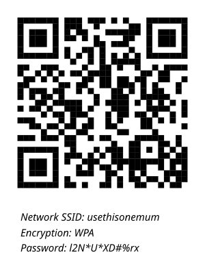

If your wifi network (SSID) is called something like "usethisonemum" and your wifi password is "l2N\*U\*XD#%rx" (no quotes) then you can create a QR code like the one below with:

```r
install.packages('qrcode')
library(qrcode)
wifiqr <- qr_wifi('usethisonemum', key = "l2N*U*XD#%rx")
plot(wifiqr)
generate_svg(wifiqr, 'wifi.svg')
```


