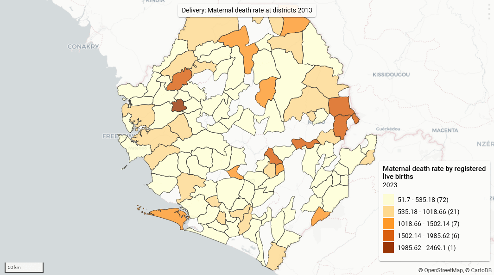

It would be nice to use the native maps from DHIS 2 in automated outputs, and probably save a lot of work recreating them in R. I'm pleased to say that maps can be downloaded from DHIS 2 using the R package RSelenium, though it is a slightly fragile process.

The [RSelenium package](http://cran.nexr.com/web/packages/RSelenium/vignettes/RSelenium-basics.html) allows R users to use the software [Selenium](https://en.wikipedia.org/wiki/Selenium_(software)) to automate things that you might otherwise have to do manually in your browser. I am going to automate logging in to one of the DHIS 2 demo servers and downloading some maps. As there can be quirks to this, which can vary between browsers, I am only going to use Firefox and can't guarantee that the code below would work in other browsers without tweaking.

I am going to download the maps shown below from the DHIS 2 demo server here: <https://play.dhis2.org/2.38.4.3>.



You need the map IDs to use the function. Open your (previously saved) map in DHIS 2 (e.g. use this one: <https://play.dhis2.org/2.38.4.3/dhis-web-maps/?id=ZBjCfSaLSqD>), and on the File menu click "Get link...". It will show something like:

"https://play.dhis2.org/2.38.4.3/dhis-web-maps/?id=**ZBjCfSaLSqD**"

The map ID is the bit which I have put in bold.

Next thing you need is the base URL for your DHIS instance - here it is "https://play.dhis2.org/2.38.4.3/".

Then you need your user name and password - these are "admin" and "district" for the demo server. Finally make sure you have Firefox installed.

Next install the R packages `RSelenium`, `netstat` and `httr`.

Now you should source the R function below. This uses RSelenium to log into a DHIS 2 instance and download a specified map. This is running in "headless" mode, which means you won't actually see the browser doing this.

```r
get_dhis2_map <- function(map_id,
                          dhis2_base_url,
                          user,
                          pw,
                          dl_path = NULL,
                          delay = 3) {
  # Function to download map from DHIS 2
  # Needs RSelenium, netstats, httr packages
  # Also Firefox installation
  if (!isNamespaceLoaded('RSelenium')) {
    attachNamespace('RSelenium')
  }
  if (!is.null(dl_path)) {
    original_files <- list.files(path = dl_path,
                                 pattern = '.png',
                                 full.names = TRUE)
  }
  map_url <- httr::parse_url(dhis2_base_url)
  map_url$path <-
    paste0(map_url$path, '/dhis-web-maps/')
  map_url$query <- list(id = map_id)
  # Start Firefox
  driver <- rsDriver(
    browser = 'firefox',
    chromever = NULL,
    port = netstat::free_port(),
    check = FALSE,
    verbose = FALSE,
    extraCapabilities = list('moz:firefoxOptions' = list(args = list('--headless')))
  )
  remote_driver <- driver[['client']]
  # Open login page
  remote_driver$navigate(dhis2_base_url)
  # Log in
  username <-
    remote_driver$findElement(using = 'id',
                              value = 'j_username')
  username$clearElement()
  username$sendKeysToElement(list(user))
  password <-
    remote_driver$findElement(using = 'id',
                              value = 'j_password')
  password$clearElement()
  password$sendKeysToElement(list(pw, '\uE007'))
  Sys.sleep(delay)
  # Open map
  remote_driver$navigate(httr::build_url(map_url))
  Sys.sleep(delay)
  # Click Download button
  dl_btn <- remote_driver$findElement('xpath',
                                      '//button[text()="Download"]')
  dl_btn <- dl_btn$clickElement()
  Sys.sleep(delay)
  # Click other Download button
  dl_btn2 <- remote_driver$findElement('xpath',
                                       '//button[contains(@class, "primary") and text()="Download"]')

  dl_btn2 <- dl_btn2$clickElement()
  Sys.sleep(delay)
  # Close everything
  remote_driver$close()
  driver[['server']]$stop()
  rm(driver)
  # Rename file downloaded to map ID
  if (!is.null(dl_path)) {
    latest_files <-
      list.files(dl_path, pattern = '.png', full.names = TRUE)
    newfile <- setdiff(latest_files, original_files)
    if (length(newfile) > 1)
      stop('More than one new PNG file found in downloads folder!')
    finalfile <- file.path(dirname(newfile), paste0(map_id, '.png'))
    file.rename(newfile, finalfile)
    # Return full path to downloaded renamed file
    return(finalfile)
  } else {
    invisible(NULL)
  }
}
```

Using the function to get one map is simply:

```r
get_dhis2_map(
  map_id = 'ZBjCfSaLSqD',
  dhis2_base_url =
    'https://play.dhis2.org/2.38.4.3',
  user = 'admin',
  pw = 'district'
)
```

One slight issue is that Firefox downloads the map PNG file with a random file name, and also probably downloads it to your default downloads folder, whether you have changed that in your Firefox settings or not. It doesn't seem easy to specify the download location with RSelenium; the code that is supposed to do that did not work for me.

But once you have seen where the file was downloaded (probably to your Downloads folder), you can specify this in the function call and the function will rename the file in that location using the ID.

So if I run the code below, it renames the file as ZBjCfSaLSqD.png to match the ID, and returns the path to the file.

```r
get_dhis2_map(
  map_id = 'ZBjCfSaLSqD',
  dhis2_base_url =
    'https://play.dhis2.org/2.38.4.3',
  user = 'admin',
  pw = 'district',
  dl_path = 'C:/Users/paul.cleary/Downloads'
)
```
```
[1] "C:/Users/paul.cleary/Downloads/ZBjCfSaLSqD.png"
```

You can easily download multiple maps using `mapply`.

```r
maps <- c('qTfO4YkQ9xW', 'ZBjCfSaLSqD', 'DE644qFc32L')
mapply(
  get_dhis2_map,
  map_id = maps,
  MoreArgs = list(
    dhis2_base_url =
      'https://play.dhis2.org/2.38.4.3',
    user = 'admin',
    pw = 'district',
    dl_path = 'C:/Users/paul.cleary/Downloads'
  )
)
```

If you start getting errors, either you have done something wrong or RSelenium is playing up. If the latter, restarting R will fix it.

I will do some more on RSelenium and how to identify the parts of a Web page you want it to interact with in a future post.

