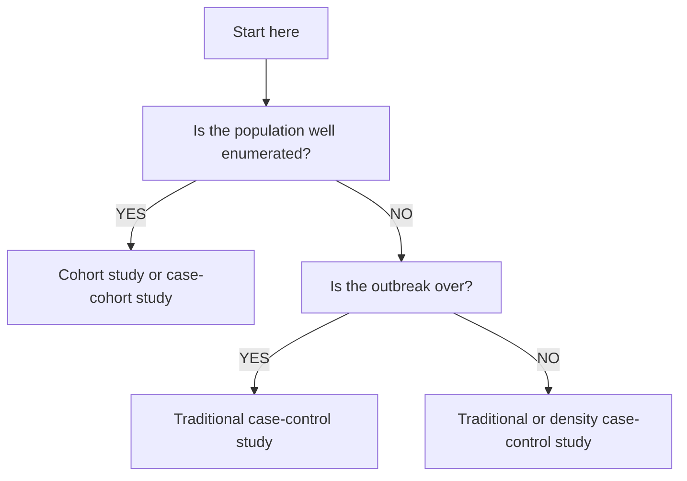

Introduction to the toolkit
===========================

The aim of this field epidemiology toolkit is to provide step-by-step guidance and other resources to support consistent, timely and appropriate investigation of infectious disease outbreaks and other incidents which may require a field epidemiology approach. The guidance outlines the issues that need to be considered in planning or conducting an epidemiological investigation. The guidance is generic and is intended to be applicable in a range of situations, including food or water borne outbreaks, outbreaks in institutional settings or outbreaks in the community, as well as incidents related to environmental agents. It is mainly aimed at Health Protection Agency staff, working in health protection units or regional epidemiology units, who may be involved in leading or contributing to outbreak investigations.

Guidance sections
=================

Train and maintain investigative capacity
-----------------------------------------

All public health staff should receive adequate training appropriate for their role in the investigation of outbreaks.

### Data collection

- Questionnaire development

- Data entry and validation

- Consent

- Telephone Interviewing skills

### Descriptive epidemiology

- Line listing

- Construction and interpretation of epidemic curves

- Mapping the geographical distribution of cases

### Epidemiological reasoning

- Formulating a hypothesis of aetiology, source of infection, mode of transmission or pathway, or risk factors

- Testing hypotheses

### Planning an analytical study

- Choosing an appropriate study design

- Sample size calculation

- Selection of a comparison group

- Developing a study protocol

### Data analysis

- Understanding measures of association, such as the odds ratio

- Stratified and multivariable analysis (especially logistic regression)

- Use of statistical software (Epidata, STATA, R)

### Data interpretation

- Causality

- The play of chance

- Minimising bias

- Accounting for confounding and interaction

- Small numbers

### Communication skills

- Writing an outbreak report

- Media management

### Influencing and negotiating skills

- Using information to influence public health outcomes

- Managing a multiagency outbreak team

The technical skills required to support outbreak and incident investigation will depend upon an individual’s role. The incident lead for an outbreak or other investigation should have access to the skills and knowledge areas above. The overall management of an outbreak demands a comprehensive range of skills and competencies. Some of these represent leadership skills which, whilst of critical importance, are not discussed further in this document, which concentrates on the epidemiological aspects of investigation.

Analyse descriptive epidemiological data early and often
--------------------------------------------------------

Basic descriptive analysis of epidemiological data may by itself identify the cause, source or mode of transmission of a communicable disease and obviate the need for more complex epidemiological investigation. The basic data collected on cases should include the information in the table below, where this is available. For ease of reference and information sharing, this information is best collated in a line listing.

A **line listing** is a table that summarizes information about persons associated with an outbreak. It includes basic descriptive epidemiological information on time, place and person. Information often includes identifying information (name, phone number, county of residence), demographic information (date of birth, sex, occupation); date and time of onset and recovery; symptoms experienced (bloody or watery diarrhoea, nausea, vomiting, abdominal cramping); and other important factors (specimens submitted, medical visits, hospitalizations, diagnosis, potential exposures). It is a unique record for each individual with a unique identifier and helps to avoid confusion with multiple versions. It can be updated as the investigation develops and allows regular, automated, computerized analysis.

Example items collected in a line listing for a *Salmonella* outbreak:

- Name

- DOB

- Sex

- Job

- Onset date

- Onset time

- Diarrhoea

- Nausea

- Vomiting

- Abdominal cramps

- Attended event

A line listing could usefully include information on:

-   **Case definitions:** Clear case definitions allow consistency in the counting of cases. Case definitions may evolve in the course of an outbreak investigation, from a broad initial definition to a more specific one when more is known about possible risk factors.
    Using more than one case definition may be useful and they may need to be reviewed during the investigation as new information comes to light.

    -   A **confirmed** case usually refers to a person with laboratory confirmation of the diagnosis.

    -   A **probable** case usually lacks laboratory confirmation but has suggestive clinical features, or may be linked to a confirmed case. Having a probable case definition is useful for including cases of disease which may not have sought medical attention to be tested, or which presented too late for testing. In addition, where there are large numbers of people affected, it may not be feasible or desirable to test all potential cases.

    -   In outbreak investigations, case definitions are usually based on clinical features and/or the results of diagnostic tests and may also specify the time and place of the putative exposure.

-   **Case finding:** Further cases may be identified through routine surveillance data, or by raising awareness of the outbreak through communications with the general public.

-   Number of cases (or less commonly incidence/prevalence where the population at risk can be quantified)

-   Patient details (including age, gender, occupation)

-   Patient and GP/hospital contact details (if required for case management only)

-   Basic clinical features (can include markers of severity such as hospitalisation or fatality)

-   Indicators of particular susceptibility to infection/severe disease (immunisation status, pregnancy, immunosuppression)

-   Laboratory results

-   Key dates (such as disease onset, taking of diagnostic sample or reporting of case)

-   Location (e.g. postcode of residence)

-   Possible common exposures as ascertained from routine screening questionnaires

-   Information on contacts (for diseases which may spread from person to person)

Time (epidemic curves), place (spot maps) and person based (summary tables of possible risk factors) analyses should be produced at the earliest opportunity from a line listing and updated as new cases are found. Timelines of significant exposures and disease onset may also be useful.

An **epidemic curve** is a special type of histogram that provides a visual depiction of the outbreak and offers information related to time. An epidemic curve provides information about the extent of the outbreak, the potential period of exposure, and the possible mode of transmission. The shape of the epidemic curve can also be very instructive, suggesting a point-source epidemic, ongoing transmission, or a combination of the two. By reviewing the epidemic curve and by examining the characteristics (age, sex, ethnicity, residence, occupation, recent travel, or attendance at events) of the cases, investigators can often generate hypotheses concerning the cause(s) or source(s) of the outbreak, for testing in an analytical study. The spread of disease, especially infectious disease is unavoidably spatial. Infection moves from individual to individual following a network of contacts within a population through local or even global transmission.

**Maps** and diagrams are helpful in showing the geographical location or layout of the place in which an outbreak has occurred. This spatial information may be crucial to the outbreak investigation and may provide clues about the source of the outbreak. The spot map is a well-used pictorial of the spatial distribution of illness within a specific setting or area. Where person to person spread is considered a possibility, social networks can usefully be presented as a diagram.

Form a hypothesis of agent, source, pathway or transmission
-----------------------------------------------------------

Based on previous knowledge of the disease and the descriptive epidemiological and/or microbiological information from the current outbreak, a **hypothesis** explaining the observations about the outbreak can be developed. Hypotheses should address the source of the agent, the mode and vehicle of transmission, and the specific exposure that caused the disease. They should also be plausible, supported by the facts established during the epidemiological, laboratory and food investigations and able to explain most of the cases. An analytical study serves to test the hypothesis arrived at in this way. It may, for example, be observed from the descriptive epidemiology that a particular exposure (such as a foodstuff or a visit to a particular place) is commonly seen among cases, which leads to a hypothesis that this exposure is associated with the disease. An analytical study can provide evidence for or against this hypothesis. If no hypothesis can be arrived at from the descriptive epidemiological data after consulting relevant expertise, an analytical study may not be appropriate.

At this stage of the investigation the data need to be summarized and hypotheses formulated to explain the outbreak. The source(s) and route(s) of exposure must be determined to understand why an outbreak occurred, how to prevent similar outbreaks in the future, and, if the outbreak is ongoing, how to prevent others from being exposed to the source(s) of infection. Using the information gathered so far, consider the possible source from which the disease may have been contracted. Quite often, by knowing the descriptive aspects and the diagnosis and by plotting an epidemic curve, the source, mode of transmission and population at risk can be determined. Once the population at risk has been determined, appropriate control measures can be targeted. The descriptive aspect of the analytical investigation is most often carried out at the local level.

Make a decision about conducting an analytical study
----------------------------------------------------

**Analytical epidemiological studies**, where groups with different exposure or disease status are compared, are required to test hypotheses of an association between a disease and a risk factor. The decision whether to conduct an analytical study should be considered by an outbreak control team at the initial meeting, irrespective of delays in the collection of basic descriptive epidemiological data. The decision (and its rationale) should be recorded clearly in the meeting notes or incident log. The fundamental criterion for deciding to conduct an analytical study is the possibility of detecting a common source of disease which would enable appropriate action to protect the health of the public. In addition, the following considerations may also indicate a need for an analytical study in relation to an outbreak or incident:

-   A large number of affected persons

-   An outbreak of disease with significant morbidity or mortality

-   A high level of public or media concern

-   An absence of known effective control measures

-   A disease from an unknown source, or with an unknown mode of transmission

-   Where risk factors for a disease may have changed

-   A new or unknown pathogen or hazard

-   Where there is uncertainty and a need for new knowledge

-   An outbreak linked to a nationally distributed product

-   An outbreak linked to a disease not normally occurring in your country

-   An outbreak linked to an event of national or international significance

-   An outbreak of particular interest to national surveillance

-   An outbreak which may be related to standards of institutional care

As a secondary consideration, analytical studies should also be considered training opportunities for junior staff.

Access the required resources
-----------------------------

Where an analytical study is thought necessary, the necessary **resources** must be discussed and agreed at an early stage. The availability of resources is an important constraint on the design, and it is best if this is explicitly considered in the study protocol. The impact upon critical functions and arrangements for maintaining resilience should also be considered and planned for. Consultation or collaboration with specialist divisions or with external centres of expertise is also advisable where information on microbiological, toxicological, environmental or other highly technical matters is sought.

Potential staff involved:

- Study design / planning: Public health specialist/ epidemiologist / epidemiological scientist / analyst

-  Data collection: Public health specialist /  administrative staff / IT support / environmental health staff

-  Data entry: Clerk / analyst / administrative and surveillance staff

-  Data analysis: Public health specialist / epidemiologist / epidemiological scientist / analyst

-  Data interpretation: Public health specialist / epidemiologist / epidemiological scientist / analyst

- Report writing: Public health specialist / epidemiologist / epidemiological scientist / analyst / administrative staff

- Specialist expertise: Subject matter experts

-  External specialist expertise: Other expertise e.g. veterinary, from other agencies

Incidents which are large, complex, or cross administrative boundaries  require activation of the wider public health response system, as do incidents with significant (actual or potential) morbidity or mortality, or where the incident fulfils any of the following criteria:

-   Has the potential of exposing a large number of (more than 50) people

-   Is linked to a nationally distributed product

-   Is linked to an event of national or international significance

-   Is unusual or likely to generate media or public interest

-   May require an analytical study to identify an aetiological agent, source, pathway or means of transmission.

Select an appropriate study design
----------------------------------

A number of possible **study designs** can be used to investigate outbreaks and incidents. The most common study designs used are **cohort studies**, **case control studies** and **case cohort studies**. Their strengths and weaknesses are summarised in the table below. See figure for further guidance.

### Cohort studies

Cohort studies identify groups of persons with different exposure status and follow them up over time to compare the occurrence of diseases of interest in the different groups and identify associations. This can be done prospectively, where subjects are recruited before the onset of disease, but in the context of the investigation of outbreaks and incidents, it is more commonly done retrospectively, collecting information on exposure and occurrence of disease during or following the incident or outbreak.

- Design of choice for well defined populations (i.e. where a complete list exists), such as outbreaks related to social events, or in settings such as cruise ships or care homes

- Allow direct estimation of incidence rates and of relative risk

- Not feasible when population at risk not well defined

### Case-control studies

Case control studies compare the exposures of groups of persons with different disease outcomes to identify associations. Cases are all or a sample of those patients identified as having the outcome of interest, whereas controls are sampled in a number of possible ways from the non cases in the population. In “traditional” case control studies, controls are selected from those disease free at the end of the study period. Occasionally “density” or “risk set sampling” case control studies may be selected where controls are sampled concurrently with cases (i.e. each time a case is identified, a control must also be identified).

- Useful when the population at risk is not well enumerated

- May be less resource intensive than a study on the whole cohort (e.g. nested case control studies)

- Incidence rates and relative risk cannot be directly calculated from case control studies.

A further possible variant on the case control design is to sample controls from all those disease-free at the beginning of the study period ie before the outbreak started. This is referred to as a case cohort design. Cases are compared to controls which are a defined sample of the total cohort which may include individuals which are both affected and unaffected by the end of the study period. Case cohort studies are a more efficient alternative to a cohort design - only a sample of non-cases need to be recruited.

A **matched design** may occasionally be required where a major potential confounder is thought to exist. It is generally preferable to adjust for confounding at the analysis stage, but if the sample size is small this may not be possible and matching may need to be considered. For these reasons the decision to match should be carefully considered.

Matching can complicate study design and interpretation in a number of ways:

-   Complicating the identification of controls

-   Case data may need to be excluded where data is missing from the control in a matched pair

-   Masking of true effects through overmatching

Selection of suitable controls for a case control study may be difficult. If no suitable sampling frame for controls exists, they can be nominated by cases from among friends or neighbours, or recruited by using random-digit dialling.

Draft a study protocol
----------------------

A draft study **protocol** should be drafted and circulated to members of the outbreak control team for discussion soon after the decision is made to proceed to an analytical study.

A large sample size is not always necessary, as effect sizes may be large, particularly in food borne outbreaks.
For example, to detect a risk ratio of 9 (90% of cases and 10% of controls exposed) with 80% power, complete exposure information on only 6 cases and 12 controls is required. The potential sample size is not always known when undertaking a study in a timely fashion. A study may be started with the intention of adding new cases and sets of controls as they arise.

A number of other factors, such as response rates or the need to adjust for confounding at the analysis stage, may also influence the estimated sample size. If the estimated sample size required to identify an odds ratio of 3 is not thought to be feasible, then a study may not be worthwhile. However, it should be considered that a non significant result may sometimes be helpful for focussing further microbiological or environmental investigations.

The protocol should include the following information:

-   Brief notes on the background to the investigation

-   Aims and objectives of the investigation

-   Study design

-   Case definitions and inclusion and exclusion criteria

-   **Sample size estimations** based on the main study hypothesis.

-   Case control ratio (see below)

-   Methods of data collection and plan for management of non-responders

-   Hypothesis and theme of enquiry

-   Draft questionnaire

-   Data management plan

-   Ethical considerations

-   Analytical strategy, outlining process and intended outputs

-   Action plan with timeline, identifying roles and responsibilities

-   Specification of resources

-   Dissemination plan (internal and external feedback)

Case control ratio: Where the number of cases is small, consideration should be given to increasing the ratio of controls to cases, up to 4 controls per case. Increasing the ratio above 4 controls per case is unlikely to increase power substantially.

Formal ethical review of non research public health activities such as outbreak investigations is not required, but due consideration should be given to ethical issues such as obtaining informed consent from participants and maintaining data confidentiality.

Whichever study design is selected, there should be clear case and control **inclusion and exclusion criteria**. In the investigation of outbreaks of possible food borne disease it is common to exclude those with a history of foreign travel or contact with a known case.

Develop a study-specific questionnaire and database
---------------------------------------------------

Preparing generic epidemiological interview instruments that can be tailored to the particular scenario is an important step in preparing for managing outbreak investigations. The **questionnaire** should be as short as possible, while collecting information on important inclusion/exclusion and exposure variables as accurately as possible. Question wording should be simple and clear, and should give clear time references where required. Closed questions should be matched with responses that are mutually exclusive and exhaustive. An “Other” or “Don’t know” category may be required. It may be necessary to define codes (“999”) for missing values. Any other codes used (1=present, 0=absent) should be used consistently.

The questionnaire should be formatted to aid navigation and completion. It is preferable for responses to be circled rather than ticked, as ticks can lead to ambiguity. Formatting responses in a single vertical column can also aid data entry.

Collect data
------------

When the questionnaire has been developed and the study design has been selected, the logistics of carrying out the investigation should be further considered, including the following:

-   If possible, the questionnaire should be tested for clarity prior to administration.

-   The personnel assigned to the study should become familiar with the questionnaire and any potential questions that may arise.

-   Training interviewers to collect epidemiological data is crucial in ensuring standardisation and a high quality of collected data.

-   A feasible method for administering and distributing the questionnaire should be discussed: self-administered/personal interview; in person/by phone/by mail/by electronic mail/via the Internet.

-   The data entry program or spreadsheet and method of entering data into the program should be considered.

-   Data collection should begin at the earliest opportunity.

Although outbreak investigations are time critical, interviewer training is a crucial component that should not be left out, especially in a situation where there are inexperienced interviewers or several interviewers are involved. Interviewing is an important, though sometimes difficult task. There are several things to be covered in interviewer training:

-   Interviewers should be provided with an overview of the outbreak situation and review the purpose of the questionnaire.

-   Interviewers should also be aware of the respondent selection process. Respondents will often ask the interviewer how they got their contact information.

-   A majority of the training should focus on the questionnaire - how to use it, the intent and meaning of each question, and how to record or code responses.

-   Discuss how the interviewer should respond to questions from the respondents.

-   Questions should always be asked in the same way for each participant. The interviewer should not prompt or lead the respondent to answers, which could introduce bias into the study.

The logistics of conducting the interviews should be agreed at the start of the outbreak investigation. This includes the hours during which it is acceptable to call, how to track the calls, how many times should the interviewers call a prospective respondent, whether they should leave a message if they get an answering machine, and what to do with completed questionnaires. Finally, and most importantly, discuss confidentiality of the interviews and questionnaires. At the interviewer training, it is good practice to provide materials to the interviewers in a manual (what exactly is included in a manual will depend on the outbreak situation). You might include a calendar to help track dates, a map of a facility, or guidelines related to but not directly associated with the outbreak (for example, a copy of vaccination guidelines if you are investigating an influenza outbreak) that might be useful if there are questions. Also, you might create a list of frequently asked questions and answers that can be used by interviewers as a quick reference tool. Interviewers might also find it useful to have some background information available on the outbreak - the organism, an epidemic curve, etc. Depending on each outbreak scenario, decide which **interview method** would be most appropriate (face to face, postal or telephone) and why. The relative strengths and weaknesses of these approaches are summarised below.

Face-to-face interview:

- Generally achieves the highest response rates

- May allow collection of more complex data

- May be time-consuming and resource-intensive

Postal questionnaire:

- Least resource requirements

- Generally achieves the lowest overall and item response rates

- Slower data collection

Telephone interviews:

- Can achieve high response rates

- May allow collection of more complex data

- May be the quickest method of data collection

- Respondent must be contactable by telephone

- May also be resource-intensive

Online self-administered questionnaire:

- May be the quickest method of data collection, especially if appropriate for the sample

- Dependent on respondents having access to the appropriate technology

- May achieve low response rates

- Data security principles must be respected

Based on the above, where resources allow, telephone interviews are often the optimal method of data collection. The questionnaire templates are designed on the assumption that telephone interviews are the chosen method of data collection, and so will require further adaptation if another method is chosen.

If data is to be collected by a postal questionnaire, particular attention will need to be given to the design of the questionnaire. Clear instructions and formatting are important to aid the navigation and completion of postal questionnaires. The questionnaire will need to be short and avoid open or complex questions. Unlike in research studies, there may not be time for a thorough pretesting or piloting of the questionnaire before it is used to collect data. However, where possible the questionnaire should be at least completed by a convenience sample of colleagues or others before use to identify issues with presentation, wording, navigability or content.

Whichever method is chosen, data collection should be preceded by a interviewer script (or cover letter for postal questionnaires) explaining who is conducting the investigation and why the investigation is taking place, giving assurances on data confidentiality and security, and thanking respondents for their participation. The completed questionnaire should be checked after completion, as this is the best time to clarify anything with the respondent. In phone interviews, a courteous and knowledgeable interviewer can be the difference between a hang-up and a completed questionnaire. By maintaining a professional but friendly approach throughout an interview, an interviewer can obtain important information that will help investigators identify the cause of an outbreak.

Enter the data into a suitable database
---------------------------------------

Errors may be introduced into the data at any stage of data collection, data entry or data analysis, and **checking** should take place at each stage. There are three main ways of reducing data entry errors and maintaining data quality at the data entry stage: interactive checking, double data entry and batch checking. None of these approaches can guarantee the identification of all data entry errors.

**Double data entry** (where the data is entered twice, ideally by two different people, with the two data sets then compared using verification software) is the gold standard, but may be impractical in an incident or outbreak setting. **Interactive checking** identifies errors or anomalies in the data as it is entered, and can detect range errors (an age of 176) or consistency errors (a pregnant male). Interactive checking is best used when data collection proceeds in parallel with data entry, and anomalies in the data can quickly be queried from the data source. However, interactive checking interrupts data entry, and so **batch checking**, where checks are made on the data after all the data is entered, or periodically during data entry, may be preferred.

It is important that every record entered into the database has a unique identifier, which must be entered with the record. Personal identifying information (PID) such as name or address does not need to be entered into the study database (although names can alternatively be anonymised using Soundex codes) but should be stored separately and securely along with the linking database identifier to allow subjects to be linked with their records if required to correct errors.

Data should be stored securely, with backups made at appropriate intervals.

Clean and validate the data
---------------------------

Maintaining quality control during data collection and data entry will prevent many, but not all common errors in the data, and further checking and **“cleaning”** will usually be required. As discussed above, batch checks can be run once the data has been entered to avoid interrupting data entry to correct errors. Interim analyses of the data, such as basic tabulations and plots, can identify further errors in the data. Where errors are corrected, it is important to maintain an audit trail of changes made to the data. One way of doing this is to leave the original data untouched and to correct errors programmatically at the time of analysis. If it is not possible to correct these errors, then it may be necessary to set their values to missing.

Analyse and interpret the data
------------------------------

Once the data is entered and cleaned, the analytical strategy will usually aim to answer some or all of the following questions.

-   What was the size and time course of the outbreak?

-   What were the demographics and other characteristics of the cases, and what does this suggest about the population at risk?

-   What were the clinical features and the outcomes of the cases?

-   What do the above suggest about the likely agent?

-   What factors are associated with disease?

    -   Are any associations real, artefactual, confounded or due to the play of chance?

    -   What do the findings suggest about the likely source or mode of transmission of the agent?

    -   Are the data consistent with the hypothesis developed from the descriptive epidemiology?

Important steps to consider in analysing incident or outbreak data include:

-   Re-evaluate the case definition and ensure that persons classified as cases or controls are eligible for inclusion.

-   Familiarise yourself with the data by examining the distribution of each individual variable.

    -   Categorical variables can be examined as frequency tables or bar charts.

    -   Quantitative variables can be examined by computing numerical summaries (such as mean and standard deviation, or median and interquartile range) or by histograms and box plots.

    -   Identify how much data is missing for each variable.

-   Orient the data in time.

    -   Update any epidemic curves previously plotted.

    -   Compute the median and range for the estimated incubation and recovery periods.

-   Orient the data in terms of person characteristics.

    -   Demographics of cases and controls

    -   Clinical features of cases and controls

    -   Outcomes of cases

-   Univariate analyses (see below)

    -   If the study design was a retrospective cohort study, calculate the overall attack rate, risk factor specific attack rates, and relative risks.

    -   If the study design was a case control study, calculate the risk factor specific odds ratios.

    -   If possible, examine the dose-response relationship between a risk factor and outcome.

    -   Test the null hypothesis of no association for each relationship of interest. The chi square test (or Fisher’s exact test) are commonly used methods.

    -   Where evidence is found for an association, calculate 95% confidence intervals for the observed measure of effect.

-   Consider adjusting for the effect of confounding or related issues. Methods which can be used include:

    -   Stratified analysis, which examines the outcome in relation to two possible risk factors

    -   Multivariate regression, which examines the outcome in relation to several possible risk factors (examples include logistic regression, Poisson regression, Cox regression)

The term “univariate analysis” is commonly used to refer to steps in the analysis where each risk factor is examined individually for a possible association with outcome. The term “bivariate analysis” is sometimes preferred. Given that there is a 5% chance of each univariate analysis falsely demonstrating an association with a p value of less than 0.05, the more risk factors that are studied, the less likely it is that any associations observed are real.

Confounding refers to the influence of a third “lurking” variable on the observed association. Specialist advice may be required to account for this in the analysis.

The measures of effect (relative risks or odds ratios), after adjustment for confounding if required, then need to be interpreted for the support they give to the hypothesis or hypotheses under investigation. If, for a possible risk factor, the measure of effect is not significant at the 5% level (in other words, if the p value is not less than 0.05, and/or the 95% confidence interval of the measure of effect includes 1), then we conclude that the data does not provide evidence of an association. If the measure of effect is significant at the 5% level, we conclude that the data does provide evidence of an association between this risk factor and disease. To judge whether this association may be a *causal* association, we need further information. The stronger the association (in other words, the larger the measure of effect), the more likely the association is to be causal. Demonstrating a dose-response relationship adds further evidence towards a causal explanation for the association.

The term “epidemiological **bias**”, or simply “bias”, refers to a whole range of possible weaknesses in the design or conduct of the investigation which may lead to an incorrect conclusion being drawn. Observational study designs such as case control studies are prone to particular types of bias, and bias should always be considered in the interpretation of the results of the investigation of an outbreak or incident.

The results of the epidemiological study should also be considered in the light of the results of the microbiological and environmental parts of the investigation. Careful development of epidemiological inferences combined with environmental and clinical evidence may provide convincing evidence of the source and mode of spread of a disease.

Write a report and disseminate it
---------------------------------

Every outbreak should have a report prepared. For some incidents this will be a very brief document but for more significant outbreaks this will be more substantial. Using a template report can facilitate this process. The production of the outbreak report is the overall responsibility of the incident lead. However all agencies involved in the outbreak investigation will be required to contribute to appropriate sections.

Consideration needs to be given to target audience for the report and how it may be used. Outbreak reports should be completed as soon as possible after outbreak or incident closure. Preliminary findings to enable public health action should be available within days or weeks of closure of the incident. It is important at the outset of the incident to agree responsibility for the writing or preparation of different sections of the report. It is also essential to be clear which is the lead organisation for the investigation and where ownership of the data rests to avoid unnecessary dispute. Similarly it is good practice to agree the sign off process for the report and the distribution plan at an early stage.

Preparation of reports for publication should follow the [STROBE guidance](https://www.strobe-statement.org/) or equivalent for reporting observational studies such as outbreak investigations.

Outbreak reports should be made available to stakeholder agencies and outbreak team members. Where possible investigated outbreaks should be presented as posters or presentations at appropriate level conferences. Submission for publication in public health journals should also be considered.

### Report template

    Responsibility to write: CCDC

    Outbreak Report Template

    Contents Page

        Executive Summary

    1.  Introduction

    2.  Background

    3.  Investigation of the outbreak

    3.1 Epidemiological
    3.2 Environmental
    3.3 Microbiological/Toxicological

    4.  Results

    4.1 Epidemiological
    4.2 Environmental
    4.3 Microbiological

    5.  Control measures

    5.1 Overall co-ordination and management of the outbreak
    5.2 Care of cases
    5.3 Prevention of further cases (primary and secondary spread)
    5.4 Public information
    5.5 Information to professionals/businesses, etc
    5.6 Outline of food safety enforcement action

    6.  Communication and media

    7.  Discussion and conclusion

    8.  Lessons learned and recommendations

    9.  Appendices

    Executive Summary

    Introduction

    A brief summary of the outbreak/ setting the scene.

    Briefly describe:

        When the outbreak occurred; How the outbreak was discovered; Where or
        what foods were implicated; Important facts to be drawn out; Total number;
        Summary of cases investigated

    Background

    Optional section depending on the outbreak and implicated organism(s).

    If uncommon pathogen implicated/ organism with serious consequences (i.e. E.
    coli 0157), give brief description of clinical features, incubation period,
    infectious dose, source and modes of spread, diagnosis and treatment, etc.

    Also give background prevalence of the disease locally, nationally and globally
    if relevant.

    Investigation of the outbreak

    Chronology of key dates and events.

    3.1 Epidemiological

    (i) Descriptive: e.g. description of initial cases/ case definition and
    hypothesis generation/ demographic characteristics/ geographical distribution of
    cases / enhanced surveillance

    (ii) Analytical: case control and/or cohort studies.

    3.2 Environmental

        e.g. Inspection of premises/ source of food and its distribution / food,
        water or environmental sampling / risk assessment / process enquiry / staff
        interviews / possible sources of infection

    3.3 Microbiological/Toxicological

        Local labs, reference labs, etc, clinical, food/water and environmental
        samples

    Results

    4.1 Epidemiological

    4.2 Environmental

    4.3 Microbiological

        Control measures

    5.1 Overall co-ordination and management of the outbreak

    5.2 Care of cases

    5.3 Prevention of further cases (primary and secondary spread)

    5.4 Public information

    5.5 Information to professionals/businesses, etc

    5.6 Communication and Media

        Brief information/ description regarding communication throughout the
    investigation, both internal and external to all organisations involved.

        Details of which organisation took the lead for communications with the
        media

    Discussion and conclusion

        Lessons learned and recommendations

    Appendix

        Contents may depend upon target audience

Learn from the outbreak
-----------------------

Learning the lessons which have been identified through the investigation of an outbreak both about public health risks and effective working in the control of an incident is essential. Local mechanisms may exist for multi-agency fora to review lessons and recommendations from local incidents.

Regular audit of the management of outbreaks and incidents may be beneficial for organisational learning. Audits can assess structure (were adequate resources available?), process (were actions and decisions appropriate?) and outcome (was the cause/source/mode of transmission identified? Was the response effective?)

Additional considerations for specific circumstances
====================================================

Outbreaks in health or social care settings
-------------------------------------------

Public health staff have long been involved in the response to community-based outbreaks, such as those occurring in elderly care homes, and are now increasingly involved in the investigation of outbreaks or incidents occurring in acute and other hospital settings, which this section will briefly focus on. Health care associated infections are common, and the organisms involved are diverse and may include *Clostridium difficile*, methicillin-resistant *Staphylococcus aureus*, or other pathogens which may be notable for their potential for nosocomial transmission, virulence or resistance to multiple antibiotics. In health care settings, the population at risk may be particularly susceptible to infection with certain pathogens by virtue of their underlying medical conditions.

The basic principles of investigation in a health or social care setting are similar to the general principles outlined above. Good descriptive epidemiology is a key part of the early investigation, and may be sufficient to demonstrate potential sources of infection or transmission pathways between cases of diseases, the institutional environment and health care workers (or other vectors). Where a common source of infection is hypothesised to exist, or other possible individual-level risk factors are of interest, a field epidemiology analytical study may be of value and can identify risk factors, for example the use intravascular devices in cases of bacteraemia with certain organisms, or the use of high risk antibiotics in cases of *Clostridium difficile* associated disease. As an alternative or complementary approach, where numbers allow, rates of infection can be compared at ward level and correlated with indicators such as hand hygiene scores.

Investigation of outbreaks and incidents in institutions may be facilitated by use of existing data sources, such as medical case notes, hospital information systems (for administrative and prescribing data), information from surveillance systems for health care associated infection and the results of internal investigations, such as “root cause analyses”. Infection control teams are often a useful source of informal local intelligence. Case definitions used in the investigation may need to take account of existing case or outbreak definitions, for example in mandatory surveillance data. For example, a widely used definition of an outbreak of *Clostridium difficile* on a hospital ward is two or more cases of the same strain which are related in time and place.

New forms of molecular typing may be very useful for demonstrating nosocomial transmission, and it is best to ensure access to such specialised laboratory resources at an early stage. Studying transmission of certain pathogens, where infection may be preceded by a period of colonisation of indeterminate length, may be complex.

There should be a clear understanding about the relative contribution of resources from the public health team and the hospital. In general, the Trust should provide information in an analysable form and clerical tasks such as data collection or data entry should not fall to public health staff.

The investigation may also be complicated by media interest or medicolegal consequences for the hospital and it is especially important that the investigation is of the highest possible standard.

Environmental epidemiology
--------------------------

Front-line health protection staff are less often required to investigate possible acute health effects of physical or chemical hazards. This section will briefly outline certain relevant principles of environmental epidemiology. Expert advice should be sought where available.

Good descriptive epidemiology is again important for generating hypotheses. Mapping may be particularly important in studying possible environmental exposures. Physical and chemical hazards are often best conceptualised using a source-pathway-receptor model, rather than the agent-host-environment model often used for communicable diseases.

For an incident occuring within a short time scale, a field epidemiology study such as a case control study may be appropriate. However, more ambitious studies, such as retrospectively studying the possible chronic health effects of a long term chemical, physical or other environmental exposure; prospectively studying the possible future health effects of a defined episode of exposure to such as hazard; or investigating a geographical or temporal cluster of health outcomes with a putative environmental cause, all raise other epidemiological issues which it is outwith the scope of this document to address.

Just as the investigation of communicable disease outbreaks may be complemented by microbiological typing data, environmental epidemological investigations may be complemented by chemical or physical measurements on individuals or on the environment. Environmental investigations are often multidisciplinary, involving external partners.

