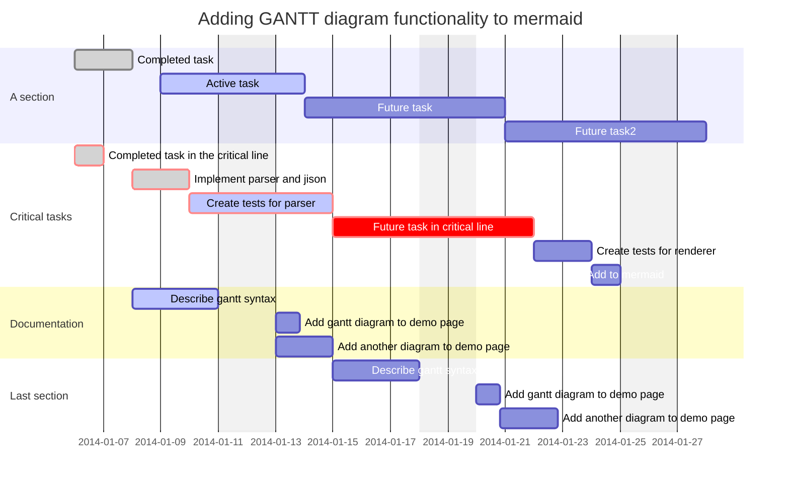

Uses standard Markdown

## Frontmatter 

```
--- 
title: Emanote syntax 
date: 2023-03-08 
tags: 
  - emanote 
  - blogging
--- 
```

Careful not to use tabs instead of spaces in the YAML

## Mermaid syntax

    ```mermaid
    gantt
        dateFormat  YYYY-MM-DD
        title       Adding GANTT diagram functionality to mermaid
        excludes    weekends
        %% (`excludes` accepts specific dates in YYYY-MM-DD format, days of the week ("sunday") or "weekends", but not the word "weekdays".)
    
        section A section
        Completed task            :done,    des1, 2014-01-06,2014-01-08
        Active task               :active,  des2, 2014-01-09, 3d
        Future task               :         des3, after des2, 5d
        Future task2              :         des4, after des3, 5d
    
        section Critical tasks
        Completed task in the critical line :crit, done, 2014-01-06,24h
        Implement parser and jison          :crit, done, after des1, 2d
        Create tests for parser             :crit, active, 3d
        Future task in critical line        :crit, 5d
        Create tests for renderer           :2d
        Add to mermaid                      :1d
    
        section Documentation
        Describe gantt syntax               :active, a1, after des1, 3d
        Add gantt diagram to demo page      :after a1  , 20h
        Add another diagram to demo page    :doc1, after a1  , 48h
    
        section Last section
        Describe gantt syntax               :after doc1, 3d
        Add gantt diagram to demo page      :20h
        Add another diagram to demo page    :48h
    ```




## Code highlighting

    ```r
    library(data.table)
    d <- fread('mydata.csv')
    ```
```r
library(data.table)
d <- fread('mydata.csv')
```

## Internal links

No path needed - it will find nearest

    [[my-zola-cheatsheet]]
    
    [[my-zola-cheatsheet|Some Zola stuff]]

[[my-zola-cheatsheet]]

[[my-zola-cheatsheet|Some Zola stuff]]

## Links (three ways)

```
This is a URL: <https://prcleary.github.io>

This is a [link](https://prcleary.github.io)

This is a [link][link].

[link]: https://prcleary.github.io
```

This is a URL: <https://prcleary.github.io>

This is a [link](https://prcleary.github.io)

This is a [link][link].

[link]: https://prcleary.github.io

## Maths

    Prime numbers are positive integers $p > 1$ that have _exactly one_ positive divisor other than $1$.
    
    The $n$th prime number is commonly denoted $p_n$, so $p_1 = 2$, $p_2 = 3$, and so on.
    
    The Dirichlet generating function of the characteristic function of the prime numbers $p_n$ is given by
    
    $$
    \begin{aligned}
    \sum^\infty_{n=1} \frac{[n \in \{p_k\}^\infty_{k=1}]}{n^{\scriptsize S}} &= \sum^\infty_{n=1} \frac{1}{p^{\scriptsize S}_n} \\
    	&= \frac{1}{2^{\scriptsize S}} + \frac{1}{3^{\scriptsize S}} + \frac{1}{5^{\scriptsize S}} + \frac{1}{7^{\scriptsize S}} + \ldots \\
    	&= P({\scriptsize S}),
    \end{aligned}
    $$

Prime numbers are positive integers $p > 1$ that have _exactly one_ positive divisor other than $1$.

The $n$th prime number is commonly denoted $p_n$, so $p_1 = 2$, $p_2 = 3$, and so on.

The Dirichlet generating function of the characteristic function of the prime numbers $p_n$ is given by

$$
\begin{aligned}
\sum^\infty_{n=1} \frac{[n \in \{p_k\}^\infty_{k=1}]}{n^{\scriptsize S}} &= \sum^\infty_{n=1} \frac{1}{p^{\scriptsize S}_n} \\
	&= \frac{1}{2^{\scriptsize S}} + \frac{1}{3^{\scriptsize S}} + \frac{1}{5^{\scriptsize S}} + \frac{1}{7^{\scriptsize S}} + \ldots \\
	&= P({\scriptsize S}),
\end{aligned}
$$

## Tables

    | Right | Left | Default | Centre |
    |------:|:-----|---------|:------:|
    |   12  |  12  |    12   |    12  |
    |  123  |  123 |   123   |   123  |
    |    1  |    1 |     1   |     1  |

| Right | Left | Default | Centre |
|------:|:-----|---------|:------:|
|   12  |  12  |    12   |    12  |
|  123  |  123 |   123   |   123  |
|    1  |    1 |     1   |     1  |

## Callouts

    > [!info] Here's a callout title
    > Here's a callout block.
    >
    > It supports **Markdown** and other things

> [!info] Here's a callout title
> Here's a callout block.
>
> It supports **Markdown** and other things

More here: [Callouts - Obsidian Help](https://obsidian.md/help/callouts)

## CSS styling

    ::: {class="sticky-note"}
    ### CSS styles
    CSS styles like this one ("sticky note") can be specified in index.yaml and used thus.
    :::


::: {class="sticky-note"}
### CSS styles
CSS styles like this one ("sticky note") can be specified in index.yaml and used thus.
:::

    ::: {class="highlight-block"}
    Some content can be highlighted
    :::

::: {class="highlight-block"}
Some content can be highlighted
:::

## Embedding other notes

Like the home page

    ![[index]]

![[index]]

No path needed e.g.

    ![[my-zola-cheatsheet]]

## External images

    


## Local images

    


## Emoji

As per here: [Complete list of github markdown emoji markup](https://gist.github.com/rxaviers/7360908)

## Adding classes etc to fenced divs

[commonmark-hs/commonmark-extensions/test/attributes.md at master · jgm/commonmark-hs](https://github.com/jgm/commonmark-hs/blob/master/commonmark-extensions/test/attributes.md)


