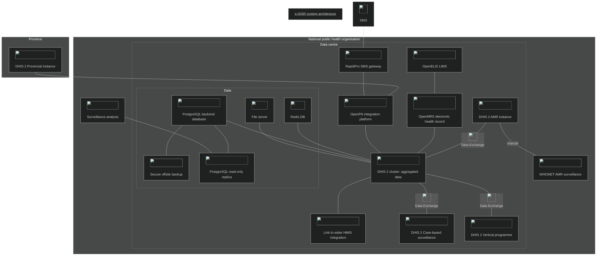

```mermaid
%%{init: {'theme': 'dark', 'fontFamily': 'monospace', 'flowchart': { 'htmlLabels': true} } }%%
graph TD
title["<u>e-IDSR system architecture</u>"]

    %% nodes
    OffsiteBackup["<img src='https://icons.iconarchive.com/icons/icons8/windows-8/256/Database-Backup-icon.png' height='40' width='40'/><br/>Secure offsite backup"]
    OpenELIS["<img src='https://images.squarespace-cdn.com/content/v1/59bc3457ccc5c5890fe7cacd/1593041170321-QXQH87RYT3V6181U7JTL/ELIS.png' width='200' height='40'/><br/>OpenELIS LIMS"]
    OpenFN["<img src='https://docs.openfn.org/img/logo.svg' width='40' height='40'/><br/>OpenFN integration platform"]
    OpenHIE["<img src='https://wiki.ohie.org/download/attachments/8945721/logoHD.fw.png' height='40' width='180'/><br/>Link to wider HMIS integration"]
    OpenMRS["<img src='https://i0.wp.com/openmrs.org/wp-content/uploads/2025/07/OpenMRS-logo-transparent-1.png' width='160' height='60'/><br/>OpenMRS electronic health record"]
    RapidPro["<img src='https://app.rapidpro.io/sitestatic/images/logo-dark.svg' height='40' width='160'/><br/>RapidPro SMS gateway"]
    SMS["<img src='https://img.icons8.com/color/512/sms.png' height='40' width='40'/><br/>SMS"]
    WHONET["<img src='https://community.whonet.org/uploads/default/original/1X/a60e8f43ec439ae6868e82b90a5fd6f5146826f5.png' height='40' width='100'/><br/>WHONET AMR surveillance"]
    analysis["<img src='https://www.reshot.com/preview-assets/icons/BA3SEYLHU9/charts-BA3SEYLHU9.svg' width='40' height='40'/><br/>Surveillance analysis"]
    dhis1["<img src='https://raw.githubusercontent.com/dhis2/dhis2-icons/master/icons/dhis2_logo_positive.svg' width='40' height='40'/><br/>DHIS 2 cluster: aggregated data"]
    dhis2["<img src='https://raw.githubusercontent.com/dhis2/dhis2-icons/master/icons/dhis2_logo_positive.svg' width='40' height='40'/><br/>DHIS 2 Case-based surveillance"]
    dhis3["<img src='https://raw.githubusercontent.com/dhis2/dhis2-icons/master/icons/dhis2_logo_positive.svg' width='40' height='40'/><br/>DHIS 2 Vertical programme"]
    dhis4["<img src='https://raw.githubusercontent.com/dhis2/dhis2-icons/master/icons/dhis2_logo_positive.svg' width='40' height='40'/><br/>DHIS 2 Provincial instance"]
    dhis5["<img src='https://raw.githubusercontent.com/dhis2/dhis2-icons/master/icons/dhis2_logo_positive.svg' width='40' height='40'/><br/>DHIS 2 AMR instance"]
    fileserver["<img src='https://symbols.getvecta.com/stencil_240/79_fileserver.c500813aaa.svg' width='40' height='40'/><br/>File server"]
    postgres1["<img src='https://www.vectorlogo.zone/logos/postgresql/postgresql-ar21.svg' width='60' height='40'/><br/>PostgreSQL backend database"]
    postgres2["<img src='https://www.vectorlogo.zone/logos/postgresql/postgresql-ar21.svg' width='60' height='40'/><br/>PostgreSQL read-only replica"]
    redis["<img src='https://www.vectorlogo.zone/logos/redis/redis-ar21.svg' width='60' height='40'/><br/>Redis DB"]

    %% subgraphs
    subgraph "National public health organisation"
        subgraph "Data centre"
            direction LR
            OpenELIS
            OpenFN
            OpenHIE
            OpenMRS
            RapidPro
            dhis1
            dhis2
            dhis3
            dhis5
            subgraph "Data"
                direction RL
                fileserver
                postgres1
                postgres2
                redis
                OffsiteBackup
            end
        end
        analysis
        WHONET
    end
    subgraph "Province"
        dhis4
    end

    %% links
    OpenELIS --- OpenMRS
    OpenFN --- dhis1
    OpenMRS --- dhis1
    RapidPro --- OpenFN
    SMS --- RapidPro
    analysis --- postgres2
    dhis1 --- OpenHIE
    dhis1 ---|"<img src='https://apps.dhis2.org/api/v1/apps/media/dhis2/08012f21-0061-4e96-b49b-286e2743a8b4/a78021d9-1e89-4adf-af29-2142f5601a9b' width='40' height='40'/><br/>Data Exchange"| dhis2
    dhis1 ---|"<img src='https://apps.dhis2.org/api/v1/apps/media/dhis2/08012f21-0061-4e96-b49b-286e2743a8b4/a78021d9-1e89-4adf-af29-2142f5601a9b' width='40' height='40'/><br/>Data Exchange"| dhis3
    dhis4 --- OpenFN
    dhis5 ---|"manual"| WHONET
    dhis5 ---|"<img src='https://apps.dhis2.org/api/v1/apps/media/dhis2/08012f21-0061-4e96-b49b-286e2743a8b4/a78021d9-1e89-4adf-af29-2142f5601a9b' width='40' height='40'/><br/>Data Exchange"| dhis1
    fileserver --- dhis1
    postgres1 --- OffsiteBackup
    postgres1 --- dhis1
    postgres1 --- postgres2
    redis --- dhis1
```

