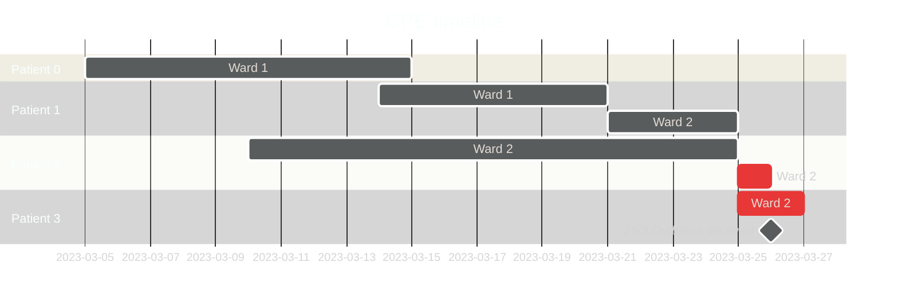

Probably the easiest way to construct this type of visualisation - can be helpful for presenting a timeline of colonisation or invasive infection among cases when person-to-person transmission is occurring.



You can play with dummy data in the live online tool ([Online FlowChart & Diagrams Editor - Mermaid Live Editor](https://mermaid.live)); for sensitive data use the R package [DiagrammeR](https://rich-iannone.github.io/DiagrammeR/).
```
gantt
    title CPE timeline
    dateFormat YYYY-MM-DD
    section Patient 0
    Ward 1: 2023-03-05, 2023-03-15
    section Patient 1
    Ward 1: 2023-03-14, 2023-03-21
    Ward 2: 2023-03-21, 2023-03-25
    section Patient 2
    Ward 2: 2023-03-10, 2023-03-25
    Ward 2: crit, 2023-03-25, 2023-03-26
    section Patient 3
    Ward 2: crit, 2023-03-25, 2023-03-27
    25/3 Outbreak declared: milestone, 2023-03-25
```
