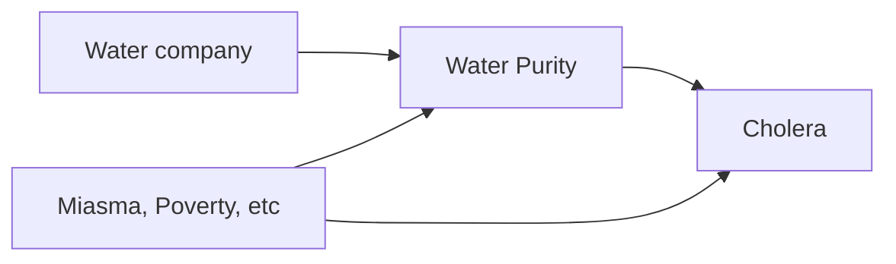

## What is causality?

Not sure if the book provides its own definition of causality, though it does use metaphors about information flowing, or Y "listening to" X. It does critique some previous attempts at definition.

## The problem with statistics

Human intelligence makes causal inferences, but statistics has often limited itself to statements about associations ("correlation is not causation"), with honourable exceptions.

"Data is dumb": it cannot answer causal questions alone, e.g. about interventions or counterfactuals. A causal model, derived from scientific knowledge, is needed too.

Artificial intelligence needs to address causal inference. The author started as a computer scientist. But mathematical treatment of causal inference has been lacking.

## Causal diagrams and the do calculus

We now have causal diagrams and the *do calculus*, an algebra/notation with symbols representing causality.

Fundamentally, causal inference is based on an "inference engine". First, use the causal model (typically a diagram), based on assumptions and knowledge, to decide if a causal question (expressed in do calculus) can be answered. If it can, derive an "estimand" which can be applied to data to give you an answer. If the model is correct and the data is sufficient, then the answer is correct. The inference engine can be automated.

## The Ladder of Causation

There are three levels of questions of increasing difficulty that causal inference can answer (the "Ladder of Causation"): observed association, the effect of an intervention, and counterfactuals ("what if").

## Confounding, mediation and paradoxes

The book shows how causal diagrams can explain phenomena like confounding and mediation and explain various apparent paradoxes. It shows how the standard epidemiological definition of confounding is insufficient.

## The three junctions of causal diagrams

The three junctions of causal diagrams are chains, forks and colliders. These are not necessarily visible from data.

### Chains and forks

If $A\rightarrow B\rightarrow C$, controlling for B is bad and "prevents information from A getting to C". The same applies if you control for proxies of B.

The same happens if you control for B when $A\leftarrow B\rightarrow C$, but in this case controlling is good, as it controls for confounding. The path via B is a *back-door path*.

### Colliders

When $A\rightarrow B\leftarrow C$, B is a collider, and controlling for it (e.g. by restriction) means "information starts flowing" and a correlation is induced, even when A and C are independent. This explains a number of paradoxes (e.g. low birth weight, smoking and mortality).

## Dealing with confounding in complex models

In a more complex causal model (more than 3 nodes), deal with confounding by blocking any back-door path (any path from X to Y that begins with an arrow pointing into X).

Sometimes we do not have data on variables that would allow us to block the back-door path.

## The front-door adjustment

The *front-door adjustment* can be used where there is a mediator and a confounder between X and Y. It is a weighted combination of the causal effect of X on the mediator and the causal effect of the mediator on Y.

## Axioms of the do calculus

The book then sets out some axioms for do calculus, which allow estimands to be obtained by a process of simplification.

## Instrumental variables

The book then introduces *instrumental variables*, using the John Snow example. "Water Company" is the instrumental variable, allowing you to use the front-door trick to deconfound the relationship without information on poverty, miasma, etc.

## Counterfactuals

I lost the thread a bit from chapter 8 about counterfactuals. It includes a long and involved example about education, experience and salary, using a multi-step algorithm. I need to read this chapter and later ones again.

## Mediation

There is then a chapter on mediation and estimating direct and indirect effects.

## Implications

A final chapter covers implications, e.g. for artificial intelligence.

## Bayesian networks

The book covers Pearl's development (and later rejection) of Bayesian networks as causal models.
