```mermaid
erDiagram
  analysisCategories { string title PK "required" string department FK "required" }
  analysisCategories ||--o{ labDepartments: "an analysis category has a department"
  analysisProfileServices { string profile FK "required" string service FK "required" string keyword FK }
  analysisProfileServices ||--|| analysisProfiles: "an analysis profile service has a profile"
  analysisProfileServices ||--|| analysisServices: "an analysis profile service has a service"
  analysisProfiles { string client FK string title PK "required" string keyword "required" }
  analysisProfiles ||--|| clients: "an analysis profile has a client"
  analysisServiceInstruments { string service FK string instrument FK}
  analysisServiceInstruments ||--o{ analysisServices: "an analysis service has instruments"
  analysisServiceInstruments ||--o{ instruments: "an instrument has analysis services"
  analysisServiceInterimFields { string service FK "required" string minimum "required" string maximum "required" string uncertainty "required" } 
  analysisServiceInterimFields ||--|| analysisServices: "an analysis has uncertainties"
  analysisServiceMethods { string service FK string method FK }
  analysisServiceMethods ||--o{ analysisServices: "an analysis service has methods"
  analysisServiceMethods ||--o{ methods: "a method has analysis services"
  analysisServiceResultOptions { string service FK "required" string option "required" string optionValue "required"}
  analysisServiceResultOptions }o--|| analysisServices: "an analysis service has options"
  analysisServices { string protocolId string title PK "required" string keyword "required" string pointOfCapture FK "required" string analysisCategory FK "required" string labDepartment FK "required" int attachments FK "required" string unit FK int standard FK int exponentialFormat FK "required" string method FK }
  analysisServices ||--o{ analysisCategories: "an analysis service has a category"
  analysisServices ||--o{ labDepartments: "an analysis service has a department"
  analysisServices ||--o{ methods: "an analysis service has a method"
  analysisSpecifications { string specification FK "required" string sampleType FK "required" string service FK "required" }
  analysisSpecifications ||--|| analysisServices: "don't understand this one"
  analysisSpecifications ||--|| sampleTypes: "a specification has a sample type"
  calculationInterimFields { string title FK "required" string keyword "required" string title PK "required" int hidden float value string unit FK}
  calculationInterimFields ||--o{ calculations: "an interim field has a calculation"
  calculations { string title PK "required" formula formula}
  clientContacts { string firstName "required" string surname "required" string userName PK string password int publicationPreference FK int attachments FK "1 or 0"}
  clients { string name "required" string id PK "required" int members FK int bulk FK }
  clients ||..o{ clientContacts: "clients not linked to client contacts"
  containerTypes { string title PK "required" }
  containers { string title PK "required" string containerType FK int prePreserved FK string preservationTitle FK }
  containers }o--|| containerTypes: "a container has a type"
  instrumentCertifications ||--|| instruments: "an instrument has a certification"
  instrumentCertifications ||--|| suppliers: "an agency supplies a certification"
  instrumentCertifications{ string instrument FK "required" date validFrom "required" date validTo "required" string agency FK }
  instrumentMethods ||--o{ methods: "an instrument method has a method"
  instrumentMethods{ string instrument FK string method FK }
  instrumentTypes{ string title PK "required"}
  instruments ||--|| suppliers: "an instrument has a supplier"
  instruments }o--|| instrumentMethods: "an instrument has a method"
  instruments }o--|| instrumentTypes: "an instrument has an instrument type"
  instruments }o--|| manufacturers: "an instrument has a manufacturer"
  instruments{ string title "required" string instrumentType FK "required" string manufacturer FK "required" string supplier FK "required" }
  labContacts { string firstName "required" string surname "required" string department FK "required" string userName PK "required" string password "required" string group "required" }
  labDepartments ||--|{ labContacts: "each department has one or managers"
  labDepartments{ string title PK "required" string manager FK "required" }
  manufacturers{ string title PK "required"}
  methods ||--o{ calculations: "a method has a calculation"
  methods{ string id string title PK "required" int manualResultsEntry string calculation FK string subcontractor FK int accredited  }
  preservations { string title PK "required" int days "required" int hours "required" int minutes "required" }
  preservations ||--o{ containers: "a container has a preservation"
  sampleMatrices{ string title PK "required" }
  samplePointSampleTypes }o--|| samplePoints: "a sample point has sample types"
  samplePointSampleTypes }o--|| sampleTypes: "a sample type has sample points"
  samplePointSampleTypes{ string samplePoint FK "required" string sampleType FK "required" }
  samplePoints }o--|| clients: "a sample point has a client"
  samplePoints }o--|| sampleTypes: "a sample point has a sample type"
  samplePoints{ string client FK string samplePoint PK "required" int composite  string sampleType FK }
  sampleTypes }o--|| containerTypes: "a sample type has a container type"
  sampleTypes }o--|| sampleMatrices: "a sample type has a sample matrix"
  sampleTypes{ string title PK "required" int hazardous FK string sampleMatrix FK string prefix "required" string minimumVolumeWeight "required" string containerType FK }
  supplierContacts { string supplier FK "required" string firstName "required" string surname "required" }
  suppliers ||--o{ supplierContacts: "a supplier has contact points"
  suppliers ||--|| methods: "a method has a subcontractor"
  suppliers{ string title PK "required" }
```

+++
title = "SENAITE setup data diagram"

[extra]
mermaid = true
+++

As part of getting my head around SENAITE, I put together the diagram below using the Mermaid.js syntax. As you can see, it is quite a large and complex diagram which is hard to read. Syntax is below.


erDiagram
  analysisCategories { string title PK "required" string department FK "required" }
  analysisCategories ||--o{ labDepartments: "an analysis category has a department"
  analysisProfileServices { string profile FK "required" string service FK "required" string keyword FK }
  analysisProfileServices ||--|| analysisProfiles: "an analysis profile service has a profile"
  analysisProfileServices ||--|| analysisServices: "an analysis profile service has a service"
  analysisProfiles { string client FK string title PK "required" string keyword "required" }
  analysisProfiles ||--|| clients: "an analysis profile has a client"
  analysisServiceInstruments { string service FK string instrument FK}
  analysisServiceInstruments ||--o{ analysisServices: "an analysis service has instruments"
  analysisServiceInstruments ||--o{ instruments: "an instrument has analysis services"
  analysisServiceInterimFields { string service FK "required" string minimum "required" string maximum "required" string uncertainty "required" } 
  analysisServiceInterimFields ||--|| analysisServices: "an analysis has uncertainties"
  analysisServiceMethods { string service FK string method FK }
  analysisServiceMethods ||--o{ analysisServices: "an analysis service has methods"
  analysisServiceMethods ||--o{ methods: "a method has analysis services"
  analysisServiceResultOptions { string service FK "required" string option "required" string optionValue "required"}
  analysisServiceResultOptions }o--|| analysisServices: "an analysis service has options"
  analysisServices { string protocolId string title PK "required" string keyword "required" string pointOfCapture FK "required" string analysisCategory FK "required" string labDepartment FK "required" int attachments FK "required" string unit FK int standard FK int exponentialFormat FK "required" string method FK }
  analysisServices ||--o{ analysisCategories: "an analysis service has a category"
  analysisServices ||--o{ labDepartments: "an analysis service has a department"
  analysisServices ||--o{ methods: "an analysis service has a method"
  analysisSpecifications { string specification FK "required" string sampleType FK "required" string service FK "required" }
  analysisSpecifications ||--|| analysisServices: "don't understand this one"
  analysisSpecifications ||--|| sampleTypes: "a specification has a sample type"
  calculationInterimFields { string title FK "required" string keyword "required" string title PK "required" int hidden float value string unit FK}
  calculationInterimFields ||--o{ calculations: "an interim field has a calculation"
  calculations { string title PK "required" formula formula}
  clientContacts { string firstName "required" string surname "required" string userName PK string password int publicationPreference FK int attachments FK "1 or 0"}
  clients { string name "required" string id PK "required" int members FK int bulk FK }
  clients ||..o{ clientContacts: "clients not linked to client contacts"
  containerTypes { string title PK "required" }
  containers { string title PK "required" string containerType FK int prePreserved FK string preservationTitle FK }
  containers }o--|| containerTypes: "a container has a type"
  instrumentCertifications ||--|| instruments: "an instrument has a certification"
  instrumentCertifications ||--|| suppliers: "an agency supplies a certification"
  instrumentCertifications{ string instrument FK "required" date validFrom "required" date validTo "required" string agency FK }
  instrumentMethods ||--o{ methods: "an instrument method has a method"
  instrumentMethods{ string instrument FK string method FK }
  instrumentTypes{ string title PK "required"}
  instruments ||--|| suppliers: "an instrument has a supplier"
  instruments }o--|| instrumentMethods: "an instrument has a method"
  instruments }o--|| instrumentTypes: "an instrument has an instrument type"
  instruments }o--|| manufacturers: "an instrument has a manufacturer"
  instruments{ string title "required" string instrumentType FK "required" string manufacturer FK "required" string supplier FK "required" }
  labContacts { string firstName "required" string surname "required" string department FK "required" string userName PK "required" string password "required" string group "required" }
  labDepartments ||--|{ labContacts: "each department has one or managers"
  labDepartments{ string title PK "required" string manager FK "required" }
  manufacturers{ string title PK "required"}
  methods ||--o{ calculations: "a method has a calculation"
  methods{ string id string title PK "required" int manualResultsEntry string calculation FK string subcontractor FK int accredited  }
  preservations { string title PK "required" int days "required" int hours "required" int minutes "required" }
  preservations ||--o{ containers: "a container has a preservation"
  sampleMatrices{ string title PK "required" }
  samplePointSampleTypes }o--|| samplePoints: "a sample point has sample types"
  samplePointSampleTypes }o--|| sampleTypes: "a sample type has sample points"
  samplePointSampleTypes{ string samplePoint FK "required" string sampleType FK "required" }
  samplePoints }o--|| clients: "a sample point has a client"
  samplePoints }o--|| sampleTypes: "a sample point has a sample type"
  samplePoints{ string client FK string samplePoint PK "required" int composite  string sampleType FK }
  sampleTypes }o--|| containerTypes: "a sample type has a container type"
  sampleTypes }o--|| sampleMatrices: "a sample type has a sample matrix"
  sampleTypes{ string title PK "required" int hazardous FK string sampleMatrix FK string prefix "required" string minimumVolumeWeight "required" string containerType FK }
  supplierContacts { string supplier FK "required" string firstName "required" string surname "required" }
  suppliers ||--o{ supplierContacts: "a supplier has contact points"
  suppliers ||--|| methods: "a method has a subcontractor"
  suppliers{ string title PK "required" }


