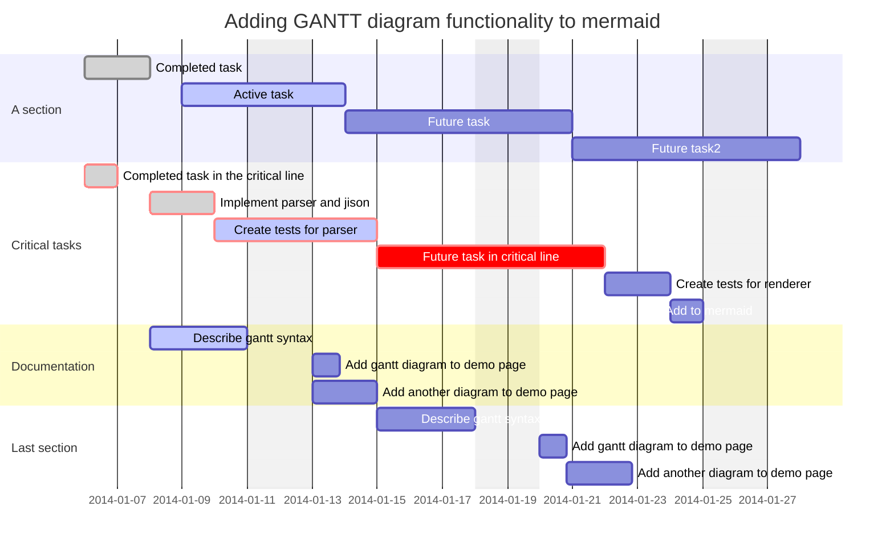
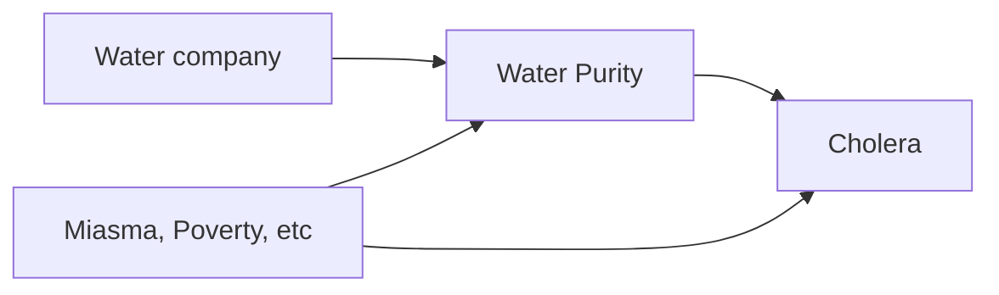

<!-- LLM PROMPT: This document contains all notes from an Emanote notebook.
Each note is separated by '===' delimiters and includes metadata headers.
- Source: The original file path in the notebook
- URL: The full URL where this note can be accessed
- Title: The note's title
- Wikilinks: All possible ways to reference this note using [[wikilink]] syntax

When referencing notes, you can use any of the wikilinks provided.
The base URL is: https://prcleary.github.io
-->

<!-- Source: Blog.md -->
<!-- URL: https://prcleary.github.io/Blog -->
<!-- Title: Blog -->
<!-- Wikilinks: [[Blog]] -->

---
title: Blog
feed:
  enable: true
---

[RSS feed](https://prcleary.github.io/Blog.xml)

> Index page for blog

```query {.timeline}
path:Blog/*
```


===

<!-- Source: Blog/2023-02-26.md -->
<!-- URL: https://prcleary.github.io/Blog/2023-02-26 -->
<!-- Title: Most frequently bookmarked -->
<!-- Wikilinks: [[Blog/2023-02-26]], [[2023-02-26]] -->

---
title: Most frequently bookmarked
date: 2023-02-27
---

I follow more than 4,500 blogs or other Web sites at the moment and have bookmarked over 15,500 pages in recent years. My rule is no feeds before 6pm, even at weekends (reading, Anki, guitar practice and either a run or pull-ups take priority in leisure time), but I can skim through a lot quite quickly, bookmarking those that might come in useful later and reading only those that are relevant to what I am doing now. 

I have listed my most frequently bookmarked sites of all time (excluding scientific journals, which I should be adding to Zotero) below, in decreasing order, with some comments on each (WIP):

- [GitHub](https://github.com/): lots of interesting or relevant repos, gists, issues etc, often discovered via [Track Awesome List - Track your Favorite Github Awesome List Daily](https://www.trackawesomelist.com/)
- [DEV Community ??????????](https://dev.to/): site for posting pretty much anything relating to coding or software development, but mainly about web development and the cloud in my experience
- [R-bloggers](https://www.r-bloggers.com/): aggregator for R blogs
- [Explore / Twitter](https://twitter.com/): I used to try to keep up to date via Twitter (and sometimes Reddit), but now prefer the much better signal-to-noise ratio of RSS feeds; people put more thought into blog posts than Tweets (or Toots as they are called on Mastodon I think); following someone on Twitter means you can read the things they say that interest you, but can also read what they think about politics, religion, sport or other wedge issues - no thanks
- [Reddit - Dive into anything](https://www.reddit.com/): I don't have to choose between RSS feeds and Reddit, as I can follow some Reddit communities (mainly about self-hosting) via RSS feeds
- [Stack Overflow - Where Developers Learn, Share, & Build Careers](https://stackoverflow.com/): another biggie; mainly bookmarked after I have Googled how to do something (i.e. a lot)
- [ROBERT Stéphane - Devops](https://blog.stephane-robert.info/): prolific French blogger who does a lot on open source cloud automation
- [YouTube](https://www.youtube.com/):  you can follow YouTube channels via RSS feeds; I admit I bookmark a lot of YouTube stuff but rarely/never go back to it; I would rather read a blog
- [Opensource.com](https://opensource.com/): Red Hat-funded site with a lot of articles on Linux, programming and the cloud
- [DHIS2 Community](https://community.dhis2.org/): helpful forum where I have occasionally posted; more useful than the documentation for obscure [DHIS 2](#DHIS2) issues
- [vegibit](https://vegibit.com/): a massive resource of articles on Python, web development and the cloud
- [Towards Data Science](https://towardsdatascience.com/): a Medium community focussing on machine learning
- [The Comprehensive R Archive Network](https://cran.r-project.org/): I seem to bookmark a lot of R package documentation
- [DigitalOcean | The Cloud for Builders](https://www.digitalocean.com/): very beginner-friendly cloud hosting tutorials
- [Cross Validated](https://stats.stackexchange.com/): Stack Overflow for statistics
- [Analytics Vidhya | Learn everything about Data Science, Artificial Intelligence and Web 3.0](https://www.analyticsvidhya.com/): good blog mainly focussed on machine learning and related areas
- [Data Science, Machine Learning, AI & Analytics - KDnuggets](https://www.kdnuggets.com/): many articles about machine learning etc, but also SQL, Python and data engineering
- [Medium – Where good ideas find you.](https://medium.com/): Medium (like Substack) is now where a lot of interesting people host their blogs
- [Linux Hint](https://linuxhint.com/): lots of short tutorials related to Linux
- [Rob J Hyndman](https://robjhyndman.com/): blog on time series analysis and forecasting in R
- [Tecmint: Linux Howtos, Tutorials & Guides](https://www.tecmint.com/): another sponsored site churning out Linux articles
- [Python Tutorials – Real Python](https://realpython.com/): Python training; the free articles are good
- [Yi's Knowledge Base - Yi's Knowledge Base](https://www.y1zhou.com/): articles spanning statistics, machine learning, bioinformatics, Linux, R and Python
- [Home - Documentation - OpenMRS Wiki](https://wiki.openmrs.org/): community wiki on the OpenMRS open source electronic medical record system
- [Modern BI Powered by Open Source Apache Superset™ | Preset](https://preset.io/): lots of articles on Apache Superset, the open source business intelligence dashboard (which is very good)
- [Statistical Modeling, Causal Inference, and Social Science](https://statmodeling.stat.columbia.edu/): Bayesian statistics blog specialising in dodgy statistics and science fraud
- [Home | RWeekly.org - Blogs to Learn R from the Community](https://rweekly.org/): more R blogs
- [sleeplessbeastie's notes](https://sleeplessbeastie.eu/): wide-ranging on notes on Linux and open source software
- [DZone: Programming & DevOps news, tutorials & tools](https://dzone.com/): good articles on machine learning, the cloud, data engineering and Java
- [Home - DHIS2 Documentation](https://docs.dhis2.org/en/home.html): the main DHIS 2 documentation; unfortunately many of my bookmarks are now dead links since they switched platform
- [Linux.com - News For Open Source Professionals](https://www.linux.com/): general Linux articles
- [Swizec Teller](https://swizec.com/): articles on web development
- [Red Hat - We make open source technologies for the enterprise](https://www.redhat.com/en): excellent resources on Linux and the cloud
- [nixCraft - Linux Tips, Hacks, Tutorials, And Ideas In Blog](https://www.cyberciti.biz/): sponsored Linux tips site
- [John Myles White](https://www.johnmyleswhite.com/): statistical blogger who may not be be blogging any more
- [InfoSec Write-ups](https://infosecwriteups.com/?gi=47bc8d709fdf): fascinating accounts of ethical hacking 
- [Datamethods Discussion Forum - Data-related methods](https://discourse.datamethods.org/): Stack Overflow for epidemiology and practical data analysis
- [Wikipedia, the free encyclopedia](https://en.wikipedia.org/wiki/Main_Page): I spend a lot of time on Wikipedia
- [SENAITE Community](https://community.senaite.org/): the forum for the SENAITE open source laboratory information management system
- [Learn How To Code by Envato Tuts+](https://code.tutsplus.com/): free software development tutorials
- [HackerNoon - read, write and learn about any technology](https://hackernoon.com/): articles on data science and other areas of tech
- [DevOps and Cloud tutorials | DevCoops](https://devcoops.com/): anonymous site with lots of articles mainly on the cloud
- [It's FOSS](https://itsfoss.com/): a newsletter about free and open source software i.e. Linux and Android apps 
- [Home - DHIS2](https://dhis2.org/): the home page for DHIS 2 
- [Python-bloggers](https://python-bloggers.com/): aggregator for Python blogs
- [R Shiny | Enterprise R Shiny Dashboards | R Consulting](https://appsilon.com/): company producing various packages for Shiny apps, with tutorials 
- [World Health Organization (WHO)](https://www.who.int/): lots of useful resources about digital health 
- [Home | Bookdown](https://bookdown.org/): RMarkdown package for making books 
- [Heimdal Security](https://heimdalsecurity.com/): cybersecurity articles 
- [Talk TW - Community discussion forum about TiddlyWiki](https://talk.tiddlywiki.org/): forum for Tiddlywiki users 
- [Yihui Xie | ???](https://yihui.org/): blog of author of various useful R packages 
- [Checklists - Linux Security Expert](https://linuxsecurity.expert/checklists/): useful Linux security resources 
- [SERious EPI | A podcast from the Society for Epidemiologic Research](https://seriousepi.blubrry.net/): excellent podcast on epidemiological methodology 
- [Linux Audit - The Linux security blog about Auditing, Hardening, and Compliance](https://linux-audit.com/): Linux security blog 
- [OpenMRS Talk](https://talk.openmrs.org/): forum for OpenMRS implementers 
- [rOpenSci - open tools for open science](https://ropensci.org/): initiative doing peer reviews of R packages 
- [SitePoint – Learn HTML, CSS, JavaScript, PHP, UX & Responsive Design](https://www.sitepoint.com/): free and paid articles and courses on Web development and Python 
- [CSS-Tricks - Tips, Tricks, and Techniques on using Cascading Style Sheets.](https://css-tricks.com/): sponsored site on Cascading Style Sheets, i.e what you format Web pages with; followed this a lot while in a Web developer phase, but not so much now 
- [LowEndBox - Cheap VPS, Dedicated Servers and Hosting Deals](https://lowendbox.com/): articles on cloud hosting plus cheap hosting deals 
- [FlowingData | Data Visualization and Statistics](https://flowingdata.com/): data visualisation blog, partly free 
- [Learn to Code — For Free — Coding Courses for Busy People](https://www.freecodecamp.org/): thousands of free tutorials on many aspects of coding 
- [Find the best online Programming courses and Tutorials - Hackr.io](https://hackr.io/): tutorials on many aspects of coding, some free 
- [Essential Programming Books](https://www.programming-books.io/): free books on many programming languages 
- [R Views](https://rviews.rstudio.com/): blog about R packages from Posit/RStudio 
- [Win Vector LLC – Data science advising, consulting, and training](https://win-vector.com/): great little blog about R and Python 
- [Expert consulting in applied mathematics & data privacy](https://www.johndcook.com/blog/services-2/): blog about maths and sometimes coding 
- [InfoWorld - Technology insight for the enterprise](https://www.infoworld.com/uk/): IT blog with wide ranging articles 
- [How-To Geek - We Explain Technology](https://www.howtogeek.com/): articles to make you more computer savvy 
- [Journal of Statistical Software](https://www.jstatsoft.org/index): in-depth articles on statistical software, mostly R and Python related 
- [RPubs](https://rpubs.com/): publish any RMarkdown document for free 
- [Stack Abuse](https://stackabuse.com/): useful articles on Python, JavaScript, Web development, data science, Linux 
- [Count Bayesie - A Probability Blog](https://www.countbayesie.com/): good Bayesian blog 
- [Learn Data Science - Tutorials, Books, Courses, and More – LearnDataSci](https://www.learndatasci.com/): tutorials on data science, Python, SQL; maps out a useful curriculum 
- [MDN Web Docs](https://developer.mozilla.org/en-US/): one of the best Web development resources 
- [Self-Hosted](https://selfhosted.show/): podcast to follow once the cloud hosting bug has bitten you 
- [Tidyverse](https://www.tidyverse.org/): information on tidyverse packages, plus a blog 
- [Bayesian Spectacles – Powered by JASP](https://www.bayesianspectacles.org/): good Bayesian blog, from the people bringing you JASP, the easy to use statistical software based on R
- [The DevSecOps Platform | GitLab](https://about.gitlab.com/): useful information on Git and GitLab 
- [DHIS2 Trainingland](https://dhis2trainingland.com/): used to be an odd assortment of sometimes quite useful DHIS 2 stuff, but now revamped for DHIS 2 courses 
- [learnbyexample](https://learnbyexample.github.io/): programming blog on Python, JavaScript, Vim; some of his books are available for free 
- [Becoming Human: Artificial Intelligence Magazine](https://becominghuman.ai/): data science and artificial intelligence blog
- [rstudio.github.io](https://rstudio.github.io/): nothing there now 
- [Hacker News](https://news.ycombinator.com/): the best feed for geeks of any stripe, but follow the more specialised subfeeds rather than the main "drinking from the firehose" feed
- [dlford.io](https://www.dlford.io/): useful IT blog
- [Vim Newsletter - VimTricks](https://vimtricks.com/): weekly [Vim](<#https://prcleary.github.io/#My%20Vim%20configuration%20file>) newsletter 
- [demographeR’s notes | Ilya Kashnitsky](https://ikashnitsky.github.io/): infrequent but excellent R blogger 
- [Noobunbox - Tutoriels : NAS, Serveur, Sécurité, NGinx, Apache, Vmware, Virtualisation tout y est :)](https://www.noobunbox.net/): articles in French related to cloud hosting 
- [Spatial Galaxy](https://spatialgalaxy.net/): long running blog about QGIS, your open source mapping tool 
- [Posit | The Open-Source Data Science Company](https://posit.co/): information and articles on RStudio 
- [Notes from a data witch](https://blog.djnavarro.net/): phenomenal blog, posts usually somehow related to R but exploring lots of other technologies; maybe one day my blog will be this good 
- [Jumping Rivers](https://www.jumpingrivers.com/): great blog on R, Python and other useful things 
- [Big Data, Cloud, DevOps and container orchestration | Adaltas](https://www.adaltas.com/en/): blog mainly on the IT side of data science 
- [Open Health News | The Voice for the Open Health Community](https://www.openhealthnews.com/): news on interesting developments in the intersection between digital health and open source, open data etc
- [DevOps by How-To Geek](https://www.howtogeek.com/devops/): articles on DevOps (the collaboration between those writing code and those delivering/deploying the product; sometimes now extended to DevSecOps to bring in the cybersecurity angle) 
- [Home - Rtask](https://rtask.thinkr.fr/): some interesting articles on R (in English and French) by an consultancy outfit 
- [Lazybear](https://lazybear.io/): blog about Vim, other open source tools, sometimes other things
- [Ansible is Simple IT Automation](https://www.ansible.com/): Ansible is a great tool from Red Hat for automating all the things, e.g. deployment of software on a server; I have played with it but want to learn more; some good articles
- [Learn X in Y Minutes: Scenic Programming Language Tours](https://learnxinyminutes.com/): very concise summaries of many programming languages (or things that can be scripted)
- [Collaborative data platform and canvas | Observable](https://observablehq.com/): cutting edge Web-based data visualisation; partly motivates my intermittent attempts to learn JavaScript
- [Machine Learning Mastery](https://machinelearningmastery.com/): interesting articles on data science, focussing on the code more than the maths
- [Shiny](https://shiny.rstudio.com/): lots of resources on Shiny (for writing Web apps in R); was really interested in Shiny at one time (my interests are currently more down the technology stack)
- [Vim Tips Wiki | Fandom](https://vim.fandom.com/wiki/Vim_Tips_Wiki): a wiki with lots of tips on [Vim](<#https://prcleary.github.io/#My%20Vim%20configuration%20file>), the text editor that you can spend a lifetime learning
- [Garrick Aden-Buie](https://www.garrickadenbuie.com/): blogs on R, Shiny, RMarkdown, RStudio - also creates some useful packages
- [Proxmox Support Forum](https://forum.proxmox.com/): using Proxmox as the virtualisation environment (i.e. where I can create virtual machines and containers) for my open source experimentation; bit of a learning curve but I am comfortable with it now
- [The Hacker News | \#1 Trusted Cybersecurity News Site](https://thehackernews.com/): articles mainly about cybersecurity; different from Hacker News as mentioned above (which is of more general geek interest)
- [SQLServerCentral – The \#1 SQL Server community](https://www.sqlservercentral.com/): not just articles on SQL, but also on broader/related areas such as data management and PowerBI
- [Linux Tips, Tricks and Tutorials | Linuxize](https://linuxize.com/): simple articles on how to do various things on various distributions of Linux
- [Econometrics and Free Software](https://www.brodrigues.co/): blog on open source software, with a big focus on R; not that much about econometrics actually
- [Tom's Blog](https://tomaugspurger.github.io/): Python/data science blog
- [Ask Ubuntu](https://askubuntu.com/): StackOverflow for Ubuntu users; Ubuntu is the version of Linux I would recommend to new Linux users
- [Let's Encrypt Community Support](https://community.letsencrypt.org/): free service (something to do with the excellent Electronic Frontier Foundation I think) allowing you to set up your Web sites with an https://... URL for free; basically anything you put on the Web should use HTTPS (the encrypted Web protocol) for security and authentication (assurance that the Web site is what it says it is); useful forum for queries, which I have needed at times
- [Michael's and Christian's Blog – R and Python, Machine Learning and Actuarial Topics](https://lorentzen.ch/): says it all really
- [R Package Documentation](https://rdrr.io/): search for help on any R packages
- [Posit Forum (formerly RStudio Community)](https://community.rstudio.com/): forum for queries on RStudio, tidyverse, Shiny and lots more
- [Practical Business Python -](https://pbpython.com/): great Python articles with a business focus
- [coolbutuseless](https://coolbutuseless.github.io/): blog mainly on R
- [rud.is](https://rud.is/): data science blog with a big R focus
- [TechRepublic: News, Tips & Advice for Technology Professionals](https://www.techrepublic.com/): general IT news
- [Le Courrier du hacker, la newsletter du Logiciel Libre et de l'Open Source](https://lecourrierduhacker.com/): French open source software newsletter, with links to various blogs
- [Snyk | Developer security | Develop fast. Stay secure.](https://snyk.io/): blog on open source security and sometimes Snyk products
- [Scala, Java, Unix, MacOS tutorials (page 1) | alvinalexander.com](https://alvinalexander.com/): prolific blogger, recently focussing on functional programming
- [DevOps - The Web's Largest Collection of DevOps Content](https://devops.com/): articles and news on DevOps (see above)
- [Home - Hacker Bits](https://hackerbits.com/): newsletter collating links to a variety of articles, also covering issues like productivity and work-life balance
- [Leanpub: Publish Early, Publish Often](https://leanpub.com/): self-publishing site with many cheap e-books on all things data science and computing; you can often choose what you pay
- [edX | Free Online Courses by Harvard, MIT, & more | edX](https://www.edx.org/): thousands of courses that I would like to do (and a few I have done); often free (but you pay for the certificate/qualification)
- [Server Fault](https://serverfault.com/): StackOverflow for system administrators
- [Git](https://git-scm.com/): downloads and other useful resources
- [Programming with R](https://www.programmingwithr.com/): R blog
- [Le blog technique de Microlinux – Unix est long et la vie est brève](https://blog.microlinux.fr/): French Linux blog
- [Welcome to the DHIS2 Developer Portal | DHIS2 Developer Portal](https://developers.dhis2.org/): good for keeping up with the latest DHIS 2 developments
- [Le blog de Seboss666 – Les divagations d'un pseudo-geek curieux](https://blog.seboss666.info/): French Linux blog
- [Cloud Computing Services - Amazon Web Services (AWS)](https://aws.amazon.com/): AWS is a big cloud provider; some useful articles
- [JustDjango | The Definitive Django Learning Platform](https://justdjango.com/): Django is a very comprehensive Web app framework for Python coders; learning Django is a medium-term objective of mine; this is a good place to start
- [Analytics4All – An Analytics Education for All. Unraveling the Mystery Behind Big Data and Analytics](https://analytics4all.org/): useful data science blog
- [NHS-R Community – Promoting the use of R in the NHS](https://nhsrcommunity.com/): "Promoting the Use of R in the UK Health & Care System"; I follow the blog
- [Free Fonts! Legit Free & Quality » Font Squirrel](https://www.fontsquirrel.com/): good place to find interesting fonts for those interested in typography
- [Erik Marsja - Erik Marsja](https://www.marsja.se/): Python and R blog
- [All Code No Brain - Colin Fay](https://colinfay.me/): blog on R (and sometimes other things)
- [H2S Media: Technology News, Gadgets, Howto, Reviews & More](https://www.how2shout.com/): tech news (some good Linux stuff)
- [Julia Evans](https://jvns.ca/): wide-ranging geek blog
- [Linux Systems Analyst | Hayden James](https://haydenjames.io/): Linux blog
- [Home Page - I Love Free Software](https://www.ilovefreesoftware.com/): free/open source software blog
- [miku86](https://miku86.com/): blog about personal philosophy and tech 
- [Home - ratfactor](https://ratfactor.com/): general geek blog
- [ouR data generation - ouR data generation](https://www.rdatagen.net/): blog on R, statistics and simulating data
- [The Intersection - Philipp Muens](https://philippmuens.com/): blog with various thoughts relevant to data science
- [Technology, Design, and Inspiration - Hongkiat](https://www.hongkiat.com/blog/): tech news and tips
- [Álvaro Ramírez](https://xenodium.com/): blog sharing various geek stuff (and occasional recipes)
- [unixsheikh.com](https://unixsheikh.com/): opinions and tips/tricks on open source tools

A lot of the other things I bookmark most often are individual blogs - check out the following if you have time:

- [flaviocopes.com](https://flaviocopes.com/)
- [Microsoft Learn: Build skills that open doors in your career](https://learn.microsoft.com/en-gb/)
- [Super User](https://superuser.com/)
- [Graham King](https://darkcoding.net/)
- [LIMSWiki](https://www.limswiki.org/index.php/Main_Page)
- [Codementor | Get live 1:1 coding help, hire a developer, & more](https://www.codementor.io/)
- [Paged.js —](https://pagedjs.org/)
- [DjangoTricks](https://djangotricks.blogspot.com/)
- [The R Journal: Overview](https://journal.r-project.org/)
- [Unix & Linux Stack Exchange](https://unix.stackexchange.com/)
- [Little Miss Data](https://www.littlemissdata.com/)
- [The Geek Stuff](https://www.thegeekstuff.com/)
- [apalrd's adventures](https://www.apalrd.net/)
- [SmartHomeBeginner | Smart Home, Media, Server, and Technology](https://www.smarthomebeginner.com/)
- [Rgraphs – deliver a compelling message with your data](https://rgraphs.com/)
- [Noted - Self Hosted App Reviews](https://noted.lol/)
- [TiddlyWiki — a non-linear personal web notebook](https://tiddlywiki.com/)
- [World's \#1 Digital Cloud Certification Course & Training Provider | A Cloud Guru](https://acloudguru.com/)
- [Hund - My personal weblog](https://hunden.linuxkompis.se/)
- [From Development to Production — Nick Janetakis](https://nickjanetakis.com/)
- [Personal weblog about programming, linux, life, the universe and everything](https://zignar.net/)
- [Hynek Schlawack](https://hynek.me/)
- [Gruntwork](https://blog.gruntwork.io/)
- [The New Stack | DevOps, Open Source, and Cloud Native News](https://thenewstack.io/)
- [Simon Willison’s Weblog](https://simonwillison.net/)
- [?? DJ?RFY ??](https://xorhak.io/)
- [Jake Trent](https://jaketrent.com/)
- [Terence Eden’s Blog](https://shkspr.mobi/blog/)
- [Homepage - LinuxRocks PeerTube](https://peertube.linuxrocks.online/)
- [Dirk Eddelbuettel](https://dirk.eddelbuettel.com/)
- [Matt Rickard](https://matt-rickard.com/)
- [Michael Betancourt, PhD - betanalpha.github.io](https://betanalpha.github.io/)
- [NCSC - NCSC.GOV.UK](https://www.ncsc.gov.uk/)
- [Webmasters Stack Exchange](https://webmasters.stackexchange.com/)
- [Statistics by Jim - Statistics By Jim](https://statisticsbyjim.com/)
- [Ars Technica](https://arstechnica.com/)
- [R-hub blog](https://blog.r-hub.io/)
- [Dev Genius](https://blog.devgenius.io/)
- [Smashing Magazine — For Web Designers And Developers](https://www.smashingmagazine.com/)
- [PyPI · The Python Package Index](https://pypi.org/)
- [Darren Wilkinson's blog – Statistics, computing, functional programming, data science, Bayes, stochastic modelling, systems biology and bioinformatics](https://darrenjw.wordpress.com/)
- [Test-Driven Development, Microservices, Web Development Courses | TestDriven.io](https://testdriven.io/)
- [Jozef's Rblog](https://jozef.io/)
- [JavaScript in Plain English](https://javascript.plainenglish.io/)
- [Nextcloud community - Keep your data safe!](https://help.nextcloud.com/)
- [World Wide Web Consortium (W3C)](https://www.w3.org/)
- [r-spatial](https://r-spatial.org/)
- [RapidSMS Documentation — RapidSMS 2.0.0 documentation](https://rapidsms.readthedocs.io/en/latest/)
- [OSTechNix - Open Source | Technology | Linux And Unix](https://ostechnix.com/)
- [Karl Broman](https://kbroman.org/)
- [Free and open training resources to respond to outbreaks, health emergencies and humanitarian crises](https://www.reconlearn.org/)

You can follow some or all of the above via their RSS feeds - the software I use for this is mentioned [[my-tech-march-2024|here]]. I would share my OPML file (a file format allowing you to import/export a "blogroll" of multiple RSS feeds) but since I imported a number of OPML files shared by others, I've had to exclude quite a few blogs because of extreme politics, manga, gaming, fetishism, religiosity, wrong language (accidentally imported a ton of Dutch and Chinese blogs) and other reasons, and I am not sure I have extirpated all of these just yet. 


===

<!-- Source: Blog/2023-02-27.md -->
<!-- URL: https://prcleary.github.io/Blog/2023-02-27 -->
<!-- Title: Holiday reading; learning R; most frequently bookmarked -->
<!-- Wikilinks: [[Blog/2023-02-27]], [[2023-02-27]] -->

---
title: Holiday reading; learning R; most frequently bookmarked
date: 2023-02-07
---

- Yet another holiday (still using up leave carried over from the pandemic) and time to read[[reading|more books]]. But too soon going back to the *anomie* of the public health world.
- Gathered my thoughts on[[how-to-learn-r|how to learn R]]. I've recently been accused of "forcing" trainees to learn R. That's just not true - I'd be just as happy if they learned Python. 
- I collate my public bookmarks on [Pinboard](https://pinboard.in/u:prcleary). The tagging system is currently a mess, which I need to sort out (and yes, [there's an R package for that](https://github.com/RMHogervorst/pinboardr)), but I have done a quick summary of[[2023-02-26|the sites I tend to bookmark most frequently]] as a metric of utility. 


===

<!-- Source: Blog/2023-03-01.md -->
<!-- URL: https://prcleary.github.io/Blog/2023-03-01 -->
<!-- Title: My tech March 2024 -->
<!-- Wikilinks: [[Blog/2023-03-01]], [[2023-03-01]] -->

---
title: My tech March 2024
date: 2023-03-01
---

Recently there has been a flurry of "my tech" articles on the blogs I follow, so I thought I would list some of the more interesting software I've been using recently. 

- I was having some issues with Manjaro Linux on my home Linux box (Intel NUC from Entroware) so I decided to try out Elementary OS: [The thoughtful, capable, and ethical replacement for Windows and macOS ⋅ elementary OS](https://elementary.io/)

  

  - It looks really nice; I paid a donation of £10 before realising I could also legitimately get it for free
  - The only problem I have had is that I mainly use Firefox, and both versions on Elementary OS (installed via Snap or `apt`) tended to crash frequently (which was no good as I basically live in my browser). 
  - In the end I used a version of Firefox called Waterfox which seems to work better, and is compatible with the Firefox Extensions I use: [Fast and Private Web Browser | Waterfox](https://www.waterfox.net/)

- My current Firefox Extensions are:
  - uBlock Origin to block ads: [uBlock Origin - Free, open-source ad content blocker.](https://ublockorigin.com/)
  - Privacy Badger to stop tracking: [Privacy Badger](https://privacybadger.org/)
  - the Zotero plugin (rarely used these days)
  - Tab Stash for keeping track of tabs - it syncs across machines via my Mozilla account and is really useful: [Tab Stash – Get this Extension for 🦊 Firefox (en-GB)](https://addons.mozilla.org/en-GB/firefox/addon/tab-stash/)
  - "Add custom search engine": if you run your own search engine (I do - sort of) then you will probably want to be able to search it from your browser address bar: [Add custom search engine – Get this Extension for 🦊 Firefox (en-GB)](https://addons.mozilla.org/en-GB/firefox/addon/add-custom-search-engine/)
  - Bitwarden for password management: recently switched from LastPass (as my subscription was expiring) to self-hosted Vaultwarden; so far I think it is better than LastPass; the Android app is also good but can't yet handle the new passkeys (though will do soon apparently); links below
	  - [The password manager trusted by millions | Bitwarden](https://bitwarden.com/)
    - [dani-garcia/vaultwarden: Unofficial Bitwarden compatible server written in Rust, formerly known as bitwarden_rs](https://github.com/dani-garcia/vaultwarden)
  - Other useful Firefox Extensions
    - [deathau/markdownload: A Firefox and Google Chrome extension to clip websites and download them into a readable markdown file.](https://github.com/deathau/markdownload): save web pages as Markdown (e.g. in Nextcloud Notes)
    - [Dark Reader – Get this Extension for 🦊 Firefox (en-US)](https://addons.mozilla.org/en-US/firefox/addon/darkreader/): dark mode on any web site
- I am using my cloud-hosted Nextcloud more and more: [Nextcloud - Open source content collaboration platform](https://nextcloud.com/)
  - Nextcloud is like an app you are forced to use at work, and dislike initially, but later you discover all sorts of things it can do, grow to love it and eventually couldn't live without it. 
  - I sync all my Nextcloud files with my Linux desktop. 
  - On my Android phone (Motorola Moto G7; five or six years old and a bit crashy but not slow, and the battery still seems fine, so I haven't replaced it yet) I use the Nextcloud app (for file management), and also the Notes and Cookbook apps, both syncing with my cloud instance. I've started writing a lot more notes to organise myself, instead of adding everything to my to-do list.
  - I have grown to absolutely love the Tasks.org app, which syncs with Nextcloud Tasks, and I am convinced it has made more productive: [Tasks.org | Tasks.org](https://tasks.org/)
- Other interesting apps I use on my Android phone (in no particular order):
  - Bitwarden as mentioned above
  - [8x3: bodyweight fitness – Apps on Google Play](https://play.google.com/store/apps/details?id=com.eightxthree.app&pli=1): an app to do a particular fitness routine I found on Reddit; reminds me of the Canadian Air Force exercises I discovered in my teens and continued (with variations) for many years
  - [Aegis Authenticator - Secure 2FA app for Android](https://getaegis.app/): recently replaced Google Authenticator with this (surprisingly easily); more flexible in terms of backups and the user interface is nicer
  - [DocMarty84/miniflutt: Another Miniflux client.](https://github.com/DocMarty84/miniflutt): syncs with my Miniflux RSS aggregator ([Miniflux - Minimalist and Opinionated Feed Reader](https://miniflux.app/)); if you see me doomscrolling this is probably what I am looking at
  - [F-Droid - Free and Open Source Android App Repository](https://f-droid.org/): for installing apps without involving Google
  - [FairEmail - Fully featured, privacy oriented email app](https://email.faircode.eu/): very flexible email client
  - [Moon+ Reader for Android](https://moondownload.com/): still the best e-reader I have found; syncs with my self-hosted Calibre Web ([janeczku/calibre-web: :books: Web app for browsing, reading and downloading eBooks stored in a Calibre database](https://github.com/janeczku/calibre-web))
  - [OsmAnd | OsmAnd](https://osmand.net/): for fellwalking navigation
  - [fibelatti/pinboard-kotlin: Unofficial Android client for Pinboard](https://github.com/fibelatti/pinboard-kotlin): for saving bookmarks to [Pinboard: bookmarks for prcleary](https://pinboard.in/u:prcleary)
- I am self-hosting the following (and some others) in the cloud:
  - Calibre Web as mentioned above
  - Miniflux as mentioned 
  - Nextcloud as mentioned
  - My old Tiddlywiki: [TiddlyWiki — a non-linear personal web notebook](https://tiddlywiki.com/)
  - [searxng/searxng: SearXNG is a free internet metasearch engine which aggregates results from various search services and databases. Users are neither tracked nor profiled.](https://github.com/searxng/searxng): it basically searches other search engines and aggregates them for you
  - Vaultwarden as mentioned above
	
I am currently thinking about getting a new Android phone, if I can find one that fits the following criteria:

- Latest version of Android and at least four years of upgrades
- Long battery life
- 8GB RAM and good performance
- More storage than my current phone
- 5G compatible
- Rugged/water-resistant if possible
- Dual SIM would be nice
- Don't care about camera, weight, aesthetics
- Budget price (my last one cost £120)


===

<!-- Source: Blog/2024-02-03.md -->
<!-- URL: https://prcleary.github.io/Blog/2024-02-03 -->
<!-- Title: Back to blogging; RSS feed; p values; SENAITE; 2024 reading -->
<!-- Wikilinks: [[Blog/2024-02-03]], [[2024-02-03]] -->

---
title: Back to blogging; RSS feed; p values; SENAITE; 2024 reading 
date: 2024-02-03
---

## Back to blogging

Have been doing bits and pieces on this blog over recent months, but no posts like this; I've been led to realise how niche my interests are on a number of occasions recently, but this blog is still useful to me, as somewhere to put stuff if nothing else

## RSS feed

I finally added an RSS feed

## P values and Bayesian methods in outbreak investigations

I did a massive brain dump addressing the [[statistical-practice-in-field-epidemiology-so-many-problems-so-many-solutions|concerns about p values]]; we've now successfully used Bayesian logistic regression in an outbreak investigation

## Setting up SENAITE for laboratory data management

I now know how to [[installing-senaite-laboratory-information-management-system-on-ubuntu|install senaite]], do the [[quick-start-with-senaite-laboratory-information-management-system-configuration|initial setup]] and securely configure Nginx Proxy Manager for it; I am learning how to set up laboratory data management workflows and export data through the API

## Notes on the data.table package

Started adding my [[notes-on-the-datatable-package]]

## 2024 reading

I am now working through [[reading|my 2024 reading]]


===

<!-- Source: Blog/2024-10-27.md -->
<!-- URL: https://prcleary.github.io/Blog/2024-10-27 -->
<!-- Title: SENAITE rabbithole; Python mon amour; Alles was du wissen muss; causal inferencing; better blogging; Bayesian and other shiny new things -->
<!-- Wikilinks: [[Blog/2024-10-27]], [[2024-10-27]] -->

---
title: SENAITE rabbithole; Python mon amour; Alles was du wissen muss; causal inferencing; better blogging; Bayesian and other shiny new things
date: 2024-01-27
---

## Deep dive into SENAITE laboratory information management

When I was previously tasked with implementing DHIS 2 for surveillance I must have spend hundreds of hours learning about it and playing with it, both in work and in my own time; the last several months I have been going through a similar process with SENAITE the laboratory information management system; I have been documenting things here as I go, such as [[installation-senaite|installation]], [[modifying-a-senaite-add-on|modifying functionality]], [[senaite-customising-laboratory-report-content|styling printed reports]] and the [[post-installation-checklist-for-senaite|myriad other steps]] involved in implementation; this week we should be "soft launching" it at the lab we are working with to see what they think and make any further changes required; I am confident we have chosen the best open source option, but there is further work to do around microbiology/AMR reporting, SMS reporting and integration of the data with DHIS 2.

## SENAITE API and secure report sharing

Related to that LIMS work, I have been familiarising myself with the SENAITE API (WIP) and also working out how to send secure links for patients to download their own lab reports (using [[automating-bitwarden-send|Bitwarden Send]]).

## Revival of interest in Python

Not unrelated is the revival of my interest in Python: as well as reading a [[reading|massive Python book]] and delving into the innards of SENAITE I've been [[running-python-apps-from-r|playing with various Python apps]].

## Books and causal inference

Finally finished a [[reading|massive German book]] that's been on the shelves for years, and also started a good [[moocs|MOOC]] on causal inference, to follow on from a [[the-book-of-why-by-judea-pearl-and-dana-mackenzie-book-notes|good causal inference book]] I finished.

## Blog improvements

I did a bit of work on the blog recently, upgrading it, adding a Creative Commons licence (you can choose your own licence [here](https://chooser-beta.creativecommons.org/)) and automating the process for creating RSS and Atom feeds using [RSS Anything](https://rss.diffbot.com/); also [added buttons](https://wilk-tweaks.tiddlyhost.com/#About:About%20Functional%20Visual) so you can copy code sections.

## Bayesian statistics in practice

We actually used [[notes-on-using-bayesian-statistics-in-outbreak-investigation|Bayesian statistical methods in an outbreak]]! and it was easier in several ways than doing it the frequentist way; I've been supporting another research project which is using [JASP](https://jasp-stats.org/), though not in a Bayesian way.

## Interesting developments in data science tooling

Continuing to monitor interesting developments in the data science tooling space, such as [Vapour](https://vapour.run/), a "better R"; [Positron](https://www.appsilon.com/post/introducing-positron), a "better RStudio" (more [here](https://www.andrewheiss.com/blog/2024/07/08/fun-with-positron/)); [Typst](https://typst.app/), a "better LaTeX"; and [hayagriva](https://github.com/typst/hayagriva), a "better BibTex".


===

<!-- Source: Blog/2025-03-11.md -->
<!-- URL: https://prcleary.github.io/Blog/2025-03-11 -->
<!-- Title: SENAITE progress; Bluesky; home server; AOC; Shiny app; Python apps from R; old blog; LibreELEC; Pop! OS Linux distro and new desktop computer; causal inference course -->
<!-- Wikilinks: [[Blog/2025-03-11]], [[2025-03-11]] -->

---
title: SENAITE progress; Bluesky; home server; AOC; Shiny app; Python apps from R; old blog; LibreELEC; Pop! OS Linux distro and new desktop computer; causal inference course
date: 2025-03-11
---

## SENAITE open-source laboratory information system for Pakistan

My main global health focus is still on setting up SENAITE open-source laboratory information system for a provincial lab in Pakistan; I wrote up the [[post-installation-checklist-for-senaite|post-installation steps]]; partners are engaging well, we are adding more and more metadata, and we are hopefully nearing the stage where it can be used in production; I did a presentation on the work at a conference, which generated some interest; I found and reported a [bug](https://github.com/senaite/senaite.patient/issues/120) in the `senaite.patient` add-on; I was slightly worried that not all of the SENAITE API would work but I haven't had any problems yet, and I've written [[convenience-r-functions-for-querying-the-senaite-api|some useful R functions]] to query the API; I treated myself to the [Senaite Starter Package](https://ridingbytes.com/product/senaite-starter/) to help me understand SENAITE internals and add more functionality, though haven't played with it yet; I've also worked out how to [[adding-translated-subtitles-to-video-recordings-of-presentations-using-large-language-models|add Urdu subtitles]] to recordings of my training presentations on SENAITE, though it doesn't work perfectly.

## Joining Bluesky

I now have a social media presence! on [Bluesky](https://bsky.app/) and have abandoned my RSS feeds for the moment; you can find me as @paulcleary.net; I like it so far - it is like Twitter in the good old days; I made the mistake of following too many people at first and then found [this tip](https://www.reddit.com/r/BlueskySocial/comments/1f23h5b/tool_to_unfollow_every_account_i_follow/) for doing a mass unfollow; I somehow have over 1,000 followers but my geekery, occasional inanity and absolute avoidance of political commentary will hopefully have led most of them to "mute" me; at the moment I only follow a restricted number of people, such as people I know or particularly interesting people, and also follow a "list" of interesting but prolific accounts, and a "feed" (constructed in [SkyFeed](https://skyfeed.app/)) based on various keywords

## Home server setup with Nextcloud and BorgBase

I have set up my own [[notes-on-new-homelab-setup|home server]] now; I like the Nextcloud All-In-One version; it does use a lot of RAM but it is great for updates and backups (I am now using [BorgBase](https://www.borgbase.com/) as my offsite backup)

## Advent of Code 2024 in R

I enjoyed doing some Advent of Code last year, all using R; I only got part way through day 9 before running out of spare time, but think I could get further next time; I have put my solutions [[advent-of-code-2024-days-1-5|here]] and [[advent-of-code-2024-days-6-9|here]].

## A useful Shiny app

I have uploaded [[deef-a-shiny-app|the most useful and used Shiny app I ever did]].

## Running Python apps from R

I have also been playing with [[running-python-apps-from-r|running Python apps from R]].

## Text from an old blog

Also uploaded the text of an [[stuff-i-found-from-years-ago-when-i-was-going-down-a-web-developmentprint-css-rabbithole|abortive previous blog]].

## LibreELEC media centre on an old laptop

I have a few old laptops which were discarded by my wife; I have installed [LibreELEC](https://libreelec.tv/) on one of them (a very old laptop with no functioning battery, that even refused to start until I changed some BIOS options) and connected it to the TV; it's great! I can now watch my collection of old ripped DVDs and YouTube downloads, and easily transfer video files from my phone or other computers on the local network via Samba

## Pop! OS and a dying desktop machine

My home Linux desktop machine, an old Intel NUC running Elementary OS, is dying; I've pulled it apart multiple times over the years to clear out dust; wi-fi and Bluetooth don't work anymore; the system flickers and Firefox frequently crashes; printing and Ethernet networking work variably; I just installed [Pop! OS by System76](https://pop.system76.com/) to see what the fuss is about; it has a great GUI, possibly the best I have seen on Linux, but I do need a new computer and have just ordered a cheap replacement mini PC from alibaba.com (if it is any good I will do a review)

Causal inference course and ethical hacking

I now have a passing grade on my course: [Causal Diagrams: Draw Your Assumptions Before Your Conclusions | edX](https://learning.edx.org/course/course-v1:HarvardX+PH559x+2T2024/home) and I'll finish it soon (might add my notes to the blog) and then might start to learn about ethical hacking from [Hack The Box: The \#1 Cybersecurity Performance Center](https://www.hackthebox.com/)

## New blog theme

I have also altered the format to use a new theme that became available; not sure I like it, but it is fine for the moment


===

<!-- Source: Blog/2025-04-10.md -->
<!-- URL: https://prcleary.github.io/Blog/2025-04-10 -->
<!-- Title: DHIS 2 indicators for incidence; a good webinar; backing up servers -->
<!-- Wikilinks: [[Blog/2025-04-10]], [[2025-04-10]] -->

---
title: DHIS 2 indicators for incidence; a good webinar; backing up servers
date: 2024-04-10
---

Just a quick post - I'm going to try to blog little and often in future

## Creating incidence rates in DHIS 2

I've always known it was possible to create rates in DHIS 2, but it was more work than I expected when I came to do it; I've put my notes [[incidence-rates-in-dhis-2|here]] as there were a couple of things I had to work out in the process; it's not difficult though

## DHIS 2 webinars on infrastructure

The University of Oslo does a lot of good webinars about DHIS 2, so I've been trying to catch up with some of them recently; there was a [[implementation-considerations-infrastructure-dhis-2-academy|particularly good one]] about infrastructure considerations for DHIS 2

## Backing up servers off-site

I have found a [[backing-up-servers-and-desktops-with-borgmatic|good way to back up servers off-site]] that might be useful for the global health work

## New home computer

I've finally got a new home computer! it is a mini-PC that I bought off alibaba.com and it's actually great - will add my setup notes at some point

## Exploring app frameworks

Finally, I have been looking into app frameworks recently, as we have a need for an incident tracker of some kind and I am not sure shoehorning into DHIS 2 is the best approach; I had been planning to learn Plone to see if I could come up with anything useful with that, but I've just discovered the Frappe Framework which is also Python-based (based on Flask I think) and might be a better bet and so I'm playing with that: [Frappe: Open Source Software](https://frappe.io/)


===

<!-- Source: Blog/2025-09-11.md -->
<!-- URL: https://prcleary.github.io/Blog/2025-09-11 -->
<!-- Title: Karakeep; Paperless GPT; vibe coding; PeerTube; Kodi; Proxmox upgrade -->
<!-- Wikilinks: [[Blog/2025-09-11]], [[2025-09-11]] -->

---
title: Karakeep; Paperless GPT; vibe coding; PeerTube; Kodi; Proxmox upgrade
date: 2025-09-11
---

Off today so catching up with the blog. Lots going on as always; at work I am increasingly being led down a technical leadership path, which is not always comfortable for me, and mostly takes me away from doing lovely technical stuff, but it seems to be what they need me to do; the global health work is progressing, but as always taking longer than expected.

## Reading

I am a bit behind with my reading plan, due to work spilling over into life, but I have just updated my reading log; I am travelling abroad soon and hope to catch up then.

## Social media fatigue

I have got over my initial enthusiasm for [Bluesky](https://bsky.app/) and now just occasionally browse it or [Mastodon](https://infosec.exchange/explore), usually when I am too brain-dead to even watch television.

## Karakeep for bookmarking and RSS

I have set up [Karakeep](https://karakeep.app/) on my home server and really like it; I am back to following lots of RSS feeds and Karakeep hoards any web pages I have visited in a searchable form; the Android app is simple but fine; I have even configured it to use the OpenAI API for automatic tagging.

## Paperless GPT for document management

Having realised that the OpenAI API was simple to use, and not that expensive if you carefully choose your LLM, I then set up [paperless-gpt](https://github.com/icereed/paperless-gpt) to sort out my PDF collection; since I got it working it has worked well.

## Vibe coding and AI chatbots for technical problem solving

In general, and in part inspired by this article ([Why You Should Be Vibe Coding in Your Home Lab Right Now!](https://www.virtualizationhowto.com/2025/09/why-you-should-be-vibe-coding-in-your-home-lab-right-now/)), I've been resorting to AI chatbots more and more to solve technical issues; I am not sure it saves time, as you often have to iterate several times to get working code, and then carefully check what it has given you, but it can be more fun than frustratedly Googling some obscure issue.

## PeerTube for training videos

I set up [PeerTube](https://github.com/Chocobozzz/PeerTube) as an interim platform for training videos, which I made using [Awesome Screenshot](https://www.awesomescreenshot.com/); it is a little bit slow to load but otherwise has worked well.

## Anki flashcards

I am back to using [Anki](https://apps.ankiweb.net/) more - it even helps with guitar practice.

## Kodi media centre and Samba file sharing

I managed to install [Kodi](https://kodi.tv/) on the family TV without breaking anything; now I can watch videos downloaded to my PC (usually free film noir or other classics from YouTube or similar resources - I don't have the bandwidth for anything illegal) from any device that can connect via [Samba](https://www.samba.org/), including my phone using [Cx File Explorer](https://www.alphainventor.com/cx-file-explorer).

## Blog and Proxmox updates

I have upgraded and tidied up the blog but there are still some things I don't like about the current theme and I keep looking for alternatives. Upgraded [Proxmox](https://proxmox.com/en/) to the latest version on my home server without major issues and added another terabyte of storage; it is not fully automated but all my backups now go to [BorgBase](https://www.borgbase.com/).

## Xerte Online Toolkit

I fixed my instance of [Xerte Online Toolkit](https://www.xerte.org.uk/index.php/en/) so that a colleague can experiment with it for e-learning.

## Looking ahead

Looking forward to a belated post-pandemic recovery sabbatical next year - only taking three months off, but planning to do lots of climbing and meet up with far-flung friends I haven't seen in a long time.


===

<!-- Source: Blog/2025-12-31.md -->
<!-- URL: https://prcleary.github.io/Blog/2025-12-31 -->
<!-- Title: Out with the old, in with the new; updates, plans and aspirations -->
<!-- Wikilinks: [[Blog/2025-12-31]], [[2025-12-31]] -->

---
title: Out with the old, in with the new; updates, plans and aspirations
date: 2025-12-31
---

Well, 2025 ends with this ageing epidemiologist still endlessly curious and in love with life and the human race (yes, all of you, you beautiful complex bastards), maybe a bit tired/bored at work but looking forward to a refreshing short sabbatical later in the year and thinking about how I can keep my job interesting for another 5-10 years when I've already done everything I wanted to do.

## Resolutions for 2026

[Learn Rust](https://rust-lang.org/learn/) (particularly for data engineering)! Get back to the me who did pull-ups every day and could always run 10 miles without noticeably training. Learn to improvise jazz guitar without sounding like Kraftwerk. That's plenty. Reading for pleasure only this year and no Anki.

## Experimenting with blog formats

I am going to experiment with alternative blog formats - I like the look of [Zola](https://www.getzola.org/) ([maybe with Typst?](https://github.com/getzola/zola/issues/2790)) but there are [so many options](https://jamstack.org/generators/). Tiddlywiki is a great personal knowledge dump but a bit lacking as a blog. I want to structure things a bit better, consolidate my thousands of other notes (still looking for a good AI option), and have a cleaner look, quick to load with a faff-free RSS feed.

## Plans and aspirations for the year

Other things I hope to do this year: try [Pangolin](https://pangolin.net) instead of Cloudflare Tunnels (the maximum upload file size for CT is stopping me uploading large PDFs); do more AI-assisted/vibe coding ([Poe](https://poe.com/) is a good place to dabble with the latest and best), particularly in terms of making better analytical methods more accessible; play with [Jujutsu](https://www.jj-vcs.dev) and [n8n](https://n8n.io) and [Forgejo](https://forgejo.org/) and [jamovi](https://www.jamovi.org/); also do more journal reviewing, more teaching if anyone is interested, finish off (or get free of) some big pieces of work that are dragging me down and get my deafness sorted one way or another.

## Advent of Code

Didn't do Advent of Code this year (relearnt skiing instead) but will do it in Rust next year.

## Social media and bookmarking

Deleted my Facebook account finally and have revived my interest in Bluesky/Mastodon by following them as a combined feed in [Flare](https://flareapp.moe/) (Rust learners are my people), though I am still more of a [Karakeep](https://karakeep.app/) kinda guy.

## Home server trials and tribulations

Running a home server has been tricky recently due to Docker/LXC issues, Cloudflare outages and an undiagnosed issue with one plug circuit in my house (RCD keeps tripping), which led to much interesting learning about uninterruptible power supplies, [Network UPS Tools](https://networkupstools.org/), [Healthchecks.io](https://healthchecks.io/) and [Pushover](https://pushover.net/); I also realised [UptimeRobot](https://uptimerobot.com/) is not great for monitoring services using Cloudflare Tunnels so switched to [Uptime Kuma](https://uptimekuma.org/) for my remaining VPS-hosted services.

## Happy new year

Finally, I would like to wish a happy, healthy and meaningful 2026 to both of my readers.


===

<!-- Source: Blog/2026-01-06.md -->
<!-- URL: https://prcleary.github.io/Blog/2026-01-06 -->
<!-- Title: New Zola blog; Dashboard Reports; integration teaser; most-used tech -->
<!-- Wikilinks: [[Blog/2026-01-06]], [[2026-01-06]] -->

---
title: "New Zola blog; Dashboard Reports; integration teaser; most-used tech"
date: 2026-01-06
---

## New Zola blog

Testing out a new [Zola](https://www.getzola.org/) blog using the [tabi-start](https://github.com/welpo/tabi-start) template - feels pretty Spartan at the moment compared to Tiddlywiki.

## Dashboard Reports for DHIS 2

When I first started working with public health colleagues abroad, it was easiest for me to automate surveillance reporting using R and Markdown, but it could subsequently be fiendishly difficult to hand those processes over for colleagues to run, so I have been trying to extract the maximum analytical value from DHIS 2 ever since. The always wonderful [EyeSeeTea](https://eyeseetea.com/) have created an [add-on](https://github.com/EyeSeeTea/dashboard-reports/) for DHIS 2 which allows you to convert a DHIS 2 dashboard into an (editable) Word document. Unfortunately it seems that the (now unsupported) 2.39.5 version of DHIS 2 that we have does not work with the add-on. There is some guidance in the README suggesting that you can extract JavaScript files from the DHIS 2 WAR file and include them in the app, but I am hoping an upcoming upgrade will sort this issue out for me.

## Integration teaser

I think I am getting closer to an integration solution for the global health work, or at least an MVP, and I think it is quite exciting. I will add my notes when it is more developed.

## Current most-used tech at the start of 2026

Server: Minisforum MS 01 running Proxmox, Nextcloud AIO, Karakeep, Paperless GPT, Vaultwarden; I've stopped using SearXNG as it kept getting blocked; lots of Cloudflare Tunnels currently, plus a demo information system running behind Nginx Proxy Manager; backed up to [BorgBase](https://www.borgbase.com/) but I really should be using [Proxmox Backup Server](https://www.proxmox.com/en/products/proxmox-backup-server/overview); BPC Energy UPS.

Desktop: MOREFINE S500+ AMD Ryzen Mini PC R7 6810U CPU Windows11 Pro Dual R45\*2 LAN NVMe SSD Gaming PC HD DP Type-C WiFi Desktop Computer, which cost £240 off alibaba.com but has been pretty solid; running Pop_OS! (have not yet upgraded to latest version - I really like it).

VPS hosting on Hetzner: MIAB (recently upgraded), and Rustdesk relay server (to access my Mum's laptop).

Phone: OnePlus Nord CE 3 Lite which has been fine; it is a bit small for reading for me now so I have also ordered an Android tablet.

I also recently switched from Gmail (after decades) to Proton equivalent services, which are fine.

I have also got a standing desk (converter really) and a four computer KVM switch so I am now unstoppable.


===

<!-- Source: Blog/2026-04-13.md -->
<!-- URL: https://prcleary.github.io/Blog/2026-04-13 -->
<!-- Title: New Emanote blog -->
<!-- Wikilinks: [[Blog/2026-04-13]], [[2026-04-13]] -->

---
title: New Emanote blog
date: 2026-04-13
---

## Emanote

Yup, I've changed the blog software again. [Zola](https://www.getzola.org/) is really powerful, but as before with Quarto/Hugo/Jekyll/you name it, the default format is too basic, so you end up finding a template that is partly what you want and then fighting to get it to do everything you want, which means understanding enough of yet another templating language that you really don't want to learn, and which LLMs are not very good at. I wanted something that looked good to me with minimal work (and boring enough to deter visitors) and followed whatever structure of nested folders of Markdown files I had without having to specify much routing. This site is for me and rarely for others unless I have pointed someone to something specific. My content is so niche that no one should follow this site. I am a medic doing global health informatics, but am not sure that what I am interested in would interest medics or global health informatics folk. In related news I've also come off all social media, realising that I didn't know what I was doing there and had no reason to use it. 

I think I will stick with [Emanote](https://emanote.srid.ca/) for a while. There are one or two things that aren't great about it, mainly that you have to install gigabytes of software to use it and have to generate the site locally and push it to GitHub yourself. But out of the box it does what I want and was easy to configure - I'll add my notes on setup here at some point.  


===

<!-- Source: Blog/2026-04-18.md -->
<!-- URL: https://prcleary.github.io/Blog/2026-04-18 -->
<!-- Title: Pop!_OS upgrade; blog development -->
<!-- Wikilinks: [[Blog/2026-04-18]], [[2026-04-18]] -->

---
title: Pop!_OS upgrade; blog development
date: 2026-04-18
---

A quiet weekend. Was supposed to be in Pakistan but Iran got first dibs. Up to over 9,000 words for textbook chapter I am writing. Nothing much else going on.

## Pop!\_OS upgrade

Upgraded my home Linux box to Pop!\_OS 24.04 without major issues: [Upgrade Pop!\_OS - System76 Support](https://support.system76.com/articles/upgrade-pop/). Won't be able to use [RustDesk](https://rustdesk.com/) to access my computer because the new Pop!\_OS uses Wayland, but I don't really need it. Had to reinstall [borgmatic](https://torsion.org/borgmatic/how-to/install-borgmatic/), [apt-fast](https://github.com/ilikenwf/apt-fast) and R, as well as rebuilding all my R packages. It has also broken my daily planner Shiny app in [prcleary/paulmisc: Miscellaneous R functions that Paul uses](https://github.com/prcleary/paulmisc/) package (the `clipr` package doesn't work as before), which I will need to fix at some point. 

## Blog development

Still playing with the blog format - added a list of interesting[[Bookmarks|bookmarks]]using [Karakeep](https://karakeep.app/). Added a couple of shortcuts to `~/.bashrc` to help with blogging.

```bash
blog() {
  local BLOG_DIR="$HOME/prcleary.github.io/content/Thoughts"
  local DATE
  DATE=$(date +%F)   # YYYY-MM-DD format
  local FILE="$BLOG_DIR/$DATE.md"
  vim "$FILE"
}
alias publish='cd ~/prcleary.github.io; emanote -L content/ gen docs/; git add .; git commit -m "Add content"; git push; cd -'
```


===

<!-- Source: Blog/2026-04-20.md -->
<!-- URL: https://prcleary.github.io/Blog/2026-04-20 -->
<!-- Title: The scope of this blog -->
<!-- Wikilinks: [[Blog/2026-04-20]], [[2026-04-20]] -->

---
title: The scope of this blog
date: 2026-04-20
---

Potential reasons for blogging include:

1. to raise your profile and get a better job
2. to share your opinions 
3. to "learn in the open" 
4. to share useful materials on the Web
5. to document stuff you've learned which just might be useful for someone else one day

For me the main reasons are numbers 3 to 5, and rarely 2. Reason number 5 is probably the most important for me, because I've done a lot of very obscure stuff in global health informatics that I need to document somewhere.  I've also benefitted from many other people who have put useful information out there just in case it was useful, and I'm very grateful to them. I don't blog for reason 1, as I've painted myself into a niche techy corner in this late stage of my career and can't imagine ever applying for another job.

At the moment this blog is mostly random stuff that I've managed to put together in limited time, but one day I'd like it to be a useful resource for epidemiologists, particularly epidemiologists involved in global health informatics. So I've put together a sort of roadmap for what this blog will ultimately include. The content will mostly be about technical subject areas that are adjacent to public health work in some way, and in some cases will be related IT hobbyist stuff which gave me the initial foothold in informatics. But overall you could call it technical epidemiology. 

Here are the broad areas I have some interest in and experience with and hope to cover eventually, learning more about each area in the process:

- Knowledge management and learning, e.g. note taking, Anki, blogging, participation in e.g. Advent of Code
- Book/article summaries, teaching materials, best practices
- R stuff, particularly intermediate/advanced uses, packages, testing, API interaction, JSON, XML/XPath, reproducibility, Shiny, WebR, useful snippets/scripts/packages I have developed
- Python stuff, particularly for data engineering, app development, AI/machine learning, useful scripts/snippets I have developed, Jupyter 
- Data management engineering/integration stuff, particularly technologies suitable for low-resource settings, including relevant R (e.g. data.table), Python (e.g. polars, dbt, dlt), SQL, Rust, databases esp PostgreSQL, DuckDB/DuckLake stuff, data modelling, data architecture, Apache Airflow, dashboards
- Git stuff including workflows, advanced features, GitLab, GitHub, alternatives like forgejo
- Statistics stuff including commonly used epidemiological methods, Bayesian methods, causal inference, data visualisation, mapping, diagramming
- Software stuff, including IDEs (Vim, Positron, VSCode, RStudio), Quarto, Typst, OpenRefine, D3 
- Home server and cloud stuff: maintenance, Proxmox, VMs, Docker, Kubernetes, Ansible, command line, tmux, SSH, nginx, Nextcloud, Android, server hardening, Cloudflare, self-hosted software, digital sovereignty from Google or Apple
- Global health informatics: context and constraints, needs assessment, technology appraisal, implementation, troubleshooting, DHIS 2, SENAITE LIMS, SORMAS, WHONet,  information security, interoperability and integration
- Software development, including hosting on the Internet, web development, JavaScript, Plone, Flask, Django
- Cybersecurity, including networking
- AI, including experience of AI-assisted coding or engineering, GitHub CoPilot, Aider


===

<!-- Source: Blog/adding-translated-subtitles-to-video-recordings-of-presentations-using-large-language-models.md -->
<!-- URL: https://prcleary.github.io/Blog/adding-translated-subtitles-to-video-recordings-of-presentations-using-large-language-models -->
<!-- Title: Adding translated subtitles to video recordings of presentations, using large language models -->
<!-- Wikilinks: [[Blog/adding-translated-subtitles-to-video-recordings-of-presentations-using-large-language-models]], [[adding-translated-subtitles-to-video-recordings-of-presentations-using-large-language-models]] -->

---
title: "Adding translated subtitles to video recordings of presentations, using large language models"
date: 2025-01-28
tags:
  - AI
---

As part of my LIMS implementation I have been delivering training sessions in my native English to non-native English speakers. I usually consciously try to speak slowly but I have realised I may need to do more to increase accessibility for non-native speakers. It's possible a British accent is more difficult to understand (even in the US I found I needed to speak in a mid-Atlantic way to avoid occasional incomprehension). Recently I was excited to find an easy way to add translated subtitles to a presentation recording without using any online services. 

If you use Teams as we do, and record a meeting, you can then download the recording as an MP4 file. You can then use a Python package to create and embed subtitles in the file. 

The original version of the Python package is here: [m1guelpf/auto-subtitle: Automatically generate and overlay subtitles for any video.](https://github.com/m1guelpf/auto-subtitle) - this allows you to generate subtitles in the language spoken in the video. It uses one of the open source OpenAI Whisper LLMs for this.

Whisper is also capable of translating into other languages and `auto-subtitle` has been forked to add this capability to the Python package: [adills/auto-subtitle: Automatically generate and overlay subtitles for any video.](https://github.com/adills/auto-subtitle)

I did the following on Linux (I am still using Elementary OS, based on Ubuntu, though I am itching to change distro again). You should be able to get it to work on Windows if you have permission to install the `ffmpeg` software.

Note that I have a GPU on my Linux machine - I am not yet sure if that is required but I don't think so.

Firstly install dependencies - note that there are some packages with similar names which will not work, and you may need to uninstall those:

```bash
sudo apt update; sudo apt install ffmpeg
pip install ffmpeg-python  # not `python-ffmeg` or `ffmpeg`! use `pip uninstall` if needed
```

Install the Python package from the forked repo:

```bash
pip install git+https://github.com/adills/auto-subtitle
```

You can then add English subtitles with e.g.:

```bash
auto_subtitle teamsmeeting.mp4 -o subtitled/
```

It will create a "subtitled" folder if none exists and the subtitled video file will be in there when it is finished. The English subtitles were very accurate, even with my weird accent.

At my first attempt the file created could not be opened on Windows or Linux. Thinking the video file from Teams might contain some weird codecs, I converted it to `.webm` format with the code below (which took hours, multiple times the duration of the video) and the video file was then viewable. At later attempts this was not required. I think I had possibly tried to open it before it was completely finished.

```bash
fmpeg -i subtitled/teamsmeeting-subtitled.mp4 /subtitled/teamsmeeting-subtitled-converted.webm
```

To add subtitles translated into a different language (here Urdu, but quite a few languages are available) I used: 

```bash
auto_subtitle teamsmeeting.mp4 -o subtitled/ --task translate --language_out ur --model medium
```

After a long wait, this produced what a colleague has told me is an accurate translation into Urdu, but with the words broken in a way impeding readability. I have barely scratched the surface of this so my explorations continue.


===

<!-- Source: Blog/advent-of-code-2024-days-1-5.md -->
<!-- URL: https://prcleary.github.io/Blog/advent-of-code-2024-days-1-5 -->
<!-- Title: Advent of Code 2024: days 1-5 -->
<!-- Wikilinks: [[Blog/advent-of-code-2024-days-1-5]], [[advent-of-code-2024-days-1-5]] -->

---
title: "Advent of Code 2024: days 1-5"
date: 2024-12-13
---

Here are my solutions so far:

## Day 1

Nice easy one to start

```r
library(data.table)

input1 <- fread('day-1-input')
sorted_lists <- data.table(list1 = sort(input1$V1),
                           list2 = sort(input1$V2))
sorted_lists[, distance := abs(list1 - list2)][, sum(distance)]
```
```
## [1] 3246517
```
```r
run_lengths <- rle(sort(input1$V2)) |> setDT()
similarity_table <- run_lengths[input1, on = 'values==V1',
                                ][!is.na(lengths)]
similarity_table[, similarity := lengths * values
                 ][, sum(similarity)]
```
```
## [1] 29379307
```
## Day 2

Still not too bad

```r
is_monotonic <- function(x) length(unique(sign(diff(x)))) %in% 1
steps_are_safe <- function(x) all(abs(diff(x)) %in% 1:3)

input2 <- fread('day-2-input', sep = NULL, header = FALSE)

input2[, char_list := strsplit(V1, ' ')
       ][, num_list := lapply(char_list, as.numeric)
         ][, monotonic := sapply(num_list, is_monotonic)
           ][, safe_steps := sapply(num_list, steps_are_safe)
             ][, safe := ifelse(monotonic & safe_steps, TRUE, FALSE)
               ][, sum(safe)]
```
```
## [1] 299
```
```r
dampener <- function(x) {
  safe_steps <- steps_are_safe(x)
  monotonic <- is_monotonic(x)
  if (monotonic & safe_steps)
    TRUE
  else  {
    subset_list <- combn(x, length(x) - 1, simplify = FALSE)
    monotonic_list <- sapply(subset_list, is_monotonic)
    safe_step_list <- sapply(subset_list, steps_are_safe)
    any(monotonic_list & safe_step_list)
  }
}

input2[, safe_damped := sapply(num_list, dampener)
       ][, sum(safe_damped)]
```
```
## [1] 364
```

## Day 3

The last easy one I think

```r
input3 <- readLines('day-3-input')
matches <- regmatches(input3, gregexpr('mul\\(\\d{1,3},\\d{1,3}\\)', input3)) |> unlist()
num_matches <- regmatches(matches, gregexpr('\\d{1,3}', matches))
sum(sapply(num_matches, \(x) prod(as.numeric(x))))
```
```
## [1] 178538786
```
```r
DT <- data.table(matches = regmatches(input3,
  gregexpr("mul\\(\\d{1,3},\\d{1,3}\\)|do\\(\\)|don't\\(\\)", input3)
) |> unlist())
DT[matches %in% 'do()', do := 1L]
DT[matches %in% "don't()", do := 0L]
DT[, do := nafill(do, type = 'locf')]
DT <- DT[!do %in% 0 & !matches %in% 'do()']
DT[, num_matches := regmatches(matches, gregexpr('\\d{1,3}', matches))
   ][, product := sapply(num_matches, \(x) prod(as.numeric(x)))
     ][, sum(product)]
```
```
## [1] 102467299
```

## Day 4

Resorted to StackOverflow to find out how to get diagonals of a matrix

```r
count_pattern <- function(x, pattern = 'XMAS') {
  strings_forwards <- sapply(x, \(x) paste0(x, collapse = ''))
  count_forwards <- regmatches(strings_forwards,
                               gregexpr(pattern, strings_forwards)) |>
    sapply(length) |>
    sum()
  strings_backwards <- sapply(x, \(x) paste0(rev(x), collapse = ''))
  count_backwards <- regmatches(strings_backwards,
                               gregexpr(pattern, strings_backwards)) |>
    sapply(length) |>
    sum()
  count_forwards + count_backwards
}

input4 <- readLines('day-4-input') |> strsplit('')
input4_matrix <- do.call(rbind, input4)
input4_vertical <- as.list(as.data.frame(input4_matrix))
diagonals_left <- split(input4_matrix, row(input4_matrix) - col(input4_matrix))
diagonals_right <- split(input4_matrix, row(input4_matrix) + col(input4_matrix))

count_pattern(input4) +
  count_pattern(input4_vertical) +
  count_pattern(diagonals_left) +
  count_pattern(diagonals_right)
```
```
## [1] 2464
```
```r
x_mas_count <- 0
for (i in 1:(ncol(input4_matrix) - 2)) {
  for (j in 1:(nrow(input4_matrix) - 2)) {
    diagonal_left <- list(c(input4_matrix[i, j], input4_matrix[i + 1, j + 1], input4_matrix[i + 2, j + 2]))
    diagonal_right <- list(c(input4_matrix[i + 2, j], input4_matrix[i + 1, j + 1], input4_matrix[i, j + 2]))
    if (count_pattern(diagonal_left, 'MAS') + count_pattern(diagonal_right, 'MAS') == 2) x_mas_count <- x_mas_count + 1
  }
}
x_mas_count
```
```
## [1] 1982
```

## Day 5

Seriously went down a blind alley with this one, trying to find a more elegant solution

```r
input5_rules <- readLines('day-5-input-rules') |>
  strsplit('\\|') |>
  lapply(as.numeric)
input5_updates <- readLines('day-5-input-updates') |>
  strsplit(',') |>
  lapply(as.numeric)
apply_rule <- function(x, rule, swap = FALSE) {
  if (length(intersect(x, rule)) < 2) {
    TRUE
  } else {
    before <- match(rule[1], x)
    after <- match(rule[2], x)
    correct <- before < after
    if (swap) {
      if (correct) {
        return(x)
      } else {
        x[c(after, before)] <- rule
        return(x)
      }
    } else {
      return(correct)
    }
  }
}
sum_middlepagenos <- 0
incorrect_updates <- list()
for (i in input5_updates) {
  rules_passed <- TRUE
  for (j in input5_rules) {
    if (apply_rule(i, j)) {
      next
    } else {
      rules_passed <- FALSE
    }
  }
  if (rules_passed) {
    middlepageno <- i[ceiling(length(i) / 2)]
    sum_middlepagenos <- sum_middlepagenos + middlepageno
  } else {
    incorrect_updates <- append(incorrect_updates, list(i))
  }
}
sum_middlepagenos
```
```
## [1] 5747
```
```r
sum_middlepagenos2 <- 0
for (i in incorrect_updates) {
  relevant_rules <- list()
  for (j in input5_rules) {
    if (length(intersect(i, j)) < 2) {
      next
    } else {
      relevant_rules <- append(relevant_rules, list(j))
    }
  }
  all_passed <- FALSE
  while (!all_passed) {
    rules_to_pass <- length(relevant_rules)
    passed_rules <- 0
    for (k in relevant_rules) {
      if (apply_rule(i, k)) {
        passed_rules <- passed_rules + 1
      } else {
        i <- apply_rule(i, k, swap = TRUE)
      }
    }
    if (passed_rules == rules_to_pass)
      all_passed <- TRUE
  }
  middlepageno2 <- i[ceiling(length(i) / 2)]
  sum_middlepagenos2 <- sum_middlepagenos2 + middlepageno2
}
sum_middlepagenos2
```
```
## [1] 5502
```

Excellent way to test/develop your coding skills - would like to see if I can get to day 10 now


===

<!-- Source: Blog/advent-of-code-2024-days-6-9.md -->
<!-- URL: https://prcleary.github.io/Blog/advent-of-code-2024-days-6-9 -->
<!-- Title: Advent of Code 2024: days 6-9 -->
<!-- Wikilinks: [[Blog/advent-of-code-2024-days-6-9]], [[advent-of-code-2024-days-6-9]] -->

---
title: "Advent of Code 2024: days 6-9"
date: 2024-12-30
---

Got further than I thought I would - ran out of alone time when I got to day 9 .

## Day 6

Second part of this one took hours to run

```r
# Day 6
input6 <- readLines('day-6-input') |> strsplit('')
input6_matrix <- do.call(rbind, input6)
get_current_position <- function(input_matrix)
  arrayInd(which(input_matrix %in% c('^', '>', 'v', '<')), dim(input_matrix))
get_current_direction <- function(input_matrix)
  input_matrix[get_current_position(input_matrix)]
get_next_position <- function(input_matrix) {
  position <- get_current_position(input_matrix)
  direction_vector <- switch(
    get_current_direction(input_matrix),
    '^' = c(-1, 0),
    '>' = c(0, 1),
    'v' = c(1, 0),
    '<' = c(0, -1)
  )
  position + direction_vector
}
turn_right <- function(current_direction) {
  c(
    '^' = '>',
    '>' = 'v',
    'v' = '<',
    '<' = '^'
  )[current_direction]
}
check_for_obstacle <- function(input_matrix, next_position)
  input_matrix[next_position] %in% c('#', 'O')
check_for_exit <- function(input_matrix, next_position) {
  matrix_dims <- dim(input_matrix)
  (next_position[1] < 1 | next_position[1] > matrix_dims[1]) |
    (next_position[2] < 1 | next_position[2] > matrix_dims[2])
}
while (TRUE) {
  current_position <- get_current_position(input6_matrix)
  current_direction <- get_current_direction(input6_matrix)
  next_position <- get_next_position(input6_matrix)
  if (check_for_exit(input6_matrix, next_position)) {
    input6_matrix[current_position] <- 'X'
    break
  }
  if (check_for_obstacle(input6_matrix, next_position)) {
    input6_matrix[current_position] <- turn_right(current_direction)
  } else {
    input6_matrix[next_position] <- input6_matrix[current_position]
    input6_matrix[current_position] <- 'X'
  }
}
sum(unlist(input6_matrix) %in% 'X')
```
```
# 5531
```
```r
positions_visited <- arrayInd(which(input6_matrix %in% 'X'), dim(input6_matrix))
input6 <- readLines('day-6-input') |> strsplit('')
input6_matrix <- do.call(rbind, input6)
total_loops <- 0
for (i in split(positions_visited, row(positions_visited))) {
  test_matrix <- input6_matrix
  history_matrix <- matrix(0,
                           nrow = nrow(test_matrix),
                           ncol = ncol(test_matrix))
  if (test_matrix[i[[1]], i[[2]]] == '^') {
    next
  } else {
    test_matrix[i[1], i[2]] <- 'O'
  }
  while (TRUE) {
    current_position <- get_current_position(test_matrix)
    current_direction <- get_current_direction(test_matrix)
    next_position <- get_next_position(test_matrix)
    if (any(history_matrix > 4)) {
      total_loops <- total_loops + 1
      break
    }
    if (check_for_exit(test_matrix, next_position)) {
      test_matrix[current_position] <- 'X'
      break
    }
    if (check_for_obstacle(test_matrix, next_position)) {
      test_matrix[current_position] <- turn_right(current_direction)
    } else {
      test_matrix[next_position] <- test_matrix[current_position]
      test_matrix[current_position] <- 'X'
      history_matrix[current_position] <- history_matrix[current_position] + 1
    }
  }
}
total_loops
```
```
# 2165
```

## Day 7 

Recursive functions!

```r
options(scipen = 999999)
input7 <- readLines('day-7-input')
munge_data <- function(x) {
  char_list <- sapply(input7, \(x)strsplit(x, ': '))
  desired_results <- as.numeric(sapply(char_list, `[`, 1))
  values <- sapply(sapply(sapply(char_list, `[`, 2), \(x) strsplit(x, ' ')), as.integer)
  list(desired_results = desired_results, values = values)
}
search_paths <- function(interim_result,
                         next_values,
                         desired_result) {
  if (sum(next_values) == desired_result)
    return(TRUE)
  if (prod(next_values) == desired_result)
    return(TRUE)
  next_value <- rev(next_values)[1L]
  remaining_values <- next_values[-length(next_values)]
  option1 <- interim_result / next_value
  option2 <- interim_result - next_value
  if (length(remaining_values) == 1L) {
    if (option1 == remaining_values) {
      return(TRUE)
    }
    if (option2 == remaining_values) {
      return(TRUE)
    }
    return(FALSE)
  } else {
    if (option1 %% 1L == 0L) {
      return(list(
        search_paths(option1, remaining_values, desired_result),
        search_paths(option2, remaining_values, desired_result)
      ))
    } else {
      return(list(
        search_paths(option2, remaining_values, desired_result)
      ))
    }
  }
}
input7_munged <- munge_data(input7)
search_results <- mapply(
  search_paths,
  input7_munged$desired_results,
  input7_munged$values,
  input7_munged$desired_results
)
sum(input7_munged$desired_results[sapply(search_results, \(x) sum(unlist(x)) > 0)])
```
```
# 1298300076754
```
```r
get_leftmost <- function(interim_result, next_value) {
  ir_digits <- floor(log10(interim_result)) + 1
  nv_digits <- floor(log10(next_value)) + 1
  if (ir_digits - nv_digits > 0) {
    ir_leftmost <- floor(interim_result / (10 ^ nv_digits))
    ir_rightmost <- interim_result - ir_leftmost * (10 ^ nv_digits)
    if (ir_leftmost * (10 ^ nv_digits) + next_value == interim_result) {
      return_value <- ir_leftmost
    } else {
      return_value <- -1
    }
  } else {
    return_value <- -1
  }
  return_value
}
search_paths2 <- function(interim_result,
                          next_values,
                          desired_result) {
  if (sum(next_values) == desired_result) {
    return(TRUE)
  }
  if (prod(next_values) == desired_result) {
    return(TRUE)
  }
  next_value <- rev(next_values)[1L]
  remaining_values <- next_values[-length(next_values)]
  option1 <- interim_result / next_value
  option2 <- interim_result - next_value
  option3 <- get_leftmost(interim_result, next_value)
  if (length(remaining_values) == 1L) {
    if (option1 == remaining_values) {
      return(TRUE)
    }
    if (option2 == remaining_values) {
      return(TRUE)
    }
    if (option3 == remaining_values) {
      return(TRUE)
    }
    return(FALSE)
  } else {
    return(list(
      if (option1 %% 1L == 0L)
        search_paths2(option1, remaining_values, desired_result),
      if (option2 > 0)
        search_paths2(option2, remaining_values, desired_result),
      if (option3 != -1)
        search_paths2(option3, remaining_values, desired_result)
    ))
  }
}
search_results2 <- mapply(
  search_paths2,
  input7_munged$desired_results,
  input7_munged$values,
  input7_munged$desired_results
)
sum(input7_munged$desired_results[sapply(search_results2, \(x) sum(unlist(x)) > 0)])
```
```
# 248427118972289
```

## Day 8

Felt quite routine by now

```r
get_positions <- function(input_matrix, value)
  arrayInd(which(input_matrix %in% value), dim(input_matrix))

input8 <- readLines('day-8-input') |> strsplit('')
input8_matrix <- do.call(rbind, input8)
unique_values <- unique(as.vector(input8_matrix))
unique_values <- unique_values[!unique_values %in% '.']
max_row <- dim(input8_matrix)[1]
max_col <- dim(input8_matrix)[2]
test_matrix <- matrix(0L, ncol = max_col, nrow = max_row)

for (i in unique_values) {
  positions <- get_positions(input8_matrix, i)
  n_positions <- combn(1:nrow(positions), 2)
  for (j in split(n_positions, col(n_positions))) {
    point1 <- positions[j[1], ]
    point2 <- positions[j[2], ]
    antinode_pos1 <- point2 + (point2 - point1)
    antinode_pos2 <- point1 - (point2 - point1)
    if (all(antinode_pos1 > 0 &
            antinode_pos1 <= c(max_row, max_col))) {
      test_matrix[antinode_pos1[1], antinode_pos1[2]] <- 1L
    }
    if (all(antinode_pos2 > 0 &
            antinode_pos2 <= c(max_row, max_col))) {
      test_matrix[antinode_pos2[1], antinode_pos2[2]] <- 1L
    }
  }
}
sum(test_matrix)
```
```
# 409
```
```r
test_matrix <- matrix(0L, ncol = max_col, nrow = max_row)
for (i in unique_values) {
  positions <- get_positions(input8_matrix, i)
  n_positions <- combn(1:nrow(positions), 2)
  for (j in split(n_positions, col(n_positions))) {
    point1 <- positions[j[1], ]
    test_matrix[point1[1], point1[2]] <- 1L
    point2 <- positions[j[2], ]
    test_matrix[point2[1], point2[2]] <- 1L
    difference <- point2 - point1
    antinode_pos1 <- point2 + difference
    antinode_pos2 <- point1 - difference
    if (all(antinode_pos1 > 0) &
        antinode_pos1[1] <= max_row &
        antinode_pos1[2] <= max_col) {
      test_matrix[antinode_pos1[1], antinode_pos1[2]] <- 1L
    }
    if (all(antinode_pos2 > 0) &
        antinode_pos2[1] <= max_row &
        antinode_pos1[2] <= max_col) {
      test_matrix[antinode_pos2[1], antinode_pos2[2]] <- 1L
    }
    for (k in 1:max(max_col, max_row)) {
      next_diagonal1 <- point1 - k * difference
      if (all(next_diagonal1 > 0) &
          next_diagonal1[1] <= max_row &
          next_diagonal1[2] <= max_col) {
        test_matrix[next_diagonal1[1], next_diagonal1[2]] <- 1L
      }
      next_diagonal2 <- point1 + k * difference
      if (all(next_diagonal2 > 0) &
          next_diagonal2[1] <= max_row &
          next_diagonal2[2] <= max_col) {
        test_matrix[next_diagonal2[1], next_diagonal2[2]] <- 1L
      }
    }
  }
}
sum(test_matrix)
```
```
# 1308
```

## Day 9

First bit was fine but I never got another chance to focus on this

```r
input9 <- unlist(sapply(readLines('test'), \(x) strsplit(x, ''))) |>
  as.integer()
file_id <- 0L
input9_expanded <- vector('integer', sum(input9))
position <- 1L
for (i in seq_along(input9)) {
  if (i %% 2L == 1L) {
    input9_expanded[position:(position + input9[i] - 1L)] <-
      rep(file_id, input9[i])
    file_id <- file_id + 1L
    position <- position + input9[i]
  } else {
    if (input9[i] %in% 0L) {
      next
    } else {
      input9_expanded[position:(position + input9[i] - 1)] <-
        rep(NA_integer_, input9[i])
      position <- position + input9[i]
    }
  }
}
part2 <- input9_expanded
values <- input9_expanded[!is.na(input9_expanded)]
total_to_move <- length(input9_expanded) - length(values)
to_be_moved <- rev(values)[1:total_to_move]
input9_expanded[is.na(input9_expanded)] <- to_be_moved
input9_expanded[(length(values) + 1):length(input9_expanded)] <-
  rep(NA_integer_, total_to_move)
values <- input9_expanded[!is.na(input9_expanded)]
format(sum(values * (seq_along(values) - 1)), scientific = FALSE)
```
```
# 6288707484810
```

Could definitely have got further with more time - next year's goal is to get up to say 12


===

<!-- Source: Blog/automatically-email-yourself-tomorrows-calendar.md -->
<!-- URL: https://prcleary.github.io/Blog/automatically-email-yourself-tomorrows-calendar -->
<!-- Title: Automatically email yourself tomorrow's calendar -->
<!-- Wikilinks: [[Blog/automatically-email-yourself-tomorrows-calendar]], [[automatically-email-yourself-tomorrows-calendar]] -->

---
title: "Automatically email yourself tomorrow's calendar"
date: 2026-01-17
tags:
  - Powershell
---

I sometimes have early meetings and it is nice to check while still in bed. This uses a PowerShell script to send an email containing tomorrow's calendar events to a specified email address.

Create the PowerShell script: `Send-OutlookCalendarEmail.ps1`:

```powershell
param (
    [Parameter(Mandatory = $true)]
    [string]$RecipientEmail,

    [string]$EmailSubjectPrefix = "Calendar Events for"
)

# -----------------------------
# LOG START
# -----------------------------
$log = "$env:TEMP\calendar_task.log"
Add-Content $log "$(Get-Date) - Script started"

# -----------------------------
# TARGET DATE (TOMORROW)
# -----------------------------
$Date = (Get-Date).Date.AddDays(1)

# -----------------------------
# ENSURE OUTLOOK IS RUNNING
# -----------------------------
$outlookProcess = Get-Process OUTLOOK -ErrorAction SilentlyContinue
if (-not $outlookProcess) {
    Start-Process "outlook.exe"
}

# Wait for Outlook MAPI session to be ready
$maxWait = 30
$waited = 0
do {
    Start-Sleep -Seconds 1
    try {
        $outlook = New-Object -ComObject Outlook.Application
        $namespace = $outlook.GetNamespace("MAPI")
        $null = $namespace.Folders.Count
        $ready = $true
    } catch {
        $ready = $false
    }
    $waited++
} until ($ready -or $waited -ge $maxWait)

if (-not $ready) {
    Add-Content $log "$(Get-Date) - Outlook MAPI not ready, exiting"
    exit
}

# -----------------------------
# ACCESS CALENDAR
# -----------------------------
$calendar = $namespace.GetDefaultFolder(9)
$items = $calendar.Items
$items.Sort("[Start]")
$items.IncludeRecurrences = $true

$startOfDay = $Date
$endOfDay   = $startOfDay.AddDays(1)

$filter = "[Start] >= '" + $startOfDay.ToString("g") +
          "' AND [Start] < '" + $endOfDay.ToString("g") + "'"

$appointments = $items.Restrict($filter)

# -----------------------------
# BUILD EMAIL BODY
# -----------------------------
$body = "Calendar events for " +
        $Date.ToString("dddd, MMMM dd, yyyy") + "`r`n`r`n"

if ($appointments.Count -eq 0) {

    $body += "No events scheduled.`r`n"

} else {

    foreach ($appt in $appointments) {

        $body += "- " + $appt.Subject + "`r`n"
        $body += "  Time: " +
                 $appt.Start.ToString("hh:mm tt") +
                 " - " +
                 $appt.End.ToString("hh:mm tt") + "`r`n"

        if ($appt.Location) {
            $body += "  Location: " + $appt.Location + "`r`n"
        }

        $body += "`r`n"
    }
}

# -----------------------------
# SEND EMAIL
# -----------------------------
$mail = $outlook.CreateItem(0)
$mail.To = $RecipientEmail
$mail.Subject = "$EmailSubjectPrefix $($Date.ToString('MMMM dd, yyyy'))"
$mail.Body = $body
$mail.Send()

Add-Content $log "$(Get-Date) - Mail.Send() called"

# -----------------------------
# CLEANUP
# -----------------------------
[System.Runtime.InteropServices.Marshal]::ReleaseComObject($mail)      | Out-Null
[System.Runtime.InteropServices.Marshal]::ReleaseComObject($items)     | Out-Null
[System.Runtime.InteropServices.Marshal]::ReleaseComObject($calendar)  | Out-Null
[System.Runtime.InteropServices.Marshal]::ReleaseComObject($namespace) | Out-Null
[System.Runtime.InteropServices.Marshal]::ReleaseComObject($outlook)   | Out-Null
[GC]::Collect()
[GC]::WaitForPendingFinalizers()
```

Enable it:

```powershell
Set-ExecutionPolicy -Scope CurrentUser -ExecutionPolicy RemoteSigned
```

Run it to check - you should get an email:

```powershell
.\Send-OutlookCalendarEmail.ps1 -RecipientEmail "name@domain.tld"
```

You can add this to Task Scheduler.

- Open Task Scheduler
- Create Task
- General
    - Give task a descriptive name 
    - Run whether user is logged on or not
- Triggers
    - Weekly, select Monday to Thursday, 5pm, enabled
- Actions
    - Start a program
    - Program/script: `C:\Windows\System32\WindowsPowerShell\v1.0\powershell.exe`
    - Add arguments: `-NoProfile -ExecutionPolicy Bypass -File "C:\Users\your.name\full\path\to\folder\Send-OutlookCalendarEmail.ps1" -RecipientEmail "name@domain.tld"`
    - Start in: `C:\Users\your.name\full path\Desktop`
- Conditions: Wake the computer to run this task
- Settings: tick all except one about deleting it


===

<!-- Source: Blog/automating-bitwarden-send.md -->
<!-- URL: https://prcleary.github.io/Blog/automating-bitwarden-send -->
<!-- Title: Automating Bitwarden Send -->
<!-- Wikilinks: [[Blog/automating-bitwarden-send]], [[automating-bitwarden-send]] -->

---
title: "Automating Bitwarden Send"
date: 2024-08-24
tags:
  - Bitwarden
---

Not many years ago your local IT department might be alarmed to learn that you were using a password manager. A password manager is a software tool running on your computer and/or in your browser which helps you keep track of your login details for different websites. The key advantage is that you can create a different long, complex password (I use at least 20 characters from a-z, A-Z, 0-9 plus special characters) for every site without having to remember any of them; the downside is if your password manager gets hacked. However, if your alternative to using a password manager is to use the same passwords (or variations) across sites, then that is far more risky. The UK National Cybersecurity Centre now [recommends the use of password managers](https://www.ncsc.gov.uk/blog-post/what-does-ncsc-think-password-managers). 

I used [LastPass](https://www.lastpass.com/) for several years and was happy with it, but after they got [hacked](https://www.schneier.com/blog/archives/2022/12/lastpass-breach.html) to some extent a couple of times, and my subscription came to  its end, I decided to switch to hosting my own password manager with [Vaultwarden](https://github.com/dani-garcia/vaultwarden), an open-source version of [Bitwarden](https://bitwarden.com/). It was easy to set up and to transfer my existing passwords from LastPass. It works well with the Bitwarden extension for Firefox and can handle the new [passkeys](https://research.kudelskisecurity.com/2024/03/14/passkeys-under-the-hood/) that may replace passwords in future. It can also take care of multi-factor authentication, though that's too many eggs in one basket for me - I use MFA wherever I can but manage that separately. 

I find that open-source software often has all the features I need, sometimes even before I realise I need them. As part of my laboratory work I was looking for a way to securely send links (via SMS ultimately) to download lab reports, when I realised that Vaultwarden can do this too, using [Bitwarden Send](https://bitwarden.com/help/send-cli/). 
It creates a URL which allows you to share some text or a file - you can add a password, or specify an expiry period. You can can do it in the Web app or via a command-line interface if you need to automate the process. 

I've played with the CLI tool but I'm still thinking about how it would fit into my desired workflow. It's not difficult to set up; there is nothing to do at the server end, just download and unzip the CLI executable to your local machine.  Installation instructions and the list of commands are [here](https://bitwarden.com/help/cli/). 

**At the time of writing, the latest versions of the tool have a bug which stops you sending file attachments; I found that using the 1.22.1 version from [here](https://github.com/bitwarden/cli/releases) worked fine.**

A sample session (in Windows here) could be (there are many more commands):

```bash
./bw config server https://subdomain.domain.tld  # give it the URL for your self-hosted instance of Vaultwarden
./bw login  # enter your email address then your master key for that instance - it gives you a session key to use in the next command
export BW_SESSION="xxxxxxxxxxxxxxxxxxxxxxxxxxxxxxxxxxxxxxxxxxxxxxxxxxxxxxxxxxxxxxxxxxxxxxxxxxxxxxxxxxxxxxxx" 
./bw list items  # view your passwords
./bw logout  # when done
```

(I'm still using R for things I should be using Python for) so my next question was: can I automate this in R? The answer is yes, though it is a bit more complicated. You need to log in to the web app and go to Security/Settings/Keys to get your API key. Your API key will be in two parts: an ID and a secret, which are both just text. Once you have these, you have all the information necessary and can save it securely on your local machine with the following R code:

```r
keyring::key_set('bw_url', prompt = 'Enter BW URL: ')
keyring::key_set('bw_clientid', prompt = 'Enter BW client ID: ')
keyring::key_set('bw_clientsecret', prompt = 'Enter BW client secret: ')
keyring::key_set('bw_masterkey', prompt = 'Enter BW master key: ')
```

Make sure that the unzipped, downloaded CLI executable is in the same directory as the R code.

You can then use the following R function to get a session key:

```r
bw_login_apikey <- function() {
  Sys.setenv(BW_CLIENTID = keyring::key_get('bw_clientid'))
  Sys.setenv(BW_CLIENTSECRET = keyring::key_get('bw_clientsecret'))
  Sys.setenv(BW_PASSWORD = keyring::key_get('bw_masterkey'))
  suppressWarnings({
    system(paste('bw logout'), intern = TRUE)
    system(paste('bw config server', keyring::key_get('bw_url')), intern = TRUE)
    system('bw login --apikey', intern = TRUE)
    output <- system('bw unlock --passwordenv BW_PASSWORD', intern = TRUE)
  })
  strsplit(output[grepl('export BW_SESSION', output)], '\"')[[1]][2]  # hack
}
```

Example usage would be:

```r
session_token <- bw_login_apikey()
```

The following two functions allow you send either text or a file:

```r
bw_sendtext <- function(msg, session_token) {
  output <- system(paste('bw send', shQuote(msg), '--session', session_token),
                   intern = TRUE)
  jsonlite::fromJSON(output)
}

bw_sendfile <- function(filename, session_token) {
  output <- system(paste('bw send -f', shQuote(filename), '--session', session_token),
                   intern = TRUE)
  jsonlite::fromJSON(output)
}
```

To send some text (and view the result):

```r
bw_sendtext('Hello world!', session_token)$accessUrl |> browseURL()
```

To send a file (and view the result):

```r
bw_sendfile('bw_send.R', session_token)$accessUrl |> browseURL()
```

Next I needed to work out how to interact with the API of an SMS gateway to be able to send the URL as a text - that can be a future post.


===

<!-- Source: Blog/backing-up-servers-and-desktops-with-borgmatic.md -->
<!-- URL: https://prcleary.github.io/Blog/backing-up-servers-and-desktops-with-borgmatic -->
<!-- Title: Backing up servers and desktops with borgmatic -->
<!-- Wikilinks: [[Blog/backing-up-servers-and-desktops-with-borgmatic]], [[backing-up-servers-and-desktops-with-borgmatic]] -->

---
title: "Backing up servers and desktops with borgmatic"
date: 2025-04-06
tags:
  - Borgmatic
---

To have a resilient backup strategy, you need:

- (at least) three copies of every file, database, VM/filesystem snapshot or whatever you don't want to lose - this allows for failure of systems
- two of those copies should be on different media (being on different computers seems to count) - this allows for failure of media
- one of those copies should be off-site (e.g. in the cloud) - this allows for catastrophes affecting your home/data centre

I maintain a mail server for a local football club. It runs on a cloud VM (one of Hetzner's cheapest tier offerings) and automatically makes backups of the emails locally. I've been using `rsync` to keep an up-to-date copy of the backups on my desktop machine. The alias in my `.bashrc` that I use is (sensitive details obscured):

```bash
alias getboxbackups='rsync -avzP --delete --rsh='\''ssh -p 9999'\'' box.example.com:/home/user-data/backup/encrypted/ /home/paul/Backups/box.example.com'
```

I have another alias which runs several other aliases for various system administration tasks such as updates and backups. I run this daily from my home Linux box, or via my phone if I am away. 

When I got my new home server I decided to try out Nextcloud All-In-One and this comes with [a backup process](https://github.com/nextcloud/all-in-one/discussions/4391) based on [BorgBase - Simple and Secure Offsite Backups](https://www.borgbase.com/). As I now had an account with them, I decided to back up my football emails there too. You get a terabyte for about $24 a year so it's probably cheaper than doing it yourself. 

It is not that complicated at the end of the day, but I did make some mistakes in the process, for example starting with the [comprehensive documentation on the borgmatic site](https://torsion.org/borgmatic/docs/how-to/set-up-backups/) and getting diverted into some similar instructions on the BorgBase site. The instructions below are mostly taken from the borgmatic site, which it is best to adhere to. I also had some problems with SSH, which seemed to work in some ways but not in others. After several rounds with asking for help from DeepSeek and searching the Web, I eventually solved the problem myself by realising something quite simple, which I mention below.  

I'm glad I worked it out, because this could be useful for all sorts of server backups. 

## Instructions

Install the software and check it can be run: this installs it so you can run it as root or as an ordinary user - I might want to do either. 

Note that after some steps you should exit your shell and open another. I also had to add a local executable path into the `sudo` configuration for this to work.

```bash
sudo apt install borgbackup pipx
sudo pipx ensurepath  # exit shell and open another
sudo pipx install borgmatic
sudo borgmatic --version  # check
pipx ensurepath  # exit shell and open another
pipx install borgmatic
sudo EDITOR=vim visudo # add `:/home/paul/.local/bin` to end of `secure_path`
borgmatic --version  # check
```

If you don't already have SSH keys then you should create them. *If you want to run borgmatic both as root and as an ordinary user, you should make sure that the SSH keys are in both `~/.ssh` and `/root/.ssh`, and that permissions and ownership are correct.*

Then you will need to copy the public key you want to use to borgbase.com.

```bash
cat ~/.ssh/id_ed25519.pub  # copy the output
```
Paste the output to the SSH keys section on borgbase.com and save it there.

Again on the borgbase.com site, create a new repository, specifying:

- name of repo
- storage in EU
- type: Borg
- select key (append-only access - stops an intruder from permanently deleting your backups)
- alerting if no backup after 1 day
- enable compaction
- finally add the repo

You should then get a URL for the remote repo, in the format: `ssh://xxxxxxxx@xxxxxxxx.repo.borgbase.com/./repo`

I wanted to create a local backup as well, so I created a folder for that outside my home directory:

```bash
sudo mkdir -p /mnt/backup
sudo chown -R $USER:$USER /mnt/backup  
```

Next you want to create a template configuration file for borgmatic:

```bash
sudo borgmatic config generate
```

You can edit the configuration file you just created with:

```bash
sudo vim /etc/borgmatic/config.yaml
```

My configuration file looks like this (there are lots of other options I haven't explored):

```
source_directories:
  - /home/paul/Backups
  - /home/paul/.ssh
  - /home/paul/ansible
  - /home/paul/.bashrc
repositories:
  - path: "ssh://xxxxxxxx@xxxxxxxx.repo.borgbase.com/./repo"
    label: pop-os-Backups
  - path: /mnt/backup
    label: local
keep_daily: 7
keep_weekly: 4
keep_monthly: 6
keep_yearly: 1
checks:
  - name: repository
  - name: archives
    frequency: 2 weeks
encryption_passphrase: "flashing-unsuited-trench-shape-plexiglas-swizzle"  # not real!
```

What this does is (in a single configuration file - cool):

- Specify multiple files or folders for backup
- Specify where the backups are to go
- Retention periods for backups
- Checks to be done on the backups
- The passphrase I want to use for encryption

It is easy to end up with invalid YAML in your configuration file, so make sure to check it with:

```bash
sudo borgmatic config validate
```

Next you need to "initiate" your repositories:

```bash
sudo borgmatic init --encryption=repokey 
```

Then you should obtain the Borg encryption keys, which are different to your SSH key and different for each location you are backing up to (you will need these and the passphrase for recovery):

```bash
sudo borg key export ssh://xxxxxxxx@xxxxxxxx.repo.borgbase.com/./repo  
sudo borg key export /mnt/backup
```

Save each key shown, which each looks like this:

```
BORG_KEY aaaaaaaaaaaaaaaaaaaaaaaaaaaaaaaaaaaaaaaaaaaaaaaaaaaaaaaaaaaaaaaaaaaa...
...
```

Now your repositories are set up, you can do a test backup:

```bash
sudo borgmatic create --verbosity 2 --dry-run
```

If that works without errors (I had to go back and try to fix SSH several times, before realising that both my user and root needed the keys), you can now run a backup:

```bash
sudo borgmatic create --verbosity 2 --list --stats
```

This may take a while if it is a big backup. 

The command which you will then run routinely is the following, which does the backup as well as other routine maintenance:

```bash
sudo borgmatic --verbosity 2 --list --stats
```

You can run the backup manually whenever you like, or (better) create a CRON job to run the backup/maintenance at 3am each day, in which case you need to create a file containing this line, with the commands below:

```
0 3 * * * root PATH=$PATH:/usr/bin:/usr/local/bin /root/.local/bin/borgmatic --verbosity 2 --syslog-verbosity 2
```

```bash
vim borgmatic  # add line above - can reduce verbosity if preferred
sudo mv borgmatic /etc/cron.d/borgmatic
sudo chown root:root /etc/cron.d/borgmatic
sudo chmod 644 /etc/cron.d/borgmatic
```

Check the CRON command can run with:
```bash
PATH=$PATH:/usr/bin:/usr/local/bin /root/.local/bin/borgmatic --verbosity 2 --syslog-verbosity 2
```

You now have a 3-2-1 backup strategy, with various checks.

If you lose a file, you can search for versions of it in your backups with:

```bash
sudo borgmatic list --find myfile.docx
```

I haven't tried this yet, but borgmatic has `extract` and `restore` commands for restoring from backups - I intend to try these out, as a resilient backup strategy should also check that the backups can be restored. 


===

<!-- Source: Blog/checklist-for-setting-up-a-new-ubuntu-server-vm-in-proxmox-to-run-docker.md -->
<!-- URL: https://prcleary.github.io/Blog/checklist-for-setting-up-a-new-ubuntu-server-vm-in-proxmox-to-run-docker -->
<!-- Title: Checklist for setting up a new Ubuntu Server VM in Proxmox to run Docker -->
<!-- Wikilinks: [[Blog/checklist-for-setting-up-a-new-ubuntu-server-vm-in-proxmox-to-run-docker]], [[checklist-for-setting-up-a-new-ubuntu-server-vm-in-proxmox-to-run-docker]] -->

---
title: "Checklist for setting up a new Ubuntu Server VM in Proxmox to run Docker" 
date: 2023-03-16
tags:
  - Ubuntu
  - Docker
  - Proxmox
---

Bit of an aide-memoire as I have done this so many times now and keep forgetting bits. 
There may be slight differences between Ubuntu versions.

1. Run the installer: specify options for keyboard, user account etc; set
static IP (I am using subnet 10.10.10.0/24, address 10.10.10.?, gateway
10.10.10.1, nameserver 8.8.8.8, search 1.1.1.1 in my setup); don't install any snaps
1. Reboot and log in
1. Update the system
1. [[dealing-with-tiny-console-text-in-proxmox|Address any console font issues]]
1. Install Docker, Docker Compose (not via apt) and dependencies - varies by
Ubuntu version so Google latest 
1. Check Docker running: `sudo systemctl status docker.service`
1. Set to start on boot: `sudo systemctl enable docker.service`
1. Add user to docker group (see [[my-docker-cheatsheet|Docker cheatsheet]]; log out and back in; no need to use `sudo docker`
any more (just `docker`)
1. Limit log size of Docker containers (see [[my-docker-cheatsheet|Docker cheatsheet]]
1. Clone any Git repos (e.g. for Docker Compose files)
1. Run Docker Compose file/startup script in repo folder
1. Create subdomain/s required (I am using CloudFlare as name servers)
1. Configure Nginx Proxy Manager to point to subdomain/s and ports (do usual other security stuff if not behind a proxy)
1. Monitor uptime and logs: if the services keep going down it might be because because you have given the VM too little RAM etc (suggest minimum of 8Gb for Docker Compose projects, ideally 16Gb), or the Docker logs are filling up all the disk space (but you can prevent that happening). I use [UptimeRobot: Free Website Monitoring Service](https://uptimerobot.com/) for monitoring uptime.
1. Play with your new Web services

Doing this manually thus far but some of it could be scripted, or could use [`cloud-init`](https://austinsnerdythings.com/2023/01/10/proxmox-ubuntu-22-04-jammy-lts-cloud-image-script/).

Here are a couple of examples I have used so far:

- [Ozone HIS](https://github.com/ozone-his/ozone-docker)

	I had to fork the Ozone HIS repo to change the Java config (as Java was running out of memory), to use the latest Superset image to address [this issue](https://github.com/amancevice/docker-superset/issues/51), and to change the OpenMRS reference app to the "latest" tag to (only partly successfully so far) deal with an issue stopping me adding patients. See [here](https://github.com/prcleary/ozone-docker) for my fork. Also realised that SENAITE was filling all the disk space because [the Zope database needs regular "packing"](https://docs.plone.org/manage/deploying/packing.html) (i.e. reclaiming space from deleted objects) which you can configure when you build the app - or do it manually in the Web GUI at the **base-url/@@maintenance-controlpanel** URL as I have been doing it with the demo Docker container.

- [Bahmni](https://github.com/Bahmni/bahmni-docker)

	If you run Bahmni behind Nginx Proxy Manager, make sure to point it to **https://vm-ip-address:443** as the connection to the Bahmni proxy also uses HTTPS - I wasted a lot of time getting "too many redirects" and other browser errors.

This approach is good for demo versions of Web platforms, but can be a bit rough around the edges requiring some firefighting on your part.


===

<!-- Source: Blog/command-line-weather-forecast.md -->
<!-- URL: https://prcleary.github.io/Blog/command-line-weather-forecast -->
<!-- Title: Command line weather forecast -->
<!-- Wikilinks: [[Blog/command-line-weather-forecast]], [[command-line-weather-forecast]] -->

---
title: "Command line weather forecast"
date: 2025-02-18
---

You can get a weather forecast direct from the command line with e.g. 

```bash
curl wttr.in/Liverpool
```


It works in GitBash.

You can get all sorts of other information - try the query: 

```
Liverpool?format=Dawn: %D Sunrise: %S Zenith: %z Sunset: %s Dusk: %d
```

More info [here](https://github.com/chubin/wttr.in).


===

<!-- Source: Blog/convenience-r-functions-for-querying-the-senaite-api.md -->
<!-- URL: https://prcleary.github.io/Blog/convenience-r-functions-for-querying-the-senaite-api -->
<!-- Title: Convenience R functions for querying the SENAITE API -->
<!-- Wikilinks: [[Blog/convenience-r-functions-for-querying-the-senaite-api]], [[convenience-r-functions-for-querying-the-senaite-api]] -->

---
title: "Convenience R functions for querying the SENAITE API"
date: 2025-03-11
tags:
  - R
---

Developed these R functions to query the SENAITE API and to put the data into a more manageable format

- `get_senaite_data` can query data or metadata from any endpoint, specifying parameters
- `download_senaite_report` will download a PDF lab report given the URL and expected file name
- `view_senaite_output` views the data in an easier format for viewing
- `flatten_senaite_output` converts the data to an easier format for analysis

Dependencies: `cli`, `httr`, `keyring` (make sure to save your `senaite_username` and `senaite_password` secrets before running these functions), `tibble`, `tidyr`

```r
# functions.R

# Plone API: [plone.jsonapi.routes — plone.jsonapi.routes 0.9.3 documentation](https://plonejsonapiroutes.readthedocs.io/en/latest/index.html)
# SENAITE API: [senaite.jsonapi — senaite.jsonapi 1.2.5 documentation](https://senaitejsonapi.readthedocs.io/en/latest/index.html)

construct_senaite_url <- function(base_url, endpoint, params = list()) {
  base_url <- sub('/$', '', base_url)
  endpoint <- sub('^/', '', endpoint)
  api_url <- paste0(base_url, '/@@API/senaite/v1/', endpoint)
  if (length(params) > 0) {
    query_string <- paste(names(params),
                          params,
                          sep = '=',
                          collapse = '&')
    api_url <- paste0(api_url, '?', query_string)
  }
  api_url
}

get_senaite_data <- function(base_url,
                             endpoint = c(
                               'analysis',
                               'analysiscategories',
                               'analysiscategory',
                               'analysisprofile',
                               'analysisprofiles',
                               'analysisrequest',
                               'analysisrequestsfolder',
                               'analysisservice',
                               'analysisservices',
                               'analysisspec',
                               'analysisspecs',
                               'antibiotic',
                               'antibioticclass',
                               'arreport',
                               'artemplate',
                               'artemplates',
                               'astpanel',
                               'astpanelfolder',
                               'attachment',
                               'attachmenttype',
                               'attachmenttypes',
                               'auditlog',
                               'autoimportlog',
                               'batch',
                               'batchfolder',
                               'batchlabel',
                               'batchlabels',
                               'bikasetup',
                               'breakpointstable',
                               'breakpointstables',
                               'calculation',
                               'calculations',
                               'catalogs',
                               'client',
                               'clientfolder',
                               'contact',
                               'samplecontainer',
                               'samplecontainers',
                               'containertype',
                               'containertypes',
                               'databox',
                               'databoxfolder',
                               'department',
                               'departments',
                               'duplicateanalysis',
                               'dynamicanalysisspec',
                               'dynamicanalysisspecs',
                               'instrument',
                               'instrumentcalibration',
                               'instrumentcertification',
                               'instrumentlocation',
                               'instrumentlocations',
                               'instrumentmaintenancetask',
                               'instruments',
                               'instrumentscheduledtask',
                               'instrumenttype',
                               'instrumenttypes',
                               'instrumentvalidation',
                               'interpretationtemplate',
                               'invoice',
                               'labcontact',
                               'labcontacts',
                               'laboratory',
                               'labproduct',
                               'labproducts',
                               'manufacturer',
                               'manufacturers',
                               'method',
                               'methods',
                               'microorganism',
                               'microorganismcategory',
                               'microorganismcategories',
                               'microorganismfolder',
                               'multifile',
                               'patient',
                               'patientfolder',
                               'plone_site',
                               'preservation',
                               'preservations',
                               'pricelist',
                               'pricelistfolder',
                               'referenceanalysis',
                               'referencedefinition',
                               'referencedefinitions',
                               'referencesample',
                               'referencesamplesfolder',
                               'reflexrule',
                               'reflexrulefolder',
                               'rejectanalysis',
                               'report',
                               'reportfolder',
                               'samplecondition',
                               'sampleconditions',
                               'samplematrices',
                               'samplematrix',
                               'samplepoint',
                               'samplepoints',
                               'sampletype',
                               'sampletypes',
                               'samplingdeviation',
                               'samplingdeviations',
                               'search',
                               'storagelocation',
                               'storagelocations',
                               'subgroup',
                               'subgroups',
                               'supplier',
                               'suppliercontact',
                               'suppliers',
                               'supplyorder',
                               'supplyorderfolder',
                               'version',
                               'worksheet',
                               'worksheetfolder',
                               'worksheettemplate',
                               'worksheettemplates',
                               'version'
                             ),
                             params = list(),
                             limit = 100,
                             verbose = TRUE) {
  if (!is.list(params))
    stop('`params` should be a list')
  params <- c(params, limit = limit)
  endpoint <- match.arg(endpoint)
  url <- construct_senaite_url(base_url, endpoint, params)
  if (verbose)
    cli::cli_alert_info('Downloading: {url}')
  response <- httr::GET(url,
                        httr::authenticate(
                          keyring::key_get('senaite_username'),
                          keyring::key_get('senaite_password')
                        ))
  output <- httr::content(response)
  if (!is.null(output$pages)) {
    n_pages <-  output$pages
    if (n_pages > 1) {
      b_start <- seq(params$limit + 1, n_pages * params$limit, params$limit)
      next_urls <- paste(url, '&b_start=', b_start, sep = '')
      next_outputs <- lapply(next_urls, function(x) {
        if (verbose)
          cli::cli_alert_info('Downloading: {x}')
        response <- httr::GET(x,
                              httr::authenticate(
                                keyring::key_get('senaite_username'),
                                keyring::key_get('senaite_password')
                              ))
        httr::content(response)
      })
      items <- unlist(c(
        list(output$items),
        lapply(next_outputs, function(x)
          x$items)
      ), recursive = FALSE)
    } else {
      items <- output$items
    }
    items

  } else {
    if (verbose)
      cli::cli_alert_warning('Not found')
    NULL
  }
}

download_senaite_report <- function(url, output_file) {
  response <- httr::GET(url,
                        httr::authenticate(
                          keyring::key_get('senaite_username'),
                          keyring::key_get('senaite_password')
                        ))
  if (httr::status_code(response) == 200) {
    writeBin(httr::content(response, 'raw'), output_file)
    cli::cli_alert_info('Download successful: {output_file}')
  } else {
    cli::cli_alert_info('Failed to download file.\nHTTP Status: {httr::status_code(response)}')
  }
}

view_senaite_output <- function(x, new_tab = TRUE) {
  senaite_output <- tibble::enframe(unlist(x))
  if (new_tab)
    View(senaite_output, 'SENAITE output')
  invisible(senaite_output)
}

flatten_senaite_output <- function(x, collapse = '➕') {
  unpacked_list <- lapply(x, function(item) {
    enframed <- tibble::enframe(unlist(item))
    enframed |> tidyr::pivot_wider(
      names_from = 'name',
      values_from = 'value',
      values_fn = \(x) paste0(x, collapse = collapse)
    )
  })
  data.table::rbindlist(unpacked_list, use.names = TRUE, fill = TRUE)
}
```

Examples for testing

```r
# paul_testing.R

source('R/functions.R')

# Examples
BASE_URL <- 'https://senaite.example.com/yourlab'

# Example 1
analysis1 <- get_senaite_data(BASE_URL,
                              endpoint = 'analysis',
                              params = list(complete = TRUE, children = TRUE))
length(analysis1) 

analysis2 <- get_senaite_data(
  BASE_URL,
  endpoint = 'analysis',
  params = list(
    complete = TRUE,
    children = TRUE,
    review_state = 'published'
  )
)
length(analysis2) 

analysis3 <- get_senaite_data(
  BASE_URL,
  endpoint = 'analysis',
  params = list(
    complete = TRUE,
    children = TRUE,
    recent_created = 'this-week'  # today, yesterday this-week, this-month, this-year; recent_modified
  )
)
length(analysis3)

sapply(analysis3, `[[`, 'title')
names(analysis3[[1]])

# Example 2
catalogs <- get_senaite_data(BASE_URL,
                             endpoint = 'catalogs',
                             params = list(complete = TRUE, children = TRUE))
sapply(catalogs, `[[`, 'id')

# Example 3
senaite_catalog_analysis <- get_senaite_data(
  BASE_URL,
  endpoint = 'search',
  params = list(
    catalog = 'senaite_catalog_analysis',
    review_state = 'published',
    sort_on = 'getDatePublished',
    # or 'getDateSampled'
    sort_order = 'desc',
    complete = TRUE,
    children = TRUE
  )
)
length(senaite_catalog_analysis)  
names(senaite_catalog_analysis[[1]])
sapply(senaite_catalog_analysis, `[[`, 'title')
sapply(senaite_catalog_analysis, `[[`, 'Result')

# Example 4
arreport <- get_senaite_data(BASE_URL,
                             endpoint = 'arreport',
                             params = list(complete = TRUE, children = TRUE))
length(arreport)
sapply(arreport, `[[`, 'Pdf')  # all lab reports
view_senaite_output(arreport)

# Example 5
download_senaite_report(
  'https://senaite.example.come/yourlab/clients/client-9/plasma-0001/arreport-1/at_download/Pdf',
  'plasma-0001.pdf'
)

# Example 6
patient <- get_senaite_data(BASE_URL,
                            endpoint = 'patient',
                            params = list(complete = TRUE, children = TRUE))
patient_output <- view_senaite_output(patient, new_tab = FALSE)
View(patient_output[patient_output$name %in% c('path', 'birthdate'), ])
flatten_senaite_output(patient)
```

You can download all your metadata with:

```r
# download_metadata.R

source('R/functions.R')

BASE_URL <- 'https://senaite.example.com/yourlab'

get_it_all <- function(x)
  get_senaite_data(BASE_URL,
                   endpoint = x,
                   params = list(complete = TRUE, children = TRUE))

metadata <- list(
  analysiscategory = get_it_all('analysiscategory'),
  analysisprofile = get_it_all('analysisprofile'),
  analysisservice = get_it_all('analysisservice'),
  analysisspec = get_it_all('analysisspec'),
  antibiotic = get_it_all('antibiotic'),
  antibioticclass = get_it_all('antibioticclass'),
  artemplate = get_it_all('artemplate'),
  bikasetup = get_it_all('bikasetup'),
  containertype = get_it_all('containertype'),
  department = get_it_all('department'),
  interpretationtemplate = get_it_all('interpretationtemplate'),
  labcontact = get_it_all('labcontact'),
  method = get_it_all('method'),
  microorganism = get_it_all('microorganism'),
  preservation = get_it_all('preservation'),
  report = get_it_all('report'),
  samplecondition = get_it_all('samplecondition'),
  samplecontainer = get_it_all('samplecontainer'),
  samplematrix = get_it_all('samplematrix'),
  sampletype = get_it_all('sampletype')
)
metadata <- lapply(metadata, flatten_senaite_output)

metadata_output <-
  openxlsx::createWorkbook(creator = 'Me',
                           title = 'SENAITE metadata',
                           category = 'Laboratory surveillance')
for (i in names(metadata)) {
  if (nrow(metadata[[i]] > 0)) {
    openxlsx::addWorksheet(metadata_output, i)
    openxlsx::writeDataTable(
      metadata_output,
      sheet = i,
      x = metadata[[i]],
      headerStyle = openxlsx::createStyle(wrapText = TRUE, halign = 'left'),
      tableStyle = 'TableStyleLight9'
    )
    openxlsx::setColWidths(
      metadata_output,
      sheet = i,
      cols = 1:ncol(metadata[[i]]),
      widths = 'auto'
    )
    openxlsx::freezePane(metadata_output, i, firstRow = TRUE)
  }
}
openxlsx::saveWorkbook(metadata_output, file = 'metadata.xlsx', overwrite = TRUE)
```


===

<!-- Source: Blog/creating-indicators-via-the-dhis-2-api.md -->
<!-- URL: https://prcleary.github.io/Blog/creating-indicators-via-the-dhis-2-api -->
<!-- Title: Creating indicators via the DHIS 2 API -->
<!-- Wikilinks: [[Blog/creating-indicators-via-the-dhis-2-api]], [[creating-indicators-via-the-dhis-2-api]] -->

---
title: "Creating indicators via the DHIS 2 API"
date: 2025-04-21
tags:
  - DHIS\ 2
---

Creating indicators manually in DHIS 2 is not difficult, but it is time-consuming if you have to do a lot. I needed to create health facility-level rates for over 30 data elements. The R code below takes a manual download of DHIS 2 data element metadata, filters them to those with a certain pattern in their names (in my case, "(new cases)" - not case sensitive) and creates a JSON file to be uploaded into DHIS 2 via the Data Import/Export app. 

You need these packages and this function:

```r
library(httr)
library(jsonlite)

create_indicators_upload <- function(name,
                             numerator = '#{xxxxxxxxxxx}',
                             numeratorDescription = 'Numerator',
                             denominator = '#{xxxxxxxxxxx}',
                             denominatorDescription = 'Denominator',
                             shortName = NULL,
                             annualized = FALSE,
                             decimals = 2,
                             indicatorType.id = 'xxxxxxxxxxx') {
  if (is.null(shortName))
    shortName <- substr(name, 1, 50)
  list(
    name = name,
    shortName = shortName,
    numerator = paste0('#{', numerator, '}', collapse = ''),
    numeratorDescription = numeratorDescription,
    denominator = denominator,
    denominatorDescription = denominatorDescription,
    annualized = annualized,
    decimals = decimals,
    indicatorType = list(id = indicatorType.id)
  )
}
```

All this does is create a named list with the required structure. Note that the numerator and denominator arguments need identifiers to be formatted as `#{<uid>}`. 

Then read in the data elements metadata download (I called mine "data_elements.json"), filter them by your preferred pattern and extract their names and identifiers.

```r
data_elements <- read_json('data_elements.json')$dataElements
new_cases <- Filter(\(x) grepl('(New Cases)', x$name, ignore.case = TRUE),
                    data_elements)
new_case_names <- sapply(new_cases, `[[`, 'name')
new_case_ids <- sapply(new_cases, `[[`, 'id')
```

Then use those to create a JSON file in the correct format for upload:

```r
indicators <-
  mapply(
    create_indicators_upload,
    new_case_names,
    new_case_ids,
    MoreArgs = list(denominator = '#{xxxxxxxxxxx}', indicatorType.id = 'xxxxxxxxxxx'),
    SIMPLIFY = FALSE,
    USE.NAMES = FALSE
  )
indicators <- list(indicators = indicators)
write_json(indicators,
           'created_indicators.json',
           auto_unbox = TRUE,
           pretty = FALSE)
```

You can use `browseURL('created_indicators.json')` to check the results. 

Do a dry run of importing them into DHIS 2 - if it all works then do the import proper.


===

<!-- Source: Blog/dealing-with-tiny-console-text-in-proxmox.md -->
<!-- URL: https://prcleary.github.io/Blog/dealing-with-tiny-console-text-in-proxmox -->
<!-- Title: Dealing with tiny console text in Proxmox -->
<!-- Wikilinks: [[Blog/dealing-with-tiny-console-text-in-proxmox]], [[dealing-with-tiny-console-text-in-proxmox]] -->

---
title: "Dealing with tiny console text in Proxmox"
date: 2024-10-04
tags:
  - Proxmox
---

It is easy to do most Proxmox things through the Web interface. You can easily interact with virtual machines through a console in your browser, but the console text is very small and borderline readable for someone like me. You can easily increase the size of the text by changing the console font thus:

```bash
setfont /usr/share/consolefonts/Lat15-Terminus32x16.psf.gz
```

This works on a recent version of Ubuntu. There are lots of other fonts in `/usr/share/consolefonts` that you might prefer. 

As this won't persist across sessions, you can add this as the default to your login shell with:

```bash
echo "setfont /usr/share/consolefonts/Lat15-Terminus32x16.psf.gz" >> ~/.bashrc
```


===

<!-- Source: Blog/deef-a-shiny-app.md -->
<!-- URL: https://prcleary.github.io/Blog/deef-a-shiny-app -->
<!-- Title: deef: a Shiny app -->
<!-- Wikilinks: [[Blog/deef-a-shiny-app]], [[deef-a-shiny-app]] -->

---
title: "deef: a Shiny app"
date: 2024-11-15
tags:
  - Shiny
---

Nearly 10 years ago I was faced with the challenge of routinely collecting personally-identifiable data on TB cases from clinicians across my region. I created a form in Microsoft Word and some code (ultimately a Shiny app) to extract the data from a batch of forms (sent via secure email), which involved getting my head around XML and XPath queries. This process worked surprisingly well for several years, and I automated much of the analysis too. I even Dockerised the Shiny app at one point and tried to deploy it on our internal OpenShift platform (ultimately stymied by a non-functioning GitLab Runner). For fun (only) I deployed the app on my CapRover PaaS. It was my first real Shiny app and I did want to develop it further to tidy up the code and the user interface and capture more types of form field, but version 2 never progressed very far due to increasing competing demands on my time. Eventually the national surveillance data collection system was upgraded to capture the same data and we switched to using that instead.

I had shared the app code with other interested teams in my organisation but only recently became aware that one of our national teams was still using it (in combination with Word macros), when someone did a stocktake of survey solutions we use. I was as surprised as I was gratified. It is likely to be replaced with a better process for us, but as it could still have applications where offline form-based data collection is the only option, I thought I would add it to the blog, as is. 

The GitHub repo is here: [Paul Cleary / deef · GitLab](https://gitlab.phe.gov.uk/Paul.Cleary/deef) - you can run it from GitHub without cloning. The version I deployed to CapRover is here (it includes the Shiny code as a Git submodule): [prcleary/caprover-deef: Shiny app](https://github.com/prcleary/caprover-deef). The rest of the information below is from the README file and the main code files. 

## README

`deef` is a data extractor for electronic forms, compatible with Microsoft Word 
files with name ending `.docx` and/or `.docm`, i.e. compatible with Microsoft Office 2007 and later.

It is a work in progress. Please log any issues in this project. For any other queries drop [me](mailto:paul.cleary@phe.gov.uk?Subject=deef) an email.

It allows you to load and extract form field data from a batch of `.docx` and/or `.docm` files 
which contain certain *legacy* electronic form fields:

- Text Form Fields 
- Check Box Form Fields
- Drop-Down Form Fields

See illustration for where to find these in the Word "ribbon". 

See also this helpful YouTube clip for more information on using legacy form fields in Microsoft Word: <https://www.youtube.com/watch?v=rCjVKZcXMP0>


The questionnaire needs to be "protected" before use; otherwise the fields can be overwritten. You first need to make the Developer tab visible on the Ribbon as shown below, using Word Options:


Then you can protect the document thus: 


You don’t need to set a password (just leave the password fields blank and click Ok). 

Finally save the form. 

Limitation: Text Form Field data extracted may include other text in the same paragraph as the content control, so it is safest to use a table to structure your questionnaire and to put each content control in a separate cell, without any following text in the same cell. 

Data can be copied to the clipboard or downloaded from the app as CSV or Microsoft Excel files. 

The following packages must be installed:

- `data.table`
- `DT`
- `shiny`
- `XML`
- `xml2`

You can install all dependencies with:

``` r
install.packages(c('data.table', 'DT', 'shiny', 'XML', 'xml2'), dependencies = TRUE)
```

You can easily run the app on your own machine with a single command if you have R, RStudio and the above packages installed.

``` r
shiny::runUrl('https://github.com/prcleary/deef/archive/refs/heads/master.zip')
```

You can also use the extraction function in your own code - see <https://gist.github.com/prcleary/c7f4dcbd9226c491ee53161ad7f88cef>.

You can also run it in a Docker container - see enclosed Dockerfile.

**TODO**

- [ ] Rebuild based on Shiny modules to make it extensible
- [ ] Use a better-looking framework such as [shiny.fluent](https://appsilon.github.io/shiny.fluent/index.html)
- [ ] Make the app available online via UKHSA OpenShift

## `fixUploadedFilesNames.r`

This was a hack which may no longer be necessary. All code was written before I started using RStudio so R code filenames variably end in `.r` or `.R`. 

```r
fixUploadedFilesNames <- function(x) {
  
  # rename uploaded files to real filenames
  # from http://tinyurl.com/nxcqluf
  
  if (is.null(x)) {
    return()
  }
  
  oldNames = x$datapath
  newNames = file.path(dirname(x$datapath),
                       x$name)
  file.rename(from = oldNames, to = newNames)
  x$datapath <- newNames
  x
}
```

## `get_ffData.r`

This is the main function for extracting data from form fields. As soon as it did what I needed I stopped developing it. It can be used independently of the Shiny app. 

```r
# TODO check how deals with odd character encoding
# TODO get merge fields

get_ffData <- function(filepath,
                       verbose=FALSE) {
  
  # NB: only looks for legacy form fields currently
  # (others ignored)
  # NB: each form field must be in own table cell
  
  require(XML)
  require(xml2)  # Use only xpath (1.0) expressions
  
  if (!file.exists(filepath)) stop('File ', filepath,
  ' not found. Try changing working directory or giving full path.')
  
  if (verbose) message('Reading file: ', filepath)
  
  unzipped <- unzip(filepath, 'word/document.xml')
  doc_xml <- read_xml(unzipped)
  
  ffData_nodeset <- xml_find_all(doc_xml, './/w:ffData')
  num_ffData_nodes <- xml_length(ffData_nodeset)
  num_ffData <- length(num_ffData_nodes)
  
  if (length(num_ffData_nodes) > 1 && num_ffData_nodes[1] > 0) {
    
    ffData_results <- data.frame(
      name = rep(NA_character_, num_ffData),
      result = rep(NA_character_, num_ffData),
      stringsAsFactors = FALSE
    )
    
    for (i in 1:num_ffData) {
      
      if (verbose) message('Processing form field ', i)
      
      result <- NULL
      
      # Get names 
      # form field names in `name` node in `ffData` node
  
      ffData_node <- ffData_nodeset[i]
      name_node <- xml_find_first(ffData_node,
                                  './/w:name')
      name <- xml_attr(name_node, 'val')
      
      if (verbose) message('Name is ', name, ', ',
                           appendLF = FALSE)  
      ffData_results[i, 'name'] <- name
      
      # Look for nodes with results 
      
      # checkBox result is presence/absence of `checked` node 
      # downtree of `checkBox` node downtree of `ffData` node
      # val of checked is NA if checked, 0 if unchecked
      # checked is missing if default
      
      checkBox_node <- xml_find_first(ffData_node,
                                      './/w:checkBox')
      if (!is.na(xml_text(checkBox_node))) {
        
        checked <- xml_find_first(checkBox_node,
                                  './/w:checked')
        if (!is.na(xml_text(checked))) {  
          
          result <- ifelse(xml_attr(checked, 'val') %in% '0', 
                           '0', 
                           '1')
          
        } else {
          
          result <- '0'
          
        }
        
      }  
      
      # dropdown result is `result` node 
      # downtree of `ddList` node downtree of `ffData` node
      # NA if default selected
      
      ddList_node <- xml_find_first(ffData_node,
                                    './/w:ddList')
      
      if (!is.na(xml_text(ddList_node))) {  
        
        result_node <- xml_find_first(ddList_node, './/w:result')
        ddList_option_nodes <- xml_find_all(ddList_node,
                                       './/w:listEntry')
        ddList_options <- xml_attr(ddList_option_nodes,
                                   'val')
        result_index <- xml_attr(result_node, 'val')
        if (is.na(result_index)) {  
          
          result_index <- NULL
          result_index <- 1
          
        } else {
          
          # Deal with zero-based indexing
          result_index <- as.numeric(result_index) + 1
          
        }
        
        result <- ddList_options[result_index]
        
      }    
      
      textInput_node <- xml_find_first(ffData_node,
                                       './/w:textInput')
      
      if (!is.na(xml_text(textInput_node))) {
        
        # Select innermost containing paragraph
        # relative to `ffData_node`
        parent_para <- xml_find_first(textInput_node,
                                      "./ancestor::w:p")
        
        # Get `textInput` run
        textInput_run <- xml_find_first(textInput_node,
                                        "./ancestor::w:r")
         
        # Get remaining parent paragraph runs
        parent_para_runs <-
          xml_find_all(textInput_run, 
                       'following-sibling::w:r')
        
        # Get text from remaining following runs in parent paragraph
        parent_para_t <- xml_find_all(parent_para_runs,
                                      './/w:t')
        
        # Find all paragraphs that are following siblings
        following_para <-
          xml_find_all(parent_para,
                       "following-sibling::w:p")
        
        # Find all runs in those paragraphs
        following_para_runs <-
          xml_find_all(following_para,
                       "w:r")
        
        # Get text from runs in following paragraphs
        following_para_t <-
          xml_find_all(following_para_runs,
                       './/w:t')
        
        result <- paste0(c(xml_text(parent_para_t), 
                           xml_text(following_para_t)), 
                         collapse = '')
        
        result <-
          gsub("\\s+", " ", str_trim(result))
        
      }
      
      if (verbose) message('Result is ', result)
      
      if (exists('result')) {
        ffData_results[i, 'result'] <- result
        
      }
      
    }
    
    ffData_results <- rbind(ffData_results,
                            c('filename', basename(filepath)))
    n <- ffData_results$name
    transposed <- as.data.frame(t(ffData_results[,-1]))
    colnames(transposed) <- n
    
    data.frame(lapply(transposed, as.character),
               stringsAsFactors=FALSE)
    
  } else {
    
    message('No form fields found in ', filepath)
    
    data.frame(stringsAsFactors=FALSE)
    
  }
  
}
```

## `global.r`

```r
library(data.table)
library(DT)
library(shiny)
library(stringr)
library(XML)
library(xml2)

source('fixUploadedFilesNames.r')
source('get_ffData.r')

# Hide `structure` error (bug in DT)
# https://github.com/rstudio/shiny/issues/1682
options(warn=-1)
```

## `server.R`

```r
shinyServer(function(input, output) {
  
  cat('Server starting\n')
  
  wordfiles <- reactive(fixUploadedFilesNames(input$wordfiles))
  
  observe({
    validate(
      need(!is.null(wordfiles()$datapath),
                    'No files uploaded'))
  })
  
  output$wordfiles <- renderDataTable({ 
    wordfiles()
    })
  
  formdata <- reactive({     
    
    if (input$verbose) cat('\n', paste(wordfiles()$datapath, '\n'))
    datalist <- lapply(as.list(wordfiles()$datapath),  
                       function(x) get_ffData(x, verbose=input$verbose))  
    output <- rbindlist(datalist, use.names=TRUE, fill=TRUE) 
    row.names(output) <- NULL
    output
  })
  
  output$formdata <- DT::renderDataTable({   
    formdata() 
    },  extensions = 'Buttons',  
    options = list(   
      dom = 'Bfrtip',   
      buttons = c('copy',  
                  'excel', 
                  'csv' 
                  )),
    server=FALSE)
  
})
```

## `ui.R`

A clunky, minimal-effort user interface

```r
shinyUI(fluidPage(
  
  titlePanel('deef (data extractor for electronic forms)',
             'deef'),
  
  tags$p('Compatible with Microsoft Word files with file name ending .docx'),
  
  tags$a('GitHub project page', href='https://github.com/prcleary/deef', target='_blank>'),
  
  tags$p(),
  
  fileInput(
    'wordfiles',
    label=NULL,
    multiple = TRUE,
    accept = c(
      'application/vnd.openxmlformats-officedocument.wordprocessingml.document',
      'application/vnd.ms-word.document.macroEnabled.12'
    ),
    width = '30%',
    buttonLabel = "Click here",
    placeholder = "No file selected"
  ),
  
  checkboxInput('verbose', 
                label='Print details to console (when run locally)', 
                value=FALSE
  ),
  
  tags$h2('Files uploaded'),
  
  dataTableOutput('wordfiles'),   
  
  tags$h2('Data extracted'),
  
  dataTableOutput('formdata')
 
))
```

##  Script for batch extraction of data from Microsoft Word forms, using function from deef Shiny app 

See code comments for instructions

```r
# Save this script in a directory containing "input" and "output" directories. 
# Open script in RStudio and make sure working directory is where script is.
 
# Packages required - install if needed
library(data.table)
library(stringr)
library(XML)
library(xml2)

# Directory containing forms
inputdir <- 'input'

# Directory for data extracted
outputdir <- 'output'

# Obtain key function from deef tool
source('https://gitlab.phe.gov.uk/Paul.Cleary/deef/raw/master/get_ffData.r')

# Get list of file paths
filepaths <- list.files(inputdir, full.names=TRUE, pattern='\\.docx$')
if (length(filepaths)==0) stop('No docx files found')

# Iterate through files
datalist <- lapply(filepaths, function(x) get_ffData(x))  
output <- rbindlist(datalist, use.names=TRUE, fill=TRUE) 
row.names(output) <- NULL

# Save output 
write.csv(output, 
  file=file.path(outputdir, paste(Sys.Date(), 'output.csv', sep='')),
  row.names=FALSE)
```

Shiny app development could be quite time-consuming, but now that ChatGPT, [Shiny Assistant](https://shiny.posit.co/blog/posts/shiny-assistant/) and similar tools can speed up the development process I've started seeing more potential uses.  


===

<!-- Source: Blog/deleting-unusedempty-dashboards-and-similar-in-dhis-2-via-the-api-using-r.md -->
<!-- URL: https://prcleary.github.io/Blog/deleting-unusedempty-dashboards-and-similar-in-dhis-2-via-the-api-using-r -->
<!-- Title: Deleting unused/empty dashboards and similar in DHIS 2 via the API using R -->
<!-- Wikilinks: [[Blog/deleting-unusedempty-dashboards-and-similar-in-dhis-2-via-the-api-using-r]], [[deleting-unusedempty-dashboards-and-similar-in-dhis-2-via-the-api-using-r]] -->

---
title: "Deleting unused/empty dashboards and similar in DHIS 2 via the API using R"
date: 2025-04-28
tags:
  - DHIS\ 2
  - R
---

The Data Administration app (Data Integrity section) in DHIS 2 can give you a list of dashboards which are empty or which have not been viewed within the last year. It is easy to delete those dashboards manually if you can access those dashboards as another user, but what if the dashboards have not been shared with other users?

We found that we had several hundred such dashboards, which may have been created by users during training or experimentation. 

First you need a list of all the URLs for unused/empty dashboards. Run the Data Integrity check so that the relevant dashboards are listed in the page as links. I then used a browser add-on to get all the links as URLs: [Link Gopher – Get this Extension for 🦊 Firefox (en-US)](https://addons.mozilla.org/en-US/firefox/addon/link-gopher/).

I then copied and pasted that list of URLs into an R script and reformatted it into an R vector. I then used this convenience R function to make the API calls (it assumes login details have been saved with `keyring`, and that you have the `httr` package installed): 

```r
urls <- c(
  "https://dhis2.example.com/dhis-web-dashboard/#/A4jBIftP0TS",
  "https://dhis2.example.com/dhis-web-dashboard/#/AUIhabtJtFK"
)

dhis2_delete <- function(url) {
  url2 <- paste('https://dhis2.example.com/api/dashboards/',
                basename(url),
                sep = '')
  message('DELETE: ', url2)
  response <- httr::DELETE(url = url2,
                           httr::authenticate(
                             keyring::key_get('dhis2_username'),
                             keyring::key_get('dhis2_password')
                           ))
  message('Status code: ', response$status_code)
}

for (i in urls) {
  Sys.sleep(1)
  dhis2_delete(i)
}
```
	
If the function returns 200 then the request was successful. If not then you will see other numbers. You can tweak the `Sys.sleep(1)` line to make the script pause more than one second between each call if required, as you can come up against rate limiting. 

You can easily amend the code above to remove other unused resources such as maps. 


===

<!-- Source: Blog/emanote-syntax.md -->
<!-- URL: https://prcleary.github.io/Blog/emanote-syntax -->
<!-- Title: My Emanote cheatsheet -->
<!-- Wikilinks: [[Blog/emanote-syntax]], [[emanote-syntax]] -->

---
title: My Emanote cheatsheet
date: 2023-03-08
tags:
  - Emanote
---

Uses standard Markdown

## Frontmatter 

```
--- 
title: Emanote syntax 
date: 2023-03-08 
tags: 
  - emanote 
  - blogging
--- 
```

Careful not to use tabs instead of spaces in the YAML

## Mermaid syntax

    ```mermaid
    gantt
        dateFormat  YYYY-MM-DD
        title       Adding GANTT diagram functionality to mermaid
        excludes    weekends
        %% (`excludes` accepts specific dates in YYYY-MM-DD format, days of the week ("sunday") or "weekends", but not the word "weekdays".)
    
        section A section
        Completed task            :done,    des1, 2014-01-06,2014-01-08
        Active task               :active,  des2, 2014-01-09, 3d
        Future task               :         des3, after des2, 5d
        Future task2              :         des4, after des3, 5d
    
        section Critical tasks
        Completed task in the critical line :crit, done, 2014-01-06,24h
        Implement parser and jison          :crit, done, after des1, 2d
        Create tests for parser             :crit, active, 3d
        Future task in critical line        :crit, 5d
        Create tests for renderer           :2d
        Add to mermaid                      :1d
    
        section Documentation
        Describe gantt syntax               :active, a1, after des1, 3d
        Add gantt diagram to demo page      :after a1  , 20h
        Add another diagram to demo page    :doc1, after a1  , 48h
    
        section Last section
        Describe gantt syntax               :after doc1, 3d
        Add gantt diagram to demo page      :20h
        Add another diagram to demo page    :48h
    ```




## Code highlighting

    ```r
    library(data.table)
    d <- fread('mydata.csv')
    ```
```r
library(data.table)
d <- fread('mydata.csv')
```

## Internal links

No path needed - it will find nearest

    [[my-zola-cheatsheet]]
    
    [[my-zola-cheatsheet|Some Zola stuff]]

[[my-zola-cheatsheet]]

[[my-zola-cheatsheet|Some Zola stuff]]

## Links (three ways)

This is a URL: <https://prcleary.github.io>

This is a [link](https://prcleary.github.io)

This is a [link][link].

[link]: https://prcleary.github.io

## Maths

    Prime numbers are positive integers $p > 1$ that have _exactly one_ positive divisor other than $1$.
    
    The $n$th prime number is commonly denoted $p_n$, so $p_1 = 2$, $p_2 = 3$, and so on.
    
    The Dirichlet generating function of the characteristic function of the prime numbers $p_n$ is given by
    
    $$
    \begin{aligned}
    \sum^\infty_{n=1} \frac{[n \in \{p_k\}^\infty_{k=1}]}{n^{\scriptsize S}} &= \sum^\infty_{n=1} \frac{1}{p^{\scriptsize S}_n} \\
    	&= \frac{1}{2^{\scriptsize S}} + \frac{1}{3^{\scriptsize S}} + \frac{1}{5^{\scriptsize S}} + \frac{1}{7^{\scriptsize S}} + \ldots \\
    	&= P({\scriptsize S}),
    \end{aligned}
    $$

Prime numbers are positive integers $p > 1$ that have _exactly one_ positive divisor other than $1$.

The $n$th prime number is commonly denoted $p_n$, so $p_1 = 2$, $p_2 = 3$, and so on.

The Dirichlet generating function of the characteristic function of the prime numbers $p_n$ is given by

$$
\begin{aligned}
\sum^\infty_{n=1} \frac{[n \in \{p_k\}^\infty_{k=1}]}{n^{\scriptsize S}} &= \sum^\infty_{n=1} \frac{1}{p^{\scriptsize S}_n} \\
	&= \frac{1}{2^{\scriptsize S}} + \frac{1}{3^{\scriptsize S}} + \frac{1}{5^{\scriptsize S}} + \frac{1}{7^{\scriptsize S}} + \ldots \\
	&= P({\scriptsize S}),
\end{aligned}
$$

## Tables

    | Right | Left | Default | Centre |
    |------:|:-----|---------|:------:|
    |   12  |  12  |    12   |    12  |
    |  123  |  123 |   123   |   123  |
    |    1  |    1 |     1   |     1  |

| Right | Left | Default | Centre |
|------:|:-----|---------|:------:|
|   12  |  12  |    12   |    12  |
|  123  |  123 |   123   |   123  |
|    1  |    1 |     1   |     1  |

## Callouts

    > [!info] Here's a callout title
    > Here's a callout block.
    >
    > It supports **Markdown** and other things

> [!info] Here's a callout title
> Here's a callout block.
>
> It supports **Markdown** and other things

More here: [Callouts - Obsidian Help](https://obsidian.md/help/callouts)

## CSS styling

    ::: {class="sticky-note"}
    ### CSS styles
    CSS styles like this one ("sticky note") can be specified in index.yaml and used thus.
    :::


::: {class="sticky-note"}
### CSS styles
CSS styles like this one ("sticky note") can be specified in index.yaml and used thus.
:::

    ::: {class="highlight-block"}
    Some content can be highlighted
    :::

::: {class="highlight-block"}
Some content can be highlighted
:::

## Embedding other notes

Like the home page

    ![[index]]

![[index]]

No path needed e.g.

    ![[my-zola-cheatsheet]]

## External images

    


## Local images

    


## Emoji

As per here: [Complete list of github markdown emoji markup](https://gist.github.com/rxaviers/7360908)

## Adding classes etc to fenced divs

[commonmark-hs/commonmark-extensions/test/attributes.md at master · jgm/commonmark-hs](https://github.com/jgm/commonmark-hs/blob/master/commonmark-extensions/test/attributes.md)


===

<!-- Source: Blog/extracting-postcodes-from-text.md -->
<!-- URL: https://prcleary.github.io/Blog/extracting-postcodes-from-text -->
<!-- Title: Extracting postcodes from text -->
<!-- Wikilinks: [[Blog/extracting-postcodes-from-text]], [[extracting-postcodes-from-text]] -->

---
title: "Extracting postcodes from text"
date: 2025-02-20
tags:
  - R
---

```r
# https://www.randomlists.com/uk-addresses?qty=20

library(data.table)

addresses <- c('72 High Street CANTERBURY CT96 7CD',
'794 Church Road BLACKPOOL FY957BR',
'22 Grove Road SOUTHALL UB9 0FN',
'9431 Mill Lane EAST CENTRAL LONDON EC6 1OK',
'201 Manchester Road PAISLEY PA37 8OA',
'84 Church Street STEVENAGE sg83 3ri',
'6 Alexander Road SLOUGH SL973KM',
'8085 Victoria Street BELFAST BT71 3UJ',
'9265 The Green BOURNEMOUTH BH68 7WI',
'9651 North Street BATHBA55 0KD',
'345 Kingsway SOUTH EAST LONDON SE63 2JY',
'82 Kings Road OUTER HEBRIDES HS9 9OJ',
'13 West Street HEREFORD HR598YR',
'717 New Road WATFORD WD70 3XW',
'31 Broadway SWANSEA SA90 5YM',
'480 Station Road STOCKPORT sk758tq LA7 7DZ',
'467 Springfield Road WESTERN CENTRAL LONDON WC91 9BI',
'3 Queens Road CHELMSFORD CM0 0QE',
'7 Windsor Road SOUTH WEST LONDON SW11 3UY',
'475 Green Lane GLASGOW G33 3WC')

pattern <- '([Gg][Ii][Rr] 0[Aa]{2})|((([A-Za-z][0-9]{1,2})|(([A-Za-z][A-Ha-hJ-Yj-y][0-9]{1,2})|(([A-Za-z][0-9][A-Za-z])|([A-Za-z][A-Ha-hJ-Yj-y][0-9]?[A-Za-z]))))\\s?[0-9][A-Za-z]{2})'  
# http://webarchive.nationalarchives.gov.uk/+/http://www.cabinetoffice.gov.uk/media/291370/bs7666-v2-0-xsd-PostCodeType.htm

mydata <- data.table(addresses)

mydata[, postcodes1 := list(regmatches(addresses, gregexpr(pattern, addresses))), 1:nrow(mydata)]  # allow for more than one match

mydata[, postcodes2 := regmatches(addresses, regexpr(pattern, addresses)), 1:nrow(mydata)]  # only 1st match

mydata
```


===

<!-- Source: Blog/function-to-aggregate-counts-by-iso-week-from-dates-without-gaps.md -->
<!-- URL: https://prcleary.github.io/Blog/function-to-aggregate-counts-by-iso-week-from-dates-without-gaps -->
<!-- Title: Function to aggregate counts by ISO week from dates, without gaps -->
<!-- Wikilinks: [[Blog/function-to-aggregate-counts-by-iso-week-from-dates-without-gaps]], [[function-to-aggregate-counts-by-iso-week-from-dates-without-gaps]] -->

---
title: "Function to aggregate counts by ISO week from dates, without gaps"
date: 2025-02-20
tags:
  - R
---


```r
agg_fill_isoweek <- function(datevar,
                             isoweekfmt = NULL,
                             pad = 0) {
  DT <- data.table::data.table(datevar)
  DT[, isoyr := lubridate::isoyear(datevar)]
  DT[, isowk := lubridate::isoweek(datevar)]
  DT_agg <- DT[, .N, .(isoyr, isowk)][order(isoyr, isowk)]
  all_dates <-
    DT[, seq(
      from = min(datevar, na.rm = TRUE) - pad,
      to = max(datevar, na.rm = TRUE) + pad,
      by = 1
    )]
  all_iso <-
    unique(data.table::data.table(
      isoyr = lubridate::isoyear(all_dates),
      isowk = lubridate::isoweek(all_dates)
    ))
  DT_agg_fill <- DT_agg[all_iso, on = names(all_iso)]
  DT_agg_fill[is.na(N), N := 0]
  if (is.null(isoweekfmt)) {
    DT_agg_fill[]
  } else {
    DT_agg_fill[, .(isoyrwk = sprintf(isoweekfmt, isoyr, isowk), N)]
  }
}
```


===

<!-- Source: Blog/function-to-find-date-of-end-of-iso-week-for-a-date.md -->
<!-- URL: https://prcleary.github.io/Blog/function-to-find-date-of-end-of-iso-week-for-a-date -->
<!-- Title: Function to find date of end of ISO week for a date -->
<!-- Wikilinks: [[Blog/function-to-find-date-of-end-of-iso-week-for-a-date]], [[function-to-find-date-of-end-of-iso-week-for-a-date]] -->

---
title: "Function to find date of end of ISO week for a date"
date: 2025-02-20
tags:
  - R
---


```r
isowkend <- function(mydate)  {
  intdate <- as.POSIXlt(mydate)
  output <- intdate
  output[intdate$wday == 0 &
           !is.na(intdate$wday)] <-
    intdate[intdate$wday == 0 & !is.na(intdate$wday)]
  output[intdate$wday %in% c(1, 2, 3, 4, 5, 6) &
           !is.na(intdate$wday)] <-
    intdate[intdate$wday %in% c(1, 2, 3, 4, 5, 6) &
              !is.na(intdate$wday)] + 24 * 60 * 60 * (7 - intdate$wday[intdate$wday %in% c(1, 2, 3, 4, 5, 6) & !is.na(intdate$wday)])
  output
}
```


===

<!-- Source: Blog/how-to-create-a-bluesky-feed.md -->
<!-- URL: https://prcleary.github.io/Blog/how-to-create-a-bluesky-feed -->
<!-- Title: How to create a Bluesky feed -->
<!-- Wikilinks: [[Blog/how-to-create-a-bluesky-feed]], [[how-to-create-a-bluesky-feed]] -->

---
title: "How to create a Bluesky feed"
date: 2025-03-11
---

- You need a Bluesky account, and to create an app password in the Bluesky site: Settings --> Privacy and Security --> App passwords
- Next log in to [SkyFeed](https://skyfeed.app/) with your Bluesky user name and the app password from the previous step
- SkyFeed has quite a busy interface - what you are looking for is "Feed Builder" (in the left hand column) then "Create Feed" at the top of the interface that opens 
- You can then add blocks - these run from top to bottom - mine were:
	- Input: entire network, 7 days
	- Remove: if item is reply
	- Remove: duplicates
	- Regex with "Invert" ticked: add a regular expression here to filter out patterns you don't want - use `\b` to delineate words, e.g. `\bsex\b` will remove posts with "sex" but not "Essex"
	- Regex with "Invert" not ticked: add a regular expression for what you want here - mine is below (used lots of trial and error and help from chatbots)
	```
	(?i)(📈🤖|🤖📈|(^|[^a-z0-9_])(rstats|pydata|duckdb|polars|dataviz|quartopub|parquet|data.table|apache[ -]?airflow|kubernetes|podman)([^a-z0-9]|$)|(^|[^a-z0-9_])bayes(ian)?s?([^a-z0-9_]|$)|causal[ -]*inference|(^|[^a-z0-9])(medsky|medtwitter|epidemiology|episky|publichealth)([^a-z0-9_]|$)|(^|[^a-z0-9_])(fhir|ehr|emr|hl7|openhie|openfn|apache[ -]?camel)([^a-z0-9]|$)|dhis[ -]?2|(^|[^a-z0-9])(proxmox|nextcloud|openrefine)([^a-z0-9_]|$)|(^|[^a-z0-9_])(senaite|openelis|lims|loinc)([^a-z0-9_]|$)|(^|[^a-z0-9_])rust(lang)?([^a-z0-9_]|$)|(^|[^a-z0-9_])#(idsky|statsky|idepi|foss|publichealth|python)\b)|(^|[^a-z0-9_/:])(docker)([^a-z0-9_]|$)
	```
	- Sort by: random

You can see the result of mine here: [EpiNerd — Bluesky](https://bsky.app/profile/paulcleary.net/feed/aaadvpxlfawji) - it still includes some weird things (mute or block them if they keep appearing) 


===

<!-- Source: Blog/how-to-follow-blogs-without-rss-feeds.md -->
<!-- URL: https://prcleary.github.io/Blog/how-to-follow-blogs-without-rss-feeds -->
<!-- Title: How to follow blogs without RSS feeds -->
<!-- Wikilinks: [[Blog/how-to-follow-blogs-without-rss-feeds]], [[how-to-follow-blogs-without-rss-feeds]] -->

---
title: "How to follow blogs without RSS feeds"
date: 2024-03-09
---

If like me you have given up on Twitter, Reddit, Mastodon and whatnot (I haven't deleted my Facebook and LinkedIn accounts just yet), and follow blogs exclusively using their RSS (or Atom or JSON) feeds, then you will occasionally find a really good geek blog which inexplicably does not have a web feed (expecting you to use Twitter or Mastodon instead). In vain you will add things like `/feed.xml` to the end of the URL or search the page source. 

The geekiest solution is to use something like [RSS-Bridge](https://rss-bridge.github.io/rss-bridge/), either using the official instance or hosting it yourself. I've set this up but never spent enough time trying to understand it, and therefore have never got it to work. It is not exactly automatic and requires some knowledge of CSS selectors and similar things (possibly more than I have) to create a feed.

There is an easier solution. You can use something like [RSS Anything](https://rss.diffbot.com/), a free service which provides an RSS or Atom feed for any public Web page with a list of links (not just blogs). If you find a blog with a feed, simply find the page that lists the blog entries and then give that URL to RSS Anything - it will generate a feed for you automatically, which you can then add to your feed reader. 

Today I realised I could automate that process a bit by creating a bookmarklet (a bookmark button in your browser toolbar which runs a bit of JavaScript). Now once I navigate to the blog page with the links of interest I just have to click the button and RSS Anything will open, giving me the feed links.

To create the bookmarklet (in Firefox)

- Right-click the browser toolbar and click "Add Bookmark".
- In the Name field, enter what you want to appear on the button, e.g. "RSS Anything".
- In the URL field, enter the following:
  ```javascript
  javascript:location.href='https://rss.diffbot.com/feeds?url='+encodeURIComponent(window.location.href)
  ```
- Save the bookmark.

Here's an example with this blog: [Blog | Adrian Göransson](https://adrg.se/blog) (note that this is the page listing the blog entries, not the home page)

Click the button and you will get two feeds:

- <https://rss.diffbot.com/rss?url=https://adrg.se/blog>
- <https://rss.diffbot.com/atom?url=https://adrg.se/blog>

Add one of these to your feed reader (I always add the RSS one in honour of [Aaron Swartz](https://www.rollingstone.com/culture/culture-news/the-brilliant-life-and-tragic-death-of-aaron-swartz-177191/)). 

If you like the idea of bookmarklets, then check out [Jesse's Bookmarklets Site](https://www.squarefree.com/bookmarklets/).


===

<!-- Source: Blog/how-to-install-peertube-on-ubuntu.md -->
<!-- URL: https://prcleary.github.io/Blog/how-to-install-peertube-on-ubuntu -->
<!-- Title: How to install PeerTube on Ubuntu -->
<!-- Wikilinks: [[Blog/how-to-install-peertube-on-ubuntu]], [[how-to-install-peertube-on-ubuntu]] -->

---
title: "How to install PeerTube on Ubuntu" 
date: 2025-10-24
tags:
  - PeerTube
  - Ubuntu
---

PeerTube is a self-hosted video streaming platform, with various social networking features that I am not using. I need this to host training videos for SENAITE. 

I first installed it using [caprover/caprover: Scalable PaaS (automated Docker+nginx) - aka Heroku on Steroids](https://github.com/caprover/caprover) which was pretty easy, but later took down that VM to reduce my [Günstige Dedicated Server, Cloud & Hosting aus Deutschland](https://www.hetzner.com/) costs. The following instructions are for installing PeerTube on Ubuntu 24.04. 

I first created an Ubuntu LXC on Proxmox on my home server. I am mainly using free [Cloudflare Tunnels](https://developers.cloudflare.com/cloudflare-one/networks/connectors/cloudflare-tunnel/) to expose self-hosted web services to the public Internet, and Cloudflare doesn't like you using a lot of bandwidth for these, but I don't think it will be high volume.

I gave the instance 4GB RAM and 30GB storage. It got an IP address from DHCP. 

Log into the instance. The following code installs Docker and other software required, then creates a user and then switches to being that user for the subsequent steps.

```bash
apt update
apt install apt-transport-https vim ca-certificates curl software-properties-common
curl -fsSL https://download.docker.com/linux/ubuntu/gpg | gpg --dearmor -o /usr/share/keyrings/docker-archive-keyring.gpg
echo "deb [arch=$(dpkg --print-architecture) signed-by=/usr/share/keyrings/docker-archive-keyring.gpg] https://download.docker.com/linux/ubuntu $(lsb_release -cs) stable" | sudo tee /etc/apt/sources.list.d/docker.list > /dev/null
apt update
apt-cache policy docker-ce
apt install docker-ce
systemctl enable docker
systemctl status docker
useradd -m paul -s /bin/bash
passwd paul  # use a strong password
usermod -aG sudo paul
usermod -aG docker paul
su - paul
```

Then I create a folder to keep things tidy and in that folder I create two files: `docker-compose.yml` and `.env`. The content of these files will be different if you are not using  Cloudflare Tunnels - this stage repeatedly caught me out, but this is the configuration that ultimately worked for me. 

```bash
mkdir docker
cd docker
vim docker-compose.yml
vim .env
```

- `docker-compose.yml`: use your own secure password for the database (this password should be the same in both config files)

```
version: '3.7'
services:
  peertube:
    image: chocobozzz/peertube:production-bookworm
    container_name: peertube
    ports:
    - "9000:9000"
    volumes:
    - ./data/config:/config
    - ./data/storage:/data
    - ./data/logs:/logs
    env_file:
    - .env
    depends_on:
    - postgres
    - redis
    restart: unless-stopped
  postgres:
    image: postgres:13
    environment:
      POSTGRES_USER: peertube
      POSTGRES_PASSWORD: xxxxxxxxxxxxxx
      POSTGRES_DB: peertube
    volumes:
    - ./data/db:/var/lib/postgresql/data
    restart: unless-stopped
  redis:
    image: redis:6
    restart: unless-stopped
```
	
- `.env`: add your database password and webserver hostname; add the IP address of the container/VM to the trusted proxies; create a secret using the suggested command; add your email address
	
```
	# Database / Postgres service configuration
POSTGRES_USER=peertube
POSTGRES_PASSWORD=xxxxxxxxxxxxxx
# Postgres database name "peertube"
POSTGRES_DB=peertube
# The database name used by PeerTube will be PEERTUBE_DB_NAME (only if set) *OR* 'peertube'+PEERTUBE_DB_SUFFIX
#PEERTUBE_DB_NAME=<MY POSTGRES DB NAME>
#PEERTUBE_DB_SUFFIX=_prod
# Database username and password used by PeerTube must match Postgres', so they are copied:
PEERTUBE_DB_USERNAME=$POSTGRES_USER
PEERTUBE_DB_PASSWORD=$POSTGRES_PASSWORD
PEERTUBE_DB_SSL=false
# Default to Postgres service name "postgres" in docker-compose.yml
PEERTUBE_DB_HOSTNAME=postgres

# PeerTube server configuration
# If you test PeerTube in local: use "peertube.localhost" and add this domain to your host file resolving on 127.0.0.1
PEERTUBE_WEBSERVER_HOSTNAME=xxxxxxxx.xxxxxxxxxx.xxx
# If you just want to test PeerTube on local
#PEERTUBE_WEBSERVER_PORT=9000
#PEERTUBE_WEBSERVER_HTTPS=false
# If you need more than one IP as trust_proxy
# pass them as a comma separated array:
PEERTUBE_TRUST_PROXY=["127.0.0.1", "loopback", "xxx.xxx.x.xxx/24"]

# Generate one using `openssl rand -hex 32`
PEERTUBE_SECRET=xxxxxxxxxxxxxxxxxxxxxxxxxxxxxxxxxxxxxxxxxxxxxxxxxxxxxxxxxxxxxxxx

# E-mail configuration
# If you use a Custom SMTP server
#PEERTUBE_SMTP_USERNAME=
#PEERTUBE_SMTP_PASSWORD=
# Default to Postfix service name "postfix" in docker-compose.yml
# May be the hostname of your Custom SMTP server
# PEERTUBE_SMTP_HOSTNAME=postfix
# PEERTUBE_SMTP_PORT=25
# PEERTUBE_SMTP_FROM=noreply@<MY DOMAIN>
# PEERTUBE_SMTP_TLS=false
# PEERTUBE_SMTP_DISABLE_STARTTLS=false
PEERTUBE_ADMIN_EMAIL=xxxxxxx@xxxxxxxxxx.xxx

# Postfix service configuration
# POSTFIX_myhostname=<MY DOMAIN>
# If you need to generate a list of sub/DOMAIN keys
# pass them as a whitespace separated string <DOMAIN>=<selector>
# OPENDKIM_DOMAINS=<MY DOMAIN>=peertube
# see https://github.com/wader/postfix-relay/pull/18
# OPENDKIM_RequireSafeKeys=no

# If you want to enable object storage for PeerTube, set the following variables.
#PEERTUBE_OBJECT_STORAGE_ENABLED=
#PEERTUBE_OBJECT_STORAGE_ENDPOINT=
#PEERTUBE_OBJECT_STORAGE_REGION=
#PEERTUBE_OBJECT_STORAGE_CREDENTIALS_ACCESS_KEY_ID=
#PEERTUBE_OBJECT_STORAGE_CREDENTIALS_SECRET_ACCESS_KEY=
#PEERTUBE_OBJECT_STORAGE_STREAMING_PLAYLISTS_BUCKET_NAME=
#PEERTUBE_OBJECT_STORAGE_STREAMING_PLAYLISTS_PREFIX=
#PEERTUBE_OBJECT_STORAGE_STREAMING_PLAYLISTS_BASE_URL=
#PEERTUBE_OBJECT_STORAGE_WEB_VIDEOS_BUCKET_NAME=
#PEERTUBE_OBJECT_STORAGE_WEB_VIDEOS_PREFIX=
#PEERTUBE_OBJECT_STORAGE_WEB_VIDEOS_BASE_URL=
#PEERTUBE_OBJECT_STORAGE_USER_EXPORTS_BUCKET_NAME=
#PEERTUBE_OBJECT_STORAGE_USER_EXPORTS_PREFIX=
#PEERTUBE_OBJECT_STORAGE_USER_EXPORTS_BASE_URL=
#PEERTUBE_OBJECT_STORAGE_ORIGINAL_VIDEO_FILES_BUCKET_NAME=
#PEERTUBE_OBJECT_STORAGE_ORIGINAL_VIDEO_FILES_PREFIX=
#PEERTUBE_OBJECT_STORAGE_ORIGINAL_VIDEO_FILES_BASE_URL=
#PEERTUBE_OBJECT_STORAGE_CAPTIONS_BUCKET_NAME=
#PEERTUBE_OBJECT_STORAGE_CAPTIONS_PREFIX=
#PEERTUBE_OBJECT_STORAGE_CAPTIONS_BASE_URL=

# Comment these variables if your S3 provider does not support object ACL
PEERTUBE_OBJECT_STORAGE_UPLOAD_ACL_PUBLIC="public-read"
PEERTUBE_OBJECT_STORAGE_UPLOAD_ACL_PRIVATE="private"

#PEERTUBE_LOG_LEVEL=info

# /!\ Prefer to use the PeerTube admin interface to set the following configurations /!\
#PEERTUBE_SIGNUP_ENABLED=true
#PEERTUBE_TRANSCODING_ENABLED=true
#PEERTUBE_CONTACT_FORM_ENABLED=true
```

Then fire up the containers:

```bash
docker compose up -d
```

If it is not working you can check the Docker logs for clues to what you have done wrong. Look out for the web login details in the Docker output. 

I then pointed a Cloudflare Tunnel at `http://<IP address>:9000` - job done. 


===

<!-- Source: Blog/how-to-learn-r.md -->
<!-- URL: https://prcleary.github.io/Blog/how-to-learn-r -->
<!-- Title: How to learn R (an opinionated view) -->
<!-- Wikilinks: [[Blog/how-to-learn-r]], [[how-to-learn-r]] -->

---
title: How to learn R (an opinionated view)
date: 2023-02-27
tags:
  - Writing
  - R
---

So you would like to learn the statistical programming language R. You have decided this entirely of your own free will and without any undue coercion, conscious or unconscious, from me.

I applaud your decision.

---

## Should you learn R?

R is widely used but is not your only option.

Reasons to learn and use R include:

- it has a broad range of statistical methods (probably unparalleled)
- it is free and open source software: R will always be available to you for free, wherever your career takes you; thousands of add-on packages are made available by other users
- it is very useful for public health and provides everything you need for outbreak investigation, surveillance, research, data science and your other analytical needs
- it has excellent data visualisation capabilities (including mapping)
- it can be used to generate excellent flexible and automatable reports of various types
- you can write Web apps in R code (called Shiny apps)
- it plays well with other open standards-based or open source software (and there is an extensive open source software ecosystem)
- it has a wide community of mutually supportive users and a vast amount of online learning material
- being good at a language like R feels like a kind of superpower

If your need is more for general purpose programming, machine learning or data engineering then you should perhaps learn Python instead (or as well). Python is also great and I will do some more on that at some point.

If your work is mainly with databases then you should focus on SQL (and probably more than one SQL dialect). R users would do well to learn at least some SQL.

Depending on the industry or area you work in, or the languages that your collaborators use, there may be other languages that you should consider. Commercial statistical software such as SPSS, Stata or SAS often lags open source software in terms of development of capability, and it can be very expensive, but if you can already do everything you need with those tools and if your employer will pay for them then you need feel no pressure to learn R.

---

## How hard is R to learn?

You must remember that R is a language rather than just software. You need to retain vocabulary, follow grammatical rules, appreciate semantics, and in return you gain richness and expressiveness. And that all comes with time and practice.

R has a famously steep learning curve in the early stages, as in addition to learning the language you may also need to master concepts of statistics and computing.

If your main aim is report production then it is possible to become a productive user of R without knowing much statistics, but you will still need to understand some basic computing concepts, as with any programming language.

Learning R is a process, not an event, and we are all just at different stages in that process.

---

## How long does it take to learn R?

After approaching 20 years of using R there are still some aspects of R where my understanding remains superficial. I constantly have to look up solutions for things I have done previously in e.g. `ggplot2` or `data.table`, hence my growing cheatsheets.

I have "learned R" only in that I now have the confidence that I can do just about everything I need to do with R, either from memory or by Googling things. But I will probably be learning R for the remainder of my career.

If you have experience of coding and apply yourself, focussing on the aspects of R that are most relevant to you, you can be productive in R within weeks or months.

If you meet more than one of the following criteria:

- you are new to coding
- you only need to code infrequently (less than two hours per week on average)
- you don't really need R but you think it would be handy to know it
- you don't really want to learn R but think that you should
- you are waiting to be taught it
- you can do everything you need with other analytical tools

then it could take years.

I always thought it would be helpful to have some knowledge of JavaScript, to be able to make Web pages more interactive etc, but after several online courses and reading one or more books over the years, and almost no real need to use it, I still couldn't sit down and write any useful JavaScript code from scratch.

---

## Which R should I learn?

Like any language, R has diversified into dialects:

- base R (the basic R language that comes out of the box before any additional packages have been installed)
- the `tidyverse` of packages with consistent syntax, championed by RStudio/Posit and popular with beginners
- the `data.table` package, which enables you to write concise and super-fast running code

Base R is the equivalent of French with its clarity, subtlety and elegance, but also its difficulties and inconsistencies. In French "l'amour" is masculine in the singular ("l'amour fou"), but can be feminine in the plural ("les amours tarifées"). In R, the function to choose a directory is `choose.dir`, but the function to choose a file is `file.choose`.

The `tidyverse` is the German of R: business-like, practical, verbose and fond of concatenation.

```r
mydata %>%
    do_this() %>%
    do_that() %>%
    do_something_else() %>%
    ad_infinitum()
```

The German for "motor vehicle indemnity insurance" is `Kraft %>% fahrzeug %>% haftpflicht %>% versicherung`.

`data.table` is the [Toki Pona](https://en.wikipedia.org/wiki/Toki_Pona) of R: a linguistic experiment in concision, conceptually profound, with a minimal vocabulary added to base R. This is how you do a left join in `data.table`:

```r
x[y]
```

To strain the metaphor further, Python is the English of R: easy to learn as a second language to R, though complex in advanced use; idiomatic and used everywhere.

You should regard any assertion that you only need one dialect with suspicion. Both the `tidyverse` and `data.table` are built on base R and complement it, which makes the things you occasionally hear from `tidyverse` overenthusiasts sound ridiculous (*We don't use base R* -> *Really? You don't use functions or vectors??*). See [here](https://github.com/matloff/TidyverseSkeptic) for much more on this.

---

## The actual matter of learning R

In reality most people these days start off learning a mixture of base R, `tidyverse` and RMarkdown, probably also falling back frequently on analytical tools they used previously.

At some point, possibly much later, it might become useful to learn some SQL, `data.table` and/or Python for more complex data tasks.

Your learning of R should in general be driven by what you need to do and what the people around you are doing.

R can be overwhelming at first, but there are some basic capabilities that will be needed for pretty much anything you do, and you should focus on these first. The outline below is deliberately dialect-agnostic.

In my view, it is helpful initially to learn these by way of a time-limited but non-business critical personal project that you can work on, ideally with some experienced supervision. This would ideally be done in parallel with any course you are undertaking.

At first you will write a lot of terrible code, perhaps with lots of copying and pasting from Google, [Stack Overflow](https://stackoverflow.com/questions/tagged/r) or random Web pages, lots of repetition, excessive use of packages, poor formatting, no version control apart from multiplication of files with a nomenclature that made sense at the time, and numerous other deviations from best practice.

Don't beat yourself up about it. The real learning is by doing and making mistakes.

Allow the pain points of this first project to determine what other learning materials you need to access.

There are too many free resources on the Web for me to list here, but by honing your Web searching skills during this phase you should aim to learn the following first.

---

## Phase 1: Getting set up and oriented

- How to install R and RStudio, assuming you will be running this locally rather than in the cloud
- How to run or close RStudio
- How to open and read R help files
- Where you type R code to run it interactively, for example `cat("I am cool!")`
- How to create and save an R script in RStudio
- What the working directory concept means
- What relative and absolute paths are

Explore the menus and settings in RStudio during this phase. You are unlikely to break anything.

Find some blogs, newsletters, social media or YouTubers with useful R content and follow the good ones. Learn how to ask good questions on forums.

---

## Phase 2: Core programming foundations

Most analytical code involves applying functions to data, taking some data and making calculations with it to derive something more useful than the data alone.

In this phase you should aim to learn the following:

- What a *variable* is and how to create a variable, that is assignment
- Which variable names are valid in R
- What the simplest data structures are in R, start with *vectors*, and how to create them
- The basic types of data that R can represent: numeric, character, date, logical; what a *factor* is; how to convert between data types; how R represents missing data and other special values
- How to use an R function
- The basic calculating functions available in base R, for example: `abs`, `sqrt`, `round`, `exp`, `log`, `cos`, `sin`, `tan`, `all`, `any`, `sum`, `min`, `max`, `range`
- What function arguments are and what default values are
- What an operator is, for example: `+`, `-`, `*`, `/`, `^`, `%%`, `&`, `|`, `!`, `==`, `!=`, `<`, `<=`, `>=`, `>`; understand operator precedence
- The difference between a *statement* and an *expression*
- How to combine functions and operators in a statement or expression
- How to read a comma-separated values file of data into R
- How to filter your data to records meeting certain conditions
- Ways of viewing, summarising and checking data you have read into R
- How to create a simple frequency table
- How to run an R script containing several statements
- How to add comments to R scripts
- Understanding common error messages in R

Some of the above may vary depending on which dialect you are focussing on, for example the simple `data.frame` data structure in base R is replaced by modified versions in other dialects.

By the end of this phase you should aim to be able to replicate in R many of the basic calculations you can probably already do in a spreadsheet like Excel.

---

## Phase 3: Packages and visualisation

From this point on things will often be done differently in different dialects, so it is worth learning about R packages, which bring additional user-written functions and other goodness into R:

- How to install R packages
- How to include R packages in your code
- How to list the functions provided by a package
- How to update R packages

One of the most useful packages irrespective of dialect is `ggplot2`, so at this point you could start to learn how to create basic bar charts as a minimum.

---

## Phase 4: Code quality and structure

Once you can create basic tables and charts from data, it is time to work on the quality and efficiency of your code by learning:

- How to style R code in RStudio, check out the Ctrl-Shift-A keyboard combo in particular
- How to write R functions, aiming for each function to do one thing well
- How to control the flow of your code using loops and `if`/`else` conditional statements
- How to create and use RStudio Projects

---

## Phase 5: Working with others

At this point you should be ready to start working with other coders. Working in a supportive team can be incredibly valuable and a time for accelerated learning.

If you are required to run code for the team, make sure you have read that code and asked lots of stupid questions.

Working in a team may mean you now need to learn Git for version control and collaboration. Git can be hard to set up for a complete beginner, so seek help.

Once Git is set up, first learn how to:

- clone a Git repository
- pull the latest changes from a Git repository

This is how you get the code and is often all you need until you become an active contributor.

---

## Moving beyond beginner

If you have reached this point and can say with confidence that you can do most of the things above, either from memory or with the help of Google, then congratulations. You are no longer a beginner.

You can do more with R than I can do with JavaScript. You can start to teach others how to code.

As an intermediate coder you can next learn whichever of the following are most useful to you:

- More complex data manipulations such as grouping, aggregating, converting between long and wide formats, joins and merges, using lookup files
- Running SQL queries on databases from R
- More complex data visualisations such as small multiples, maps, interactivity for example `htmlwidgets`
- Learning Markdown, as a preliminary step to learning RMarkdown
- Learning RMarkdown, a combination of R, Markdown and YAML, for creating documents in HTML or Microsoft Word formats, including simple dashboards
- Classical statistical tests: start with Student's \(t\) test, the chi-squared test, Fisher's exact test, correlations, basic non-parametric tests, linear and logistic regression; sample size estimation can also be useful
- Debugging R code using commands such as `browser` and `debug`
- More advanced uses of Git: committing and pushing code changes, branching, fixing merge conflicts

---

## Advanced directions

Other more advanced areas you could then consider include:

- Creating an R package with documentation and tests and deploying it via GitLab or GitHub
- Creating more complex dashboards such as Shiny apps or using HTML, CSS and JavaScript directly
- More advanced statistical methods: multivariable models of different types; time series and forecasting; or, most advanced of all, Bayesian methods
- Working with different types of data such as spatial data, whole genome sequencing data, network data
- Running R in the cloud, perhaps in a container such as Docker or podman, or a virtual machine, typically Linux, perhaps on a cloud platform like OpenShift or Proxmox
- Working with data APIs and pipelines
- Regular expressions to extract patterns from text
- If mastery is your goal, deepening your understanding of core R programming concepts: scope, environments, namespaces, non-standard evaluation, object-oriented and functional coding paradigms; learning about other languages and technologies
- If career progression is your goal, developing your broader skill set: technical leadership, management, soft skills; getting a technical mentor

---

## Continuing the journey

As well as doing more and more with R, you should learn as much as you can about best practices to help you produce robust, safe, maintainable, reusable and efficient code.

R is always evolving and you will need to stay up to date. Save yourself time by collating useful snippets of code, your own cheatsheets, Web links and other helpful reference material. You could even write a blog and try to share useful material there.

The best of luck to you.


===

<!-- Source: Blog/implementation-considerations-infrastructure-dhis-2-academy.md -->
<!-- URL: https://prcleary.github.io/Blog/implementation-considerations-infrastructure-dhis-2-academy -->
<!-- Title: Implementation considerations: infrastructure (DHIS 2 Academy) -->
<!-- Wikilinks: [[Blog/implementation-considerations-infrastructure-dhis-2-academy]], [[implementation-considerations-infrastructure-dhis-2-academy]] -->

---
title: "Implementation considerations: infrastructure (DHIS 2 Academy)"
date: 2025-03-21
tags:
  - DHIS\ 2
---

<iframe width="560" height="315" src="https://www.youtube.com/embed/y1NL-gvneN8?si=oYOab-ddNj0ZMptC" title="YouTube video player" frameborder="0" allow="accelerometer; autoplay; clipboard-write; encrypted-media; gyroscope; picture-in-picture; web-share" referrerpolicy="strict-origin-when-cross-origin" allowfullscreen></iframe><br/>

Excellent webinar from the University of Oslo on the advantages and disadvantages of different options for hosting DHIS 2, the open-source health information management system; also useful on the open-source software skills needed for implementation (which many IT people won't have if their experience has been in commercial contexts); advice on having separate development, staging, production and training instances, and separate instances for tracker and aggregate systems; accessible and non-technical approach


===

<!-- Source: Blog/incidence-rates-in-dhis-2.md -->
<!-- URL: https://prcleary.github.io/Blog/incidence-rates-in-dhis-2 -->
<!-- Title: Incidence rates in DHIS 2 -->
<!-- Wikilinks: [[Blog/incidence-rates-in-dhis-2]], [[incidence-rates-in-dhis-2]] -->

---
title: "Incidence rates in DHIS 2"
date: 2025-04-10
tags:
  - DHIS\ 2
---

Fair comparison of disease activity across areas typically requires calculation of rates. Here are some notes on uploading denominator data into DHIS 2 and creating indicators for incidence.

We were tasked with creating disease incidence rates using estimated health facility catchment populations as denominators. After many failed attempts at cleaning up some data files I had been sent, that had many spelling variations in the transliteration of names of health facilities, I decided to create a template and ask partners to complete it. 

I downloaded Organisation Unit and Organisation Unit Level from the Import/Export app (Metadata export tab) as uncompressed JSON. This can then be read into R and put into more manageable form with:

```r
library(data.table)
library(jsonlite)
extract_list_elements <- function(x) {
  list(
    name = x$name,
    shortName = x$shortName,
    parent_id = x$parent$id,
    path = x$path,
    id = x$id,
    level = x$level
  )
}
ou_json <- read_json('metadata.json')$organisationUnits
ou_list <- lapply(ou_json, extract_list_elements)
ou_data <- rbindlist(ou_list, fill = TRUE, use.names = TRUE)
```

You now have a list of all the organisation units in your system and need to filter to health facilities and show the hierarchy. In our system, organisation units can have the following levels: national (1), provincial (2), district (3), [tehsil](https://en.wikipedia.org/wiki/Tehsil) (4), [union council](https://en.wikipedia.org/wiki/Union_councils_of_Pakistan) (5) and health facility (6). 

I then divided the data by geographical level:

```r
hf_data <- ou_data[level %in% 6]
uc_data <- ou_data[level %in% 5]
tehsil_data <- ou_data[level %in% 4]
district_data <- ou_data[level %in% 3]
province_data <- ou_data[level %in% 2]
```

The next horrendous bit of code just joins these all up so that you can see the full hierarchy, and saves it as a CSV file:

```r
hf_data[, c(
  'ignore',
  'national_id',
  'province_id',
  'district_id',
  'tehsil_id',
  'unioncouncil_id',
  'healthfacility_id'
) := tstrsplit(path, '/')]
hf_data[, name_national := 'Pakistan']
hf_data2 <- merge(
  hf_data,
  province_data,
  by.x = 'province_id',
  by.y = 'id',
  all.x = TRUE,
  suffixes = c('', '_province')
)
hf_data3 <- merge(
  hf_data2,
  district_data,
  by.x = 'district_id',
  by.y = 'id',
  all.x = TRUE,
  suffixes = c('', '_district')
)
hf_data4 <- merge(
  hf_data3,
  tehsil_data,
  by.x = 'tehsil_id',
  by.y = 'id',
  all.x = TRUE,
  suffixes = c('', '_tehsil')
)
hf_data5 <- merge(
  hf_data4,
  uc_data,
  by.x = 'unioncouncil_id',
  by.y = 'id',
  all.x = TRUE,
  suffixes = c('', '_uc')
)
hf_data_final <- hf_data5[, .(
  name_national,
  name_province,
  shortName_province,
  name_district,
  shortName_district,
  name_tehsil,
  shortName_tehsil,
  name_uc,
  shortName_uc,
  name_hf = name,
  shortName_hf = shortName,
  hf_id = id
)]
fwrite(hf_data_final, 'dhis2_hf_details.csv')
```

I could then create a nicely formatted Excel spreadsheet out of this and send it out for completion. I added a column for catchment population denominator and asked for the other columns not to changed. After some months most of the data was in, so I could upload it into DHIS 2. 

In DHIS 2 I created an aggregate data element for the denominator values, of type "Number" and (very important) aggregation type of "Average". I took note of the ID of the data element created. 

I could then manually reformat the returned spreadsheet into the format required for import into DHIS 2. It needs to be in CSV format and to have the following structure (first two lines shown only):

| dataelement | period | orgunit     | categoryoptioncombo | attributeoptioncombo | value | storedby    | lastupdated | comment                 | followup | deleted |
|-------------|--------|-------------|---------------------|----------------------|-------|-------------|-------------|-------------------------|----------|---------|
| gEzZS4YRmT0 | 2025   | sgVCYsjiu5i | HllvX50cXC0         | HllvX50cXC0          | 2150  | Paul Cleary |             | Requires annual refresh |          |         |

`categoryoptioncombo` and `attributeoptioncombo` can be as shown, but add your own IDs and values for the rest. 

Using the Import/Export app (Data import tab) I imported this into DHIS 2 (select CSV; tick "First row is a header") after a successful dry run import. After running analytics this was available for analysis and I presented it in some charts in a dashboard for checking (some of the numbers were surprisingly large).

Before you can create an indicator for a rate, you need to create an indicator type - this is just a factor that the rate will be multipled with for presentation. I created an indicator type called "Per 100,000" with a factor of 100,000.

I created a rate indicator for acute watery diarrhoea for starters, specifying presentation with 2 decimal places, the "Per 100,000" indicator type and the numerator (acute watery diarrhoea cases) and denominator (catchment population). If you prefer, you can "annualise" the rate (which for a weekly rate just means multiplying it by 52). After running analytics again you can show your indicator in charts and dashboards. 

There are a couple of minor issues to mention. The denominator will need to be updated for 2026 - I have set a calendar reminder. Also, some of our health facilities appear more than once in the list, presumably because their catchment populations span multiple administrative areas, and there is also a risk of double counting (e.g. for hospitals covering the same population as health facilities), so this is really only for looking at rates at health facility level - you can't aggregate it up. 

I am now looking at using the API to create all the remaining rate indicators required. 


===

<!-- Source: Blog/installation-senaite.md -->
<!-- URL: https://prcleary.github.io/Blog/installation-senaite -->
<!-- Title: Installation · SENAITE -->
<!-- Wikilinks: [[Blog/installation-senaite]], [[installation-senaite]] -->

---
title: "Installation · SENAITE"
date: 2024-10-08
tags:
  - SENAITE
---

> An updated version of [the official installation instructions](https://www.senaite.com/docs/installation), working as of September 2024 - I subsequently found this which might be better: [bika.documentation/docs/BikaSenaiteServerIntroduction.md at main · bikalims/bika.documentation](https://github.com/bikalims/bika.documentation/blob/main/docs/BikaSenaiteServerIntroduction.md)

SENAITE is an Add-on for the [Plone Content Management Framework](https://plone.org/) and the installation instructions depend therefore mostly on the successful [installation of Plone](https://docs.plone.org/4/en/manage/installing/installation.html#how-to-install-plone).

## Operating system

We recommend to install SENAITE on [Ubuntu](https://ubuntu.com/download/server) or [Debian](https://www.debian.org/) Linux. Installation on MacOS works as well, but needs additional packages installed via [Homebrew](https://brew.sh/).

In this section we will mostly use **Ubuntu 22.04 LTS** as reference system.

The installation on other Linux distributions, MacOS or Windows is not covered here.

## A note about Versions

The current codebase of SENAITE is at the moment only compatible with the latest version 4 of Plone.

**☝️Note:** **This version of Plone works only with [Python](https://www.python.org/) 2.x.**

## Python

Most UNIX based operating system (Linux/Mac OSX) ship already with a Python interpreter installed. However, it is not recommended to use the system interpreter to setup and install SENAITE on the local system.

Besides the required super-user permissions for installing additional Python libraries is that it might get upgraded by the system and get incompatible.

Therefore, it is better to setup a virtual Python environment with one of the following tools:

-   Virtualenv: [https://pypi.org/project/virtualenv](https://pypi.org/project/virtualenv)
-   Miniconda: [https://conda.io/miniconda.html](https://conda.io/miniconda.html)

In this manual we will use **Miniconda**.

## Create a new user

Create a new user `senaite` in your system with the following commands:

```bash
$ sudo adduser --home /home/senaite --shell /bin/bash senaite
$ sudo usermod -aG sudo senaite
```

And make sure you became this user within the following sections:

```bash
$ sudo su - senaite 
$ whoami
```

```bash
senaite
```

## Miniconda

Download and install the `Python 2.7` version for your operating system:

```bash
$ wget https://repo.anaconda.com/miniconda/Miniconda2-latest-Linux-x86_64.sh 
$ bash /home/senaite/Miniconda2-latest-Linux-x86_64.sh 
$ source /home/senaite/.bashrc
```

*You can accept the default settings of the Miniconda installer*.

Create a new Python environment with the name `senaite`:

```bash
$ conda create --name senaite python=2.7
```

Activate the Python environment:

```bash
$ conda activate senaite
```

The command `which python` can be used to check if the right Python interpreter is active in the current session:

```bash
$ which python
```
```bash
/home/senaite/miniconda2/envs/senaite/bin/python
```

```bash
$ python 
```

```bash
Python 2.7.17 |Anaconda, Inc.| (default, Oct 21 2019, 19:04:46) [GCC 7.3.0] on linux2 
Type "help", "copyright", "credits" or "license" for more information. 
>>>
```

Type `exit()` to quit Python.

## Install system dependencies

Install the required dependencies for SENAITE:

```bash
$ sudo apt install build-essential 
$ sudo apt install python2.7 python2.7-dev 
$ sudo apt install libxml2 libxml2-dev libxslt1.1 libxslt1-dev 
$ sudo apt install libffi-dev libcairo2 libpango-1.0-0 libgdk-pixbuf2.0-0 libpangocairo-1.0-0 libgdk-pixbuf2.0-0 
$ sudo apt install zlib1g zlib1g-dev
$ sudo apt install libjpeg-dev
```

## Download the Plone Unified installer

The [Plone Unified Installer](https://github.com/plone/Installers-UnifiedInstaller) installs Plone and its dependencies from source on most Unix-like platforms.

```bash
$ wget --no-check-certificate https://launchpad.net/plone/5.2/5.2.14/+download/Plone-5.2.14-UnifiedInstaller-1.0.tgz
$ tar xzf Plone-5.2.14-UnifiedInstaller-1.0.tgz 
$ cd Plone-5.2.14-UnifiedInstaller-1.0
```

## Install Plone

Next step is to install Plone with the provided `install.sh` shell script:

```bash
$ ./install.sh standalone --target=/home/senaite --instance=senaitelims --password=whateveryouwant --with-python=/home/senaite/miniconda2/envs/senaite/bin/python
```

**☝️Note:** We install SENAITE in the directory `/home/senaite/senaitelims` and we have set the admin password to `whateveryouwant`.

## Install SENAITE

To install SENAITE we need to modify the generated `buildout.cfg` config file. [Buildout](http://www.buildout.org/en/latest/) is an automation tool written in and extended with Python:

```bash
$ cd /home/senaite/senaitelims 
$ vim buildout.cfg
```

**☝️Note:** You can use `nano` or any other text editor you feel comfortable with.

Add `senaite.lims` and `simplejson` to the `eggs` section of the file:

```
[buildout] 
... 
eggs = 
  ... 
  senaite.lims 
  simplejson 
zcml = 
...
```

Modify the `versions` section of the file as follows:

```
[versions]
zc.buildout =
setuptools =
Pillow = 5.1.0
cssselect2 = 0.2.2
soupsieve = 1.9.5
# other pins not in plone
plone.recipe.unifiedinstaller = 5.2b1
buildout.sanitycheck = 1.0.2
collective.recipe.backup = 4.1.0

# only for Windows
nt-svcutils = 2.13.0
```

**☝️Note:** The version unpinning of `zc.buildout` and `setuptools` is important!

### Install the requirements with the `pip` command of the local Python environment

```bash
$ pip install -r requirements.txt
```

Run the `buildout` script:

```bash
$ PYTHONHTTPSVERIFY=0 buildout
```

Once this process completes successfully, SENAITE is installed but not yet running.

## Further links

-   [https://github.com/senaite/senaite.lims#readme](https://github.com/senaite/senaite.lims#readme)
-   [http://www.buildout.org/en/latest/](http://www.buildout.org/en/latest/)
-   [https://setuptools.readthedocs.io/en/latest](https://setuptools.readthedocs.io/en/latest)
-   [https://docs.conda.io/en/latest/miniconda.html](https://docs.conda.io/en/latest/miniconda.html)

## Starting SENAITE

You start SENAITE from the terminal.

To start SENAITE in foreground (debug) mode, use this command:

```bash
$ bin/instance fg
```

To stop the server, you can press `CTRL+C` on your keyboard.

**Note** You can also start SENAITE in the background (production) mode with the command `bin/instance start` and stop it again with `bin/instance stop`.

This will print several logs to the terminal and notifies when the server is ready with the line:

```
2019-09-14 09:59:44 INFO Zope Ready to handle requests
```

Open a browser (Safari/Chrome/FireFox ...) and navigate to the URL [http://localhost:8080](http://localhost:8080/)


Log in with `admin:whateveryouwant` to proceed to the next page.


You can continue with the default settings and press the *Install SENAITE LIMS* button. After a few moments, SENAITE should be installed and the dashboard view appears.


Congratulations 🙌 you successfully installed SENAITE LIMS on your system!

Please continue with the next sections to learn the first steps in your new system.


===

<!-- Source: Blog/installing-senaite-laboratory-information-management-system-on-ubuntu.md -->
<!-- URL: https://prcleary.github.io/Blog/installing-senaite-laboratory-information-management-system-on-ubuntu -->
<!-- Title: Installing SENAITE laboratory information management system on Ubuntu -->
<!-- Wikilinks: [[Blog/installing-senaite-laboratory-information-management-system-on-ubuntu]], [[installing-senaite-laboratory-information-management-system-on-ubuntu]] -->

---
title: "Installing SENAITE laboratory information management system on Ubuntu"
date: 2023-12-08
tags:
  - SENAITE
---

Notes from my own recent installation:

- At the time of writing, the official installation instructions [here](https://www.senaite.com/docs/installation) **do not work**.

- There are a number of blog posts and [SENAITE Community](https://community.senaite.org) postings on the Internet with advice on installation, but none can be relied on alone for a successful installation. 
	- The closest I found to accurate and up-to-date installation instructions is this (contains some additional helpful tips): [Install Senaite on Ubuntu 18.04: A Step-by-Step Guide](https://senaite.hashnode.dev/installing-senaite-on-ubuntu-18-04)
	- You may also come across this one: [Complete setup guide, step-by-step - Technical - SENAITE Community](https://community.senaite.org/t/complete-setup-guide-step-by-step/137)
	
- There are Docker/Docker Compose options which seemed to work from limited experimentation but I didn't pursue these as I wanted to understand the technology stack.
	- Here is an example: [An Easy, Beginner's Guide, Step-by-Step Senaite Cloud Install with Digital Ocean and Docker - Google Docs](https://docs.google.com/document/d/1kHifKeMtz4MVniIXXBAraL3VfmI8Ctn6OcKhoD5Y724/edit#heading=h.g95b68l6qnss)
	
- The steps are (I haven't gone into detail  for the steps from the official documentation that worked):
	- Install Ubuntu 18.04 (I suspect you might get away with a more recent version of Ubuntu, or Debian Buster, but I haven't looked into this much)
		- I created a VM in my Proxmox setup with 4 vCPUs, 16GB of RAM and 100GB of storage (this was probably more than was needed for a demo version)
	- Create a user called `senaite` with `sudo` privileges and switch to being that user.
	- Install Miniconda (you can alternatively use `virtualenv`) to isolate the Python dependencies of SENAITE from system updates and then create and activate a Python virtual environment.
	- Install some system dependencies (these are the ones listed in the official instructions):

		```bash
		sudo apt install build-essential  libcairo2 libffi-dev libgdk-pixbuf2.0-0 libpango-1.0-0 libpangocairo-1.0-0 libxml2 libxml2-dev libxslt1-dev libxslt1.1 python2.7 python2.7-dev zlib1g zlib1g-dev 
		```	
		
	- I also installed some additional dependencies in my various attempts to install SENAITE (not sure if it made any difference):
	
		```bash
		sudo apt install bzip2 libbz2-1.0 libbz2-dev libexpat1-dev libjpeg-dev libjpeg-turbo8-dev libopenjp2-7-dev libpango1.0-0 libpcre3 libpcre3-dev libssl-dev libtiff5-dev python-pil 
		```
	- So far so good...
  - Install Plone: this is where things started going wrong, as you need a more recent version of Plone than is described in the official instructions; in my successful attempt I installed this version of Plone:
	
	```bash
	wget --no-check-certificate https://launchpad.net/plone/5.2/5.2.13/+download/Plone-5.2.13-UnifiedInstaller-1.0.tgz
	tar -xf Plone-5.2.13-UnifiedInstaller-1.0.tgz
	cd Plone-5.2.13-UnifiedInstaller-1.0
	./install.sh standalone --target=/home/senaite --instance=senaitelims --password=whateveryouwant --with-python=/home/senaite/miniconda2/envs/senaite/bin/python
	cd /home/senaite/senaitelims
	```
	
  - Next you need to edit the [`buildout.cfg` file](https://training.plone.org/mastering-plone-5/buildout_1.html) in a text editor; this is the configuration file that will be used to build your Plone app and resolve Python dependencies; the critical parts of mine look like this:
	
	```
	eggs =
      Plone 
      senaite.lims 
      simplejson
	# ...
	user = admin:whateveryouwant 
	# ...
	[versions]
	setuptools =
	zc.buildout =
	Plone = 5.2.11
	plone.recipe.unifiedinstaller = 5.2b1
	buildout.sanitycheck = 1.0.2
	collective.recipe.backup = 4.1.0		
	```
	
    - Note how (by accident) I didn't specify the right Plone version (and yet it worked); perhaps this just specifies minimum versions
  - I did not touch the `requirements.txt` file.
	- I did however install some specific Python package versions, which may have helped.
	
		```bash
		pip install zc.buildout==2.13.4
		pip install setuptools==44.1.1
		```
	
	- At some point I think I also followed some advice to change permissions with `sudo chown -R senaite:senaite /home/senaite/.cache` 
  - Now the moment of truth (or more likely of many errors): run the buildout script
	- If the script completes without error, then you can start an instance with `bin/instance start` (to stop it use `bin/instance stop`; run it in debug mode with `bin/instance fg`)
	- The service should now be running on port 8080 of that host.
	
- Note that the instructions above may not work for you once a new version of SENAITE is out 

- What helped me work through the dependency issues was looking at the [GitHub page for SENAITE Dockerfiles](https://github.com/senaite/senaite.docker); click the link for the version you want and then look at the following files:
	- `Dockerfile`: for the Plone version; look under the "ENV" environment variables section
	- `build_deps.txt` and `run_deps.txt`: for system dependencies
	- `docker-initialize.py`: for stuff you may need for proxy server configuration (see below) 	
	- `requirements.txt`: follow the link in this file to find out what versions of Python packages you will need
	
- So I now had SENAITE running on my server but my problems were not at an end: some of the functionality in the interface was not working, and there were lots of errors in the browser console, indicating that I had issues related to ["Cross-Origin Resource Sharing" (CORS)](https://owasp.org/www-community/attacks/CORS_OriginHeaderScrutiny); basically, when your browser has opened a Web page from a server, it will not by default allow that page to access resources from another location unless specified; this is a security measure to prevent an attack called ["Cross Site Request Forgery" (CSRF)](https://owasp.org/www-community/attacks/csrf); however with a Web app you may well need to access resources at a different location, so you need to specify this in the "headers" that the server sends to the browser
	- As a quick fix I added a "Custom Location" to Nginx Proxy Manager as suggested [here](https://www.reddit.com/r/selfhosted/comments/xo5uht/cors_issue_how_to_work_around_it_with_nginx_proxy/), containing the following:
		```
		add_header 'Access-Control-Allow-Origin' '*';
		add_header 'Content-Security-Policy' 'upgrade-insecure-requests';
		```
	
	- This would not be sufficiently secure in itself (I think this is something that would be best addressed in the Plone configuration, as for example [here](https://community.plone.org/t/volto-on-an-existing-plone-5-1-x-project/13564)), but this is just a demo version
- Having got past that, I still couldn't get the interface to work for one thing (related to dropdown boxes) and then discovered that this did work if I used (vanilla) Edge instead of Firefox (with lots of security add-ons)
- I was feeling pretty good at this point and started on the [Quick Start tutorial](https://www.senaite.com/docs/quickstart); unfortunately this is also out-of-date and will not work for you in a recent version of SENAITE
- However I have worked out that if you do things in a different order to that specified, and do one or two things that aren't documented in the Quick Start (this can be a future post), then it is all possible and it all seems to work well. 
- As (despite my usual tenacity) I never got OpenELIS fully working I am now delighted to say I can install a laboratory information management system!


===

<!-- Source: Blog/interested-in-bayesian-statistics-and-want-to-know-more.md -->
<!-- URL: https://prcleary.github.io/Blog/interested-in-bayesian-statistics-and-want-to-know-more -->
<!-- Title: Interested in Bayesian statistics and want to know more? -->
<!-- Wikilinks: [[Blog/interested-in-bayesian-statistics-and-want-to-know-more]], [[interested-in-bayesian-statistics-and-want-to-know-more]] -->

---
title: "Interested in Bayesian statistics and want to know more?"
date: 2023-06-23
tags:
  - Bayesian\ statistics
---

Some suggested articles below. Not a systematic review but ones that I found useful or might be of general interest. Some start off easy but suddenly get hard - dip in and out of several to see which interest you most.

### Problems with p values, confidence intervals and stepwise methods

- [Scientists rise up against statistical significance](https://www.nature.com/articles/d41586-019-00857-9) - a short article outlining some of the issues
- [1,500 scientists lift the lid on reproducibility ](https://www.nature.com/articles/533452a) - the reproducibility crisis
- [An investigation of the false discovery rate and the misinterpretation of p-values](https://royalsocietypublishing.org/doi/10.1098/rsos.140216) - excellent article by David Colquhoun, who is not a Bayesian but clearly explains the problems with p values - probably the best long article to read, but for a shorter more accessible version see he has done a more accessible version [here](https://aeon.co/essays/it-s-time-for-science-to-abandon-the-term-statistically-significant).
- [Statistical Thinking - My Journey from Frequentist to Bayesian Statistics](https://www.fharrell.com/post/journey) - worth reading if you think frequentist statistics is "objective" and Bayesian statistics is "subjective" 
- [The ASA Statement on p-Values: Context, Process, and Purpose](https://www.tandfonline.com/doi/full/10.1080/00031305.2016.1154108) - if you still want to use p values then do read this to understand best practices.
- [Significance, truth and proof of p values: reminders about common misconceptions regarding null hypothesis significance testing](https://link.springer.com/article/10.1007/s11136-013-0437-2) - we all need reminding
- [The P Value and Statistical Significance: Misunderstandings, Explanations, Challenges, and Alternatives - PMC](https://www.ncbi.nlm.nih.gov/pmc/articles/PMC6532382/) - interpret your p value as a continuous variable and don't use thresholds
- [Beyond psychology: prevalence of p value and confidence interval misinterpretation across different fields ](https://www.cambridge.org/core/journals/journal-of-pacific-rim-psychology/article/beyond-psychology-prevalence-of-p-value-and-confidence-interval-misinterpretation-across-different-fields/D1520CFBFEB2C282E93484057D84B6C6) - it's endemic
- [How Confident are Students in their Misconceptions about Hypothesis Tests?](https://www.tandfonline.com/doi/full/10.1080/10691898.2009.11889514) - strangely worded title; some students thought that a significant p value was *mathematical proof*
- [Redefine statistical significance](https://www.nature.com/articles/s41562-017-0189-z) - a proposal to change the p value threshold
- [HARKing: Hypothesizing After the Results are Known ](https://journals.sagepub.com/doi/10.1207/s15327957pspr0203_4) - why you should publish your analytical protocol to give confidence that your results were not due to data dredging
- [The Extent and Consequences of P-Hacking in Science](https://journals.plos.org/plosbiology/article?id=10.1371/journal.pbio.1002106) - "p hacking", selective reporting and publication bias
- [The fallacy of placing confidence in confidence intervals](https://link.springer.com/article/10.3758/s13423-015-0947-8) - "Frequentist CI theory says nothing at all about the probability that a particular, observed confidence interval contains the true value; it is either 0 (if the interval does not contain the parameter) or 1 (if the interval does contain the true value)."
- [Step away from stepwise](https://journalofbigdata.springeropen.com/articles/10.1186/s40537-018-0143-6) - "standard statistical tests assume a single test of a pre-specified model and are not appropriate when a sequence of steps is used to choose the explanatory variables"
- [Moving to a World Beyond “p < 0.05”](https://www.tandfonline.com/doi/full/10.1080/00031305.2019.1583913) - don't say "statistically significant"
- [Abandon Statistical Significance](https://amstat.tandfonline.com/doi/full/10.1080/00031305.2018.1527253)- "We recommend dropping the NHST paradigm - and the p-value thresholds intrinsic to it - as the default statistical paradigm for research, publication, and discovery in the biomedical and social sciences."

### Bayesian concepts, methods and software

- [BBC Radio 4 - More or Less: Behind the Stats, Bayes: the clergyman whose maths changed the world](https://www.bbc.co.uk/programmes/p09g10xn) - story of Thomas Bayes
- [Bayes theorem, the geometry of changing beliefs](https://3quarksdaily.com/3quarksdaily/2022/04/bayes-theorem-the-geometry-of-changing-beliefs.html) - an introductory video re understanding Bayes' theorem
- [The Bread and Butter of Bayes with Ghassan Hamra | SERious EPI](https://seriousepi.blubrry.net/2020/10/15/7-the-bread-and-butter-of-bayes-with-ghassan-hamra/) - a podcast episode on Bayesian statistics
- [Four reasons to prefer Bayesian analyses over significance testing](https://link.springer.com/article/10.3758/s13423-017-1266-z) - four scenarios where Bayesian methods offer more
- [An Introduction to Data Analysis](https://michael-franke.github.io/intro-data-analysis/index.html) - one of the gentler introductions to Bayesian methods, which are introduced alongside frequentist statistics for beginners (which is probably the best way to learn statistics)
- [Get Started with Bayesian Analysis](https://easystats.github.io/bayestestR/articles/bayestestR.html) - why you should consider the Bayesian approach and an R package to help
- [Bayesian perspectives for epidemiological research: I. Foundations and basic methods](https://academic.oup.com/ije/article/35/3/765/735529?login=false) - anything by Sander Greenland is worth reading but this is good on concepts and the misconceptions about Bayesian statistics which may discourage their use. 
- [Introduction to Bayesian Statistics - Yi's Knowledge Base](https://www.y1zhou.com/series/bayesian-stat/bayesian-stat-introduction) - lots of R code, though it gets increasingly mathematical 
- [Bayesian Basics](https://m-clark.github.io/bayesian-basics/preface.html) - possibly not the first thing you should read about Bayesian statistics, but a good practical intro once you are starting to get the basic ideas.
- [An Introduction to Bayesian Reasoning and Methods](https://bookdown.org/kevin_davisross/bayesian-reasoning-and-methods) - online book covering Bayesian methods - lots of exercises
- [What does a Bayes factor feel like?](https://www.nicebread.de/what-does-a-bayes-factor-feel-like/) - if you Google Bayesian statistics you will find a lot about Bayes factors, but I haven't yet decided what place they have
- [Bayes Rules! An Introduction to Applied Bayesian Modeling](https://www.bayesrulesbook.com) - a whole online book going through a lot of the foundations of Bayesian statistics
- [Stepwise regression for Bayesian models - Cross Validated](https://stats.stackexchange.com/questions/156093/stepwise-regression-for-bayesian-models) - why Bayesians don't use stepwise regression.
- [Bayesian Workflow](https://arxiv.org/abs/2011.01808) - a very general approach to fitting Bayesian models
- [rstanarm: Bayesian Applied Regression Modeling via Stan ](https://mc-stan.org/rstanarm) - the package you should use for Bayesian multivariable regression
- [A Shiny app for fitting Bayesian regression models](https://journal.r-project.org/archive/2021/RJ-2021-081/RJ-2021-081.pdf) - intended for econometrics, not so useful for epidemiology - perhaps adoption of Bayesian methods would increase if someone developed a Shiny app for Bayesian epidemiological model fitting (it has been on my list of ideas for a long time)
- [User-friendly Bayesian regression modeling: A tutorial with rstanarm and shinystan](https://www.tqmp.org/RegularArticles/vol14-2/p099/p099.pdf) - the `shinystan` Shiny app allows you to explore and check a fitted Bayesian regression model
- [Introduction to Bayesian Regression Modeling in R using rstanarm](https://biostat.app.vumc.org/wiki/pub/Main/StatisticalComputingSeries/bayes_reg_rstanarm.html) - another example of using the `rstanarm` package
- [Bayesian Regression Models: Choosing informative priors in rstanarm](https://strengejacke.files.wordpress.com/2017/12/bayesian-regression-models.pdf) - good presentation with examples of code and use of priors, e.g. for Bayesian logistic regression
- [Bayesian Data Analysis demos for R](https://github.com/avehtari/BDA_R_demos) - lots of example Bayesian analyses with R code
- [Tidy Data and Geoms for Bayesian Models](http://mjskay.github.io/tidybayes) - the Bayesian tidyverse
- [JASP - A Fresh Way to Do Statistics](https://jasp-stats.org) - easy to use statistical software (based on R) that can do most commonly-used frequentist and Bayesian statistical methods (unfortunately no Bayesian logistic regression yet, though they were apparently working on it and this would be a killer feature)
- [Prophet](https://facebook.github.io/prophet) - a Bayesian time series forecasting tool useful if you have seasonal data from over several years - created by Facebook
- [causalimpact](https://google.github.io/CausalImpact/) - an R package estimating the causal effect of an intervention on a time series using Bayesian methods - created by Google
- [The Rapid Inquiry Facility](https://smallareahealthstatisticsunit.github.io/rapidInquiryFacility/) was a tool for fitting Bayesian spatial models - it is now an ArcGIS plugin
- [SPSS Statistics](https://www.ibm.com/products/spss-statistics) - even SPSS has Bayesian methods nowadays
- [Introduction to Bayesian Data Analysis | openHPI](https://open.hpi.de/courses/bayesian-statistics2023) - this course looks good


===

<!-- Source: Blog/modifying-a-senaite-add-on.md -->
<!-- URL: https://prcleary.github.io/Blog/modifying-a-senaite-add-on -->
<!-- Title: Modifying a SENAITE add-on -->
<!-- Wikilinks: [[Blog/modifying-a-senaite-add-on]], [[modifying-a-senaite-add-on]] -->

---
title: "Modifying a SENAITE add-on"
date: 2024-10-10
tags:
  - SENAITE
---

The lab I am working with needs to add some additional patient identifiers to its sample requests. SENAITE (with the `senaite.patient` add-on) has an unsatisfactory solution to this: you can add arbitrary identifiers, but only if you go into the Patient listing and add the patient there, i.e. as an additional step to entering the sample request information. Ideally you would be able to enter the additional identifiers at the same time as you enter the sample request information. 

The `senaite.patient` add-on adds patient handling to SENAITE. I forked [the repo](https://github.com/senaite/senaite.patient) and created a branch from the last commit compatible with SENAITE 2.5.0. Then I created a new directory (`src`) in the buildout directory (`/home/senaite/senaitelims`) of my SENAITE installation and cloned the repo into that. 

I had to create a [GitHub Personal Access Token](https://docs.github.com/en/get-started/getting-started-with-git/about-remote-repositories#cloning-with-https-urls) ("repo" ticked only) to allow me to push from the VM to GitHub. As it happened I never made any changes to code on the VM.

Code so far:

```bash
cd /home/senaite/senaitelims  # the "buildout directory"
mkdir src
cd src
git config --global user.name "Your user name goes here"
git config --global user.email "Your email address goes here"
git remote set-url origin https://xxxxxxxxxxxxxxxxxxxxxxxxxxxxxxxxxxxxxxxx@github.com/prcleary/senaite.patient.git  # replace xxxx... with your GitHub PAT
git config -l  # check the Git config if you like
git clone https://github.com/prcleary/senaite.patient
cd senaite.patient
git checkout -b additional-fields ce80650  # version 1.4.0 of senaite.patient, for compatibility with SENAITE 2.5.0
git push --set-upstream origin additional-fields  # just git push needed thereafter
```

I also cloned the repo, checked out the `additional-fields` branch and set the upstream branch on my local machine - this is where I tinkered with the code, pushing commits to GitHub and pulling them to the VM SENAITE installation.

Next I had to configure the build process to use the repo, not the Python Package Index version of `senaite.patient`. In the `buildout.cfg` file, add `senaite.patient` under `eggs =` and `src/senaite.patient` under `develop =` not far below. 

I would like to say that I have a good understanding of Plone, which SENAITE is built on. I am starting to get more familiar with concepts such as adapters, subscribers, catalogs, brains etc. I have realised that the add-on machinery is very powerful. But mostly I grepped through the code looking for similar fields (`grep -iRnw . -e 'MRN'` can get you a long way) and used a copy/paste/adapt process. It did require some knowledge of Python classes. As a proof of concept I decided to add a "Test ID" field. 

After making some changes, I would push them to GitHub from my local machine and then do the following on the VM from the buildout directory, to pull the changes, rebuild the app and run the app again (there are ways to reload the app automatically in response to code changes, but I didn't bother with those):

```bash
git -C src/senaite.patient pull
PYTHONHTTPSVERIFY=0 buildout
bin/instance fg
```

Any errors in my code were quickly detected when I tried to run the app. After fixing errors, I logged into the Web app in my browser, created an instance (if I hadn't done so previously) and looked to see if I had the desired functionality. 

After not that many iterations of this process (it was maybe a couple of days work), I had successfully added a "Test ID" field to a Patient, and made it appear in the sample request form. I had to edit more files than I expected - firstly to create the field and thereafter to make it appear in forms and listings, as well as doing other things such as setting permissions. 

You can see the changes I made [here](https://github.com/senaite/senaite.patient/compare/master...prcleary:senaite.patient:additional-fields) thanks to GitHub's cool "compare" functionality. At the time of writing I am up to the "Second attempt" commit. It seems to work, but needs more testing and I might need to make further changes. 

In the process I spotted several other things I could tweak in `senaite.patient` (e.g. why three addresses?). I would still like to add a filter for "Department" to the samples listing view, though I could possibly manage without that. I might even look into making the additional identifiers searchable/indexable. I am still thinking of the best way to ensure that SENAITE data has matching geographies to DHIS 2, so I can import data into DHIS 2 and use it in analytics. 

This all needs to be up and running by some time in October, so I am relieved this wasn't more difficult. I do want to learn Plone properly at some point - I've even wondered whether to use it for my blog (*dogfooding*) but that's very low on my priorities. 

Edit: in later debugging I learned that after any changes you need to uninstall and reinstall the app to check it all works.


===

<!-- Source: Blog/moocs.md -->
<!-- URL: https://prcleary.github.io/Blog/moocs -->
<!-- Title: MOOCs -->
<!-- Wikilinks: [[Blog/moocs]], [[moocs]] -->

---
title: "MOOCs"
date: 2024-09-23
---

Currently doing this free online edX course: [HarvardX: Causal Diagrams: Draw Your Assumptions Before Your Conclusions | edX](https://www.edx.org/learn/data-analysis/harvard-university-causal-diagrams-draw-your-assumptions-before-your-conclusions) and it's really good. I finished the Pearl book on causal inference thinking it all made sense but wasn't sure how I would apply it in practice. This course fills that gap by going through many examples of epidemiological findings which only make sense in the light of graphical models. It has made me change how I think about confounding and selection bias. 

It is mostly video lectures followed by tests. The lecturer is very clear, it's well-paced and the questions are good at testing your understanding of the material. It's also rather bite-sized so you can move on a couple of steps even if you only have ten minutes free one day. 

I'll put my notes on here when I am finished. The author has made his book available online [here](https://www.hsph.harvard.edu/miguel-hernan/wp-content/uploads/sites/1268/2024/04/hernanrobins_WhatIf_26apr24.pdf) - at first glance it looks very long and mathematical (the course is much more beginner-friendly).

I like doing MOOCs. I did a Python one this year ([Programming in Healthcare – Let's Do Digital](https://letsdodigital.org/learn/learn-python/)) - it was a bit basic for me but the next one promises to be more challenging. I'll probably do one of these courses next: 

- [AWS Skill Builder](https://explore.skillbuilder.aws/learn/course/external/view/elearning/134/aws-cloud-practitioner-essentials)
- [R SQLite Database Tutorial | DataCamp](https://www.datacamp.com/tutorial/sqlite-in-r)
- one of these: [CS50: Computer Science Courses and Programs from Harvard | edX](https://www.edx.org/cs50)

As it happens we have also been discussing creating our own MOOC for refresher DHIS 2 training in our global health project. They had identified two options: 

- Moodle: [Home | Moodle.org](https://moodle.org/)
- Open edX: [Home - Open edX](https://openedx.org/)

Moodle is well established and widely used so we are going with that option, possibly in combination with [Xerte Online Toolkits](https://xerte.org.uk/index.php/en/) for authoring learning materials. But Open edX did look good and has a convenient Dockerised version called Tutor: [Tutor: the Docker-based Open edX distribution designed for peace of mind — Tutor documentation](https://docs.tutor.edly.io/index.html).


===

<!-- Source: Blog/my-devtools-cheatsheet.md -->
<!-- URL: https://prcleary.github.io/Blog/my-devtools-cheatsheet -->
<!-- Title: My devtools cheatsheet -->
<!-- Wikilinks: [[Blog/my-devtools-cheatsheet]], [[my-devtools-cheatsheet]] -->

---
title: "My devtools cheatsheet"
date: 2025-09-11
tags:
  - R
---

- Build pkgdown site: `usethis::use_pkgdown(); pkgdown:build_site()`
- Load functions without installing: `devtools::load_all()`
- Run tests interactively: `devtools::test()`
- Generate Roxygen2 documentation from roxygen2 comments above functions: `devtools::document()`
- Run R CMD check: `devtools::check()`
- Build package: `devtools::build()`
- Install package: `devtools::install()`


===

<!-- Source: Blog/my-docker-cheatsheet.md -->
<!-- URL: https://prcleary.github.io/Blog/my-docker-cheatsheet -->
<!-- Title: My Docker cheatsheet -->
<!-- Wikilinks: [[Blog/my-docker-cheatsheet]], [[my-docker-cheatsheet]] -->

---
title: "My Docker cheatsheet"
date: 2023-03-13
tags:
  - Docker
---

> Stuff I find myself Googling for the nth time

## Remove all Docker images

```bash
docker rmi $(docker images -a -q)
```

## Remove stopped containers, unused networks, dangling images, dangling build caches, unused volumes

```bash
docker system prune --volumes
# Note also -a [all] and -f [force] options
## To remove "dangling" (unused) Docker volumes
docker volume rm $(docker volume ls -qf dangling=true)
# To remove networks
docker network prune
```

## Add your user to the Docker group

To run Docker commands without `sudo`

```bash
sudo groupadd docker # may be required - may need a restart
sudo usermod -aG docker paul  # then log out and back in
```

## Get container shell

```bash
docker exec -it <container-id> /bin/bash
```
If you get a weird error with this, then it may be that Bash is not available in the container and you should use `sh` instead.

## Find out about your Docker setup

```bash
docker info
```

## Check size of images, containers and volumes

```bash
docker system df
```

## Stop all containers

```bash
docker stop $(docker ps -q)
```

## Check Docker logs

```bash
docker logs <container-id>
```

## Limit the size of Docker logs

Logs are unlimited by default - can limit to 50MB

In `/etc/docker/daemon.json`:

```
{
"log-driver": "json-file",
	"log-opts": {
		"max-size": "50m",
		"max-file": "3"
	}
}
```

then

```bash
sudo systemctl restart docker
```

Other configuration options [here](https://medium.com/@sujaypillai/docker-daemon-configuration-file-f577000da655)

## Aliasing `docker-compose` to `docker compose`

in e.g. `.bashrc`

```bash
alias docker-compose="docker compose --compatibility $@"
```

## Useful links

- [The Ultimate Docker Cheat Sheet | dockerlabs](https://dockerlabs.collabnix.com/docker/cheatsheet/)


===

<!-- Source: Blog/my-linux-cheatsheet.md -->
<!-- URL: https://prcleary.github.io/Blog/my-linux-cheatsheet -->
<!-- Title: My Linux cheatsheet -->
<!-- Wikilinks: [[Blog/my-linux-cheatsheet]], [[my-linux-cheatsheet]] -->

---
title: "My Linux cheatsheet"
date: 2023-06-12
tags:
  - Linux
---

> Stuff I find myself Googling for the nth time

### Check which ports are open

```bash
ss -tulnp
nmap localhost
netstat -ntlp
```

### Delete duplicate files

```bash
fdupes -rdN dir/

# r - recursive
# d - preserver first file, delete other dupes
# N - run silently (no prompt)
```

- [How to delete duplicate files with fdupes? - Ask Ubuntu](https://askubuntu.com/questions/177346/how-to-delete-duplicate-files-with-fdupes)

### Find out where all the space on your hard disk has gone

```bash
du -sh * | sort -h
```
### Give user sudo permissions

```bash
sudo usermod -a -G sudo username
```

### Remove line from CLI history

E.g. to remove use of password

```bash
history -d 316
```

### See logged in users

```bash
w
```

- [How to see Logged in Users in Linux [4 Simple Ways]](https://linuxhandbook.com/linux-logged-in-users/)

### Shorten bash prompt temporarily

```bash
PS1='\u:\W\$ '
```

- [How can I shorten my command line (bash) prompt? - Ask Ubuntu](https://askubuntu.com/questions/145618/how-can-i-shorten-my-command-line-bash-prompt) to make this permanent

### Useful `find` commands

Find a type of file and do something to each

```bash
find /path/to/source/folder -type f -name "*.pdf" -exec cp {} /path/to/destination/folder \;
```

List all file endings

```bash
find /path/to/folder -type f | awk -F. '{if (NF>1) print $NF}' | sort -u
```

Search files for pattern

```bash
find / -type f -name "*.conf" | xargs grep "listen"
```

### `ufw` firewall

With `sudo` if not root:

```bash
ufw status
ufw status numbered  # can then use ufw delete # etc
ufw allow 22  # add rule to allow traffic for SSH
ufw delete allow 22  # delete rule
ufw deny 22  # add rule to block traffic for SSH
ufw reset  # back to default rules
ufw default deny incoming  # can set defaults
ufw default allow outgoing
ufw allow from 10.10.10.2  # specify IP
ufw enable
```

If using Teleport, leave ports 3022, 3023 and 2025 open.

### View system logs

- usually with `sudo` 

```bash
journalctl  # see all with less keyboard shortcuts
journalctl -n 100  # see last 100 entries
journalctl -xe  # last few entries with extra information 
journalctl -f  # real time view
journalctl -k  # kernel logs only
journalctl -u ssh  # specific service
journalctl --since "2020-07-10 15:10:00" --until "2020-07-12"  # specific period
journalctl -p 3 -xb  # errors only
# -p 3 : filter logs for priority 3 (which is error) - can also use: emerg, alert, crit, err, warning, notice, info, or debug
# -x : provides additional information on the log (if available)
# b : since last boot (which is the current session)
```

- [How to Use journalctl Command to Analyze Logs in Linux](https://linuxhandbook.com/journalctl-command/)
- [journalctl Command in Linux with Examples - GeeksforGeeks](https://www.geeksforgeeks.org/journalctl-command-in-linux-with-examples/)


===

<!-- Source: Blog/my-proxmox-cheatsheet.md -->
<!-- URL: https://prcleary.github.io/Blog/my-proxmox-cheatsheet -->
<!-- Title: My Proxmox cheatsheet -->
<!-- Wikilinks: [[Blog/my-proxmox-cheatsheet]], [[my-proxmox-cheatsheet]] -->

---
title: "My Proxmox cheatsheet"
date: 2024-10-14
tags:
  - Proxmox
---

### Set up Let's Encrypt with Cloudflare

- as HTTP method didn't work (port 80 probably in use by Nginx Proxy Manager), let Cloudflare manage DNS
	- get zone ID (Overview page) and API token 
		- [Find zone and account IDs · Cloudflare Fundamentals docs](https://developers.cloudflare.com/fundamentals/setup/find-account-and-zone-ids/)
		- [Create API token · Cloudflare Fundamentals docs](https://developers.cloudflare.com/fundamentals/api/get-started/create-token/) - I left all the options at the defaults
	- this then worked: [Let's Encrypt with Cloudflare - 3os](https://3os.org/infrastructure/proxmox/lets-encrypt-cloudflare/#instalaion-and-configuration)
	- it should update itself automatically now
	- less helpful instructions here: [Certificate Management - Proxmox VE](https://pve.proxmox.com/wiki/Certificate_Management)

### Setting up email notifications

*Not got this working yet*

### Updating Proxmox

```bash
# as root
apt clean
apt update
apt dist-upgrade
apt autoremove
```

If updates fail with a disk-out-of-space error, then it could be that `/boot` is full of old kernels and suchlike. This has happened to me already - I solved it simply by deleting some old kernels.

This is the more convenient way: [BassT23/Proxmox: Update your Proxmox VE](https://github.com/BassT23/Proxmox)

### Use `xterm.js` for VM terminal (nicer and allows copy and paste) 

From [here](https://silicon.blog/2023/01/12/how-to-enable-copy-and-paste-function-on-your-proxmox-web-console-without-install-additional-software-in-your-vm/#:~:text=Proxmox%20uses%20noVNC%20by%20default,such%20as%20TeamViewer%20or%20Anydesk)

In host console:

```bash
qm set your_vm_id -serial0 socket
# where your_vm_id is e.g. 100
```

In VM console:

```bash
sudo vim /etc/default/grub
```

and change line to:

```
GRUB_CMDLINE_LINUX_DEFAULT="quiet console=tty0 console=ttyS0,115200"	
```

Then update GRUB and reboot:

```bash
sudo update-grub
sudo reboot
```

Now you can select an xterm.js console for that VM. Press Enter a few times if it seems to get stuck.

Sometimes this stops working, but repeating the steps above usually gets it working again.

Couldn't get SPICE to work, at least on my corporate laptop

### Useful `pct` (Proxmox container toolkit) commands

```bash
pct list
pct enter 100  # like SSH
pct status|start|stop|shutdown|destroy|unlock 100
pct config 100
pct exec 100 apt update
pct snapshot 100 snapshotname
pct restore 100 <file in /mnt/backup>
pct resize 100 rootfs +10G
pct push 100 localfilepath containerfilepath
pct pull 100 containerfilepath localfilepath
pct create ...
```

### Useful `qm` (QEMU Machine) commands

```bash
qm guest exec 100 -- df -h  # if `qm-guest-agent` installed on VM
qm guest exec 100 -- su -c 'ls /home/senaite/senaitelims' senaite  # as specific user
qm terminal 100  # needs serial interface
qm status|start|stop|shutdown|destroy|reboot 100
qm resize 100 scsi0|virtio0|ide0 50G|+20G  # can only increase
qm list
qm create  ... # must learn more about this one
qm config 100 # list config
qm set 100 ... ...  # change config
qm snapshot 100 snapshotname
qm rollback 100 snapshotname
qm unlock 100  # if stuck
```


===

<!-- Source: Blog/my-r-cheatsheet.md -->
<!-- URL: https://prcleary.github.io/Blog/my-r-cheatsheet -->
<!-- Title: My R cheatsheet -->
<!-- Wikilinks: [[Blog/my-r-cheatsheet]], [[my-r-cheatsheet]] -->

---
title: "My R cheatsheet"
date: 2023-03-15
tags:
  - R
---

> Stuff I find myself Googling for the nth time


### Get name of variable within function

```r
deparse(substitute(x))
```

### Padding numbers with leading zeroes

```r
formatC(1:10, width = 3, flag = '0') 
```

### Remove white space and extraneous characters from text

```r
x <- '  abc <>?|!"£$%^&*()_+}{~@:¬}"  def  123'
gsub('\\W+', '', x)  # Gives "abc_def123"
```

### Set contrasts

```r
options(contrasts = rep('contr.treatment', 2))
```

### Set reference level of factor

```r
thedata[, newvar := relevel(factor(oldvar), 'Reference level here')]
```


===

<!-- Source: Blog/my-tech-march-2024.md -->
<!-- URL: https://prcleary.github.io/Blog/my-tech-march-2024 -->
<!-- Title: My tech March 2024 -->
<!-- Wikilinks: [[Blog/my-tech-march-2024]], [[my-tech-march-2024]] -->

---
title: "My tech March 2024"
date: 2024-03-09
---

Recently there has been a flurry of "my tech" articles on the blogs I follow, so I thought I would list some of the more interesting software I've been using recently. 

- I was having some issues with Manjaro Linux on my home Linux box (Intel NUC from Entroware) so I decided to try out Elementary OS: [The thoughtful, capable, and ethical replacement for Windows and macOS ⋅ elementary OS](https://elementary.io/)

  

  - It looks really nice; I paid a donation of £10 before realising I could also legitimately get it for free
  - The only problem I have had is that I mainly use Firefox, and both versions on Elementary OS (installed via Snap or `apt`) tended to crash frequently (which was no good as I basically live in my browser). 
  - In the end I used a version of Firefox called Waterfox which seems to work better, and is compatible with the Firefox Extensions I use: [Fast and Private Web Browser | Waterfox](https://www.waterfox.net/)

- My current Firefox Extensions are:
  - uBlock Origin to block ads: [uBlock Origin - Free, open-source ad content blocker.](https://ublockorigin.com/)
  - Privacy Badger to stop tracking: [Privacy Badger](https://privacybadger.org/)
  - the Zotero plugin (rarely used these days)
  - Tab Stash for keeping track of tabs - it syncs across machines via my Mozilla account and is really useful: [Tab Stash – Get this Extension for 🦊 Firefox (en-GB)](https://addons.mozilla.org/en-GB/firefox/addon/tab-stash/)
  - "Add custom search engine": if you run your own search engine (I do - sort of) then you will probably want to be able to search it from your browser address bar: [Add custom search engine – Get this Extension for 🦊 Firefox (en-GB)](https://addons.mozilla.org/en-GB/firefox/addon/add-custom-search-engine/)
  - Bitwarden for password management: recently switched from LastPass (as my subscription was expiring) to self-hosted Vaultwarden; so far I think it is better than LastPass; the Android app is also good but can't yet handle the new passkeys (though will do soon apparently); links below
	  - [The password manager trusted by millions | Bitwarden](https://bitwarden.com/)
    - [dani-garcia/vaultwarden: Unofficial Bitwarden compatible server written in Rust, formerly known as bitwarden_rs](https://github.com/dani-garcia/vaultwarden)
  - Other useful Firefox Extensions
    - [deathau/markdownload: A Firefox and Google Chrome extension to clip websites and download them into a readable markdown file.](https://github.com/deathau/markdownload): save web pages as Markdown (e.g. in Nextcloud Notes)
    - [Dark Reader – Get this Extension for 🦊 Firefox (en-US)](https://addons.mozilla.org/en-US/firefox/addon/darkreader/): dark mode on any web site
- I am using my cloud-hosted Nextcloud more and more: [Nextcloud - Open source content collaboration platform](https://nextcloud.com/)
  - Nextcloud is like an app you are forced to use at work, and dislike initially, but later you discover all sorts of things it can do, grow to love it and eventually couldn't live without it. 
  - I sync all my Nextcloud files with my Linux desktop. 
  - On my Android phone (Motorola Moto G7; five or six years old and a bit crashy but not slow, and the battery still seems fine, so I haven't replaced it yet) I use the Nextcloud app (for file management), and also the Notes and Cookbook apps, both syncing with my cloud instance. I've started writing a lot more notes to organise myself, instead of adding everything to my to-do list.
  - I have grown to absolutely love the Tasks.org app, which syncs with Nextcloud Tasks, and I am convinced it has made more productive: [Tasks.org | Tasks.org](https://tasks.org/)
- Other interesting apps I use on my Android phone (in no particular order):
  - Bitwarden as mentioned above
  - [8x3: bodyweight fitness – Apps on Google Play](https://play.google.com/store/apps/details?id=com.eightxthree.app&pli=1): an app to do a particular fitness routine I found on Reddit; reminds me of the Canadian Air Force exercises I discovered in my teens and continued (with variations) for many years
  - [Aegis Authenticator - Secure 2FA app for Android](https://getaegis.app/): recently replaced Google Authenticator with this (surprisingly easily); more flexible in terms of backups and the user interface is nicer
  - [DocMarty84/miniflutt: Another Miniflux client.](https://github.com/DocMarty84/miniflutt): syncs with my Miniflux RSS aggregator ([Miniflux - Minimalist and Opinionated Feed Reader](https://miniflux.app/)); if you see me doomscrolling this is probably what I am looking at
  - [F-Droid - Free and Open Source Android App Repository](https://f-droid.org/): for installing apps without involving Google
  - [FairEmail - Fully featured, privacy oriented email app](https://email.faircode.eu/): very flexible email client
  - [Moon+ Reader for Android](https://moondownload.com/): still the best e-reader I have found; syncs with my self-hosted Calibre Web ([janeczku/calibre-web: :books: Web app for browsing, reading and downloading eBooks stored in a Calibre database](https://github.com/janeczku/calibre-web))
  - [OsmAnd | OsmAnd](https://osmand.net/): for fellwalking navigation
  - [fibelatti/pinboard-kotlin: Unofficial Android client for Pinboard](https://github.com/fibelatti/pinboard-kotlin): for saving bookmarks to [Pinboard: bookmarks for prcleary](https://pinboard.in/u:prcleary)
- I am self-hosting the following (and some others) in the cloud:
  - Calibre Web as mentioned above
  - Miniflux as mentioned 
  - Nextcloud as mentioned
  - My old Tiddlywiki: [TiddlyWiki — a non-linear personal web notebook](https://tiddlywiki.com/)
  - [searxng/searxng: SearXNG is a free internet metasearch engine which aggregates results from various search services and databases. Users are neither tracked nor profiled.](https://github.com/searxng/searxng): it basically searches other search engines and aggregates them for you
  - Vaultwarden as mentioned above
	
I am currently thinking about getting a new Android phone, if I can find one that fits the following criteria:

- Latest version of Android and at least four years of upgrades
- Long battery life
- 8GB RAM and good performance
- More storage than my current phone
- 5G compatible
- Rugged/water-resistant if possible
- Dual SIM would be nice
- Don't care about camera, weight, aesthetics
- Budget price (my last one cost £120)


===

<!-- Source: Blog/my-zola-cheatsheet.md -->
<!-- URL: https://prcleary.github.io/Blog/my-zola-cheatsheet -->
<!-- Title: My Zola cheatsheet -->
<!-- Wikilinks: [[Blog/my-zola-cheatsheet]], [[my-zola-cheatsheet]] -->

---
title: "My Zola cheatsheet"
date: 2025-12-31
tags:
  - Zola
---

Most Markdown works as expected, but here are some less obvious things you can do. You can also include HTML.

## Add a table of contents

```markdown
{{/* toc() */}}
```

More options here: [~/tabi • Table of Contents](https://welpo.github.io/tabi/blog/toc/)

## Reference links

```markdown
[Zola][zola]

[zola]: https://www.getzola.org
```

## Internal links

```markdown
[Link to this page](@/notes/Blogging/my-zola-cheatsheet.md)
```

## Images with labels on hover

```markdown
 
```

## Footnotes

```markdown
This is a sentence which appears here.[^1]

[^1]: This is the footnote which appears at the end.
```

## YouTube shortcode

Shortcodes allow you to define shortcuts for HTML snippets or loading data

More shortcodes here: [~/tabi • Custom shortcodes](https://welpo.github.io/tabi/blog/shortcodes/)

(See source code for how to escape shortcodes)

```markdown
{{/* youtube(id="5BYxzH9uBRg") */}}
```

## Callout shortcode

```markdown

This is important

```

Available types: `note`, `tip`, `info`, `warning`, `danger`


## Aside shortcode

```markdown

This is an aside

```

## Remote text shortcode

````markdown
```r
{{/* remote_text(src="https://raw.githubusercontent.com/prcleary/rename_pdf/refs/heads/master/rename_pdf.R") */}}
```
````

## Mermaid diagram shortcode

Need to add `mermaid = true` in `[extra]` section of frontmatter

```markdown

flowchart TD
    A[Christmas] -->|Get money| B(Go shopping)
    B --> C{Let me think}
    C -->|One| D[Laptop]
    C -->|Two| E[iPhone]
    C -->|Three| F[fa:fa-car Car]

```

## Spoiler shortcode

```markdown
*... and the murderer was {{/* spoiler(text="the podiatrist", fixed_blur=false) */}}!*
```

## KaTeX for formulas

```markdown
$y = \frac{x^3}{z}$
```

## Emoji examples

| code | emoji |
|------|-------|
|`:rocket:`| :rocket: |
|`:smile:`| :smile: |
|`:rofl:`| :rofl: |
|`:sunglasses:`| :sunglasses: |

More here: [ikatyang/emoji-cheat-sheet: A markdown version emoji cheat sheet](https://github.com/ikatyang/emoji-cheat-sheet/)

## Useful links: 

- Tera, the syntax used for shortcodes: [Tera](https://keats.github.io/tera/docs/#default)
- Zola discourse group: [Zola](https://zola.discourse.group/)

---


===

<!-- Source: Blog/next-steps-with-proxmox.md -->
<!-- URL: https://prcleary.github.io/Blog/next-steps-with-proxmox -->
<!-- Title: Next steps with Proxmox -->
<!-- Wikilinks: [[Blog/next-steps-with-proxmox]], [[next-steps-with-proxmox]] -->

---
title: "Next steps with Proxmox"
date: 2024-10-04
tags:
  - Proxmox
---

Been ill with some virus and feeling pretty sorry for myself for nearly two weeks.


I should note a few teething troubles I had with my Proxmox installation:

1. Networking - first problem was that, while the Proxmox host could connect to the Internet, none of my VMs could. I didn't try containers but am sure it would have been the same.

    There are a number of different ways of setting up networking in Proxmox: basically *bridging*, *routing* and *NAT*. I will attempt to summarise what I think I know about these options.
		
	Bridging is the default for Proxmox and is probably the norm for corporate internal networks in which devices access the Internet via a "gateway" (device which connects your internal network to the Internet). With bridging, VMs access the internet via a shared virtual software interface called a Linux Bridge (usually called `vmbr0` in configuration files) which acts like a "switch" and is basically connected directly to the Internet. A switch is a network device that reads the destination addresses on packets and passes them on in the required direction, like a mail sorting office does with letters. You can have multiple bridges with different IP addresses if required.
	
   In some circumstances you might not be able to use bridging. Routing (in the Proxmox sense) is an alternative networking setup which basically adds another virtual device between the VMs and the interface with the Internet. You can still use multiple IP addresses.
		
    With NAT (network address translation; also called *masquerading*), specified *ports* on your VMs are "forwarded" to the network interface by your firewall. 
		
	Ports are just a way of representing multiple networking connections to one server. A server might have several connections running: a web service, an SSH connection and other things too. As the server only has one IP address, you need some way of specifying which bit of the server to connect to for a particular purpose, which is where ports come in. Think of ports as numbered connections to a single machine.  Certain services tend to run on ports with certain numbers: SSH typically runs on port 22 (though you can change this to slightly slow down someone trying to hack your SSH connection). Other ports are free for use and allocated when needed.
		
	NAT is where you map a port on the host to a port on a VM. You are effectively replacing the port on the host with the port on the VM.
	
	It is probably the most straightforward option if you have a server with a hosting provider and only one public IP address, and the one I went with.
	
    Having figured this out, I still couldn't make it work. I looked at a lot of different Proxmox network configurations that I found on the Web, in forums etc. Mine looked fine but for no apparent reason did not work. In the various forums there are many despairing wannabe Proxmox users and many astoundingly patient people trying to help them. I then got a clue from somewhere that something might have gone wrong during the installation and so I re-ran the installation script right from the `installimage` stage. This, plus very carefully making sure my `/etc/network/interfaces` file looked very much like the one in [this](https://gist.github.com/theprincy/71c5205a3fb704074c8d0576e95fecc9), did the trick. 
		
	Note that it seems you need to reboot the Proxmox host after any change in network configuration before concluding it has not worked.
		
    My VMs could now access the Internet and I was able to configure static IP addresses for each of them on installation (this means that the IP addresses of my VMs within Proxmox will not change, say after a reboot).
		
   I started off using the `ufw` firewall for the Proxmox host as I couldn't find much information on the Web about the Proxmox firewall. At one point I foolishly turned on the data centre level Proxmox firewall and lost access to everything, having to resort to the Hetzner rescue system (more than once), and eventually managing to disable the main firewall and regain access via a rather convoluted way. More guidance on getting out of that [here](https://forum.proxmox.com/threads/how-to-disable-pve-firewall-after-lock-out-datacenter-level-firewall.60557/).
		
	 Eventually I found some guidance [here](https://www.kiloroot.com/secure-proxmox-install-sudo-firewall-with-ipv6-and-more-how-to-configure-from-start-to-finish/) on how to configure the various Proxmox firewalls - it is not great but it was enough. 
		
    Now once I had a new service up and running on a VM, I just needed to add a firewall rule forwarding the service port to the host. 
		
   In the end I went with [Nginx Proxy Manager](https://nginxproxymanager.com/) in an LXC container with some help from [this YouTube video](https://www.youtube.com/watch?v=W18bb8ZydlM) and [this page](https://github.com/ej52/proxmox-scripts/blob/main/lxc/nginx-proxy-manager/README.md). Now I can easily point various subdomains to different services on Proxmox using HTTPS without any need to mess with the firewall.
2. Second problem I ran into was running out of space! When I was installing the first (or maybe the second) VM, the system went down entirely and refused to come back up. It turned out that the default disk configuration I had used had given me only a small root partition which soon filled up. 

   I managed to access the system via the rescue system, deleted some logs (and the Ubuntu ISO file) and managed to restart the system. I then expanded the root partition to fill all available space with the following command 
	 
	 ```lvresize -l +100%FREE --resizefs /dev/mapper/vg0-root```
3. Third problem was small console text size for VMs (haven't worked out how to use SPICE yet) but my solution is [here](dealing-with-tiny-console-text-in-proxmox.md).

I also did some additional configuration of Proxmox using [Proxmox Toolbox](https://github.com/Tontonjo/proxmox_toolbox), such as smart self-tests (couldn't get email notifications to work however).


===

<!-- Source: Blog/notes-on-new-homelab-setup.md -->
<!-- URL: https://prcleary.github.io/Blog/notes-on-new-homelab-setup -->
<!-- Title: Notes on new homelab setup -->
<!-- Wikilinks: [[Blog/notes-on-new-homelab-setup]], [[notes-on-new-homelab-setup]] -->

---
title: "Notes on new homelab setup"
date: 2025-03-11
tags:
  - Proxmox
---

Bullet point notes on recent acquisition of home server and set up so far:

- Aim was to consolidate my various servers and perhaps save some money
- I had a (somewhat underused) dedicated [Hetzner](https://www.hetzner.com/) auction server running mostly dispensable health information system and other experiments, plus a large VM for [paperless-ngx](https://github.com/paperless-ngx/paperless-ngx), the super-useful tool for managing your PDFs. 
- I also had a few cloud VMs with Hetzner; the main one ran [CapRover](https://caprover.com/) as a Platform-as-a-Service for [Nextcloud](https://nextcloud.com/), my wife's blog, several other Docker containers and my various app experiments. CapRover is great and served me well for a long time, but I feel I've outgrown it a bit. The other two VMs run [Mail-in-a-Box](https://mailinabox.email./) as the mail server for a local sports club and [RustDesk](https://rustdesk.com/docs/en/self-host/rustdesk-server-oss/install/) to enable me to remotely fix my mum's laptop - I don't plan to touch those at the moment.
- I treated myself to a [Minisforum MS-01](https://store.minisforum.com/products/minisforum-ms-01) (Intel® Core™ i9-12900H / 32GB RAM+1TB SSD / UK) just before Xmas.
- My plan was to install [Proxmox](https://www.proxmox.com/en/) as a virtualisation environment and then deploy virtual machines/containers to provide my various online services. I use Nextcloud for tasks/notes/miscellaneous files, [Calibre-Web-Automated](https://github.com/crocodilestick/Calibre-Web-Automated) for ebooks and Paperless NGX for my large collection of PDFs. I wanted at least those services to be in separate VMs/containers for greater flexibility. I also wanted to have the flexibility of CapRover (though not necessarily CapRover) for running various services that don't really deserve their own VM/container as well as my own web apps. I also wanted the option to play with [Kubernetes](https://kubernetes.io/) a bit if possible. 
- I downloaded Proxmox 8.3.1 and flashed the OS image to a USB drive with [balenaEtcher](https://etcher.balena.io/). 
- After fiddling with the boot options on the server I installed Proxmox onto the server and configured the network (static IP address and gateway). I connected the server to the home router and then hid it, as I could do everything else via the LAN. Didn't bother with RAID or any fancy file systems, though I might come back to this.
- Ran the Proxmox Post Install script from [Proxmox VE Helper-Scripts](https://community-scripts.github.io/ProxmoxVE/scripts?id=post-pve-install), copied over my SSH keys (`ssh-copy-id`) and set the locale. 
- Set up [BassT23/Proxmox: Update your Proxmox VE](https://github.com/BassT23/Proxmox) to help with updates. 
- Apart from multifactor authentication, I haven't done much else to secure the server or configure remote backups yet, but I will come back to that. I might use a separate VLAN and set up Google Drive for backups. 
- I experimented with the Nextcloud options from [Proxmox VE Helper-Scripts](https://community-scripts.github.io/ProxmoxVE/) but eventually decided to go for [nextcloud/all-in-one: 📦 The official Nextcloud installation method. Provides easy deployment and maintenance with most features included in this one Nextcloud instance.](https://github.com/nextcloud/all-in-one). 
- I initially experimented with [Tailscale](https://tailscale.com/) for secure access, but as I needed to be able to access things from my work computer I decided it was simpler to go with [Cloudflare Tunnels](https://github.com/cloudflare/cloudflared). Not all features of Nextcloud All-In-One will work behind a Cloudflare Tunnel apparently, but I haven't had any issues with the features I need.
- I installed an [Ubuntu 24.04 VM](https://community-scripts.github.io/ProxmoxVE/scripts?id=ubuntu2404-vm) for Nextcloud, and used [this](https://github.com/community-scripts/ProxmoxVE/discussions/272) to set up Cloud-Init, resize the disk (after I had allocated it more space) and install other things including Docker and Docker Compose. 
- I initially started Nextcloud with the `docker run` command given, but then decided to use Docker Compose instead (after cleaning up images, containers, volumes etc first), using this from [(Solved)AIO working with Cloudflare? · nextcloud/all-in-one · Discussion \#2845](https://github.com/nextcloud/all-in-one/discussions/2845#discussioncomment-6423237): 

	```
	version: "3.8"

	services:
		nextcloud:
			image: nextcloud/all-in-one:latest
			restart: always
			container_name: nextcloud-aio-mastercontainer 
			volumes:
				- nextcloud_aio_mastercontainer:/mnt/docker-aio-config 
				- /var/run/docker.sock:/var/run/docker.sock:ro 
			ports:
				- 80:80 
				- 8080:8080
			environment: 
				- APACHE_PORT=11000 
				- APACHE_IP_BINDING=0.0.0.0
				- SKIP_DOMAIN_VALIDATION=true

	volumes:
		nextcloud_aio_mastercontainer:
			name: nextcloud_aio_mastercontainer
	```
- After `docker compose up -d`, it soon shows a `/setup` page where you get a passphrase to log in to the system. After that you go to a `/containers` page where you can select which additional options you want (I chose most of them).
- Then you wait while it sets up. It then gives you an initial admin password which you should change. Nextcloud was then accessible on my local network. 
- I configured my profile and set up email via the football club mailserver. I then installed all the Nextcloud apps I have used previously, plus some exciting new ones. I even got Nextcloud Office to work! However the Tables app still seems a bit flaky. I used the "OCCWeb" app to run commands like `maintenance:repair` to check/fix things. I also tweaked the config file for my phone region - I still have no idea why this can't be done in the GUI.
- I logged into Cloudflare and created a tunnel - it is ridiculously easy. Name your tunnel, copy the code provided into the VM console, specify the port and you're done. I could now access my Nextcloud login page on the public Internet. 
- I use the [nextcloud/desktop: 💻 Desktop sync client for Nextcloud](https://github.com/nextcloud/desktop) to synchronise files to my desktop machine, so I paused that, removed the connection and then connected it to the new Nextcloud instance. 
- I use [Tasks.org](https://tasks.org/) Android mobile app to synchronise my tasks with Nextcloud. On the mobile app, I moved all my tasks into local lists, connected it to the new Nextcloud instance and then moved my tasks back into their original lists. 
- I also use Nextcloud as backup/sync location for various mobile apps such as [Moon+ Reader for Android](https://www.moondownload.com/) ebook reader (which I use a lot) and [XilinJia/Podcini: Open source podcast instrument for Android supporting contents from YouTube and YT Music as well as normal podcasts.](https://github.com/XilinJia/Podcini), so reconfigured those. 
- Next I installed an Ubuntu 24.04 VM (from a template) and installed [Ghost: The best open source blog & newsletter platform](https://ghost.org/) from scratch for my wife's blog, which has only one post so I just copied and pasted it over. 
- I backed up all my VMs/containers on my old Proxmox and `scp`'d them to the new server, which took ages. Restoring them taught me a few things. 
- Firstly, I think I only had storage called `local` on my old Proxmox, whereas my new one has both `local` and `local-lvm`. I should have restored things to the flexible storage `local-lvm` not the root file system `local`, as `local` soon filled up. Proxmox did tried to warn me but I changed the settings of `local` to allow container directories. But once I realised what I was doing I backed them up and restored them in the right location. 
  - Restoring VMs: e.g. `qmrestore /var/lib/vz/dump/vzdump-qemu-100-2025_02_16-13_59_09.vma.zst 100 --storage local-lvm`
  - Restoring LXC containers: e.g. `pct restore 103 /var/lib/vz/dump/vzdump-lxc-104-2025_02_16-13_55_14.tar.zst --storage local-lvm`
- Secondly you have to reconfigure network settings for each VM/container. For LXC containers this is done on the host (any changes to `/etc/network/interfaces` in the container will be overwritten at reboot), e.g. `vim /etc/pve/lxc/103.conf`. For Ubuntu VMs you configure network settings in the VM with e.g. `sudo vim /etc/netplan/00-installer-config.yaml`. Restart after any changes. 
- I was able to restore all of my backups on the new server. 
- After restoring my Paperless NGX LXC, I added the new public URL to the config file and created a Cloudflare Tunnel. I also reconfigured the mobile app and set up integration with Nextcloud - now I can send files from my phone camera or from Nextcloud. 
- For my ebooks I then set up a Docker VM with [Proxmox VE Helper-Scripts](https://community-scripts.github.io/ProxmoxVE/scripts?id=docker-vm). I increased the disk size and then grew the file system in the VM using `growpart` and `resize2fs`. I created the folders required for volumes, amended the Docker Compose script for Calibre Web Automated, `docker compose up -d`'d it up, `scp`'d my ebooks into the ingest folder, checked the settings and made it accessible with a Cloudflare Tunnel.
- I cancelled the Hetzner server as I had no further need for it. I still have a few things running behind CapRover but I will get to those soon.
- I then set up an LXC container with [Vikunja: The open-source, self-hostable to-do app](https://vikunja.io/) as it's something I've been interested in playing with for task management. I'm not convinced it is worth moving from Nextcloud Tasks at this point.
- CapRover isn't intended to be run behind a Cloudflare Tunnel, though I think you can do it. So I decided to try out [CasaOS - A simple, easy-to-use, elegant open-source personal cloud system](https://casaos.io/) to give me at least some of the flexibility of CapRover for trying out apps or arbitrary Docker containers. There is a handy script to automate most installation (as an LXC) here: [Proxmox VE Helper-Scripts](https://community-scripts.github.io/ProxmoxVE/scripts?id=casaos). CasaOS looks very nice and has a small but useful app store. I've set up the Cloudflared app as per here: [How to use Cloudflare Tunnel in CasaOS? - CasaOS / CasaOS - Tutorials - IceWhale Community Forum](https://community.zimaspace.com/t/how-to-use-cloudflare-tunnel-in-casaos/131). This is where I am up to, installing various apps and seeing what I can do with this.


===

<!-- Source: Blog/notes-on-the-datatable-package.md -->
<!-- URL: https://prcleary.github.io/Blog/notes-on-the-datatable-package -->
<!-- Title: Notes on the data.table package -->
<!-- Wikilinks: [[Blog/notes-on-the-datatable-package]], [[notes-on-the-datatable-package]] -->

---
title: "Notes on the data.table package"
date: 2024-02-03
tags:
  - R
---

> Work in progress

- Advantages of `data.table`: 
    - speed (especially with large data sets)
    - concise code (useful when working interactively)
    - some conceptual similarities with SQL syntax
    - syntax builds on R data frame syntax ("data frame on steroids")
    - mature and actively developed package
    - chaining (equivalent to pipes)
    - very fast function for reading CSV files (`fread`)
    - a `data.table` object behaves like a data frame in many ways
    - `data.table` can be used alongside tidyverse where required 
      - or use `dtplyr` to write tidyverse code and get almost `data.table` speed, e.g. for speeding up large lookup tables)
    - minimal dependencies
      - can do almost everything tidyverse can (with notable exception of `dbplyr` functionality for reading from databases, which is mostly [syntactic sugar](https://en.wikipedia.org/wiki/Syntactic_sugar) anyway), *with only one package* (vs 10-20 typically for tidyverse)
    - lots of help on StackOverflow, with other users typically competing to achieve complex data manipulations with a single line of `data.table` code
- Disadvantages: 
    - something else to learn
    - may require more familiarity with base R or R internals than tidyverse (e.g. `lapply`, `NA_integer_` and `1L` may not be your thing)
		- also need to understand what a data frame is, ie a list of vectors with special properties (names must be unique, some matrix-like properties allowing extraction of rows/columns, all elements must be vectors (vectors can only contain one type of data) of same length, has row numbers etc)
		- a `data.table` is also a list and you will see list-related functions applied to it
    - code can seem cryptic
    - various traps for the unwary
- Faster than: 
    - tidyverse
    - pandas (Python)
    - Julia
- Not necessarily faster than: 
    - polars
    - reading data in optimised data formats like Apache Parquet
    - `collapse`: uses similar optimisations but has more statistical functionality 
      - main page: [Advanced and Fast Data Transformation in R • collapse](https://sebkrantz.github.io/collapse/)
      - can be used with tidyverse: [collapse for tidyverse Users • collapse](https://sebkrantz.github.io/collapse/articles/collapse_for_tidyverse_users.html)
    - `fst` package: may be faster for reading/writing data files
- Why is `data.table` so fast? 
    - optimisations of data structures
    - compilation of functions from C code
    - efficient indexing
    - parallel processing
    - typically changes R data objects "in place" 
      - instead of copying the object in RAM and changing that then replacing the original object, which is the memory-hungry default
- Dependencies: 
    - mostly core R packages
    - suggested to use `bit64` package if working with large integers (you will need it for NHS numbers)
- Associated packages (rarely needed): 
    - `kit`: adds some optimised data manipulation functions
    - `dataPreparation`: automated data preparation for data science
    - the "`fastverse`" (metapackage)
- various options can be set for `data.table`
  - after loading the package, run `options()` and look at the ones beginning `$datatable.` 
  - I have never touched these
  - `data.table` will automatically identify the number of CPU cores it can use for parallel processing
- Installation: available on CRAN
- Reading a CSV file
  ```{r}
  DT <- fread(datafile.csv)
  ```
  - automatically detects data types 
    - NB if many blanks at start of file can fail - see `colClasses` if so
  - useful options: select, drop
  - can use command line tools to preprocess data 
    - see [5 handy options in R data.table’s fread | InfoWorld](https://www.infoworld.com/article/3566384/5-handy-options-in-r-datatables-fread.html)
- Convert a data frame or tibble to a `data.table` (in place)
  ```r
  setDT(mydataframe)
  setDT(mytibble)
  ```
  - can also use (makes a copy):
	
		```{r}
		DT <- as.data.table(DF)
		```
- Read an Excel file into a `data.table`
  ```{r}
  library(readxl)
  DT <- read_excel(datafile.xlsx) |>
    setDT()
  ```
- Workaround for reading in Parquet files: [fread feather · Issue \#2026 · Rdatatable/data.table · GitHub](https://github.com/Rdatatable/data.table/issues/2026#issuecomment-1408551244)
  - only works if a `data.table` is saved as Parquet
- Creating a `data.table` from vectors
  ```{r}
  DT <- data.table(x = rnorm(100), y = rnorm(100))
  ```
- Copying a `data.table`
  ```{r}
  newDT <- copy(oldDT)  # deep copy
  ```
  - Beginner mistake 1: not distinguishing between shallow and deep copies
    ```{r}
    newDT <- oldDT  # shallow copy
    ```
  - with a shallow copy, any changes to `newDT` will also be made to `oldDT`
  - this is because they are just different names for the same object in memory
- Syntax for a `data.table` object simplifies and extends data frame syntax
  - Beginner mistake 2: using dollar notation with `data.table`s
    - as with a data frame you can select rows of data with an integer, logical or character vector, or an expression that evaluates to one of these
    - but unlike with a data frame, columns are assumed to be in the `data.table` unless otherwise indicated
    - so you should rarely need to use dollar notation:
      ```{r}
      DT[DT$age > 17,]  # will work but unnecessary typing
      DT[age > 17]  # all that is needed, and slightly more readable IMHO - note no comma is needed
      ```
    - logical `NA`s are treated as false (usually safest)
    - you can put a lot more in i - see ? data.table
    - joins with other data.tables - ? with data frames
    - lists, matrices - why?
  - i, j, k
  - grouping: by, keyby
  - list and `.`
  - special symbols:
    - `.N`
    - `.SD` - NB: assignment
    - others which I have rarely used e.g. `.I`. `.GRP`, `.BY`, `.NGRP`, `.EACHI`
    - `.I` (row number)
- Keys, primary and secondary
- Renaming variables in place
- Ordering variables in place
  
- Use "fast" versions of functions, prefixed with f, e.g. `fifelse`
- Beginner mistake 3: trying to translate literally from tidyverse syntax
- Differences between data frame and `data.table`:
    - with = FALSE
    - using correct NA and 1L and coercion
- Tricks:
  - lapply, mapply, which.max
  - `[]` to print it out
  - row-wise operations a bit kludgy ? use collapse
  - "piping" with chains
- `data.table` in R packages: 
  - data.table should be in Imports, not Depends (you shouldn't use the Depends field for anything anyway)
    - if you put it in Suggests, then add `.datatable.aware=TRUE` to one of the R/* files
  - if you use the `usethis` package then this has a handy `use_data_table` function 
  - you can also just import the bits you want if you are concerned about masking 
    - e.g. you could just import `fread`
  - more detail here: [Importing data.table](https://cran.r-project.org/web/packages/data.table/vignettes/datatable-importing.html)
- joins, merges, rollup, dicing, pivot, reshape, interval join, inequality join
- look at pinboard for other ideas
- Documentation: [Enhanced data.frame — data.table-package • data.table](https://rdatatable.gitlab.io/data.table/reference/data.table.html#)
- FAQ: [datatable-faq.pdf](http://datatable.r-forge.r-project.org/datatable-faq.pdf)
- Cheatsheets:
  - [The ultimate R data.table cheat sheet | InfoWorld](https://www.infoworld.com/article/3575086/the-ultimate-r-datatable-cheat-sheet.html)
  - [datatable - datatable.pdf](https://raw.githubusercontent.com/rstudio/cheatsheets/master/datatable.pdf)
- Useful links:
  - [Getting started · Rdatatable/data.table Wiki · GitHub](https://github.com/Rdatatable/data.table/wiki/Getting-started)
  - [Articles · Rdatatable/data.table Wiki · GitHub](https://github.com/Rdatatable/data.table/wiki/Articles)
  - [Convenience features of fread · Rdatatable/data.table Wiki · GitHub](https://github.com/Rdatatable/data.table/wiki/Convenience-features-of-fread)
  - [Do's and Don'ts · Rdatatable/data.table Wiki · GitHub](https://github.com/Rdatatable/data.table/wiki/Do%27s-and-Don%27ts)
  - [A data.table and dplyr tour · Home](https://atrebas.github.io/post/2019-03-03-datatable-dplyr/#reshape-data)
  - [A gentle introduction to data.table · Home](https://atrebas.github.io/post/2020-06-17-datatable-introduction/)
  


===

<!-- Source: Blog/notes-on-using-bayesian-statistics-in-outbreak-investigation.md -->
<!-- URL: https://prcleary.github.io/Blog/notes-on-using-bayesian-statistics-in-outbreak-investigation -->
<!-- Title: Notes on using Bayesian statistics in outbreak investigation -->
<!-- Wikilinks: [[Blog/notes-on-using-bayesian-statistics-in-outbreak-investigation]], [[notes-on-using-bayesian-statistics-in-outbreak-investigation]] -->

---
title: "Notes on using Bayesian statistics in outbreak investigation"
date: 2024-02-13
tags:
  - Bayesian\ statistics
---

I recently had the opportunity to try out Bayesian methods in a large gastrointestinal disease outbreak. This was a case-case study, comparing cases of outbreak infection with cases of another gastrointestinal infection. Data were collected from different regions/countries, in different ways. There was no sampling; just all the data we could get, which is the standard approach.

## Study design

The Bayesian analysis was conducted in parallel with a conventional frequentist analysis. This was supposedly blinded, though I ended up being involved in both analyses, and the Bayesian analysis was presented before the frequentist analysis was complete.

We agreed in advance to use models with random intercepts for geographies. We also agreed in advance to do certain separate models based on subsets of the data (e.g. adults, children). Both analyses used the same cleaned data set.

The aim was to assess the value of *non-expert* Bayesian analysis in this scenario. While I know how to use Bayesian methods, I would call myself an enthusiast rather than an expert. So in principle we would use default options (e.g. for priors, samples, burn-in) unless adjustments were required to fit models, but then do some sensitivity analysis and checks.

We ended up with data from cases in the low hundreds in each group.

First impressions of Bayesian methods were positive.

### Speed and convergence

Though models took longer to fit (several minutes on an average laptop), results were available fairly quickly, and quicker than the frequentist analysis. There were no problems of note with convergence (see below regarding initial values), but weirdly RStudio would occasionally crash, seemingly irrespective of what you were doing (e.g. sometimes while running a `ggplot2` command).

### Handling separation and collinearity

The data had some issues of *quasi-complete separation* (where one level of an exposure variable perfectly predicts the outcome) and probably a degree of collinearity, which bedevilled the frequentist analysis (requiring abstruse tweaks to `lme4` options), but was easier to handle with a Bayesian approach. There were also a predominance of zeroes in most of the exposure variables.

### Model fit

All but one of the models seemed to fit well (see below).

### Shrinkage versus stepwise methods

There seem to be time advantages to using shrinkage rather than stepwise methods, where if you make one change to the data you may have to re-run everything.

### Interpretability

Epidemiologists seemed to find the results intuitive, and there were no complaints about the absence of p values. However, there was some tendency to use inappropriate interpretations, such as describing an effect as "significant" if the credible interval did not cross the null.

Credible intervals were understood (they are what they thought confidence intervals were after all). Bayes factors seemed to be easily understood, though perhaps in a p value-like way, with >10 as the cut-off; this was probably my fault. Weakly informative priors seemed to be understood. The difference between point and ROPE null hypotheses was *possibly* understood.

### Visualisation

The various packages give you some nice graphics (perhaps they all do this these days).

## Practical points

### Variable filtering

As we had data on I think 100s of possible exposures, we did an initial filtering. We dropped variables with fewer than 5 (or was it fewer than 10?) positive responses, arguing that those could not explain more than a tiny fraction of cases. We also dropped any duplicative/overlapping variables, retaining the more specific variable (e.g. dropping "exposure to pets" when we also had "exposure to dogs" and "exposure to cats"). We also looked for identical exposure variables which could cause fitting problems. `caret::findCorrelation` was also useful as a check.

### Model fitting with rstanarm

We used the `rstanarm` package throughout for the regression analysis.

```r
# Example code
library(rstanarm)
options(mc.cores = parallel::detectCores(),
        scipen = 99999)
model1 <- 
  case ~ ns(age, df = 4) +
  sex +
  exposure1 +
  exposure2 +
  (1 | geography)
fit1 <- stan_glmer( 
  model1,
  data = thedata,
  family = binomial('logit'),
  QR = TRUE,
  init = 0,
  seed = 51186)
```

### Priors

We used default weakly informative priors initially, though these were perhaps too diffuse (see below).

### Initial values

We found that we had to use init=0 (setting the chains to start at the null value), as the default random values refused to work.

### QR decomposition

We initially used QR = TRUE (QR decomposition) as we had so many exposure variables and were concerned about multicollinearity, but it gave similar (perhaps slightly larger) estimates to QR = FALSE.

### Variable types

Most of our variables were binary (0/1 coded); the only continuous variable was age. We discussed centring/scaling age, but were not convinced we needed to. We used a cubic spline to fit age (not Bayesian; just something I have always wanted to do): ns(age, df = 4) (cubic spline with 5 knots based on quantiles).

### Model checks

We did the model checks with the bayesplot package:

- rhat to check convergence
- mcmc_trace for trace plots
- pp_check for posterior predictive checks (good fit apparent for all the models except one non-mixed logistic regression model we did for one particular geography; still pondering that)
- check_collinearity (performance package) to check for collinearity

There are a lot more checks available in ShinyStan.

### Summarising results

Once you have fitted a model you can get a nice regression table with parameters from the parameters package. There are other functions for looking at estimates and credible intervals, but don't assume they give 95% intervals without checking, as some give e.g. 90%; we stuck with 95% for familiarity. You can plot your model (use the pars argument to specify which estimates you want to show). mcmc_areas (bayesplot package) gives you some nice visualisations of the posterior distributions.

### Bayes factors

You can get Bayes factors with the bayestestR package. bf_rope gives ROPE Bayes factors, where the null hypothesis is that the parameter is zero or trivially different from zero.

### Sensitivity analysis

For sensitivity analysis we tried different priors.

A less weakly informative prior, prior=normal(0, 1), gave results more in the ballpark expected (we were not expecting to see large effects).

A "half-Cauchy" prior, prior=student_t(1, 0, 2.5), showed no major differences.

We did not try different priors for the random intercepts, or the overall intercept, but we could have.

Note that rstanarm does "autoscaling" where you have not specified the scale on your priors (i.e. it guesses based on the data). Some see this as empirical Bayesian, but that did not bother us.

## Next steps

Next steps are to compare the Bayesian with the frequentist results.

- Useful links
	- [14 Separation | Updating: A Set of Bayesian Notes](https://jrnold.github.io/bayesian_notes/separtion.html)
	- [A weakly informative default prior distribution for logistic and other regression models - priors11.pdf](http://www.stat.columbia.edu/%7Egelman/research/published/priors11.pdf)
	- [Bayesian Regression Models: Choosing informative priors in rstanarm - bayesian-regression-models.pdf](https://strengejacke.files.wordpress.com/2017/12/bayesian-regression-models.pdf)
	- [Bayesian generalized linear models with group-specific terms via Stan — stan_glmer • rstanarm](https://mc-stan.org/rstanarm/reference/stan_glmer.html)
	- [Cauchy and other shrinkage priors for logistic regression in the presence of separation - wics.1478.pdf](https://wires.onlinelibrary.wiley.com/doi/am-pdf/10.1002/wics.1478)
	- [Checking model assumption - linear models • performance](https://easystats.github.io/performance/articles/check_model.html)
	- [Dealing with separation in logistic regression models](http://www.carlislerainey.com/papers/separation.pdf)
	- [Fit a model with Stan — stan • rstan](http://mc-stan.org/rstan/reference/stan.html)
	- [How Should You Think About Your Priors for a Bayesian Analysis? | Steven V. Miller](http://svmiller.com/blog/2021/02/thinking-about-your-priors-bayesian-analysis/)
	- [How to Use the rstanarm Package • rstanarm](http://mc-stan.org/rstanarm/articles/rstanarm.html)
	- [Innocent little models won't fit in rstanarm](https://groups.google.com/g/stan-users/c/PsxD2Gl4Lbk?pli=1)
	- [Prior Choice Recommendations · stan-dev/stan Wiki](https://github.com/stan-dev/stan/wiki/Prior-Choice-Recommendations)
	- [Prior Distributions for rstanarm Models](https://cran.r-project.org/web/packages/rstanarm/vignettes/priors.html)
	- [Prior distributions and options — priors • rstanarm](https://mc-stan.org/rstanarm/reference/priors.html)
	- [README](https://cran.r-project.org/web/packages/bayestestR/readme/README.html)
	- [Robust Statistical Workflow with RStan](https://mc-stan.org/users/documentation/case-studies/rstan_workflow.html)
	- [Should I use fixed effects or random effects when I have fewer than five levels of a grouping factor in a mixed-effects model? - PMC](https://www.ncbi.nlm.nih.gov/pmc/articles/PMC8784019/)
	- [The QR Decomposition For Regression Models](https://mc-stan.org/users/documentation/case-studies/qr_regression.html)
	- [Understand and Describe Bayesian Models and Posterior Distributions • bayestestR](https://easystats.github.io/bayestestR/index.html)
	- [bayesf22 Notebook - 13: Logistic regression](https://bayesf22-notebook.classes.andrewheiss.com/bayes-rules/13-chapter.html)
	- [r - Reporting guideline for bayesian using pd and ROPE - Cross Validated](https://stats.stackexchange.com/questions/533014/reporting-guideline-for-bayesian-using-pd-and-rope)
	


===

<!-- Source: Blog/post-installation-checklist-for-senaite.md -->
<!-- URL: https://prcleary.github.io/Blog/post-installation-checklist-for-senaite -->
<!-- Title: Post-installation checklist for SENAITE -->
<!-- Wikilinks: [[Blog/post-installation-checklist-for-senaite]], [[post-installation-checklist-for-senaite]] -->

---
title: "Post-installation checklist for SENAITE"
date: 2024-10-27
tags:
  - SENAITE
---

Congratulations if you have successfully installed SENAITE. This checklist follows on [[installation-senaite|here]].

To save me retyping:

- `BASE_URL` refers to the base URL of your installation e.g. `https://senaite.myorg.net`
- `SITE_URL` refers to the SENAITE site you created e.g. `https://senaite.myorg.net/senaite`

**1. Consider installing additional useful tools for monitoring, security etc**

  ```bash
  sudo apt install htop neofetch tmux lynis
  ```
  
  - `htop` gives you a prettier list of running processes, sortable by RAM/CPU usage etc
  - `neofetch` displays information about your system (in future I think `fastfetch` may replace this)
  - `tmux` allows you to split your terminal into multiple screens, which is useful for monitoring several things at once
  - `lynis` gives you server hardening suggestions if you run `lynis audit system` as root
  
**2. Secure your system, e.g. SSH, firewall, other things suggested from the Lynis system audit or in [GitHub - imthenachoman/How-To-Secure-A-Linux-Server: An evolving how-to guide for securing a Linux server.](https://github.com/imthenachoman/How-To-Secure-A-Linux-Server)**

  If you used the default admin password (`admin`) when building the app then you need to change it. According to the buildout file, you shouldn't be able to change it there:
  
  ```
  ############################################
  # Initial User
  # ------------
  # This is the user id and password that will be used to create the initial
  # user id that will allow you to log in and create a Plone site. This only
  # sets the initial password; it will not allow you to change an already
  # existing password. If you change the admin password via the web interface,
  # the one below will no longer be valid.
  # If you find yourself locked out of your Zope/Python installation, you may
  # add an emergency user via "bin/plonectl adduser".
  user=admin:admin
  ```
  
  You should be able to change your password here: `SITE_URL/password_form` but I got an error the first time I tried this, and was still able to log in with the old password. But after a few attempts, changing it both ways, I managed to change the admin password. You can find the admin password in the `adminPassword.txt` file in the buildout folder.

**3. Configure the system so that SENAITE restarts after the system has rebooted, as per [[update-on-progress-with-senaite-laboratory-information-management-system-configuration|here]].**

**4. Expose SENAITE to the Internet with an HTTPS URL.**

  I manage DNS through Cloudflare - for my demo installations I have been creating a subdomain and pointing it to the Nginx Proxy Manager LXC container running on Proxmox. Creating a "Proxy Host" on NPM allows me to obtain an SSL certificate and add security headers - more on that [[update-on-progress-with-senaite-laboratory-information-management-system-configuration|here]]. There is more on Plone security in general here: [Plone Security Best Practices — Plone Documentation v5.2](https://5.docs.plone.org/manage/deploying/production/securitybestpractices.html)

**5. If you set up monitoring, you can use the following endpoints:**

  - `BASE_URL/@@ok`
  - `BASE_URL/ZopeTime`
  
  I often use [UptimeRobot: Free Website Monitoring Service](https://uptimerobot.com/), though I am thinking of switching to self-hosted [Uptime Kuma](https://uptime.kuma.pet/). 
  
  You could also install something like Netdata for monitoring resource utilisation: [Monitor your entire infrastructure in high-resolution and in real-time.](https://www.netdata.cloud/). 

**6. If required, add a rewrite rule to enable you to import setup data from a spreadsheet.**

  Because I was using an Nginx proxy, I had to add a rewrite rule to the config to get this to work (in NPM, Edit Proxy Host --> Advanced --> Custom Nginx Configuration).
  
  ```
  # Edit if your site is not called BASE_URL/senaite!
  rewrite ^(.*)$ /VirtualHostBase/$scheme/$host/senaite/VirtualHostRoot/$1 break;
  ```

I had an issue where SENAITE crashed trying to print invoices, which might have been due to this rule preventing SENAITE from finding things like fonts, so you probably want to remove this after any setup data is loaded.

**7. Enable any SENAITE add-ons you are using at `SITE_URL/prefs_install_products_form` - click "Install" for each.**

If you've forked and tweaked the add-ons then you need to do this each time after you have rebuilt the app.

**8. Customise/brand the appearance of your app**

  SENAITE doesn't offer different themes or allow you to easily re-skin the app with CSS, but you can add a logo and favicon and change the site title.
  
  `SITE_URL/setup` (Appearance tab) allows you to upload a logo and resize it with CSS (e.g. `height: 45px;`).
  
  In other `setup` tabs you will find options such as:
  
  - Allow the user to directly enter results after sample creation, e.g. to enter field results immediately, or lab results, when the automatic sample reception is activated.
  - Group analyses by category for samples
  - Analyses are required for sample registration
  - Set the email body text to be used by default when sending out result reports to the selected recipients. You can use reserved keywords: `$client_name`, `$recipients`, `$lab_name`, `$lab_address`
  
  You may also be able to change the logo at `SITE_URL/@@site-controlpanel`, though this didn't seem to work for me. This is where you can change the site title.
  
  You can generate a favicon from your logo: [Favicon Generator - Image to Favicon - favicon.io](https://favicon.io/favicon-converter/). Then follow the Bika LIMS instructions to add it: [LIMS browser Title and favicon. Banner colour — LIMS Collective](https://www.bikalims.org/manual/introduction-and-overview/client-facing-lab-portal/replace-you-lims-favicon), which are:
  
  - Replace the existing logo at `SITE_URL/portal_skins/senaite_images/favicon.ico/manage_main` (I am assuming your new favicon is also called `favicon.ico`)
  - Then change the TAL at `SITE_URL/portal_view_customizations/zope.interface.interface-plone.links.favicon/manage_main` (compare your URL - it is easy to end up in the wrong place changing the wrong thing) to:
  
  ```
  <tal:favicon define="portal_url view/site_url">
      <link rel="shortcut icon" type="image/x-icon" tal:attributes="href string:$portal_url/portal_skins/custom/favicon.ico" />
      <link rel="apple-touch-icon" tal:attributes="href string:$portal_url/portal_skins/custom/favicon.ico" />
  </tal:favicon>
  ```
  
  - The site favicon may not change immediately - I haven't yet worked out if it is clearing the browser cache or restarting/rebuilding the app that makes it appear.
  
  You can select a default view at `SITE_URL/select_default_view` - I have been making the Samples view the default under "Choose a content item". Clicking on the logo will then always take you back to the main samples listing view.
  
  You can hide the SENAITE footer at `SITE_URL/@@manage-viewlets` under `ViewletManager: plone.portalfooter (plone.app.layout.viewlets.interfaces.IPortalFooter) --> Viewlet: plone.footer` - click "Hide". 
  
  I did find a way of altering what appears in the left panel (Clients, Batches, Worksheets, Methods, Patients by default) but for the life of me I can't remember what I did - probably something in `SITE_URL/@@navigation-controlpanel`.
  
**9. Configure SENAITE settings to your liking at `SITE_URL/@@overview-controlpanel`.**

  I have been tending to turn off anything that would be unnecessarily restrictive for a small non-accredited lab without many staff.

  Options here include:
  
  - Date and time related settings like timezone(s), etc
  - Email settings: you can use internal or external services
  - Security settings
  - Configuration Registry and Zope Management Interface (ZMI): experts only!
  - Impress settings: print settings and lab report templates 
  - Patient settings (if you are using the `senaite.patient` add-on), including:
    - Require Medical Record Number (MRN)
    - Allow to verify samples with a temporary MRN
    - Allow to publish samples with a temporary MRN
    - Display an alert icon on samples with a temporary MRN
    - Age, gender, address, marital status, race and ethnicity data entry options
    - Configuring additional patient identifiers
    - Share patient on sample creation 
    - Allow patients in clients 
  - SENAITE Registry: haven't found I needed to change much/anything here - not clear what the "Sample Header" bit is about. 

**10. Configure other settings to your liking at `SITE_URL/bika_setup`.**

  Options here include:
  
  - Automatic log-off: The number of minutes before a user is automatically logged off.
  - Allow access to worksheets only to assigned analysts
  - Allow to submit results for unassigned analyses or for analyses assigned to others 
  - Only lab managers can create and manage worksheets 
  - Currency, country, member discount and VAT rate
  - Group analysis services by category in the LIMS tables - helpful when the list is long
  - Group analyses by category for samples
  - Require sample analyses for sample registration
  - Immediate results entry
  - Add a remarks field to all analyses 
  - Automatic verification of samples when all results are verified
  - Allow self-verification of results 
  - Default count of Samples to add
  - Default layout/landing page
  - Enable the Results Report Printing workflow
  - Auto-receive samples when recreated
  - Turnaround times
  - Email body text and default recipients
  - Standard formats for identifiers e.g. for Patients/Medical Record Numbers

**11. Modify certain user-facing listings/forms.**

  - `SITE_URL/samples`: click the three dots (main panel, top left) to show/hide/reorder columns.
  - `SITE_URL/patients`: ditto
  - You can also show/hide/reorder fields in analysis requests, but you can only do this after you are able to add an analysis request - there is a "Manage Form Fields" link for users with appropriate permissions.
  
**12. Create or import metadata**

You can manually add users, tests etc but there is a particular sequence you should follow:

- Finish the steps above
-  You can enter laboratory and accreditation information at `SITE_URL/bika_setup/laboratory`. 
- Most of the following is done via `SITE_URL/@@lims-setup` and choosing from the buttons.
- Create *Lab Contacts* (the LIMS users, specifying their roles, login details etc) and *Laboratory Departments* - read [[update-on-progress-with-senaite-laboratory-information-management-system-configuration|here]] as [the current quickstart documentation](https://www.senaite.com/docs/quickstart) didn't work for me.
  - Note that the *Lab Manager* role has the most permissions after the admin role; you will probably also need the *Analyst* and *Lab Clerk* roles; roles seem to determine more what you can *do* than what you can *see* (*Worksheets* are for controlling what analysts can see)
- Add *Laboratory Departments* e.g. Haematology, Serology
- Add *Clients* (the organisations sending samples to the lab, e.g. GPs, clinics, hospital wards) and *Client Contacts* (the individuals from those organisations that are communicated with)
- Add *Container Types*, *Containers* and *Preservations* (optional)
  - *Container Types* (categories of container e.g. blood collection)
  - *Containers* (specific types e.g. Blood Collection Tube (EDTA))
  - *Preservations* (types of sample preservation, e.g. viral transport medium)
- Add the metadata for individual samples/tests: 
  - *Sample Matrices* (categories of sample type - in a human health context it would be e.g. blood, urine, tissue)
  - *Sample Types* (e.g. whole blood, serum, plasma, bone marrow aspirate)
  - *Sample Points* (location of sampling - I have used this to capture a standardised geography attribute that I can use for analysis or integration with DHIS 2; it is a small tweak to `/home/senaite/buildout-cache/eggs/cp27mu/senaite.core-2.5.0-py2.7.egg/bika/lims/content/analysisrequest.py` to make this field mandatory)
	```
	   # Sample field
    UIDReferenceField(
        "SamplePoint",
        required=1,  # Paul woz ere
	```
	- If required, add *Manufacturers* and *Suppliers* of lab instruments
- Once the above is done, add *Methods* (aka *Analysis Methods*): for example, if a particular test could be done in different ways (e.g. a blood count could be done by manual or automated processes) then these can be specified separately for the same test - if you don't need this level of detail then just create one method called something like "Default method" as it will be shown in lab reports and will be needed later to avoid "No Method selected for this Service" errors.
- If required, add *Instruments* and other instrument-related information
- Add *Analysis Categories* and *Analysis Services*: Analysis Services just means tests e.g. Alanine aminotransferase, and Analysis Categories means category of tests e.g. "Liver function tests" and is used for grouping results in reports
  - you should associate each Analysis Service with an Analysis Category, a unique keyword (which you should not change later), a Method, a Laboratory Department, plus optionally specifying other things like price, unit and turnaround time. 
	- you also add Result Options for each test, e.g. the VDLR test can have "reactive" or "non-reactive" results.
- You can add *(Results) Calculations*, which allow you to use a bit of Python to derive a numeric result from one or more other numeric results.
- *Analysis Specifications* are where you enter reference range data; you can have e.g. different ones for males and females (these can be selected at sample registration)
- *Analysis Profiles*: this is where you specify panels of tests that are commonly done together and have one price, e.g. liver function tests.
- *Analysis Request (AR) Templates* are a convenient way to allow selection of prespecified tests/panels at sample registration; they can contain one or more Analysis Profiles and specify the sample type.
- There are lots of other things you can add (and I haven't even gone into the requirements for add-ons like `senaite.ast`) but the above ones are most important for an initial set up.

There is a way of importing metadata from a spreadsheet, which doesn't seem to be recommended but which does still work to some extent. A template is provided here: [Bika and Senaite Setup data upload Template 1.9 - Google Sheets](https://docs.google.com/spreadsheets/d/1m56tIL24f-cBqMoWouzgtoRAyzNBPTUgbW9GHYMFdfY/edit?gid=1857772669#gid=1857772669). This is set up with some internal dropdowns to help enter data in a consistent way. Note that any column with a yellow star is a required field. It is quite a complicated beast and at some point I hope to share a functioning more developed demo version that fixes existing issues. [[senaite-setup-data-diagram|Here]] is my attempt at visually understanding the relationships between the many tabs. I only got this to work with relatively simple uploads and ended up entering most of the metadata manually.

There is a "Rubik's Cube" symbol on the right of the header bar; click the arrow to the right of it and select "Import", which takes you to a page with options to import either demo metadata or your own metadata.

Complete a copy of the online spreadsheet with your own information, deleting any demo information that is there. Download it as an Excel file (*.xlsx) and then (**important**) delete all rows below the rows containing your information (they contain formatting which borks the import to SENAITE). This takes time - for each tab, highlight the first blank row, use the Ctrl-Shift-Down keyboard combo and then right-click and select Delete. 

It is best to test the metadata import on a demo version of SENAITE before applying it to your production instance. You can run SENAITE in foreground mode while doing this (`bin/instance fg`) to see the server logs, or use something like `tail -f var/log/*`. If it doesn't work you will need to know what errors are appearing in the logs. 

- If you get a Python `AuthenticationError` then there may be a problem with your proxy server - see the rewrite rule tip above.
- If you get an `IndexError` then there is an issue with the spreadsheet.
- If you get a "not implemented" error then check the spreadsheet you are trying to upload is not open. 

Once you get through the import without showstopper errors, you will see that not all the information in the spreadsheet has been imported, most noticeably:

- Client Contacts do not import, seemingly because the format of that tab is wrong (edit: I think it is actually just hidden, so you will need to unhide it in the spreadsheet) - at some point I will try to fix this in the spreadsheet. The import code is here: [senaite.core/src/senaite/core/exportimport/setupdata/__init__.py at 2.x · senaite/senaite.core · GitHub](https://github.com/senaite/senaite.core/blob/2.x/src/senaite/core/exportimport/setupdata/__init__.py)
- Lab Departments do not import with their Managers
- Lab Contacts don't import with their Lab Departments

All of the above can be fixed manually afterwards in the Web interface. There are also some things that you can't do with the import spreadsheet, such as determining whether one or multiple results can be recorded for a particular test - e.g. for blood film they might want to record a number of things such as pencil cells or spherocytes, but these can be done manually. 

Note that this is not an "idempotent" process; if you import the spreadsheet twice during testing you will see that most of the information now appears twice in the system. Advice on getting rid of previously imported information is [[quick-start-with-senaite-laboratory-information-management-system-configuration|here]] 

As a final word, for all the above, the Bika LIMS User Manual can be very helpful where SENAITE documentation is lacking: [User Manual — LIMS Collective](https://www.bikalims.org/manual). Bika LIMS is a predecessor system to SENAITE that still seems to be used in some places.


===

<!-- Source: Blog/proxmox-your-own-data-centre.md -->
<!-- URL: https://prcleary.github.io/Blog/proxmox-your-own-data-centre -->
<!-- Title: Proxmox: your own data centre -->
<!-- Wikilinks: [[Blog/proxmox-your-own-data-centre]], [[proxmox-your-own-data-centre]] -->

---
title: "Proxmox: your own data centre"
date: 2024-10-04
tags:
  - Proxmox
---

I want to do more experimentation with virtualisation and containerisation, but don't want to keep paying additional sums for things I might spin up on cloud providers like Hetzner or Digital Ocean. I've got several web apps/services that I use regularly (Nextcloud, Calibre, RStudio, Jupyter, Miniflux, Dolibarr, Appsmith and others) running on my domain, all of which run in Docker containers on a single VM behind CapRover (which uses Docker Swarm). Although only a single point of failure away from data loss (I've seen similar setups described as "clown computing"), this has worked really well for my personal stuff so far. I take snapshots, though not perhaps as frequently as I should, and periodically back up my Nextcloud files and other key stuff to an external drive (Nextcloud syncs with my main home Linux box). So not quite a 3-2-1 backup strategy. I've also got a mailserver running on a separate (much lower spec) VM for a local football club I do some admin stuff for (use MailInABox for this and had to interact with Google, Microsoft and others to get the IP address off various spam blacklists). I've also temporarily set up various other more expensive VPSs to experiment with things like DHIS 2 over the years.

I read a lot about tools like Vagrant, Terraform, Ansible, Kubernetes and similar things which have the potential to automate the process of spinning up containers or virtual machines, installing and configuring software and thereafter doing the maintenance and monitoring. I've used Ansible in a small way (I can now update my existing VMs with a single command), and managed to get Vagrant working with VirtualBox on my work laptop once. I even did a CloudFoundry course once and managed to use that to deploy a Shiny app. So lots of tinkering so far. 

I work with colleagues abroad who have access to a data centre and realise that if I am to make any significant contribution to establishing a sustainable information system architecture based on open source software I need access to something similar without bankrupting myself (I regard this as a hobby that massively informs and helps my work, so costs are on me). There are various "free tiers" on things like Amazon Web Services that you can play on, but I have read horror stories of people being faced with bills of tens of thousands of dollars for accidental usage. I have a free tier account on AWS but have been a bit too scared to play with it using things like Terraform or Kubernetes for that reason.

Which is where Proxmox comes in: [Proxmox - Powerful open-source server solutions](https://www.proxmox.com/en/). According to the website:

> Proxmox VE is a complete open-source platform for enterprise virtualization. With the built-in web interface you can easily manage VMs and containers, software-defined storage and networking, high-availability clustering, and multiple out-of-the-box tools on a single solution.

This is an open source product from a commercial company; the product is available for free, but they make their money from support contracts, training and the like. This makes it very popular among self-hosting/home server folk, particularly those who are actually running their own physical servers at home. I had wondered if I could recycle any of a few old bits of kit (mainly past-it laptops) I have lying round at home into a home server setup, but there are reasons why we stopped using them (either they are very slow or there is something wrong with them) so that has never really appealed.

I've been interested in using Proxmox for years but the simplicity and convenience of CapRover (plus not having my own physical server, plus the fact that Proxmox users seem to be technically a cut above us simpler CapRover-using souls) stopped me using it - until now...

Last night at around midnight I splurged a little (I am worth it) on renting a dedicated server from Hetzner. This means there is now a physical server in Helsinki with my name on it for my exclusive use. Hetzner run an "auction" (it doesn't really seem like an auction) where you can rent older kit at bargain prices. LowEndBox is good for finding deals like this: [LowEndBox - Cheap VPS, Dedicated Servers and Hosting Deals](https://lowendbox.com/). I wasn't expecting a quick response from Hetzner but in no time they gave me access and of course I had to then spend half the remaining night setting it up. My lovely server has 64GB of RAM, a multicore i7 CPU and (after taking account of the RAID mirroring I set up) about 500GB of storage.

For the installation of Proxmox I used bits and pieces of information from several sources, which I will link to below. Most tutorials tell you to install Debian then install Proxmox on top of that, but Hetzner have an unofficial image you can use which comes with an "installimage" script that basically installs Proxmox for you, once you have specified a domain name and how you want your storage to be organised. I created a subdomain on my main domain with an A record pointing at the server IP address. (I originally bought my domain name from GoDaddy but now use CloudFlare as my name servers. Cloudflare proxying doesn't work out of the box with Proxmox but I can come back to that later.)

The following links were useful:

- [proxmox-hetzner-autoconfigure/INSTALLING-PROXMOX.md at master · johnknott/proxmox-hetzner-autoconfigure · GitHub](https://github.com/johnknott/proxmox-hetzner-autoconfigure/blob/master/INSTALLING-PROXMOX.md) - this was the one I was reading when it finally clicked for me how you did it - I followed the same storage setup - gave a useful tip about what to do when you lose SSH access (as happened to me) - it has a follow-on section on configuration and provides a Python script to automate this though this didn't work for me.
- [Hetzner Dedicated with Debian 10 and Proxmox 6 (LXC) + Docker-CE + Portainer [NAT] · GitHub](https://gist.github.com/theprincy/71c5205a3fb704074c8d0576e95fecc9) - this gist was really helpful for some of the later stages: setting up HTTPS with Let's Encrypt, installing and setting up Docker and Portainer, setting up fail2ban and the firewall.

You end up with a system that you can access via SSH as root. You can also access the Web interface on port 8006, logging in with your root password. This seems very insecure and goes against the grain for me, but I suppose Proxmox is designed for the data centre and not the public Internet. So I have some more work to make this more secure, with SSH keys and a VPN for access.

Initial impressions are good. One minor annoyance is that you keep getting messages saying that you shouldn't really use the free version for anything serious. I found a trick (sadly can't find the page now) for removing this message fairly easily however. Edit: found it - [First steps with Proxmox VE - Danatec Blog](https://www.danatec.org/2021/05/28/first-steps-with-proxmox-ve/)

I have uploaded an Ubuntu 22.04 ISO image which I can now build virtual machines with. I also want to upload an OVA image of OpenELIS, which is not in the right format for Proxmox but can still be used - see links below:

- [Import OVA as Proxmox VM | It's full of stars!](https://www.itsfullofstars.de/2019/07/import-ova-as-proxmox-vm/)
- [Install .ova Image on Proxmox](https://ryanburnette.com/blog/proxmox-import-ova/)
- [How to Import OVA to Proxmox » SYNCBRICKS - Information Technology for everyone](https://syncbricks.com/how-to-import-ova-to-proxmox/)

So I now effectively have my own data centre. Next is to work out how I can use it for automatically provisioning and setting up VMs using Terraform and Ansible, and hopefully also play with Kubernetes clusters (for which I intend to look at [kind](https://kind.sigs.k8s.io/)). Ultimately if all goes well I can start to consolidate my various services with this.

Edit: have now added two-factor authentication, though more to do


===

<!-- Source: Blog/quick-dhis-2.md -->
<!-- URL: https://prcleary.github.io/Blog/quick-dhis-2 -->
<!-- Title: Quick DHIS 2 -->
<!-- Wikilinks: [[Blog/quick-dhis-2]], [[quick-dhis-2]] -->

---
title: "Quick DHIS 2" 
date: 2025-05-02
tags:
  - DHIS\ 2
---

Needed a quick DHIS 2 for testing something - here is an aide-mémoire of doing it with [dhis2/dhis2-server-tools: Tools to support installation and management of DHIS2](https://github.com/dhis2/dhis2-server-tools) on a new Ubuntu 22.04 VM (4GB RAM, 2 vCPU, 20GB storage, static IP address 192.168.1.104) on Proxmox.

As root in the new VM:

```bash
apt-get update && apt-get -y upgrade
apt-get install -y qemu-guest-agent  # only if you use this
sed -i -e 's/#PermitRootLogin prohibit-password/PermitRootLogin yes/g' -e 's/^PasswordAuthentication.*/PasswordAuthentication yes/' /etc/ssh/sshd_config
systemctl restart sshd
useradd -m -s /usr/bin/bash dhis
passwd dhis
usermod -a -G sudo dhis
```

Log out and log in as `dhis` user:

```bash
sudo ufw limit 22
sudo ufw enable
git clone https://github.com/dhis2/dhis2-server-tools
cp dhis2-server-tools/deploy/inventory/{hosts.template,hosts}
vim dhis2-server-tools/deploy/inventory/hosts  # just set email and timezone
cd dhis2-server-tools/deploy/
sudo ./deploy.sh
```

It then runs a long Ansible playbook to install DHIS 2, the database, a reverse proxy and some monitoring.

You can see the containers with:

```bash
sudo lxc list
```
```
+----------+---------+--------------------+------+-----------+-----------+
|   NAME   |  STATE  |        IPV4        | IPV6 |   TYPE    | SNAPSHOTS |
+----------+---------+--------------------+------+-----------+-----------+
| dhis     | RUNNING | 172.19.2.11 (eth0) |      | CONTAINER | 0         |
+----------+---------+--------------------+------+-----------+-----------+
| monitor  | RUNNING | 172.19.2.30 (eth0) |      | CONTAINER | 0         |
+----------+---------+--------------------+------+-----------+-----------+
| postgres | RUNNING | 172.19.2.20 (eth0) |      | CONTAINER | 0         |
+----------+---------+--------------------+------+-----------+-----------+
| proxy    | RUNNING | 172.19.2.2 (eth0)  |      | CONTAINER | 0         |
+----------+---------+--------------------+------+-----------+-----------+
```

On my local network I can access:

- https://192.168.1.104/dhis
- https://192.168.1.104/munin
- https://192.168.1.104/dhis-glowroot

User name is "admin" and password is "district" for all.

I then exported some organisation unit metadata from our production instance and imported into my local test instance. 

You can log into a container with e.g.:

```bash
sudo lxc exec proxy -- bash
```

Still haven't found a way to use a Cloudflare Tunnel with this (in case I wanted to do some testing from the office) but good to have it locally anyway.


===

<!-- Source: Blog/quick-start-with-senaite-laboratory-information-management-system-configuration.md -->
<!-- URL: https://prcleary.github.io/Blog/quick-start-with-senaite-laboratory-information-management-system-configuration -->
<!-- Title: Quick start with SENAITE laboratory information management system configuration -->
<!-- Wikilinks: [[Blog/quick-start-with-senaite-laboratory-information-management-system-configuration]], [[quick-start-with-senaite-laboratory-information-management-system-configuration]] -->

---
title: "Quick start with SENAITE laboratory information management system configuration"
date: 2024-01-16
tags:
  - SENAITE
---

I [[installing-senaite-laboratory-information-management-system-on-ubuntu|previously]] installed SENAITE on my test server and I have now installed a production instance on another server, using my notes from last time.


I wanted to document the setup steps, as the official documentation is incorrect and somewhat frustrating:  [A quick start into SENAITE · SENAITE](https://www.senaite.com/docs/quickstart).

There still seem to be some inconsistencies across browsers, though I am not yet sure if these would affect users. 
I started off using Edge, but had to switch back to Firefox to get the "create a new site" (see below) step working, then switched back to Edge when I again came up against the dropdown issues.
Once it is all set up and more fully configured, I will check browser compatibility again. 

As I played with my test version of SENAITE previously, I wanted to get rid of what I had set up previously. You can start afresh with:

```bash
cd /home/senaite/senaitelims
conda activate senaite  # Python virtual environment
bin/instance stop  # stop instance
rm var/filestorage/*  # remove previous stuff
rm -rf var/blobstorage  # remove other previous stuff
PYTHONHTTPSVERIFY=0 buildout  # rebuild the app
bin/instance start  # start instance
# bin/instance logtail  # (optional) monitor app logs
# bin/instance help  # (optional) see all instance commands 
```

SENAITE should now be accessible on port 8080 of your server and you can open it in your browser.

Next you create a site (you can have multiple sites on one instance) by clicking on "Create a new SENAITE site".

If you get an error page:

- try a different browser (Firefox worked for me when Edge wouldn't)
- try removing/fixing custom web server configuration (I tweaked mine experimentally but not sure it changed much)

To create a site you will need to provide the following:

- *path identifier*: this will be the final part of the URL for your site - if your server is available at `https://subdomain.domain.tld`, then putting "mylab" as your path identifier will mean your app will be available on `https://subdomain.domain.tld/mylab` 
- *title*: what will appear at the top of the browser tab (I put something short like "My lab")
- *language*: I left this as English
- *default timezone*: I changed this to Asia/Karachi

Then click "Create SENAITE site".

Go to the URL for your site e.g. `https://subdomain.domain.tld/mylab` if not taken there automatically

Log in with the admin credentials (if you have forgotten them, they are in the `buildout.cfg` file).

After logging in, first create a laboratory manager (not a laboratory department as in the instructions):

- top right in the browser window, next to your user name, is a cog icon - click on this
- look for the "Lab Contacts" button and click that
- (alternatively use the Ctrl-Space key combo and type Lab Contacts, then click the link with that name)
- click Add
- then complete the following fields (a dot means mandatory I think)
	- names (first and last name, plus *either* (not both) middle name or middle initial)
	- job title: Lab Manager (free text - use what you like)
	- leave Departments and Default Department blank at this stage 
	- Click Save

After saving, note that there is a button/tab at the top called "Login Details" - click on that - you will need to complete the following fields:

- user name (this will be the login name)
- password
- email
- under groups select Lab Manager
- save

Now you can create a Laboratory Department:

- click the cog then find and click Lab Departments, or use the keyboard combo to navigate to it
- click Add
- complete the following fields
	- title: e.g. Microbiology 
	- department ID: if the department already has a unique ID used in data then use that - I just used "micro"
	- manager: click in the empty field and you should get a dropdown where you can select the name of the manager you created (if you get an infinite spinner instead of a dropdown then try a different browser or change the web server config)
	- save

Now go back to Lab Contacts to set the default department of your lab manager

- click the lab manager entry in the list
- click Edit at the top (you may have to scroll up to see this)
- click in the empty field and select the default department of choice from the dropdown
- save

You can now follow the quickstart instructions to create other users with different roles, e.g. lab analysts. 
After that you can log out as admin and log in as lab manager to set up sample types, lab tests (try to follow this: [Home – LOINC](https://loinc.org/)), clients, etc. 

We are now epidemiologists treading with trepidation in a world of microbiology. 


===

<!-- Source: Blog/run-shiny-app-from-windows-batch-file-example.md -->
<!-- URL: https://prcleary.github.io/Blog/run-shiny-app-from-windows-batch-file-example -->
<!-- Title: Run Shiny app from Windows batch file: example -->
<!-- Wikilinks: [[Blog/run-shiny-app-from-windows-batch-file-example]], [[run-shiny-app-from-windows-batch-file-example]] -->

---
title: "Run Shiny app from Windows batch file: example"
date: 2025-01-13
tags:
  - Shiny
---

Create `planner.bat` (not `planner.bat.txt`!)

```
@echo off

"C:\Program Files\R\R-4.5.2\bin\Rscript.exe" --vanilla -e ^
"options(shiny.launch.browser = utils::browseURL); paulmisc::run_app('planner')"
```


===

<!-- Source: Blog/running-python-apps-from-r.md -->
<!-- URL: https://prcleary.github.io/Blog/running-python-apps-from-r -->
<!-- Title: Running Python apps from R -->
<!-- Wikilinks: [[Blog/running-python-apps-from-r]], [[running-python-apps-from-r]] -->

---
title: "Running Python apps from R"
date: 2025-01-08
tags:
  - Python
  - R
---

You too can run Python apps from R. I did the following in RStudio:

- Install the `reticulate` package. 
- Run one of the scripts below.

It will install everything required in a separate Python virtual environment, i.e. isolated from any other Python setup on your computer.

## `pyspread`

Link: [Welcome to pyspread | pyspread](https://pyspread.gitlab.io/)

Want to use Python in your spreadsheet and tired of waiting for your corporate IT to roll that out? Try `pyspread`.

```r
first_run <- TRUE  # change to FALSE after first run

library(reticulate)

if (first_run)
  virtualenv_create('pyspread')
	
use_virtualenv('pyspread')

if (first_run) {
  install_python()
  py_install('pyspread', pip = TRUE)
}

python_path <- py_exe()
system2(python_path, '-m pyspread')
```

## `datasette`

Link: [Datasette: An open source multi-tool for exploring and publishing data](https://datasette.io/)

An interactive Web app for exploring a SQLite database (might use this to improve my SQL)

Download and unzip the training database `chinook.db` (to the same folder as the R script) from [here](https://www.sqlitetutorial.net/wp-content/uploads/2018/03/chinook.zip).

The app should open in your browser.

```r
first_run <- TRUE  # change to FALSE after first run

library(reticulate)

if (first_run)
  virtualenv_create('datasette')

use_virtualenv('datasette')

if (first_run) {
  install_python()
  py_install('datasette', pip = TRUE)
}

python_path <- py_exe()
browseURL('http://127.0.0.1:8001')
system2(python_path, '-m datasette serve chinook.db')
```

## `howdoi`

Link: [gleitz/howdoi: instant coding answers via the command line](https://github.com/gleitz/howdoi)

Search for help with programming tasks from the command line

Only partial success with this one - search engines block automated queries in Europe because cookies have not been accepted (I will have to try this one with a VPN)

```r
first_run <- TRUE  # change to FALSE after first run

library(reticulate)

if (first_run)
  virtualenv_create('howdoi')

use_virtualenv('howdoi')

if (first_run) {
  install_python()
  py_install('howdoi', pip = TRUE)
}

python_path <- py_exe()
Sys.setenv(HOWDOI_SEARCH_ENGINE = 'bing')  # or google, duckduckgo
howdoi <- function(query) {
  cmd <- paste('-m howdoi', query)
  system2(python_path, cmd)
}
```

Example usage:

```r
howdoi('howdoi')
howdoi('format bash date')
```

## `httpie`

Link: [HTTPie – API testing client that flows with you](https://httpie.io/)

Interact with Web APIs from the command line (this could be very useful)

```r
first_run <- TRUE  # change to FALSE after first run

library(reticulate)

if (first_run)
  virtualenv_create('httpie')
	
use_virtualenv('httpie')

if (first_run) {
  install_python()
  py_install('httpie', pip = TRUE)
}

https <- function(query) {
  https_path <- file.path(py_config()$pythonhome, 'Scripts', 'https.exe')
  system2(https_path, query)
}
```

Example usage:

```r
https('httpie.io/hello')  # their test server
```

Returns JSON:

```
{"ahoy":["Hello, World! 👋 Thank you for trying out HTTPie 🥳","We hope this will become a friendship."],"links":{"homepage":"https://httpie.io","twitter":"https://twitter.com/httpie","discord":"https://httpie.io/discord","github":"https://github.com/httpie"}}
```

## `yt-dlp`

Link: [yt-dlp/yt-dlp: A feature-rich command-line audio/video downloader](https://github.com/yt-dlp/yt-dlp)

Download YouTube videos

- not adapted for Linux but you would probably just use `yt-dlp` directly anyway

```r
first_run <- TRUE  # change to FALSE after first run

library(reticulate)

if (first_run)
  virtualenv_create('yt-dlp')

use_virtualenv('yt-dlp')

if (first_run) {
  install_python()
  py_install('yt-dlp', pip = TRUE)
}

yt_dlp <- function(query) {
  yt_dlp_path <- file.path(py_config()$pythonhome, 'Scripts', 'yt-dlp.exe')
  system2(yt_dlp_path, '-o', query)
}
```

Usage:

```r
yt_dlp('https://www.youtube.com/watch?v=6541wEO_04o')
```

Output:

```
[youtube] Extracting URL: https://www.youtube.com/watch?v=6541wEO_04o
[youtube] 6541wEO_04o: Downloading webpage
[youtube] 6541wEO_04o: Downloading ios player API JSON
[youtube] 6541wEO_04o: Downloading web creator player API JSON
[youtube] 6541wEO_04o: Downloading m3u8 information
WARNING: ffmpeg not found. The downloaded format may not be the best available. Installing ffmpeg is strongly recommended: https://github.com/yt-dlp/yt-dlp#dependencies
[info] 6541wEO_04o: Downloading 1 format(s): 18
[download] Destination: How Best to Run Python in RStudio Using the Reticulate Library in R [6541wEO_04o].mp4
[download] 100% of    9.85MiB in 00:00:04 at 1.98MiB/s  
```

## `hawk-eye`

Link: [rohitcoder/hawk-eye: A powerful scanner to scan your Filesystem, S3, MySQL, Redis, Google Cloud Storage and Firebase storage for PII and sensitive data.](https://github.com/rohitcoder/hawk-eye)

Scan your filesystem (and much more) for sensitive credentials (identifiable by regular expressions). 

Instructions for installation and simple use via R below. Put the following two configuration files in your working directory:

- `fingerprint.yml` from [hawk-eye/fingerprint.yml at main · rohitcoder/hawk-eye](https://github.com/rohitcoder/hawk-eye/blob/main/fingerprint.yml) - the regular expressions it will look for
- `connection.yaml`: I used the configuration below (to scan my Desktop)
  ```
  notify:
    redacted: True
    suppress_duplicates: True

  sources:
    fs:
      mydesktop:
        path: "C:/Users/fred.bloggs/Desktop"
        exclude_patterns:
          - .pdf
          - .docx
          - private
          - venv
          - node_modules
  ```

```r
first_run <- TRUE  # change to FALSE after first run

library(reticulate)

if (first_run)
  virtualenv_create('hawk-scanner')

use_virtualenv('hawk-scanner')

if (first_run) {
  install_python()
  py_install('hawk-scanner', pip = TRUE)
}
hs_path <- file.path(py_config()$pythonhome, 'Scripts', 'hawk_scanner.exe')
system2(hs_path, 'fs --connection connection.yaml --fingerprint fingerprint.yml')
```

If there are lots of files it will run for ages and possibly max out your CPU.

## Troubleshooting

- if trying to run Python on your Windows machine opens an app store then check out this tip: [CMD opens Windows Store when I type 'python' - Stack Overflow](https://stackoverflow.com/questions/58754860/cmd-opens-windows-store-when-i-type-python) 


===

<!-- Source: Blog/rust-learning-resources.md -->
<!-- URL: https://prcleary.github.io/Blog/rust-learning-resources -->
<!-- Title: Rust learning resources -->
<!-- Wikilinks: [[Blog/rust-learning-resources]], [[rust-learning-resources]] -->

---
title: "Rust learning resources"
date: 2025-12-31
tags:
  - Rust
---

- [Learn Rust in Y Minutes](https://learnxinyminutes.com/rust/)
- [A half-hour to learn Rust](https://fasterthanli.me/articles/a-half-hour-to-learn-rust)
- [Rust for R Developers – extendr](https://extendr.rs/intro-rust/)
- [Programming a Guessing Game - The Rust Programming Language](https://doc.rust-lang.org/stable/book/ch02-00-guessing-game-tutorial.html)


===

<!-- Source: Blog/senaite-customising-laboratory-report-content.md -->
<!-- URL: https://prcleary.github.io/Blog/senaite-customising-laboratory-report-content -->
<!-- Title: SENAITE: customising laboratory report content -->
<!-- Wikilinks: [[Blog/senaite-customising-laboratory-report-content]], [[senaite-customising-laboratory-report-content]] -->

---
title: "SENAITE: customising laboratory report content"
date: 2025-03-31
tags:
  - SENAITE
---

[senaite/senaite.patient: Patient handling for SENAITE](https://github.com/senaite/senaite.patient) is the add-on that adds the capability to SENAITE to manage patient data but unfortunately it does not include any patient information in lab reports (COA, or Certificates Of Analysis in SENAITE parlance) by default. The COA templates used are in the folder `/home/senaite/buildout-cache/eggs/cp27mu/senaite.impress-2.5.0-py2.7.egg/senaite/impress/templates/reports/` - you can create a Plone add-on which overrides these templates (hard if you don't know Plone) or simply edit the templates in place (easier but your changes will disappear if you upgrade `senaite.patient`). Plone is pretty complex and it may be a while before I am creating my own add-ons, so I went with the easy option.

The COA templates are written in something called [TALES](https://en.wikipedia.org/wiki/Template_Attribute_Language), or Template Attribute Language. This consists of HTML elements (which do not change) and XML elements (which reflect the dynamic parts) - it is a bit like RMarkdown, where the Markdown does not change but the R code chunks are converted to something else when the document is created. Here Python does the converting - you can even reference Python functions or use Python code. Beyond that I don't claim to understand TALES much yet, but with a little bit of HTML knowledge and the help of the convenient [SENAITE SuperModel](https://github.com/senaite/senaite.app.supermodel) I was able to create my own COA template from one of the existing ones (`MultiDefault.pt`) to include the lab and patient information I wanted, as well as the logo of the lab.  

- Including `<tal:report define="model python:view.model;">` at the start indicates that I want to use the SENAITE SuperModel - this is a "content wrapper" which allows you to reference data through a unified interface. 
- You can see this in use with `<a tal:content="model/getPatientFullName"/>` - I found the names of the elements by rooting through the source code (there is probably a better way).
- With a bit of trial and error and fiddling with the CSS I changed the header of the report, as in the section beginning `NEW REPORT HEADER`. I had already uploaded the logo image file using the instructions here: [1.4.1 Replace the LIMS logo, banner, title and favicon — LIMS Collective](https://www.bikalims.org/manual/introduction-and-overview/client-facing-lab-portal/replace-you-lims-banner)
- The section beginning `NEW PATIENT INFO` is the main other bit I added, showing patient information in a tabular format. To format Age I used a bit of Python code; to format Sex I used a bit of TALES logic. 

The result looks good. A generic version of my final code is shown below.

```html
<tal:report define="model python:view.model;">

  <!-- REPORT CONTROLS -->
  <tal:t replace="structure python:view.render_controls(context, **options)" />

  <!-- REPORT JS -->
  <tal:t replace="structure python:view.render_js(context, **options)" />

  <!-- REPORT CSS -->
  <tal:t replace="structure python:view.render_css(context, **options)" />

  <!-- NEW REPORT HEADER -->
  <!-- Header Table -->
  <div class="row section-header no-gutters">
  <!-- Header Left -->
  <div class="col-2 text-left">
  
  </img>
  </div>
  <div class="col-10 text-left">
  <!-- Header Right -->
  <h1><strong>Name of Laboratory</strong></h1>
  <h1>Analysis Report</h1>
  </div>
  </div>

  <!-- REPORT INFO -->
  <tal:t replace="structure python:view.render_info(context, **options)" />

  <!-- REPORT ALERTS -->
  <tal:t replace="structure python:view.render_alerts(context, **options)" />

  <!-- NEW PATIENT INFO -->
    <div class="row section-summary no-gutters">
  <div class="w-100">
  <h1>Patient Information</h1>
  <table class="table table-sm table-condensed">
  <tr>
  <td class="label" i18n:translate="">
    <div>Patient MRN</div>
  </td>
  <td>
    <a tal:on-error="nothing" tal:content="model/MedicalRecordNumber/value"/>
  </td>
  </tr>
  <tr>
  <td class="label" i18n:translate="">
    <div>Patient Full Name</div>
  </td>
  <td>
    <a tal:on-error="nothing" tal:content="model/getPatientFullName"/>
  </td>
  </tr>
  <tr>
  <td class="label" i18n:translate="">
  <div>Age</div>
  </td>
  <td>
  <a tal:on-error="nothing" tal:content="python: '%s years, %s months' % (model.getAge().years, model.getAge().months)"/>
  </td>
  </tr>
  <tr>
  <td class="label" i18n:translate="">
    <div>Patient Date Of Birth</div>
  </td>
  <td>
    <a tal:on-error="nothing" tal:content="python: model.getDateOfBirth()[0].strftime('%d/%m/%Y')" />
    <a tal:on-error="nothing" tal:condition="python: model.getDateOfBirthEstimated()" tal:content="python: '(NB: estimated from age)'"/>
  </td>
  </tr>
  <tr>
  <td class="label" i18n:translate="">
    <div>Patient Sex</div>
  </td>
  <td>
    <a tal:condition="python: model.Sex == 'm'" tal:content="python: 'Male'" />
    <a tal:condition="python: model.Sex == 'f'" tal:content="python: 'Female'" />
    <a tal:condition="python: model.Sex == ''" tal:content="python: 'Unspecified'" />
  </td>
  </tr>
  <tr>
  <td class="label" i18n:translate="">
    <div>Patient Address</div>
  </td>
  <td>
    <a tal:on-error="nothing" tal:content="model/PatientAddress"/>
  </td>
  </tr>
  </table>
  </div>
  </div>

  <!-- REPORT RESULTS -->
  <tal:t replace="structure python:view.render_results(context, **options)" />

  <!-- RESULTS INTERPRETATION -->
  <tal:t replace="structure python:view.render_interpretations(context, **options)" />

  <!-- SAMPLE REMARKS -->
  <tal:t replace="structure python:view.render_remarks(context, **options)" />

  <!-- REPORT SUMMARY -->
  <tal:t replace="structure python:view.render_summary(context, **options)" />

  <!-- REPORT ATTACHMENTS -->
  <tal:t replace="structure python:view.render_attachments(context, **options)" />

  <!-- REPORT SIGNATURES -->
  <tal:t replace="structure python:view.render_signatures(context, **options)" />

  <!-- REPORT DISCREETER -->
  <tal:t replace="structure python:view.render_discreeter(context, **options)" />

  <!-- REPORT FOOTER -->
  <tal:t replace="structure python:view.render_footer(context, **options)" />

 <div style="font-size: 0.8em; color: #555; line-height: 1.4; margin-top: 20px; border-top: 1px solid #ccc; padding-top: 10px;">
      <strong>Disclaimer:</strong> This laboratory report is intended for use by healthcare professionals. All results should be interpreted in conjunction with the patient's clinical history, symptoms, and other diagnostic information.
      <br><br>
      <strong>Limitations and Accuracy:</strong> While every effort is made to ensure the accuracy of test results, laboratory testing is subject to potential <strong>pre-analytical, analytical, and post-analytical errors</strong>. These may include sample collection or handling issues, analytical variability, or reporting inaccuracies.
      <br><br>
      <strong>False Results:</strong> The presence of false positive or false negative results is a recognized limitation of laboratory testing. Such occurrences are inherent risks of complex diagnostic procedures and should not be interpreted as negligence.
      <br><br>
      <strong>Repeat Testing:</strong> If test results are unclear, unexpected, or inconclusive, a repeat test can be requested within <strong>24 hours</strong> at no additional cost. Repeat testing requests must be accompanied by relevant clinical notes and details of the clinical ambiguity or suspected discordance.
      <br><br>
      <strong>Clinical Correlation:</strong> Laboratory results are only part of the diagnostic process. They must be interpreted alongside the patient's clinical presentation, medical history, and other diagnostic investigations.
      <br><br>
      <strong>Confidentiality and Data Protection:</strong> This report contains confidential patient information. It is intended solely for the authorized recipient. Unauthorized use, disclosure, or distribution is prohibited.
  </div>
	
</tal:report>
```


===

<!-- Source: Blog/senaite-setup-data-diagram.md -->
<!-- URL: https://prcleary.github.io/Blog/senaite-setup-data-diagram -->
<!-- Title: SENAITE setup data diagram -->
<!-- Wikilinks: [[Blog/senaite-setup-data-diagram]], [[senaite-setup-data-diagram]] -->

---
title: "SENAITE setup data diagram"
date: 2024-03-27
tags:
  - SENAITE
---

As part of getting my head around SENAITE, I put together the diagram below using the Mermaid.js syntax. As you can see, it is quite a large and complex diagram which is hard to read. Syntax is below.

```mermaid
erDiagram
  analysisCategories { string title PK "required" string department FK "required" }
  analysisCategories ||--o{ labDepartments: "an analysis category has a department"
  analysisProfileServices { string profile FK "required" string service FK "required" string keyword FK }
  analysisProfileServices ||--|| analysisProfiles: "an analysis profile service has a profile"
  analysisProfileServices ||--|| analysisServices: "an analysis profile service has a service"
  analysisProfiles { string client FK string title PK "required" string keyword "required" }
  analysisProfiles ||--|| clients: "an analysis profile has a client"
  analysisServiceInstruments { string service FK string instrument FK}
  analysisServiceInstruments ||--o{ analysisServices: "an analysis service has instruments"
  analysisServiceInstruments ||--o{ instruments: "an instrument has analysis services"
  analysisServiceInterimFields { string service FK "required" string minimum "required" string maximum "required" string uncertainty "required" } 
  analysisServiceInterimFields ||--|| analysisServices: "an analysis has uncertainties"
  analysisServiceMethods { string service FK string method FK }
  analysisServiceMethods ||--o{ analysisServices: "an analysis service has methods"
  analysisServiceMethods ||--o{ methods: "a method has analysis services"
  analysisServiceResultOptions { string service FK "required" string option "required" string optionValue "required"}
  analysisServiceResultOptions }o--|| analysisServices: "an analysis service has options"
  analysisServices { string protocolId string title PK "required" string keyword "required" string pointOfCapture FK "required" string analysisCategory FK "required" string labDepartment FK "required" int attachments FK "required" string unit FK int standard FK int exponentialFormat FK "required" string method FK }
  analysisServices ||--o{ analysisCategories: "an analysis service has a category"
  analysisServices ||--o{ labDepartments: "an analysis service has a department"
  analysisServices ||--o{ methods: "an analysis service has a method"
  analysisSpecifications { string specification FK "required" string sampleType FK "required" string service FK "required" }
  analysisSpecifications ||--|| analysisServices: "don't understand this one"
  analysisSpecifications ||--|| sampleTypes: "a specification has a sample type"
  calculationInterimFields { string title FK "required" string keyword "required" string title PK "required" int hidden float value string unit FK}
  calculationInterimFields ||--o{ calculations: "an interim field has a calculation"
  calculations { string title PK "required" formula formula}
  clientContacts { string firstName "required" string surname "required" string userName PK string password int publicationPreference FK int attachments FK "1 or 0"}
  clients { string name "required" string id PK "required" int members FK int bulk FK }
  clients ||..o{ clientContacts: "clients not linked to client contacts"
  containerTypes { string title PK "required" }
  containers { string title PK "required" string containerType FK int prePreserved FK string preservationTitle FK }
  containers }o--|| containerTypes: "a container has a type"
  instrumentCertifications ||--|| instruments: "an instrument has a certification"
  instrumentCertifications ||--|| suppliers: "an agency supplies a certification"
  instrumentCertifications{ string instrument FK "required" date validFrom "required" date validTo "required" string agency FK }
  instrumentMethods ||--o{ methods: "an instrument method has a method"
  instrumentMethods{ string instrument FK string method FK }
  instrumentTypes{ string title PK "required"}
  instruments ||--|| suppliers: "an instrument has a supplier"
  instruments }o--|| instrumentMethods: "an instrument has a method"
  instruments }o--|| instrumentTypes: "an instrument has an instrument type"
  instruments }o--|| manufacturers: "an instrument has a manufacturer"
  instruments{ string title "required" string instrumentType FK "required" string manufacturer FK "required" string supplier FK "required" }
  labContacts { string firstName "required" string surname "required" string department FK "required" string userName PK "required" string password "required" string group "required" }
  labDepartments ||--|{ labContacts: "each department has one or managers"
  labDepartments{ string title PK "required" string manager FK "required" }
  manufacturers{ string title PK "required"}
  methods ||--o{ calculations: "a method has a calculation"
  methods{ string id string title PK "required" int manualResultsEntry string calculation FK string subcontractor FK int accredited  }
  preservations { string title PK "required" int days "required" int hours "required" int minutes "required" }
  preservations ||--o{ containers: "a container has a preservation"
  sampleMatrices{ string title PK "required" }
  samplePointSampleTypes }o--|| samplePoints: "a sample point has sample types"
  samplePointSampleTypes }o--|| sampleTypes: "a sample type has sample points"
  samplePointSampleTypes{ string samplePoint FK "required" string sampleType FK "required" }
  samplePoints }o--|| clients: "a sample point has a client"
  samplePoints }o--|| sampleTypes: "a sample point has a sample type"
  samplePoints{ string client FK string samplePoint PK "required" int composite  string sampleType FK }
  sampleTypes }o--|| containerTypes: "a sample type has a container type"
  sampleTypes }o--|| sampleMatrices: "a sample type has a sample matrix"
  sampleTypes{ string title PK "required" int hazardous FK string sampleMatrix FK string prefix "required" string minimumVolumeWeight "required" string containerType FK }
  supplierContacts { string supplier FK "required" string firstName "required" string surname "required" }
  suppliers ||--o{ supplierContacts: "a supplier has contact points"
  suppliers ||--|| methods: "a method has a subcontractor"
  suppliers{ string title PK "required" }
```



    ```mermaid
    erDiagram
      analysisCategories { string title PK "required" string department FK "required" }
      analysisCategories ||--o{ labDepartments: "an analysis category has a department"
      analysisProfileServices { string profile FK "required" string service FK "required" string keyword FK }
      analysisProfileServices ||--|| analysisProfiles: "an analysis profile service has a profile"
      analysisProfileServices ||--|| analysisServices: "an analysis profile service has a service"
      analysisProfiles { string client FK string title PK "required" string keyword "required" }
      analysisProfiles ||--|| clients: "an analysis profile has a client"
      analysisServiceInstruments { string service FK string instrument FK}
      analysisServiceInstruments ||--o{ analysisServices: "an analysis service has instruments"
      analysisServiceInstruments ||--o{ instruments: "an instrument has analysis services"
      analysisServiceInterimFields { string service FK "required" string minimum "required" string maximum "required" string uncertainty "required" } 
      analysisServiceInterimFields ||--|| analysisServices: "an analysis has uncertainties"
      analysisServiceMethods { string service FK string method FK }
      analysisServiceMethods ||--o{ analysisServices: "an analysis service has methods"
      analysisServiceMethods ||--o{ methods: "a method has analysis services"
      analysisServiceResultOptions { string service FK "required" string option "required" string optionValue "required"}
      analysisServiceResultOptions }o--|| analysisServices: "an analysis service has options"
      analysisServices { string protocolId string title PK "required" string keyword "required" string pointOfCapture FK "required" string analysisCategory FK "required" string labDepartment FK "required" int attachments FK "required" string unit FK int standard FK int exponentialFormat FK "required" string method FK }
      analysisServices ||--o{ analysisCategories: "an analysis service has a category"
      analysisServices ||--o{ labDepartments: "an analysis service has a department"
      analysisServices ||--o{ methods: "an analysis service has a method"
      analysisSpecifications { string specification FK "required" string sampleType FK "required" string service FK "required" }
      analysisSpecifications ||--|| analysisServices: "don't understand this one"
      analysisSpecifications ||--|| sampleTypes: "a specification has a sample type"
      calculationInterimFields { string title FK "required" string keyword "required" string title PK "required" int hidden float value string unit FK}
      calculationInterimFields ||--o{ calculations: "an interim field has a calculation"
      calculations { string title PK "required" formula formula}
      clientContacts { string firstName "required" string surname "required" string userName PK string password int publicationPreference FK int attachments FK "1 or 0"}
      clients { string name "required" string id PK "required" int members FK int bulk FK }
      clients ||..o{ clientContacts: "clients not linked to client contacts"
      containerTypes { string title PK "required" }
      containers { string title PK "required" string containerType FK int prePreserved FK string preservationTitle FK }
      containers }o--|| containerTypes: "a container has a type"
      instrumentCertifications ||--|| instruments: "an instrument has a certification"
      instrumentCertifications ||--|| suppliers: "an agency supplies a certification"
      instrumentCertifications{ string instrument FK "required" date validFrom "required" date validTo "required" string agency FK }
      instrumentMethods ||--o{ methods: "an instrument method has a method"
      instrumentMethods{ string instrument FK string method FK }
      instrumentTypes{ string title PK "required"}
      instruments ||--|| suppliers: "an instrument has a supplier"
      instruments }o--|| instrumentMethods: "an instrument has a method"
      instruments }o--|| instrumentTypes: "an instrument has an instrument type"
      instruments }o--|| manufacturers: "an instrument has a manufacturer"
      instruments{ string title "required" string instrumentType FK "required" string manufacturer FK "required" string supplier FK "required" }
      labContacts { string firstName "required" string surname "required" string department FK "required" string userName PK "required" string password "required" string group "required" }
      labDepartments ||--|{ labContacts: "each department has one or managers"
      labDepartments{ string title PK "required" string manager FK "required" }
      manufacturers{ string title PK "required"}
      methods ||--o{ calculations: "a method has a calculation"
      methods{ string id string title PK "required" int manualResultsEntry string calculation FK string subcontractor FK int accredited  }
      preservations { string title PK "required" int days "required" int hours "required" int minutes "required" }
      preservations ||--o{ containers: "a container has a preservation"
      sampleMatrices{ string title PK "required" }
      samplePointSampleTypes }o--|| samplePoints: "a sample point has sample types"
      samplePointSampleTypes }o--|| sampleTypes: "a sample type has sample points"
      samplePointSampleTypes{ string samplePoint FK "required" string sampleType FK "required" }
      samplePoints }o--|| clients: "a sample point has a client"
      samplePoints }o--|| sampleTypes: "a sample point has a sample type"
      samplePoints{ string client FK string samplePoint PK "required" int composite  string sampleType FK }
      sampleTypes }o--|| containerTypes: "a sample type has a container type"
      sampleTypes }o--|| sampleMatrices: "a sample type has a sample matrix"
      sampleTypes{ string title PK "required" int hazardous FK string sampleMatrix FK string prefix "required" string minimumVolumeWeight "required" string containerType FK }
      supplierContacts { string supplier FK "required" string firstName "required" string surname "required" }
      suppliers ||--o{ supplierContacts: "a supplier has contact points"
      suppliers ||--|| methods: "a method has a subcontractor"
      suppliers{ string title PK "required" }
    ```
    


===

<!-- Source: Blog/should-i-learn-python-now-i-know-r.md -->
<!-- URL: https://prcleary.github.io/Blog/should-i-learn-python-now-i-know-r -->
<!-- Title: Should I learn Python now I know R? -->
<!-- Wikilinks: [[Blog/should-i-learn-python-now-i-know-r]], [[should-i-learn-python-now-i-know-r]] -->

---
title: "Should I learn Python now I know R?"
date: 2024-10-27
tags:
  - Python
  - R
---

In response to a query from a colleague:

> It depends what you need. I would still recommend R as the first programming language to learn for anyone working in epidemiology or academia - I would say it is the best option for biostatistics, data visualisation, report automation and cutting-edge statistical methods. 

> Once you have got to a reasonable level in R then learning some Python is not difficult and can be valuable. Python is a general-purpose language with much broader applications than R, and has the advantage in some areas like machine learning, data engineering, and app/Web app development. Python is probably the easiest programming language to learn (R can be quirky and inconsistent). And a lot of what you learned with R is transferable. There is a Python module (equivalent of an R package) called pandas which allow you to write Python code that is often similar to tidyverse or data.table R code – see e.g. <https://gist.github.com/conormm/fd8b1980c28dd21cfaf6975c86c74d07>.

> I wouldn’t recommend everyone learns both (I know both and still manage to do everything I need in R, but can read/run Python code if I need to), but possible advantages of learning some Python as well when you are a competent R coder could include:

> -	It opens up a world of things you can’t (or shouldn’t try to) do in R. 
> -	It helps with collaboration across the diverse data science communities. Data science is increasingly bilingual. Some projects might need both. It is not really either/or any more. 
> -	It might make you a better programmer. In the Python world there is much more emphasis on quality code than in the R world. 
> -	You will possibly learn more about computer science through using Python. 
> -	You can easily mix R code with Python and get the best of both worlds – see e.g. the reticulate package. 
> -	For junior data scientists, having both Python and R skills increases employability across different sectors. 

> I started off in base R, then changed to Python for a few years, then came back to R when the tidyverse and data.table were coming in – I have only used data.table since then. I suppose your other option if you are happy with your tidyverse level would be to learn data.table, the main advantage being that it runs so much faster than tidyverse, especially with larger data sets, and does more with less code, but if you don’t need speed or to work with large data sets then there is probably little to gain. 


===

<!-- Source: Blog/statistical-practice-in-field-epidemiology-so-many-problems-so-many-solutions.md -->
<!-- URL: https://prcleary.github.io/Blog/statistical-practice-in-field-epidemiology-so-many-problems-so-many-solutions -->
<!-- Title: Statistical practice in field epidemiology: so many problems, so many solutions -->
<!-- Wikilinks: [[Blog/statistical-practice-in-field-epidemiology-so-many-problems-so-many-solutions]], [[statistical-practice-in-field-epidemiology-so-many-problems-so-many-solutions]] -->

---
title: "Statistical practice in field epidemiology: so many problems, so many solutions"
date: 2023-10-01
tags:
  - Writing
  - Statistics
---

Some colleagues and I have recently been having an interesting discussion about how we should be taking account of recent statistical criticisms of p values and practices such as stepwise model selection.
We work in a field where a lot of statistical analysis is done by non-statisticians, with or without the support of statisticians, often as part of outbreak investigations and sometimes for research projects. 

## How we currently do things

Typical practice in outbreaks is to conduct case-control or cohort studies (depending on the context) to look for associations between putative exposure variables and illness.
Typically we begin by examining the relationship of each of our exposure variables with the outcome individually.
After that sifting step we typically construct an initial logistic regression model with variables selected using a criterion such as p<0.2, often excluding variables with a possible protective effect.

We then aim to simplify that model by identifying variables to drop (often based on the significance of their estimates) and using likelihood ratio tests to decide.
If we are being good we try not to drop any important confounders in this process.
When we can't drop any more variables, we regard that as our final model to be interpreted.
Occasionally we might think of possible effect modifiers to include as interaction terms in the model.

I first learned how to do this in Stata (over 20 years ago), and, though I knew the commands to use, I had a fairly superficial understanding of what I was actually doing.
Yet at this point I was quite comfortable with what I was doing - this is what we did. Since then I have taken this approach numerous times.

### Context and constraints

In outbreak investigations we may or may not have prior hypotheses to be tested, and not infrequently we have small sample sizes but a large number of putative exposure variables to be examined.
Sometimes our questionnaires have a hierarchy of detail, e.g. we might ask a number of higher-level questions like "did you eat eggs?", and if the answer is yes, go on to ask more detailed questions about their egg eating or whatever.

### Analytical variation in practice

Our analytical process may vary.
We often don't have any control over sample size and just have to collect the data that we can. 
Usually we write some sort of analytical plan in advance of analysis, but what we do may vary according to the amount of data we actually end up with or because of issues with the data. 
Sometimes we consider alternatives to ordinary logistic regression, such as Firth logistic regression, log-binomial regression, Poisson regression with robust standard errors or exact logistic regression (if we are resorting to exact logistic regression it is usually a sign that things are not going well).
Sometimes we will use forward stepwise model selection instead and I know some colleagues have used a combination of forward and backward methods.
Sometimes we will try combining explanatory variables or creating new ones, and very occasionally we can end up fitting more than one model.

### How we interpret results

Interpretation is still very much based on p values and statistical significance. 
We do look at estimated effect sizes (reasoning that bigger ones are more consistent with a real effect and less likely to reflect residual confounding) and we always present confidence intervals, though they are often wide. 
Where we do have a prior hypothesis about a particular exposure, we give greater weight to our interpretation of a significant association. 
You still sometimes see people writing things like: there was "a trend towards significance" for p values that disappointingly don't quite make the cut, or "there was no association" when we are glad they don't. 
And not infrequently we agonise over unexpected statistically significant findings that result from these processes, such as associations between food-borne illness and unlikely causative exposures such as drinking from the water jug on the table or eating the bread rolls (in for example a Salmonella outbreak related to a wedding or funeral).
I have seen this type of finding more often ascribed to cross-contamination of foodstuffs than to dodgy statistics.

Rarely are we able to try to replicate our findings in another study, as in many outbreak investigations you only get a single shot at collecting data. But we do try to keep our hypothesis-generating process (such as the in-depth interviews we sometimes do with early cases) distinct from our hypothesis-testing process (as in e.g. a case-control study).

## Growing doubts

Over the past several years I have deepened my understanding of statistics and started to question some of our conventional practices, as I have realised that they are often pragmatic approaches without any actual theoretical justification. 
And some of the methods we continue to use have increasingly been criticised in the statistical literature, advised against by learned bodies or even banned by scientific journals.

So do we have a problem? 

We can't really talk about a "replication crisis" in our field as we rarely replicate anything.
We are not getting much flak - we are most often engaged in the mundane but worthy task of trying to identify a culprit foodstuff (both as evidence and to guide further investigation), in contrast to the more fanciful stuff based on similar statistical methods that gets published in psychology journals and draws the unwelcome attention of critical statisticians.
And old hacks like me take the results of this kind of analysis with a big pinch of salt anyway.

But we should want our findings to be as reliable as possible, as they may have important consequences and can be challenged.
Other government agencies can be sceptical about purely epidemiological evidence and courts can regard it as circumstantial evidence.

### The role of epidemiological evidence

In my experience, the epidemiological findings of an outbreak investigation are valuable corroborative evidence and useful for guiding other parts of the investigation, such as food sampling and supply network investigation, but often aren't a "smoking gun" in themselves. 
For that we still ideally need to demonstrate where the exact strain of bug that caused the illness came from and how it got to the people, which usually requires microbiological and other non-statistical evidence, to be as definitive as it can be.

Unfortunately, by the time the outbreak is recognised and the investigation begins, the microbiological evidence may no longer all be out there.
Production turnover can be rapid and food shelf lives can be short.
So we do still need the epidemiology to be as good as possible.

## The problems with p values

The problems with p values have been discussed at length in the scientific and statistical literature. 
I've listed various useful papers on this and related issues [[interested-in-bayesian-statistics-and-want-to-know-more|here]] and there may be some more relevant links [here](https://pinboard.in/u:prcleary/t:pvalue).

Basically p values are a flawed criterion for identifying true effects/associations in your data, partly due to the way they are used and (mis)interpreted, and often result in [spurious or exaggerated findings](https://web.stat.tamu.edu/~brani/isyebayes/bank/pvalue.pdf).
A lot of people don't realise that even if your result is statistically significant, there can still be a very high probability that your null hypothesis is true, though they do usually realise that statistical significance does not necessarily mean real-world significance.
And results that aren't statistically significant can be ignored or not published or assumed to indicate that there is no association (despite the saying ["absence of evidence is not evidence of absence"](https://www.bmj.com/content/311/7003/485)). 

[As statistician William Briggs summarises it rather damningly:](https://www.wmbriggs.com/post/22317/):
 
> "A wee p-value means only one thing: the probability of seeing an *ad hoc* statistic larger than the one you did see is small given a model you do not believe. This number is as near to useless as any number ever invented, for it tells you nothing about the model you don't believe, nor does it even whisper anything about the model you do believe.
Every use of the p-value, except in the limited sense just mentioned, involves a fallacy."

[This article](https://www.ncbi.nlm.nih.gov/pmc/articles/PMC4877414/) enumerates over 20 fallacies or misinterpretations related to p values.

### The case for and against p<0.05

I came across [this interesting paper defending the p<0.05 approach](https://psyarxiv.com/af9by/). 
I think the argument here is that while p<0.05 is clearly an arbitrary convention, the fact that it has persisted and spread so widely must be evidence of utility. 
It also argues that the development of scientific knowledge requires conjecture and refutation, claim and counter-claim, and that to make a scientific claim you will often need to come down on yes or no/maybe based on your statistical analysis.
You may have to accept getting the wrong answer several times before you get the right (or better) answer. 
That's not littering the literature with false-positive studies - that is just how science works. 
Your p value of 0.04 might just spur someone to do the bigger more conclusive study.
I encourage you to read the full paper.

On the other hand [this paper](https://www.researchgate.net/profile/Frank-Schmidt-2/publication/285020701_What_if_there_were_no_significance_tests/links/570bd5e208ae8883a1ffdc0c/What-if-there-were-no-significance-tests.pdf) examines a range of justifications for significance testing, finding logical flaws in each, and ultimately concluding that use of significance testing "retards the growth of scientific knowledge".

## The problem with stepwise model selection

[Stepwise model selection](https://journalofbigdata.springeropen.com/articles/10.1186/s40537-018-0143-6) with a backward or forward approach is another issue because it can simply select the most biased or randomly extreme estimates in your data rather than the true effects (particularly if there are no true effects). 
A model selected in this way also has p values which are difficult or impossible to interpret. 
[Ronald Fisher](https://en.wikipedia.org/wiki/Ronald_Fisher) popularised the use of the p value for simple agricultural experiments at a time when you used a calculator for the trickier parts of your analysis - I wonder what the old grump would have made of what we are doing now.

## The garden of forking paths

Our third big issue is that making data analysis decisions as you go along greatly increases the chances of spurious findings - see e.g. ["False-Positive Psychology: Undisclosed Flexibility in Data Collection and Analysis Allows Presenting Anything as Significant"](https://journals.sagepub.com/doi/10.1177/0956797611417632). 
This has been called the ["garden of forking paths fallacy"](http://www.stat.columbia.edu/~gelman/research/unpublished/p_hacking.pdf).

A related issue is our use of a hypothesis-testing approach when we don't have any prior hypotheses, allowing the (signal or noise in our) data to decide which hypotheses are tested (sometimes pejoratively called ["data dredging"](https://ebm.bmj.com/content/27/4/209.long)).

There are other issues with our investigations in that they are observational studies and subject to numerous biases - I won't discuss those further here.

## The inertia of current practice

A lot of our current statistical practice is what people were taught. 
It is a very simple, influential and well-rooted paradigm: if p<0.05 at the end of this process then *yes*, if not then *no* (or *don't know* for the more sophisticated). 
This may be all that remains with some people from that introductory statistics course years ago, but even statisticians are using stepwise methods, with a justification that basically seems to be a weary "well, sometimes you have to". 

I don't know how much non-statistical colleagues perceive our approach to be problematic.
And it is not straightforward to present a more robust approach, because there isn't exactly unanimity in the statistical profession on alternative approaches. 
The American Statistical Association has taken a cautious joint [position](https://amstat.tandfonline.com/doi/full/10.1080/00031305.2016.1154108#.W-sCjhBRceY) (at least on p values):

> - Principle 1: P-values can indicate how incompatible the data are with a specified statistical model.
> - Principle 2: P-values do not measure the probability that the studied hypothesis is true, or the probability that the data were produced by random chance alone.
> - Principle 3: Scientific conclusions and business or policy decisions should not be based only on whether a P-value passes a specific threshold.
> - Principle 4: Proper inference requires full reporting and transparency.
> - Principle 5: A P-value, or statistical significance, does not measure the size of an effect or the importance of a result.
> - Principle 6: By itself, a P-value does not provide a good measure of evidence regarding a model or hypothesis.

As far as I can see the Royal Statistical Society has not taken a formal written position.
The ASA principles mainly address what p values are and are not and call for cautious interpretation with transparency about methods. 
It is far from a ringing endorsement of p values, but they don't give a clear message about whether we should continue to use them, or do something else instead or as well. 

### The practitioner's dilemma

A colleague asked me recently what other colleagues in our field should take from all this - do we need to change our practice?
It seemed inadequate to simply say that people should understand what they are doing better - we have heard similar exhortations for decades without seeing decisive change.
What should we do about the dodgy things like stepwise methods?
We do need to show people practical alternatives.
Does an inference process even exist that can be relied on in inexpert hands to produce robust results?

Should we all become Bayesians?
Over the years I have given a few talks on Bayesian statistics to colleagues, partly motivating them by discussions of the problems with p values.
I hadn't intended to portray them as simple drop-in replacements for existing methods - unthinking use of Bayesian methods wouldn't necessarily solve anything. 
But I do think more work is needed to evaluate possible advantages of Bayesian methods for us and how we might operationalise them in our practice.

Other questions have arisen.
How radical should we be? 
How radical can we be? 
Can we wean traditional epidemiologists off p values?
How would other partners and scientific journals react to changes in our practice? 
How much training/retraining might this all take?

## Alternative approaches considered

As part of our discussion and investigations, I have put together a non-exhaustive (and far from mutually exclusive) list of possible alternative approaches that we have considered or seen suggested as alterations or replacements for our current practice. 
Some of the related concepts are deeply statistical, but I have tried to keep things simple where possible.

None of the proposed alternatives will necessarily have the appealing apparent simplicity of p values, nor the attractiveness of stepwise regression for those faced with a small data set, a large number of possible causal exposures and/or no prior hypotheses.
Some are evolutionary, while some are more revolutionary and might necessitate substantial retraining in my field. 
Not many of them can be considered to be simple "drop-in" replacements for existing methods. 
I have tried to order them roughly from least radical to most radical. 

Options considered so far:

### Keep doing what we are doing now

- *We keep doing what we are doing now.*

   I mainly include this to show that our current practice is at one end of the range of possibilities - I didn't come across any recommended approaches that could be regarded as *less* rigorous than our current practice. 
   
   It could be argued that we are just doing what lots of other people do, and sometimes we have to do it, and if we get wrong answers then that is just the rough and tumble of scientific progress.

### Keep doing what we are doing but be highly sceptical

- *We keep doing what we are doing now but are highly sceptical about our results.*

   This is probably where I am now, regarding unexpected results as highly likely to be spurious in the absence of other evidence. 

### Adhere to the ASA principles
   
- *We keep doing most of what we are doing now but try to adhere to the ASA principles.*

   Look at the ASA principles again. 
   They are basically saying that your p value does not tell you much, and almost certainly not what you want it to tell you. 
   
   They have been rephrased [here](https://www.tandfonline.com/doi/full/10.1080/00031305.2019.1583913) as a list of *don'ts*:
   
   > - Don't base your conclusions solely on whether an association or effect was found to be "statistically significant" (i.e., the p-value passed some arbitrary threshold such as p < 0.05).
   > - Don't believe that an association or effect exists just because it was statistically significant.
   > - Don't believe that an association or effect is absent just because it was not statistically significant.
   > - Don't believe that your p-value gives the probability that chance alone produced the observed association or effect or the probability that your test hypothesis is true.
   > - Don't conclude anything about scientific or practical importance based on statistical significance (or lack thereof).
   
   These are all entirely justified; however they just seem a bit like negging your analysis but not really giving you a more robust alternative.

### Improve our use and interpretation of p values

- *We continue to use p values, but improve our use and interpretation, while broadening our statistical toolbox and improving the research questions we ask.*

   As described in the paper ["The Practical Alternative to the p Value Is the Correctly Used p Value"](https://journals.sagepub.com/doi/full/10.1177/1745691620958012), we could decide that classic null hypothesis testing is not the be-all and and end-all of statistics and work on improving our research questions, still using p values where appropriate but improving our use and understanding of them.
   
   It is difficult to argue with the proposition that we should do things better.
   We could review the questions we ask - for example, I doubt the question that the epidemiologist really wants to ask is "is the odds ratio exactly one with infinite precision or *absolutely any other conceivable value*?", which is what our current statistical approach is assessing.
   We could use [interval hypothesis tests](https://lakens.github.io/statistical_inferences/09-equivalencetest.html) or [minimal effect tests](https://psycnet.apa.org/record/1999-13895-007) instead.
   
   
   
   We might not want to merely know the compatibility of our data with the null hypothesis - we might want to know the probability of our actual hypothesis. 
   We could stop "mindlessly" (*sic*) applying hypothesis tests. 
   We could consider other analytical approaches - to some extent I am already doing that here.
   
   It seems implicit in this paper that some of the criticism of p values and the seeking of alternatives is overplayed - p values are not the only game in town, but sometimes they can be appropriate, in which case you should use them right.
   The famous epidemiologist/statistician [Sander Greenland](https://en.wikipedia.org/wiki/Sander_Greenland) also points out [here](https://www.tandfonline.com/doi/full/10.1080/00031305.2018.1529625) that some criticisms of p values are not issues inherent to p values and are more related to misuse or misinterpretation.
   
   To take this more considered approach we would need to raise the level of understanding by our practitioners and (ideally) their audience. 
   Note that the author of the "Practical Alternative" paper has also done a number of interesting massive open online courses (MOOCs) such as [this one](https://www.coursera.org/learn/improving-statistical-questions).
   Some related materials are [here](https://lakens.github.io/statistical_inferences/).

### Redefine statistical significance
   
- *We redefine "statistical significance".*

   [It has been argued](https://www.nature.com/articles/s41562-017-0189-z) that using p<0.005 as our new threshold would reduce non-replicability of new research findings in psychology and economics, perhaps by half (note that not all non-replicability of research can be blamed on p values - some is due to other issues such as poor study design).
   p<0.001 [has also been suggested](https://www.ncbi.nlm.nih.gov/pmc/articles/PMC3845140/) as a new critical threshold for decision-making.
   
   This would be a fairly simple one to implement but wouldn't necessarily address issues such as misinterpretation of non-significant results.
   And in the null hypothesis-testing framework it would presumably increase the probability of type II errors.

### Drop the significance threshold and use p values as a continuous measure
   
- *We continue to report p values but not in relation to any arbitrary threshold and stop using terminology that is based on the concept of a critical threshold, including "statistical significance", "power", etc.*

   This approach is recommended in [Rewriting results sections in the language of evidence](https://www.sciencedirect.com/science/article/pii/S0169534721002846).
   According to this paper we should avoid binary language when interpreting continuous p values, such as "statistically significant" (or not), moving closer to how p values were originally used. 
   
   p values were originally devised as a numeric measure of compatibility of the data with the null hypothesis, without any implication of a particular threshold.
   The origin of p=0.05 as the critical threshold is a bit obscure but it is usually attributed to Ronald Fisher, who later clarified that he regarded p<0.05 as very weak evidence ("significance" meaning to him that it was merely worthy of further attention, not conclusive), and in later life he disavowed the very idea of always using a set threshold.
   
   [Neyman and Pearson](https://analyticalsciencejournals.onlinelibrary.wiley.com/doi/10.1002/cem.3240) took the p value and p<0.05 and built the machinery around it that we use/misuse today to reject the null hypothesis or not, introducing related concepts such as power or type I/II errors.
   The authors of the "language of evidence" paper recommend a modification of this approach to move away from binary interpretations towards a more continuous/loosely categorical interpretation as shown in the picture below:
   
   
   
   This is somewhat reminiscent of the famous XKCD cartoon:
   
   
   
  There have been various objections to this approach, such as whether p values can really be regarded as evidence.
  Basically, if the null hypothesis is true then the p value is [just a random number](https://stats.stackexchange.com/questions/10613/why-are-p-values-uniformly-distributed-under-the-null-hypothesis), with small values just as likely as large values. 
  
  But you could argue that sometimes you may well need a threshold/decision rule to get an approximate yes/no/maybe answer from your analysis. 

### Focus on effect sizes and confidence intervals
   
- *We continue to report p values but focus our interpretation mainly on the estimated effect sizes and their confidence intervals.*

   Confidence intervals give more information and we've been encouraged to present them routinely for a long time; however this hasn't necessarily changed our over-reliance on p values. 
   
    
   [This paper recommending an approach dubbed "The New Statistics"](https://journals.sagepub.com/doi/full/10.1177/0956797613504966) provides guidelines (for psychological research, but just as applicable to us), including:
   
   > - Whenever possible, adopt estimation thinking and avoid dichotomous thinking.
   > - Do not trust any p value.
   > - Whenever possible, avoid using statistical significance or p values; simply omit any mention of null-hypothesis significance testing (NHST).
   > - Move beyond NHST and use the most appropriate methods, whether estimation or other approaches.
   > - Use knowledgeable judgment in context to interpret observed effect sizes (ESs).
   > - Interpret your single confidence interval (CI), but bear in mind the dance. Your 95% CI just might be one of the 5% that miss.
   
   This brings together a number of ideas already mentioned, e.g.: use the proper tool for the job (you haven't only got a hammer in your toolbox); if your only evidence is a p value then you may not have much or any evidence at all.
   
   It emphasises an estimation approach over null hypothesis testing where possible, i.e. base your interpretation on your estimated effect sizes (e.g. odds ratios) and confidence intervals. 
   Would it improve our typical question to change it from "is there evidence consistent with causality by this exposure or not?" to "what are our best estimates of the possible effect/range of effects of this exposure from our data?"?
   
   Possibly, at least in some scenarios. 
   But confidence interval estimation does share some of the same issues as p values.
   And I suspect that for some people, their interpretation of the confidence interval may only go as far as "does it include the null value?", which wouldn't really move us on beyond the issues of p values. 
   
   A more thoughtful interpretation would be to consider the estimated effect size (we already look to see if it is "large" - perhaps we could pre-specify what is considered big enough) and then examine the range of effects included in the confidence interval to see if they include trivial values (not just the null).
   Then if we need a decision rule we could have a principled approach of basing our "yes" inferences on estimated effects that are big (enough), precise and inconsistent with trivial effects (in combination with consideration of the context and other evidence), rather than the lottery of p values.
   We could even routinely plot our confidence intervals to aid this kind of inference.
   A more nuanced approach to inconclusive results which don't quite meet those criteria would also be feasible.

#### Magnitude-based inference
   
   This sort of approach gets us closer to another approach called ["Magnitude Based Inference"](https://www.researchgate.net/publication/325217813_Magnitude-based_inference_What_is_it_How_does_it_work_and_is_it_appropriate), where you ignore the null value in your interpretation of the confidence interval, but instead define two other limits which define the range of effects thought to be trivial. 
   This would allow you to interpret a confidence interval in the ways shown in the diagram:
   
   
   
   Magnitude-based inference (MBI) could be an improvement on our practice, and it has been widely used in sports science.
   It has been presented as the sort of procedure I am looking for, a method that non-statisticians can use without understanding statistics, but with confidence that if they follow the rules they can make valid interpretations and won't be undermined by devastating critiques of what they are doing in the statistical literature. 
   Unfortunately there are issues with MBI, both theoretical and practical, and there is now at least one  [devastating statistical critique of MBI](https://fivethirtyeight.com/features/how-shoddy-statistics-found-a-home-in-sports-research/). 
   
   It's been argued that MBI is based on a common subtle misconception of confidence intervals: that the true value has a 95% probability of being in your 95% confidence interval.
   The 95% probability statement only relates to the procedure in the long run - if I repeat this whole procedure many times then I expect that 95% of all those confidence intervals would include the true value.
   But the one confidence interval you do have simply either does or does not include the true value. 
   MBI has also been [accused of pretending to be Bayesian](https://onlinelibrary.wiley.com/doi/10.1111/sms.13491). 
   There is a true Bayesian version which defines a "region of practical equivalence" (and so the method is called "ROPE") which is explained [here](https://osf.io/s5vdy/) and which may be more robust. 
   
   The practical issue with MBI is that it doesn't necessarily perform better than null hypothesis testing (in terms of error rates), depending on the limits you chose and the sample size you got. I imagine this might also apply to the Bayesian version.

### Stop using p values altogether
   
- *We stop using p values altogether and base our interpretation on estimated effect sizes and their confidence intervals.*

   This would be a stricter (and perhaps more honest) version of the previous option. 
   
   Not all journals are statistically forward-looking - would they have issues with this?
   And you can argue that p values are sometimes appropriate. 

### Use alternative statistics to the p value
   
- *We use an alternative statistic to the p value.*

   Given the inherent issues with p values, is there a better statistic we can use instead? 
   
   [This paper](https://www.tandfonline.com/doi/full/10.1080/00031305.2018.1537893) suggests that we use "second generation p values" where our null hypothesis is not just the exact null effect, but also the full range of unimportant effects. 
   This is very similar to the "minimal effect test" idea above.
   
   [S values](https://www.tandfonline.com/doi/full/10.1080/00031305.2018.1529625) were proposed by Sander Greenland.
   An S, or "surprisal", value is calculated from a p value using the formula $S=-\log_2({p})$.
   An S value of x means that the probability of your result is the same as the probability of getting all heads when you flip a coin x times (for p=0.05 S is 4.3). 
   While Sander Greenland has probably done more thinking about all these issues than anyone alive, I am not yet convinced that this would be much more intuitive to non-statisticians than p values (except perhaps to coin-based gamblers) or would address all their issues in itself.

### Adjust p values or present them with additional information
   
- *We continue to use p values but adjust them and/or present them with additional information to guide interpretation (of significant and non-significant results).*

   We often interpret p values (particularly non-significant ones) in the light of the sample size.
   Confidence intervals are covered above.
   But there is other information that could guide more accurate interpretation.
   It's been said (only partly in jest) that we should present p values with a range of uncertainty around them.
   
   [This paper](https://www.tandfonline.com/doi/epdf/10.1198/000313001300339950) recommends "calibration" of p values, but it is not open access so I couldn't read it.

#### False-positive risk
   
   Colquhoun (a major critic of p values and not a Bayesian, in case you were thinking that this is all just a pile-on by Bayesians) recommends presenting p values and confidence intervals alongside the [false-positive risk (FPR)](https://www.tandfonline.com/doi/full/10.1080/00031305.2018.1529622), estimated from your p value and the prior probability of a real effect.
   He even provides a [Shiny app to calculate FPR](http://fpr-calc.ucl.ac.uk/), though unfortunately only for comparing means. 
   
   Colquhoun thinks that Bayesian methods will never replace frequentist methods, as they not only take account of prior information but must have it, and prior information may be unknown or only subjectively assessed. 
   So he suggests a conservative default of 50% for prior probability of the null hypothesis, for calculation of the FPR (you can play with this assumption in the Shiny app).
   
   This approach is appealing as it uses the methods we know, and gives you an additional statistic that would be intelligible to non-statisticians. 

#### Bayes factors
   
   [Bayes factors](https://www.tandfonline.com/doi/epdf/10.1080/01621459.1995.10476572) could be a useful tool for getting a better quantitative assessment of the evidence our data provides for one hypothesis relative to another, and offer the possibility of using the methods we know but with some additional calculations.
   A Bayes factor tells you how much more likely your alternative hypothesis (that there is an association) is than your null hypothesis (that there is no association), based on your data. 
   A p value of 0.05 equates to a Bayes factor of around 3 or 4, which indicates that you should update your belief in the probability of the alternative hypothesis by a factor of three or four. 
   Recall that null hypothesis testing only allows you to reject the null hypothesis or not reject it - you can't say anything about the relative probability of hypotheses.
   There are conventions (more than one) for the interpretation of the size of Bayes factors, e.g. a BF of >100 could be regarded as "decisive" evidence against the null hypothesis. 
   So [it has been suggested](https://www.tandfonline.com/doi/full/10.1080/00031305.2018.1543135) that presenting p values alongside Bayes factors could be more informative than presenting p values alone. 
   
   Interpretation of Bayes factors is generally a bit more stringent than that of p values, and as with p values, a more stringent threshold increases the risk of a type II error.
   Despite the name, they are not a full Bayesian approach.
   So if your prior belief is that the alternative hypothesis is unlikely, then even a large Bayes Factor might not change your mind.
   Bayes factors do have subtleties and are not infrequently subject to [misinterpretations](https://daniellakens.blogspot.com/2023/04/preventing-common-misconceptions-about.html) so would also have training implications. 
   There is a "poke a pizza" explanation of Bayes factors [here](https://www.bayesianspectacles.org/lets-poke-a-pizza-a-new-cartoon-to-explain-the-strength-of-evidence-in-a-bayes-factor/).

#### Analysis of credibility
   
   [This interesting paper](https://www.tandfonline.com/doi/full/10.1080/00031305.2018.1543136) proposes a kind of reverse Bayesian analysis called "analysis of credibility": you present your estimated effect size with a confidence interval, then augment this with a "critical prior interval" (CPI) which represents the range of prior beliefs that would be compatible with a Bayesian credible interval (see below) excluding the null effect. 
   For statistically significant results you would only need to calculate the lower bound of the CPI.
   Interpretation would be as follows: to regard my finding as credible, I would have had to believe prior to the analysis that the true value was contained in the CPI presented.
   For an example with numbers from the paper: if (in a Salmonella outbreak) my estimated odds ratio for bread rolls was 2.03 and my confidence interval was 1.03-4.00, and the lower bound of the CPI was 10, then I would have had to have expected an odds ratio for bread rolls of at least 10 for my statistically significant finding to be credible.
   In other words it is not credible.
   
   This seems attractive as it brings prior information into consideration, while allowing us to use methods we know.
   It also tackles one of the challenges of going down the full Bayesian analysis route, i.e. "how do I choose my priors?". 
   But it is clearly a more complex and sophisticated approach which might require substantial retraining of the field epidemiology workforce.

#### A combined approach
   
   [This paper](https://www.tandfonline.com/doi/full/10.1080/00031305.2018.1543135) suggests that doing these three things will solve many p value problems:
   
   - Redefine statistical significance as p<0.005.
   - Present p values alongside the quantity $\frac{1}{-ep\ln{p}}$, which can be regarded as the upper bound of the Bayes factor, i.e. the alternative hypothesis is at most this times more likely than the null hypothesis.
   - Report your prior odds.
   
   The first two would be simple to implement; the latter one would require some thinking and possibly some retraining. 
   
   There are a number of other papers suggesting additional information that can be provided alongside p values, but based on similar ideas such as taking account of prior information.
   The XKCD cartoon below jokily suggests that we could calibrate our p values against prior information by adjusting for how clickbaity (and therefore unlikely) our findings were. 
   
   

### Interpret p values differently depending on context
   
- *We continue to use p values but regard them as representing different things depending on how they are being used.*

   This seems to be an active area of debate with big names such as [Sander Greenland](https://onlinelibrary.wiley.com/doi/10.1111/sjos.12625) (him again) and Bayesian statistician [Andrew Gelman](https://statmodeling.stat.columbia.edu/2023/04/14/4-different-meanings-of-p-value-and-how-my-thinking-has-changed/) weighing in. 
   
   As a simple example, the p values of exploratory or non-hypothesis driven analysis could be interpreted as having less weight than the p values of a hypothesis-driven analysis. 
   If you follow the links above you will see it can get a little bit more complicated than that.
   
   This doesn't yet seem to be a developed enough area for my purposes here. 

### Use alternative methods when we don't have a prior hypothesis
   
- *We use alternative methods in situations where we don't have a prior hypothesis.*

   If you have a clear hypothesis to test, then you could use a hypothesis-testing approach. 
   If not, then consider alternative methods.

#### Penalised regression
   
   Penalised regression models (examples are ridge regression, lasso regression and elastic net regression) fit models while penalising for complexity (i.e reducing overfitting). 
   Could these enable a safer approach to stepwise model selection?
   [This presentation by Trevor Hastie](https://hastie.su.domains/TALKS/hastie_jsm.pdf) seems to suggest so.
   He describes a scenario that may sound familiar:
   
   > - "In genetic disease studies, we are often faced with modest sample sizes, binary (case-control) responses, and many candidate genes, each a 3-level factor (AA, Aa, aa)."
   > - "Logistic regression does not do well in these scenarios: exact aliasing, high-variance coefficients, convergence problems and overfitting."
   
   He proposes an R package for stepwise penalised logistic regression model selection (which can do forward or mixed forward/backward selection) called [stepPlr](https://www.rdocumentation.org/packages/stepPlr/versions/0.93).
   
   This seems promising (though it may be intended for developing predictive models rather than hypothesis testing) but we would need to identify any practical limitations to this approach. 
   I imagine it would not necessarily provide p values that are any easier to interpret, but we could at least partly address this by focussing our interpretation on the effect sizes and confidence intervals. 

#### An eclectic approach
   
   Bayesian methods (described below) could also be used as an alternative approach when required.
   Though Bayesian statistical methods are fundamentally different in several ways from the "frequentist" (based on the expected frequency in a long run of repetitions) statistics you are probably more familiar with, it can be advantageous to take an eclectic approach, using frequentist methods where appropriate and Bayesian methods where appropriate.
   Some of the ideas above show how taking a Bayesian perspective (particularly in relation to the importance of prior information) when interpreting frequentist results can help you avoid being led into fallacy.
   
   Prior information can represent either belief or scepticism.
   Rather than applying our scepticism *post hoc* and in our heads, we could incorporate it into a Bayesian analysis, which could be useful in the "data dredging, because we have to" scenario. 
   This could have similar benefits for our inferences as the penalised models briefly mentioned above.

### Use Bayesian statistical methods
   
- *We use Bayesian statistical methods.*
   
   [The Bayesian analytical process](https://academic.oup.com/ije/article/35/3/765/735529) starts with what you knew before the analysis (expressed as a "prior" probability or probability distribution) and then updates this using your data to give you another ("posterior") probability or probability distribution. 
   If you have prior information, Bayesian analysis can give you a probability of your hypothesis (with an interval around it representing uncertainty, called a credible interval).
   
   Bayesian methods are now much more accessible and feasible than before.
   Not so long ago you might have had to leave clunky Windows software running for hours to fit a Bayesian model - now you can do it in minutes and all in R, Python, Stata or (possibly) your preferred software.

#### Why Bayesian methods appeal
   
   Another reason that Bayesian methods appeal is that some deep-seated misinterpretations of p values and confidence intervals would be valid interpretations if we were doing a Bayesian analysis.
   When a non-statistician mistakenly takes a significant p value to mean "the probability I am wrong" or "the probability of the null hypothesis" (things which frequentist statistics can't give you), then perhaps this represents the questions they really wanted to ask, which Bayesian methods would have been able to answer.
   With a 95% credible interval, there is actually a 95% probability that the true unknown estimate is in the interval.
   
   Recall the counter-intuitive mental gymnastics of p values i.e.:
   
   > "If the answer to the opposite of the question we really wanted to ask is yes, and all of our assumptions are correct, the p value is the probability of seeing this test statistic or a more extreme one in either direction in a long run of studies like this."
   
   ::: {class="highlight-block"}
   Food for thought: is "a long run of studies like this" a defensible concept in our applications of p values in (arguably unique) outbreaks where only one sample of data can feasibly be obtained?
   :::
   
   Wouldn't epidemiologists prefer to think something along the lines of: 
   
   > "If our assumptions are correct, then according to our data the probability of our hypothesis (e.g. that tiramisu is associated with illness) is 75% (95% credible interval 63.3-89.9%)."
   
   Bayesian modelling allows you to derive other useful probabilities, so you could even think things like:
   
   > "... for this exposure, the probability of an odds ratio greater than 3 (which we regard as the minimally important effect) is 97% (87-100%)."

#### The role of prior information
   
   Bayesian methods need prior information (which can be quite vague) which is incorporated into the estimation process. 
   This is a double-edged sword.
   It is useful because (i) it is a Good Thing to take account of what we already know, and (ii) prior information can represent either your belief or your scepticism.
   
   On the other hand, Bayesian methods can be seen as more "subjective" than frequentist methods. 
   Bayesian reasoning regards probability as your degree of belief in something on a scale of 0 to 1, without any notion of "if you repeated the study many times...".
   And different people could come up with different priors, so it is subjective.
   
   This isn't necessarily a clear disadvantage compared to frequentist methods.
   Frequentist analyses often require numerous subjective decisions and are quite undeserving of any label of objectivity.
   If you don't believe me, give the same data set and the same research question (with no other instructions) to several different statisticians working independently.
   It is unlikely that they will all use the exact same methods and get the exact same results.
   They may have different ways of handling missing data, of recoding their variables, of choosing statistical tests or a multivariable model to fit, etc etc.
   Some subjectivity is inevitable and it is perhaps just more explicit with Bayesian methods.

#### Bayesian methods are not a silver bullet
  
   This is not to say that Bayesian statistical methods don't bring their own complexities. 
   They don't lend themselves to unskilled use any more than classical statistical methods.
   Greater use of Bayesian methods would have important training implications.
   The few talks I have given on Bayesian statistics haven't so far led to a paradigm shift in field epidemiology, with a grateful workforce rolling out Bayesian statistical methods on a massive scale. 
    
## Conclusions

So what do I conclude from all this?

- Firstly, that this really is an area where the more you learn, the less you know!

- Secondly, that our current analytical approach could be improved in a number of areas, but it isn't just a question of swapping out one set of methods for another, nor is there a better "cookbook" approach out there which we can simply adopt.

- Thirdly, that how we think about statistics needs to develop. 
  [This paper](https://www.tandfonline.com/doi/full/10.1080/00031305.2019.1583913), mentioned earlier, puts it better than I could. 
  In brief, we need to "Accept uncertainty" and "be Thoughtful, Open and Modest" (ATOM for short).

### Accept uncertainty
  
  Accepting uncertainty includes "forsaking the false promise of certainty offered by dichotomous declarations of truth or falsity".
	Note that the debate about whether we can justify using a threshold value is [on-going](https://www.ncbi.nlm.nih.gov/pmc/articles/PMC9096069/).
  But better interpretation of effect sizes and confidence intervals would give us a more sophisticated understanding of our results. 

### Be thoughtful
  
  Being thoughtful means having clear questions, careful study design, appropriate analytical methods, an understanding of what we are doing in the analysis and careful interpretation of your results.
  Some of this we are already trying to do.
  For some of our questions, minimal effect tests, penalised regression models or Bayesian methods might be more appropriate.
  
  p values require very cautious interpretation taking account of context, subject expertise, whether there was prior information, compatibility with other non-statistical evidence, plausibility, what the null and alternative hypotheses were, sample size, power, effect sizes, consideration of what would be considered trivial effects, confidence intervals, other statistics where available, multiplicity (how many hypothesis tests you did - not just the ones you reported...), how closely a pre-specified and detailed analytical protocol was adhered to, how the model was selected and probably other factors too.
  So simply saying results are "statistically significant" or not will increasingly mark you out as someone who does not know what they are doing.
  Where we use p values (having considered the alternatives), we should be presenting as much information as we can to aid careful interpretation.

### Be open
  
  Being open means transparency in the design, conduct and reporting of your analyses. 
  Share your data, your code and your subjective decisions and be open to external critique. 

### Be modest
  
  Finally, being modest means realising that statistics is just a mathematical thought experiment, using highly simplified conceptual models to represent complex reality. 
  It is not reality and it does not give you truth.
  I haven't gone into this here, but sometimes more complex models (e.g. accounting for mediators or colliders) may be more appropriate for causal inference.

### Training implications

- Fourthly, that all of this has training implications.
  Simply telling people about the issues is no solution for the issues. 
  Introductory statistics courses need to cover a broader "toolbox" of statistical methods, including Bayesian methods, and need to provide a more sophisticated understanding of statistical results. 
  Fortunately such courses are now appearing.
  Current practitioners may require support through training and statistical support to develop the questions they ask, the range of methods they use and the thoughtful interpretations they make.
  Journals also have a role to play and may need to adapt. 
  
I think this is my longest post by far! I will try to develop some of the above ideas more practically in future posts.


===

<!-- Source: Blog/stuff-i-found-from-years-ago-when-i-was-going-down-a-web-developmentprint-css-rabbithole.md -->
<!-- URL: https://prcleary.github.io/Blog/stuff-i-found-from-years-ago-when-i-was-going-down-a-web-developmentprint-css-rabbithole -->
<!-- Title: Stuff I found from years ago when I was going down a Web development/Print CSS rabbithole -->
<!-- Wikilinks: [[Blog/stuff-i-found-from-years-ago-when-i-was-going-down-a-web-developmentprint-css-rabbithole]], [[stuff-i-found-from-years-ago-when-i-was-going-down-a-web-developmentprint-css-rabbithole]] -->

---
title: "Stuff I found from years ago when I was going down a Web development/Print CSS rabbithole"
date: 2025-02-20
tags:
  - Web\ development
---

Just found these notes while clearing out old files, from an abortive Quarto blog years ago. I ended up going down a Web development rabbithole and got fed up with both Web development and Quarto.

---

## New blog 

I have never tried blogging before, though I have often considered it. I showed a few interesting things to a colleague recently, who asked me if I had a blog. So I have just spent half a day (of annual leave) setting up a blog with the R package `blogdown` (which uses Hugo), GitHub and Netlify. Kudos to <https://github.com/ojroques> who created and shared the theme I am using. I am using [ForwardEmail](https://forwardemail.net/) to forward email from the email address below to my own personal email. So it has all cost me nothing except time (OK I have to pay for the domain name), which was part of the challenge.  

This occasional blog is just for me to share things that might be useful to others, like training materials in draft, or where I have managed to help someone with a problem and learnt something in the process, or how to do things, or useful collated resources, and also for me to clarify my thinking in some areas by writing it down. It is not for self-promotion and I am not looking for another job, so I won't be tweeting about it or otherwise advertising it - if you are reading this, you are a member of a very select set that I have shared this with. Check out the RSS feed below if you are interested in following the blog. I probably won't post more than weekly. I follow a lot of blogs (too many) using a self-hosted instance of [Miniflux](https://miniflux.app) which I read on my phone with [FeedMe](https://play.google.com/store/apps/details?id=com.seazon.feedme).

I am a well-rounded geek with a lot of interests, but I intend to restrict this blog to technical matters of possible interest to epidemiologists, analysts of infectious disease surveillance data, R users, Python users, data scientists, and anyone else whose primary job relates to data and analysis, perhaps particularly health data, but who is also interested in other related technologies, in particular open source software. Let's see how it goes.

--- 

## First define your terms

Why have I called this blog epidemiologydatascience.net? Data science wasn't a term I used much prior to the COVID-19 pandemic. I had a vague idea that data scientists were just people who used both R and Python, and probably worked for Google or Facebook.

During the pandemic, those self-identifying as epidemiologists were often thrown together with those self-identifying as data scientists. I realised that some epidemiologists do data science of a sort, and that data scientists can do epidemiology.  Some mathematical modellers or statisticians realised that they could call themselves epidemiologists (it was probably not entirely coincidental that this was a term that the general public had become increasingly familiar with) but some could have called themselves data scientists instead. And many noticed how their roles were overlapping with those of their IT and informatics colleagues.  

So I think there is a rich multi/interdisciplinary area which could be called epidemiology data science (or epidemiological data science). [I am certainly not the first to think this](https://hdsr.mitpress.mit.edu/pub/twqhhlhr/release/2) or to consider the implications for traditional skill sets and career pathways. How do we define epidemiology data science (at least for the purposes of this blog)?

Epidemiology is [variously defined](https://journals.plos.org/plosone/article/file?id=10.1371/journal.pone.0208442&type=printable#:~:text=Epidemiology%20is%20defined%20as%20the,the%20control%20of%20health%20problems), e.g. as the (soft) basic science of public health practice, or the discipline of asking what/how many/where/when/who/why questions about the health of populations. Data science is similarly tricky to pin down, as the data science skill set varies according to the domain of application, but at its broadest it could be defined as a discipline that learns from data using any of a wide range of (typically quantitative) analytical methods, sometimes in combination with elements of informatics/data engineering, software development and/or use of information and communication technologies (i.e. computers and networks). 

So epidemiology data science could be briefly defined as *the interdisciplinary study of population health data using quantitative analytical methods and computing technologies*. I could add e.g. "... to protect public health" but I don't want to exclude those working in academia (for whom knowledge creation could be an end in itself), or in industry (for whom the company bottom line could be the motivator), or any evil epidemiology data scientists who actually want to harm public health.

So what does this mean for someone like me, who came to epidemiology from a health or health science background and could conceivably have learned very little about analytical methods or computing technologies during my career? 

When I came into public health, a typical public health professional would be forced to learn some epidemiology and statistics at a couple of points in their early career. Afterwards they would usually forget any theory, which had only been hazily appreciated anyway, but retain enough useful rules of thumb such as "chi-squared test compares proportions" or "t test compares means" to be able to supervise junior staff doing basic analysis; more complicated stuff would definitely require a statistician. My typical public health professional might find learning more advanced methods painful. As a practically-focussed adult learner they might object to learning theory, however simplified, and might expect to be taught a practical and unequivocal rule-based approach similar to what they had retained for chi-squared tests etc (and ideally done by clicking a button), which would only be possible to a degree. 

Fortunately, I think this caricature is increasingly untrue. Almost everyone seems to want to "learn R" these days (OK maybe not the Stata and Python users) - that's an excellent way into epidemiology data science. The diversity of skills has grown in public health teams as a result of the pandemic. We have novel health data sources and more accessible analytical methods and computing technologies than you can shake a stick at, largely thanks to the open source philosophy. Whether we call it that or not, I think the future is bright for epidemiology data science.

---

## In which I start to do something practical

I was going to speak my mind about the kind of skills that I think epidemiology data scientists should acquire, but I have been distracted by something more interesting and practical. It's actually something related to something that I have been working on previously and now need to make some serious progress with. 

The task in hand is: reproduce a surveillance report that is currently produced manually and formatted laboriously in Word. I have done a version in RMarkdown, with a Word template, but I haven't been able to reproduce a few things like mixing text boxes with a multicolumn format. My version probably looks fine as it is, but I still think I can do better (meaning closer to the original). 

There is only so much you can do with basic RMarkdown. But [HTML](https://www.w3schools.com/html/)^[HyperText Markup Language] (the markup language behind Web pages) is much more flexible. Markdown was originally conceived as a simplified way of writing Web pages, so if you understand some Markdown you can easily understand basic HTML. I would recommend all epidemiology data scientists to at least do the basic W3Schools HTML course. 

HTML is even more flexible when combined with [CSS](https://www.w3schools.com/Css/)^[Cascading Style Sheets] (which is a way of defining the styles, such as size, colour, font, etc, for each part of a Web page and/or for the page overall). You can do a lot with some understanding of CSS, so doing enough of the W3Schools course to get the general idea should be enough for most epidemiology data scientists. CSS does get very complex beyond a certain level. 

The problem with creating a report as a Web page is that it may not look very good once printed, either to paper or PDF. You have little control on where pages begin and end. A few years ago I came across a solution to this called [paged.js](https://pagedjs.org), a JavaScript library "... that paginates any HTML content to produce beautiful print-ready PDF". JavaScript is the programming language of the Web, which runs in your browser to give your Web pages interactivity and other functionality. A library is a collection of code which allows a Web page to do something, and it is most often downloaded from the Web at the same time as the Web page using it. Pagination simply means breaking into pages (in a way that is under your control). At the time I didn't know enough about JavaScript to know where to start with paged.js, though you could clearly do [beautiful things](https://pagedjs.org/made-with-paged.js.html) with it. 

I did play with a self-hosted instance of [jsreport](https://jsreport.net) for a while, which is a very nice platform allowing you to create Web pages which are already paginated nicely for printing. It did allow me to create the more complex format that I was looking for. But in the end I realised it would not be easily integrated with my RMarkdown workflow.

Fortunately in recent years someone produced an R package which allows you to use paged.js: the [pagedown](https://pagedown.rbind.io) package. This (and related packages) provide templates for various documents such as reports and business cards. So if I can create my own custom pagedown template (using HTML and CSS) I can integrate this nicely into my workflow. If I can make the template generic enough and build it into an R package, it can be used for other similar reports by colleagues. 

In my next post I will get the basics working: setting up a new R package, creating a very basic pagedown template in it and putting everything on GitHub. After that I can develop it further and demonstrate something about HTML, CSS, fonts, SVG and perhaps even JavaScript.

---

## In which I become a Web developer

In my quest to develop a pagedown template,  I have realised why authors of other pagedown templates tend to provide one or more templates as is, with limited flexibility on overall format. It is because R users (including myself) tend not to be Web developers, and developing a pagedown template (though not using the pagedown package *per se*) really tests your basic understanding of HTML and CSS. Some examples of this approach are:

- [pagedown](https://pagedown.rbind.io): the main package
- [pagedreport](https://pagedreport.rfortherestofus.com): a few more additional templates
- [sgdf_pagedown](https://github.com/tvroylandt/sgdf_pagedown): a template for youth paramilitary organisations
  - another template derived from sgdf_pagedown: [INRAE_pagedown_template](https://github.com/SebastienBoutry/INRAE_pagedown_template)
- [another poster style](https://github.com/kbodwin/templates)
- [another CV/résumé style](https://github.com/nstrayer/cv)
- [another derivative one here](https://github.com/openvolley/ovpaged)

If I don't surpass this with my own template, I hope to expose the internals enough to make it modifiable without being an expert in HTML/CSS. 

The next thing I realised is that you don't need the pagedown package to use paged.js. It provides some convenience functions but you can manage just fine without it. I started off with an existing pagedown template, aiming to modify it for my own needs, [as others have done](https://github.com/rstudio/pagedown/pull/81/files), and ended up with something that worked but which I didn't fully understand. So I became interested to see if I could start with nothing and create my own template from scratch, without using the pagedown package. 

I've also realised that to explain what I am doing properly would take several blog posts. So in this post I will focus on how you can use HTML and CSS (with paged.js) to set up a basic Web page that can be printed to paginated PDF. Then I will develop it further with CSS to look like a report. Then I will show how to turn it into a template for RMarkdown. And finally I will make it into a package.

A minimal starting point for an HTML Web page is shown below. You can copy this code into a blank text file, call it something like `simple_html_template.html` and save it to a new folder on your Desktop. I explain what each part of the HTML means below.

Apart from the first line, which tells your browser that the text file it has just opened is a Web page, HTML is basically text and tags. 

- The text is usually what appears on the Web page. We haven't added any text to our example yet so it would just be a blank page if you opened the file in your browser.
- The tags (the bits surrounded by angle brackets, e.g. `<body>`) indicate the structure of the page: what is a heading, what is a paragraph, etc.
- Where tags need to surround something, they come in pairs, with an opening tag looking like `<tag>` and a closing tag looking like `</tag>`. It doesn't matter if paired tags are on the same line as what they are enclosing.
- It is common practice to indent things between tags for readability, but that is optional.

```html
<!DOCTYPE html>
<html lang="en">
<head>
    <meta charset="UTF-8">
    <title></title>
</head>
<body>
    
</body>
</html>
```

Note that everything after the first line is "nested" within a pair of `<html>` tags. Within that there are two parts, called the head and the body, which are each demarcated by their own tags. Other things are nested within the head and body tags.

The head is where you put the *metadata* for the Web page. Metadata (basically meaning "information about information") is information about the Web page, such as information that the browser needs to show the page correctly. Metadata is usually not of interest to the user and so is not shown in the browser.

One important piece of metadata for the Web page is what character encoding system is in use. Computers use numbers to represent (or, to put it more technically, encode) characters (such as letters, numbers or punctuation) and there are different ways of doing that. When the computer sees a number, if you haven't told it which system to use, it might show the wrong character. The [UTF-8 system](https://www.smashingmagazine.com/2012/06/all-about-unicode-utf8-character-sets/#utf-8-to-the-rescue) is widely used because it compactly represents over 100,000 characters, including those from foreign languages, mathematical symbols etc etc. `<meta charset="UTF-8">` is telling the browser to use the UTF-8 system. 

The other piece of metadata that is shown here is the page title. The page title is important: it defines what is shown in the browser tab at the top of your page, but it is also what is shown if someone finds your page via a search engine or bookmarks your site. We can make the page title "Report" if we amend the code to show:

```html
<title> Report </title>
```

You may have noticed that the opening `<html>` tag contained `lang="en"`. This is also metadata, telling your browser that your page contains English text. 

The head section is also where you link your page to other resources such as files containing CSS formatting rules or JavaScript code. We will do this in a minute.

The body section is in general where we put the content that the user will see. To add one simple line of text to the page, we can use paragraph tags (`<p>`). Our HTML file now looks something like this:

```html
<!DOCTYPE html>
<html lang="en">
    <head>
        <meta charset="UTF-8">
        <title> Report </title>
    </head>
    <body>
        <p> Hello World!</p>
    </body>
</html>
```

Note that you can miss out certain tags (and let your browser guess which bits of your page are which) but it will cause you problems when you get to the CSS part. 

So now we have a valid HTML page. We can open it in our browser and admire our handiwork. The next step is to add pagination. At the moment we need JavaScript to do this, though one day it should be possible to do this using only CSS. 

We use `<script>` tags to include JavaScript in a Web page. You can include actual JavaScript code between these tags, or just point to an external file containing JavaScript code. The external file can be on your own computer or somewhere else on the Internet. paged.js is a JavaScript "library" (collection of code) which adds pagination to your page. It is an example of a "polyfill": a JavaScript library that enables browsers to do things that they can't do with existing standard HTML etc. Many such JavaScript libraries are made available for use by "content delivery networks", or CDNs. CDNs are basically Web services which rapidly provide commonly used resources to Web pages, which basically makes the Internet faster. To add paged.js to our Web page requires only one line of code:

```html
<script src="https://unpkg.com/pagedjs/dist/paged.polyfill.js"></script>
```

You can put this anywhere between the `<html>` tags, but it is common to put it at the end of the `<body>` section (i.e. on the line just before `</body>`), because sometimes this makes your page appear more quickly to the user.

paged.js allows us to use CSS to paginate a Web page. So let's add some CSS code. We can add CSS code directly into our Web page using `<style>` tags, or link our Web page to a file containing CSS code using a `<link>` tag. The CSS code could again be on our own computer or somewhere else on the Internet, such as on a CDN. Here we will use `<style` tags to include some CSS directly into our HTML file. 

Now our page looks something like this:

```html
<!DOCTYPE html>
<html lang="en">
    <head>
        <meta charset="UTF-8">
        <title> Report </title>
        <style>
@page {
    size: A4 portrait;
    margin: 50mm;
    @bottom-center {
        content: counter(page);
    }
}
        </style>
    </head>
    <body>
        <p> Hello World!</p>
        <script src="https://unpkg.com/pagedjs/dist/paged.polyfill.js"></script>
    </body>
</html>
```

Note the part between `<style>` tags. In CSS code, anything that starts with a `@` is a special instruction to the browser. Here we are giving some special instructions to our browser that we want certain things to happen when we print the Web page to PDF. We want the page size to be A4 and in portrait orientation. We want 5cm margins for the page. We also want the bottom centre part of the margin to contain a page counter (i.e. a page number). 

If we save our HTML file, open it in our browser and print it to PDF, it should look like this: [file removed]

You now have a simple PDF from paginated HTML (note the page number). In the next post I will develop a somewhat more sophisticated version of this. 

---

## Cascading Style Sheets for Epidemiology Data Scientists

### CSS is easy

I have spent some weeks now delving into the complexities of CSS, the formatting language of the Web. CSS is easy at a basic level. If you want your paragraph text to be red, then all you need is:

```
p {
    color: red;
}
```

The `p` refers to the `<p>` element or elements in your web page. 

There are many such simple properties that you can set for your Web page, and tons of reference material where you can look them up, such as [this](https://htmlcheatsheet.com/css/). 

### CSS is difficult

CSS gets complicated beyond a certain level (OK so probably everything does :grinning:). What makes CSS hard in my limited exposure is:

1. **Browsers**. Users will view your web page using Chrome, or Safari, or Firefox, or Edge, or an old version of Internet Explorer, or on a mobile device, or on something else. These can all "render" (i.e. show) your web page in different ways. They also support the latest features of HTML and CSS in varying ways (or not at all) and this can change over time. So something which looks good to you can look a bit rubbish when viewed by others. 

    So what can you do? 
    
    You can write CSS which caters to different browsers by having different rules for each type of browser (using something called [*browser prefixes*](https://divi.space/divi-tutorials/browser-prefixes-explained/)), which is a faff. 
    
    You can try to stick to CSS which is supported by "modern browsers" ([which usually means not old versions of anything and in particular not old versions of Internet Explorer](https://caniuse.com/)) and tell users which browsers to use, which may only work if you have a captive audience. 
    
    You can use a *CSS reset* (a ready-made set of rules which removes browser inconsistencies) or a *CSS framework* (ready-made sets of rules allowing you to build web sites more quickly), which can mean learning a new syntax as well as learning CSS. 
    
    In my template I have used a CSS reset called [Normalize.css](https://necolas.github.io/normalize.css/). I have managed not to use a CSS framework, though I was sorely tempted. 
2. **Layout and flow**. Layout in CSS is tricky, and particularly tricky if you are trying to design a document that fits neatly onto A4 pages. Normal web pages can scroll infinitely (down or sideways) and don't need to break at the margins of pages. 

    You have to grasp a number of concepts and models to understand how to lay out a web page with CSS, including the [box model](https://www.w3schools.com/Css/css_boxmodel.asp), the [display](https://www.w3schools.com/CSSref/pr_class_display.asp) property, [absolute and relative positioning](https://www.w3schools.com/Css/css_positioning.asp), [floats](https://www.w3schools.com/csS/css_float.asp) and the various [units](https://www.w3schools.com/Css/css_units.asp) used for sizing things, which are all beyond the scope of this blog post. In addition there are newer layout models called [Flexbox](https://www.w3schools.com/csS/css3_flexbox.asp) and [Grid](https://www.w3schools.com/css/css_grid.asp), which (though powerful) I tried to avoid using/learning as they didn't seem to help much with print layout and [may actually break it](https://thinkdrastic.net/journal/2022/02/07/paged-js-and-css-flex-grid/). I recommend the [Interneting is Hard](https://www.internetingishard.com/html-and-css/) site if you want to learn more about CSS layout.
    
    I wanted a header section showing the title, institution and a couple of logos. I wanted the main body of the document to be a mixture of one or two columns, with some images fitting within a column and some taking the whole width of the document. I wanted the possibility of text boxes at various locations. This was all tricky; for example, it was easy to create a two-column section, but how do I stop the contents of a column flowing into the next page rather than into the second column on the same page? This was probably the most difficult part of all of it. There are developing areas of CSS such as [CSS Regions](https://www.hongkiat.com/blog/css3-regions/) which may make similar print layout/flow tasks easier in future.
3. **Specificity**. *Help! I have added a CSS rule and my browser has ignored it! My paragraph text is not red!* A CSS rule is actually more of a suggestion to your browser about how something should be formatted. Your browser has to reconcile formatting suggestions from a number of sources. There are the rules you added, many more rules already included in the web page and any CSS frameworks it uses, and the last-resort rules that the browser itself applies. It is inevitable that the same component of a web page (e.g. the paragraph text that you want to be red) ends up being targeted by multiple rules. 

    The browser decides which rule to apply based on a number of criteria such as where the rule comes from and how *specific* it is. A rule is more likely to be applied if it is in the web page code (rather than in a separate file) and if it targets something very specific, like paragraph text in a particular section of the web page rather than targetting all paragraph text elements. 
    
    This didn't turn out to be a big issue for me. You just have to remember that when you specify a CSS rule you may be *overriding* an existing rule, and so the more specific you make it the better. There is a sort of CSS trump card that you can pull out in desperation (adding `!important` to your rule) but it seems to be regarded as poor style and an admission of ignorance and defeat. It isn't even guaranteed to work (the rule you are trying to override may also have `!important`)!
4. **Print CSS learning resources**. Most CSS out there is aimed at developers who want to create web pages that look good both on big desktop screens and small mobile devices - known as *responsive design*. There is much less prior art out there for print CSS. Much of that is aimed at developers who want to develop an alternate printable version of their website, rather than those primarily targeting print/PDF. Much of the relevant CSS resources that I did find assumed I wanted to create a whole book rather than just a report.

I will spend the rest of this blog post summarising a few of the more useful things I found to help me design my report with CSS.

### Resources for print CSS 

Of course I started out looking for someone who had done something similar so that I could take it apart to understand it. 

The closest I could find was was [PubCSS](https://thomaspark.co/2015/01/pubcss-formatting-academic-publications-in-html-css/), which are HTML/CSS templates providing standard academic conference proceedings as printable HTML (there is something similar [here](https://css4.pub/)). It was quite useful for the example code (though I wanted something less academic), but it relies on using some non-open source software called [Prince](https://www.princexml.com/samples/) for printing, which wouldn't have fitted into the workflow I was imagining. There is an open source tool called [Vivliostyle](https://vivliostyle.org/) for creating PDF using HTML and CSS, which looks promising and which I will come back to at some point. I have some previous experience of using another tool called [Weasyprint](https://weasyprint.org/) and another tool called [wkhtmltopdf](https://wkhtmltopdf.org/). But I wanted something that could be printed from any modern browser without external tools. 

Code examples from the Prince and Vivliostyle documentation were useful. The old [Paged Media](https://www.pagedmedia.org/paged-js/) site is still useful, though the documentation at [pagedjs.org](https://pagedjs.org/) now probably covers all or most of that. I found a couple of free books such as [this one from a company called Antenna House](https://www.antennahouse.com/hubfs/PDFS/CSS%20for%20Paged%20Media/CSS-Print-en-2019-02-15.pdf). There are a [few](https://www.smashingmagazine.com/2015/01/designing-for-print-with-css/) [good](http://alistapart.com/article/building-books-with-css3/) [articles](https://suntoucher.de/typesetting-a-novel-for-print-with-html-css-paged-media/) but usually focussing on book creation without going into more complex layouts. 

Next post I will definitely share the template and explain the CSS that I used.

---

## The perils of perfectionism
> I am still not happy with this

Since my last post I have learned a vast amount about CSS and other things - too much to include in one blog post. I must set myself more realistic and discrete goals. 

Here is the latest version *[NB: not shown - it wasn't that good]*. [file removed]

It isn't what I intended, but it looks OK for a first try. I was aiming for something like a parish newsletter, with minimal white space, but after playing with CSS and Google Fonts a lot ended up with this. You may recognise the content - if you don't, check [this](https://www.gutenberg.org/ebooks/376) out. 

The RMarkdown is below. The first thing to note is the YAML at the top, delimited by `---`. Any values you supply here will be slotted into the template that Pandoc uses when your final document is created. In the Pandoc template, the placeholders for these values are indicated by dollar signs. For example, the value for `author` in the YAML will replace the placeholder `$author$` in the template. This is all documented [here](https://pandoc.org/MANUAL.html#templates). By including the CSS in my template (when it could have been a separate file) I could allow users to specify formatting options, such as fonts, in the YAML.

The next thing to notice is that I am using Pandoc [fenced divs](https://pandoc.org/MANUAL.html#extension-fenced_divs) to apply CSS classes (i.e. specific formatting) to sections of text. This allows you to do things like create fancy boxes, or change between single and double column formatting. 

Note also how the template to use is defined in the YAML. 

The template is also below. I have tried to document each part of it, but as I worked on it for quite some time, I don't remember why I did every thing. Notable features include:

- It makes some attempt to cater for older browsers (though that is increasingly unnecessary) and also uses a CSS reset to minimise differences in browser rendering. 
- It uses [Google Fonts](https://fonts.google.com/). I played with different combinations for too long. You can change these in the YAML, though not all seemed to work for me.
- The CSS is embedded in the HTML. It makes some limited use of [CSS variables](https://www.w3schools.com/css/css3_variables.asp) to avoid retyping things. A lot of the CSS is only relevant to `paged.js`. I don't entirely understand the use of `string-set` for setting values that appear in the running footer.

Next step is to create an R package for deployment and put it all on GitHub, which will be among my next posts. I will try to post some more fun stuff, that doesn't require quite so much effort on my part. 

### The RMarkdown

    ---
    author: "Daniel Defoe"
    date: "`r format(Sys.Date(), '%d %b %Y')`"
    email: daniel.defoe@crusoe.com
    font-h1: "Cardo"
    font-h2-h3: "Quintessential"
    font-p: "Georgia"
    banner-logo-left: logo1.jpg
    banner-logo-right: logo2.jpg
    output: 
      html_document:
        self_contained: true
        template: surveillance-report-template.html
    subtitle: "Weekly Update"
    telephone: 999-999-999
    theme-colour: "#11414A"
    title: "The Plague of London"
    ---
    
    ```{r setup, include=FALSE}
    knitr::opts_chunk$set(echo = TRUE)
    ```
    
    > "I recommend it to the Charity of all good People to look back, and reflect duly upon the Terrors of the Time; and whoever does so will see, that it is not an ordinary Strength that cou'd support it; it was not like appearing in the Head of an Army, or charging a Body of Horse in the Field; but it was charging Death itself on his pale Horse; to stay indeed was to die, and it could be esteemed nothing less."
    
    ## 1. Epidemiology 
    
    ::: floatbox-half-left
    
    
    
    :::
    
    And here I cannot but take notice that the strange temper of the people of London at that time contributed extremely to their own destruction. The plague began, as I have observed, at the other end of the town, namely, in Long Acre, Drury Lane, &c., and came on towards the city very gradually and slowly. 
    
    It was felt at first in December, then again in February, then again in April, and always but a very little at a time; then it stopped till May, and even the last week in May there was but seventeen, and all at that end of the town; and all this while, even so long as till there died above 3000 a week, yet had the people in Redriff, and in Wapping and Ratcliff, on both sides of the river, and almost all Southwark side, a mighty fancy that they should not be visited, or at least that it would not be so violent among them. 
    
    ::: floatbox-half-right 
    
    
    
    :::
    
    Some people fancied the smell of the pitch and tar, and such other things as oil and rosin and brimstone, which is so much used by all trades relating to shipping, would preserve them. Others argued it, because it was in its extreamest violence in Westminster and the parish of St Giles and St Andrew, &c., and began to abate again before it came among them—which was true indeed, in part. 
    
    That it was observed the numbers mentioned in Stepney parish at that time were generally all on that side where Stepney parish joined to Shoreditch, which we now call Spittlefields, where the parish of Stepney comes up to the very wall of Shoreditch Churchyard, and the plague at this time was abated at St Giles-in-the-Fields, and raged most violently in Cripplegate, Bishopsgate, and Shoreditch parishes; but there was not ten people a week that died of it in all that part of Stepney parish which takes in Limehouse, Ratcliff Highway, and which are now the parishes of Shadwell and Wapping, even to St Katherine’s by the Tower, till after the whole month of August was expired. But they paid for it afterwards, as I shall observe by-and-by.
    
    ::: floatbox-half-right
    
    ### From the 8th to the 15th August 
    
    |                                 |       |
    |---------------------------------|------:|
    | St Giles-in-the-Fields          |   242 |
    | Cripplegate                     |   886 |
    | Stepney                         |   197 |
    | St Margaret, Bermondsey         |    24 |
    | Rotherhithe                     |     3 |
    | Total this week                 |  4030 |
    
    ### From the 15th to the 22nd August 
    
    |                                 |        |
    |---------------------------------|-------:|
    | St Giles-in-the-Fields          |    175 |
    | Cripplegate                     |    847 |
    | Stepney                         |    273 |
    | St Margaret, Bermondsey         |     36 |
    | Rotherhithe                     |      2 |
    | Total this week                 |   5319 |
    
    :::
    
    ## 2. Public knowledge, attitude and behaviours
    
    This, I say, made the people of Redriff and Wapping, Ratcliff and Limehouse, so secure, and flatter themselves so much with the plague’s going off without reaching them, that they took no care either to fly into the country or shut themselves up. Nay, so far were they from stirring that they rather received their friends and relations from the city into their houses, and several from other places really took sanctuary in that part of the town as a Place of safety, and as a place which they thought God would pass over, and not visit as the rest was visited.
    
    And this was the reason that when it came upon them they were more surprised, more unprovided, and more at a loss what to do than they were in other places; for when it came among them really and with violence, as it did indeed in September and October, there was then no stirring out into the country, nobody would suffer a stranger to come near them, no, nor near the towns where they dwelt; and, as I have been told, several that wandered into the country on Surrey side were found starved to death in the woods and commons, that country being more open and more woody than any other part so near London, especially about Norwood and the parishes of Camberwell, Dullege, and Lusum, where, it seems, nobody durst relieve the poor distressed people for fear of the infection.
    
    
    This notion having, as I said, prevailed with the people in that part of the town, was in part the occasion, as I said before, that they had recourse to ships for their retreat; and where they did this early and with prudence, furnishing themselves so with provisions that they had no need to go on shore for supplies or suffer boats to come on board to bring them,—I say, where they did so they had certainly the safest retreat of any people whatsoever; but the distress was such that people ran on board, in their fright, without bread to eat, and some into ships that had no men on board to remove them farther off, or to take the boat and go down the river to buy provisions where it might be done safely, and these often suffered and were infected on board as much as on shore.
    
    ::: page-break
    
    :::
    
    ::: twocolumn
    
    As the richer sort got into ships, so the lower rank got into hoys, smacks, lighters, and fishing-boats; and many, especially watermen, lay in their boats; but those made sad work of it, especially the latter, for, going about for provision, and perhaps to get their subsistence, the infection got in among them and made a fearful havoc; many of the watermen died alone in their wherries as they rid at their roads, as well as above bridge as below, and were not found sometimes till they were not in condition for anybody to touch or come near them.
    
    Indeed, the distress of the people at this seafaring end of the town was very deplorable, and deserved the greatest commiseration. But, alas! this was a time when every one’s private safety lay so near them that they had no room to pity the distresses of others; for every one had death, as it were, at his door, and many even in their families, and knew not what to do or whither to fly.
    
    This, I say, took away all compassion; self-preservation, indeed, appeared here to be the first law. For the children ran away from their parents as they languished in the utmost distress. And in some places, though not so frequent as the other, parents did the like to their children; nay, some dreadful examples there were, and particularly two in one week, of distressed mothers, raving and distracted, killing their own children; one whereof was not far off from where I dwelt, the poor lunatic creature not living herself long enough to be sensible of the sin of what she had done, much less to be punished for it.
    
    It is not, indeed, to be wondered at: for the danger of immediate death to ourselves took away all bowels of love, all concern for one another. I speak in general, for there were many instances of immovable affection, pity, and duty in many, and some that came to my knowledge, that is to say, by hearsay; for I shall not take upon me to vouch the truth of the particulars.
    
    
    To introduce one, let me first mention that one of the most deplorable cases in all the present calamity was that of women with child, who, when they came to the hour of their sorrows, and their pains come upon them, could neither have help of one kind or another; neither midwife or neighbouring women to come near them. Most of the midwives were dead, especially of such as served the poor; and many, if not all the midwives of note, were fled into the country; so that it was next to impossible for a poor woman that could not pay an immoderate price to get any midwife to come to her—and if they did, those they could get were generally unskilful and ignorant creatures; and the consequence of this was that a most unusual and incredible number of women were reduced to the utmost distress. Some were delivered and spoiled by the rashness and ignorance of those who pretended to lay them. Children without number were, I might say, murdered by the same but a more justifiable ignorance: pretending they would save the mother, whatever became of the child; and many times both mother and child were lost in the same manner; and especially where the mother had the distemper, there nobody would come near them and both sometimes perished. Sometimes the mother has died of the plague, and the infant, it may be, half born, or born but not parted from the mother. Some died in the very pains of their travail, and not delivered at all; and so many were the cases of this kind that it is hard to judge of them.
    
    :::
    
    ::: page-break
    
    :::
    
    ## 3. Child Mortality
    
    Something of it will appear in the unusual numbers which are put into the weekly bills (though I am far from allowing them to be able to give anything of a full account) under the articles of -
    
    ### Child-bed. Abortive and Still-born. Chrisoms and Infants.
    
    Take the weeks in which the plague was most violent, and compare them with the weeks before the distemper began, even in the same year. For example:
    
    |              |    |                |     | Child-bed.  | Abortive.   | Still-born.  |
    |:------------:|:--:|:--------------:|:---:|:----------:|:----------:|:--------------:|
    | From January |  3 | to January     | 10  |  7         |     1      |      13        |
    |     "        | 10 |      "         | 17  |  8         |     6      |      11        |
    |     "        | 17 |      "         | 24  |  9         |     5      |      15        |
    |     "        | 24 |      "         | 31  |  3         |     2      |       9        |
    |     "        | 31 | to February    |  7  |  3         |     3      |       8        |
    |   February   |  7 |      "         | 14  |  6         |     2      |      11        |
    |     "        | 14 |      "         | 21  |  5         |     2      |      13        |
    |     "        | 21 |      "         | 28  |  2         |     2      |      10        |
    |     "        | 28 | to March       |  7  |  5         |     1      |      10        |
    |     "        |    |      "         |     |            |            |                |
    |     "        |    |      "         |     | 48         |    24      |   100          | 
    |     "        |    |      "         |     |            |            |                |
    | From August  |  1 | to August      |  8  | 25         |     5      |      11        |
    |     "        |  8 |      "         | 15  | 23         |     6      |       8        |    
    |     "        | 15 |      "         | 22  | 28         |     4      |       4        |
    |     "        | 22 |      "         | 29  | 40         |     6      |      10        |    
    |     "        | 29 | to September   |  5  | 38         |     2      |      11        |
    | September    |  5 |      "         | 12  | 39         |    23      |     ...        |
    |     "        | 12 |      "         | 19  | 42         |     5      |      17        |
    |     "        | 19 |      "         | 26  | 42         |     6      |      10        |
    |     "        | 26 | to October     |  3  | 14         |     4      |       9        |
    |              |    |                |     |            |            |                |
    |              |    |                |     | 291        |    61      |      80        |
    
    To the disparity of these numbers it is to be considered and allowed for, that according to our usual opinion who were then upon the spot, there were not one-third of the people in the town during the months of August and September as were in the months of January and February. In a word, the usual number that used to die of these three articles, and, as I hear, did die of them the year before, was thus:—
    
    | 1664.                       |      |  1665.                   |       |
    |-----------------------------|:----:|--------------------------|:-----:|
    | Child-bed                   | 189  |  Child-bed               |   625 |
    | Abortive and still-born     | 458  |  Abortive and still-born |   617 |
    |                             |      |                          |       |
    |                             | 647  |                          |  1242 |
    
    This inequality, I say, is exceedingly augmented when the numbers of people are considered. I pretend not to make any exact calculation of the numbers of people which were at this time in the city, but I shall make a probable conjecture at that part by-and-by. What I have said now is to explain the misery of those poor creatures above; so that it might well be said, as in the Scripture, Woe be to those who are with child, and to those which give suck in that day. For, indeed, it was a woe to them in particular.
    
    ## 4. Impact on Newborn Children
    
    I was not conversant in many particular families where these things happened, but the outcries of the miserable were heard afar off. As to those who were with child, we have seen some calculation made; 291 women dead in child-bed in nine weeks, out of one-third part of the number of whom there usually died in that time but eighty-four of the same disaster. Let the reader calculate the proportion.
    
    There is no room to doubt but the misery of those that gave suck was in proportion as great. Our bills of mortality could give but little light in this, yet some it did. There were several more than usual starved at nurse, but this was nothing. The misery was where they were, first, starved for want of a nurse, the mother dying and all the family and the infants found dead by them, merely for want; and, if I may speak my opinion, I do believe that many hundreds of poor helpless infants perished in this manner. Secondly, not starved, but poisoned by the nurse. Nay, even where the mother has been nurse, and having received the infection, has poisoned, that is, infected the infant with her milk even before they knew they were infected themselves; nay, and the infant has died in such a case before the mother. I cannot but remember to leave this admonition upon record, if ever such another dreadful visitation should happen in this city, that all women that are with child or that give suck should be gone, if they have any possible means, out of the place, because their misery, if infected, will so much exceed all other people’s.
    
### The HTML template

    <!-- This is a comment in HTML! -->
    <!-- Tell the browser to expect an HTML 5 page -->
    <!DOCTYPE html>
    <!-- Start of Web page -->
    <!-- where all the text will be in English -->
    <html lang="en">
        <!-- Set metadata for the page in the "head" - stuff that won't be shown -->
        <head>
            <!-- Use a character set with all the symbols you could possible need -->
            <meta charset="UTF-8">
            <!-- Adapt page to size of whatever device it is viewed on -->
            <meta name="viewport" content="width=device-width, initial-scale=1" />
            <!-- Enable HTML5 tags for older IE -->
            <!--[if lt IE 9]>  
                <script src="http://html5shim.googlecode.com/svn/trunk/html5.js"></script>
            <![endif]-->
            <!-- Google Fonts --> 
            <link rel="stylesheet" href="https://fonts.googleapis.com/css?family=$font-h1$">
            <link rel="stylesheet" href="https://fonts.googleapis.com/css?family=$font-h2-h3$">
            <link rel="stylesheet" href="https://fonts.googleapis.com/css?family=$font-p$">
            <!-- Paged JS JavaScript-->
            <!-- Note the "defer" property,--> 
            <!-- meaning the JavaScript is downloaded in parallel and run after the page is ready -->
            <script src="https://unpkg.com/pagedjs/dist/paged.polyfill.js" defer></script>
            <!-- Normalize CSS reset to deal with browser differences -->
            <link rel="stylesheet" href="https://cdnjs.cloudflare.com/ajax/libs/normalize/8.0.1/normalize.min.css" integrity="sha512-NhSC1YmyruXifcj/KFRWoC561YpHpc5Jtzgvbuzx5VozKpWvQ+4nXhPdFgmx8xqexRcpAglTj9sIBWINXa8x5w==" crossorigin="anonymous" referrerpolicy="no-referrer" />
            <!-- CSS goes between style tags -->
            <style>
                /* This is a comment in CSS! */
                /* Set CSS variables to allow reuse of values */
                /* The ":root" element basically refers to the whole HTML document */
                :root {
                    /* Set a theme colour from the RMarkdown YAML */
                    /* Anything delimted by dollar signs needs to be defined in the RMarkdown YAML */
                    /* Note later on how CSS variables can then be used as "var(--variablename)" */
                    --theme-colour: $theme-colour$;
                }
                /* STYLING OF HTML ELEMENTS */
                /* An asterix means every element, ie any properties set here are set for all elements */
    * {
        /* Width and height of elements not affected by changes to padding or borders - makes things easier */
        box-sizing: border-box;
    }
                /* Add hyphenation to text and set margins and padding of body element to zero */
                body {
                    hyphens: auto;
                    margin: 0;
                    padding: 0;
                }
                /* There are lots of things where you don't want page breaks */
                button, caption, colgroup, embed, figure, form, h1, h2, h3, h4, h5, h6, label, legend, li, object, p, script, style, tbody, td, textarea, tfoot, th, tr, table, thead {
                    page-break-inside: avoid;
                }
                /* Add space between image and text; set maximum width of image */
                img {
                    padding: 3mm;
                    max-width: 80%;
                }
                /* Set fonts */
                h1 {
                    font-family: $font-h1$, sans-serif;
                    padding: 2mm;
                }
                h2, h3 {
                    font-family: $font-h2-h3$, sans-serif;
                }
                /* Format paragraph text */
                p {
                    border: 0;
                    font-family: $font-p$, serif;
                    line-height: 1.3;
                    margin: 0;
                    padding: 5px;
                    text-align: justify;
                }
                /* Format tables - could have done a lot more here */
                table {
                    margin-left: auto;
                    margin-right: auto;
                    page-break-inside: avoid;
                }
                table, th, td {
                    border: 1px solid;
                    border-collapse: collapse;
                }
                /* STYLING RELATED TO PAGED.JS */
                @page {
                    /* Styles what goes in the margins of the page */
                    /* Put report date in middle at bottom of page, with theme colour, some transparency and centring */ 
                    @bottom-center {
                        color: var(--theme-colour);
                        opacity: 0.75;
                        text-align: center;
                        /* The "string" part takes some text content defined elsewhere in the CSS by "string-set" */
                        content: string(date);
                    } 
                    /* Put report title on left at bottom of page */ 
                    @bottom-left {
                        color: var(--theme-colour);
                        content: string(title);
                        opacity: 0.75;
                        text-align: left;
                    }
                    /* Put page number on right at bottom of page */ 
                    @bottom-right {
                        color: var(--theme-colour);
                        content: "Page " counter(page);
                        opacity: 0.75;
                        text-align: right;
                    } 
                    /* The page and page margin sizes */
                    margin-bottom: 15mm;
                    margin-left: 10mm;
                    margin-right: 10mm;
                    margin-top: 5mm;
                    size: A4;
                }
                /* Some differences for the first page */ 
                @page:first {
                    /* On first page, put email in middle at bottom of page */ 
                    @bottom-center {
                        color: var(--theme-colour);
                        content: "Email: " string(email);
                        opacity: 0.75;
                        text-align: center;
                    } 
                    /* On first page, put report author on left at bottom of page */ 
                    @bottom-left {
                        color: var(--theme-colour);
                        content: string(author);
                        opacity: 0.75;
                        text-align: left;
                    }
                    /* On first page, put telephone number on right at bottom of page */ 
                    @bottom-right {
                        color: var(--theme-colour);
                        content: "Telephone: " string(telephone);
                        opacity: 0.75;
                        text-align: right;
                    } 
                }
                /* Format author; set author variable for running footer */
                .author {
                    string-set: author content(text);
                    font-style: italic;
                }
                /* Format banner */
                .banner {
                    background: var(--theme-colour);
                    padding: 2mm;
                }
                .banner .banner-logo-left {
                    float: left;
                    padding: 2mm;
                    width: 15%;
                }
                .banner .banner-logo-right {
                    float: right;
                    padding: 2mm;
                    width: 15%;
                }
                /* Some boilerplate CSS that fixes issues with floats */
                .clearfix::after {
                    content: "";
                    clear: both;
                    display: table;
                }
                /* Can't remember why this is here! */
                .column-break-after {
                    break-after: column; 
                }
                /* Set date variable for running footer */
                .date {
                    string-set: date content(text);
                }
                /* Set email variable for running footer */
                .email {
                    string-set: email content(text);
                }
                /* Create a class for putting a section of text in a box on the left with a shadow */
                .floatbox-half-left {
                    box-shadow: rgba(6, 24, 44, 0.4) 0px 0px 0px 2px, rgba(6, 24, 44, 0.65) 0px 4px 6px -1px, rgba(255, 255, 255, 0.08) 0px 1px 0px inset;
                    float: left;
                    margin: 5mm;
                    padding: 3mm;
                    page-break-inside: avoid;
                    width: 50%;
                }
                .floatbox-half-left img {
                    width: 100%;
                }
                /* Create a class for putting a section of text in a box on the right with a shadow */
                .floatbox-half-right {
                    box-shadow: rgba(6, 24, 44, 0.4) 0px 0px 0px 2px, rgba(6, 24, 44, 0.65) 0px 4px 6px -1px, rgba(255, 255, 255, 0.08) 0px 1px 0px inset;
                    float: right;
                    margin: 5mm;
                    padding: 3mm;
                    page-break-inside: avoid;
                    width: 50%;
                }
                .floatbox-half-right img {
                    width: 100%;
                }
                /* This allows for manual page breaks */
                .page-break {
                    break-after: page; 
                }
                /* Include a landscape page - not sure this works */
                div.sideways {
                    page: Landscape;
                }
                /* Format subtitle; set subtitle variable for banner header */
                .subtitle {
                    color: white;
                    font-family: $font-h2-h3$;
                    font-style: italic;
                    font-variant: small-caps;
                    string-set: subtitle content(text);
                    text-align: center;
                }
                /* Set telephone variable for running footer */
                .telephone {
                    string-set: telephone content(text);
                }
                /* Format title; set title variable for banner header */
                .title {
                    color: white;
                    font-style: bold;
                    string-set: title content(text);
                    text-align: center;
                    text-transform: uppercase;
                }
                /* Create a class for two column format */
                .twocolumn {
                    column-count: 2;
                    column-gap: 5mm;
                }
                .twocolumn p {
                    border: 0;
                    margin: 0;
                    padding: 5mm;
                    text-align: justify;
                }
            </style>
            <!-- Use title from YAML -->
            <title>$title$</title>
        </head>
        <body>
            <!-- Put variables for banner header and running footer in a hidden div - needed to make it work -->
            <div hidden>
                <p class = "title">$title$</p>
                <p class = "author">$author$</p>
                <p class = "date">$date$</p>
                <p class = "email">$email$</p>
                <p class = "telephone">$telephone$</p>
            </div>
            <!-- Create the banner -->
            <div class="banner">
                
                
                <div>
                    <h1 class="title">$title$</h1>
                    <p class="subtitle">$subtitle$</p>
                </div>
            </div>
            <!-- Then the rest of the document goes here -->
            $body$
            <script>
            </script>
        </body>
    </html>
    
---


===

<!-- Source: Blog/timezones.md -->
<!-- URL: https://prcleary.github.io/Blog/timezones -->
<!-- Title: Timezones -->
<!-- Wikilinks: [[Blog/timezones]], [[timezones]] -->

---
title: "Timezones"
date: 2024-01-19
---

## GMT

<iframe src="https://free.timeanddate.com/clock/i97fenn1/n2114/tluk/fn12/fs20/fc9ff/tc000/ftb/bas2/bat1/bacfff/pa8/tt0/tw1/th1/ta1/tb4" frameborder="0" width="293" height="68"></iframe>

## BST

<iframe src="https://free.timeanddate.com/clock/i97fenn1/n136/tluk/fn12/fs20/fc9ff/tc000/ftb/bas2/bat1/bacfff/pa8/tt0/tw1/th1/ta1/tb4" frameborder="0" width="293" height="68"></iframe>

## Pakistan

<iframe src="https://free.timeanddate.com/clock/i97fenn1/n756/tluk/fn12/fs20/fc9ff/tc000/ftb/bas2/bat1/bacfff/pa8/tt0/tw1/th1/ta1/tb4" frameborder="0" width="293" height="68"></iframe>

## Nigeria

<iframe src="https://free.timeanddate.com/clock/i97fenn1/n742/tluk/fn12/fs20/fc9ff/tc000/ftb/bas2/bat1/bacfff/pa8/tt0/tw1/th1/ta1/tb4" frameborder="0" width="293" height="68"></iframe><br/>

From the amazing [Free Clocks for Your Website](https://www.timeanddate.com/clocks/free.html)


===

<!-- Source: Blog/update-on-progress-with-senaite-laboratory-information-management-system-configuration.md -->
<!-- URL: https://prcleary.github.io/Blog/update-on-progress-with-senaite-laboratory-information-management-system-configuration -->
<!-- Title: Update on progress with SENAITE laboratory information management system configuration -->
<!-- Wikilinks: [[Blog/update-on-progress-with-senaite-laboratory-information-management-system-configuration]], [[update-on-progress-with-senaite-laboratory-information-management-system-configuration]] -->

---
title: "Update on progress with SENAITE laboratory information management system configuration"
date: 2025-03-11
tags:
  - SENAITE
---

I am currently working on the implementation of a laboratory information management project using SENAITE.
As previously with DHIS 2, I am learning as I go: how to install it, how to pronounce it (*senn-**ite*** I think), how to make it secure, how to configure it for the specific context where it will be used, maintenance, troubleshooting, working with users, how to integrate it with other data processes, etc etc.

I keep discovering really useful features.
Partly this is because SENAITE built on the full-featured Python-based content management system Plone (which I've seen described as the "800lb gorilla" of Python CMSs), which is itself built on the fairly capable web app platform Zope. 
Zope and Plone have both been around a long time, though it seems they don't get as much attention as Flask and Django these days.

SENAITE also has a number of useful add-ons, including ones for better capture of patient data (`senaite.diagnosis` and `senaite.patient`), for capturing antimicrobial susceptibility (`senaite.ast`) and for receiving data from lab instruments (`senaite.instruments`). 
The API is also implemented as an add-on (`simplejson`).

I've realised I am probably going to need to learn a lot more about Plone and Zope. 
Zope (and therefore SENAITE) stores data as "objects" rather than in a relational database, and I am starting to realise that the permissions for these can be complex. 

I have set up a demo instance of SENAITE on my own server, which allows me to test out/learn about things before adding them to the production instance. 

## Adding security headers

This is more of an Nginx Proxy Manager thing, but I got a better score (A+) at [Analyse your HTTP response headers](https://securityheaders.com/) by using the following headers:

```
add_header 'Access-Control-Allow-Origin' '*';
add_header 'Content-Security-Policy' 'upgrade-insecure-requests';
add_header X-Content-Type-Options "nosniff";
add_header Referrer-Policy strict-origin-when-cross-origin; 
add_header Permissions-Policy interest-cohort=();
```

It wasn't obvious to me at first how you can add security headers to NPM, so here is a picture of how you do it using a "Custom location".


There are additional headers I could have added, such as to hide the web server type/version, which I might add later. 

## Using SENAITE add-ons

There are three steps to using add-ons with SENAITE

- include them in your `buildout.cfg` file; mine now looks like this
	```
	eggs =
			Plone
			senaite.lims
			senaite.patient
			senaite.diagnosis
			senaite.microorganism
			senaite.ast
			senaite.instruments
			simplejson
	```
- rebuild the app as before (at the risk of further dependency issues potentially) with
	```bash
	PYTHONHTTPSVERIFY=0 buildout
	```
- enable the add-ons in SENAITE (Site Setup/Add-ons)
- you should then see some additional options in the LIMS Setup page, and some additional metadata if you have added `senaite.ast`

## Restart SENAITE on reboot

I was manually starting SENAITE, but realised that there would be reboots for maintenance and power outages, so I need SENAITE to start automatically when the system boots up.

There were a number of suggested ways of doing this, but in the end I used a similar approach to what I previously did for DHIS 2: [Starting Tomcat at boot time with Ubuntu 18.04 using systemd - Implementation - Implémentation - DHIS2 Community](https://community.dhis2.org/t/starting-tomcat-at-boot-time-with-ubuntu-18-04-using-systemd/36936)

You need to create a file with the following path and name: `/etc/systemd/system/senaite.service`

It should contain the following
```
[Unit]
Description=SENAITE
After=network.target

[Service]
User=senaite
Group=senaite
WorkingDirectory=/home/senaite/senaitelims
Type=forking
ExecStart=/home/senaite/senaitelims/bin/plonectl start
ExecStop=/home/senaite/senaitelims/bin/plonectl stop
ExecReload=/home/senaite/senaitelims/bin/plonectl restart

[Install]
WantedBy=multi-user.target
```

Then run the following commands: 

```bash
systemctl daemon-reload
systemctl enable senaite
systemctl start senaite
```

I rebooted the VM for good measure.
Now SENAITE starts itself automatically after a reboot.

## API

I will write more about the API later.
I am currently learning which endpoints allow me to read metadata - once there is some data in my demo system I can explore how to read that. 
It all seems really flexible but I will need to look into how I can authenticate requests from another machine.

It also seems that SENAITE can use WebDAV (file server protocol) as well - that might be useful for accessing reports etc.

## Bulk upload of setup data

I had intended to configure the system manually, but SENAITE does seem to have an option for uploading setup data in bulk, and that would save a ton of time if I can get it work.
The SENAITE project even provides a standard spreadsheet to capture setup data, though I am not sure if it is entirely up to date: [Bika and Senaite Setup data upload Template 1.9 - Google Sheets](https://docs.google.com/spreadsheets/d/1m56tIL24f-cBqMoWouzgtoRAyzNBPTUgbW9GHYMFdfY/edit#gid=936537807) 

As an admin, you can access the Import process from a button on the top menu (I didn't find this at first). 
At the moment I don't seem to have the right permissions to do this (even for the test data that comes with SENAITE), despite being an administrator, so I am trying to learn more about the permissions model. 
I might post something on the SENAITE forum if I can't figure this out myself. 


===

<!-- Source: Blog/useful-javascript-snippets.md -->
<!-- URL: https://prcleary.github.io/Blog/useful-javascript-snippets -->
<!-- Title: Useful JavaScript snippets -->
<!-- Wikilinks: [[Blog/useful-javascript-snippets]], [[useful-javascript-snippets]] -->

---
title: "Useful JavaScript snippets"
date: 2025-02-03
tags:
  - JavaScript
---

## Extract Outlook or Proton webmail info to add to task list

The most reliable method I have found for avoiding productive procrastination (where you keep busy all day, but avoid important tasks you are still processing subconsciously or have a mental block on) is to randomise my tasks. I have found ways to get my tasks out of Nextcloud tasks to include in a text-based randomisation process, but I need this to work for email as well. You can easily copy the titles of emails from the Outlook client but by default you can't copy out of webmail clients (I have Outlook and Proton Mail webmail accounts - it is unlikely to work with other types of webmail as is). 

The most convenient way is to create a bookmarklet (a browser bookmark than runs some Javascript) - this works for me:

```javascript
javascript:(function () {   var host = location.host;   var isProton = host.indexOf('mail.proton.me') !== -1;   var isOutlook = host.indexOf('outlook.office.com') !== -1;    var lines = [];   var prefix = '';    if (isProton) {     prefix = 'Proton Mail';     var rows = document.querySelectorAll('[data-testid="message-list:message"]');      for (var i = 0; i < rows.length; i++) {       var row = rows[i];       var subjectEl = row.querySelector('[data-testid="message-column:subject"]');       var senderEl = row.querySelector('[data-testid="message-column:sender-address"] span:last-child');       var dateEl = row.querySelector('[data-testid="item-date-simple"]');        var subject = subjectEl ? subjectEl.innerText.trim() : '';       var sender = senderEl ? senderEl.innerText.trim() : '';       var date = dateEl ? dateEl.innerText.trim() : '';        if (subject || sender || date) {         lines.push(prefix + ' | ' + subject + ' | ' + sender + ' | ' + date);       }     }    } else if (isOutlook) {     prefix = 'Outlook Mail';     var rowsO = document.querySelectorAll('div[role="option"]');      function isDateText(t) {       return /(am|pm|mon|tue|wed|thu|fri|sat|sun|\d{1,2}\/\d{1,2})/i.test(t);     }      for (var r = 0; r < rowsO.length; r++) {       var rowO = rowsO[r];       var texts = [];       var els = rowO.querySelectorAll('span, time');        for (var e = 0; e < els.length; e++) {         var t = els[e].innerText;         if (t) {           t = t.trim();           if (t && texts.indexOf(t) === -1) {             texts.push(t);           }         }       }        if (!texts.length) continue;        var dateO = '';       var nonDates = [];        for (var n = 0; n < texts.length; n++) {         if (!dateO && isDateText(texts[n])) {           dateO = texts[n];         } else {           nonDates.push(texts[n]);         }       }        if (!nonDates.length) continue;        var subjectO = '';       var senderO = '';        if (nonDates.length === 1) {         subjectO = nonDates[0];       } else {         nonDates.sort(function (a, b) {           return b.length - a.length;         });         subjectO = nonDates[0];         senderO = nonDates.length > 1 ? nonDates[1] : '';       }        lines.push(prefix + ' | ' + subjectO + ' | ' + senderO + ' | ' + dateO);     }    } else {     alert('Unsupported mail site.');     return;   }    if (!lines.length) {     alert('No messages found.');     return;   }    var overlay = document.createElement('div');   overlay.style.cssText =     'position:fixed;inset:0;background:rgba(0,0,0,0.4);' +     'z-index:999999;display:flex;align-items:center;justify-content:center;';    var box = document.createElement('div');   box.style.cssText =     'background:Canvas;color:CanvasText;' +     'width:92%;max-width:1100px;height:95%;' +     'padding:12px;display:flex;flex-direction:column;';    var header = document.createElement('div');   header.style.cssText =     'display:flex;align-items:center;gap:8px;margin-bottom:8px;';    var title = document.createElement('div');   title.textContent = 'Extracted ' + lines.length + ' emails';   title.style.cssText = 'font-weight:bold;flex:1;';    var copyBtn = document.createElement('button');   copyBtn.textContent = 'Copy';   copyBtn.style.cssText =     'background:ButtonFace;color:ButtonText;padding:4px 10px;';    var closeBtn = document.createElement('button');   closeBtn.textContent = 'Close';   closeBtn.style.cssText =     'background:ButtonFace;color:ButtonText;padding:4px 10px;';    header.appendChild(title);   header.appendChild(copyBtn);   header.appendChild(closeBtn);    var textarea = document.createElement('textarea');   textarea.value = lines.join('\n');   textarea.style.cssText =     'flex:1;width:100%;min-height:65vh;' +     'resize:none;font-family:monospace;font-size:12px;' +     'background:Canvas;color:CanvasText;';    copyBtn.onclick = function () {     textarea.focus();     textarea.select();     try {       if (navigator.clipboard && navigator.clipboard.writeText) {         navigator.clipboard.writeText(textarea.value);       } else {         document.execCommand('copy');       }       copyBtn.textContent = 'Copied';       setTimeout(function () {         copyBtn.textContent = 'Copy';       }, 1200);     } catch (e) {       alert('Copy failed.');     }   };    closeBtn.onclick = function () {     overlay.remove();   };    box.appendChild(header);   box.appendChild(textarea);   overlay.appendChild(box);   document.body.appendChild(overlay);    textarea.focus();   textarea.select(); })();
```

A little window should open allowing you to copy the list of email tasks.

If you can't create a bookmarklet, then while on the webmail page in your browser press F12 and find the console, then copy this code in:

```javascript
(() => {
  const host = location.host;
  const isProton = host.includes('mail.proton.me');
  const isOutlook = host.includes('outlook.office.com');

  const lines = [];
  let prefix = '';

  if (isProton) {
    prefix = 'Proton Mail';
    document.querySelectorAll('[data-testid="message-list:message"]').forEach(row => {
      const subject = row.querySelector('[data-testid="message-column:subject"]')?.innerText.trim() || '';
      const sender =
        row.querySelector('[data-testid="message-column:sender-address"] span:last-child')
          ?.innerText.trim() || '';
      const date = row.querySelector('[data-testid="item-date-simple"]')?.innerText.trim() || '';

      if (subject || sender || date) {
        lines.push(`${prefix} | ${subject} | ${sender} | ${date}`);
      }
    });

  } else if (isOutlook) {
    prefix = 'Outlook Mail';
    const isDateText = t =>
      /(am|pm|mon|tue|wed|thu|fri|sat|sun|\d{1,2}\/\d{1,2})/i.test(t);

    document.querySelectorAll('div[role="option"]').forEach(row => {
      const texts = [];
      row.querySelectorAll('span, time').forEach(el => {
        const t = el.innerText?.trim();
        if (t && !texts.includes(t)) texts.push(t);
      });

      if (!texts.length) return;

      let date = '';
      const nonDates = [];
      texts.forEach(t => {
        if (!date && isDateText(t)) date = t;
        else nonDates.push(t);
      });

      if (!nonDates.length) return;

      let subject = '';
      let sender = '';

      if (nonDates.length === 1) {
        subject = nonDates[0];
      } else {
        subject = [...nonDates].sort((a, b) => b.length - a.length)[0];
        sender = nonDates.find(t => t !== subject) || '';
      }

      lines.push(`${prefix} | ${subject} | ${sender} | ${date}`);
    });

  } else {
    alert('Open Proton Mail or Outlook Web Mail first.');
    return;
  }

  if (!lines.length) {
    alert('No messages found.');
    return;
  }

  const overlay = document.createElement('div');
  overlay.style.cssText =
    'position:fixed;inset:0;background:rgba(0,0,0,0.4);z-index:999999;' +
    'display:flex;align-items:center;justify-content:center;';

  const box = document.createElement('div');
  box.style.cssText =
    'background:Canvas;color:CanvasText;width:92%;max-width:1100px;height:95%;' +
    'padding:12px;display:flex;flex-direction:column;';

  const header = document.createElement('div');
  header.style.cssText = 'display:flex;gap:8px;align-items:center;margin-bottom:8px;';

  const title = document.createElement('div');
  title.textContent = `Extracted ${lines.length} emails`;
  title.style.cssText = 'font-weight:bold;flex:1;';

  const copyBtn = document.createElement('button');
  copyBtn.textContent = 'Copy';

  const closeBtn = document.createElement('button');
  closeBtn.textContent = 'Close';

  header.appendChild(title);
  header.appendChild(copyBtn);
  header.appendChild(closeBtn);

  const textarea = document.createElement('textarea');
  textarea.value = lines.join('\n');
  textarea.style.cssText =
    'flex:1;width:100%;min-height:65vh;resize:none;' +
    'font-family:monospace;font-size:12px;' +
    'background:Canvas;color:CanvasText;';

  copyBtn.onclick = () => {
    textarea.select();
    navigator.clipboard?.writeText(textarea.value) ||
      document.execCommand('copy');
    copyBtn.textContent = 'Copied';
    setTimeout(() => (copyBtn.textContent = 'Copy'), 1200);
  };

  closeBtn.onclick = () => overlay.remove();

  box.append(header, textarea);
  overlay.appendChild(box);
  document.body.appendChild(overlay);

  textarea.focus();
  textarea.select();
})();
```


===

<!-- Source: Blog/useful-scripts-from-chatgpt.md -->
<!-- URL: https://prcleary.github.io/Blog/useful-scripts-from-chatgpt -->
<!-- Title: Useful scripts from ChatGPT -->
<!-- Wikilinks: [[Blog/useful-scripts-from-chatgpt]], [[useful-scripts-from-chatgpt]] -->

---
title: "Useful scripts from ChatGPT"
date: 2023-03-16
tags:
  - AI
---

Possibly like many nerds, I couldn't initially see past all the hype and stupidity around generative AI, but I have now managed to get ChatGPT to generate some really useful scripts recently, which I have included below, and I now realise it can be really useful if not game-changing. It sometimes took several iterations to get the working code I wanted, so there definitely has to be a human in the loop for it to be safe, but generative AI does have the potential to be quite time-saving. It is good at some things (bash or Python scripts) but not so good at others (Dockerfiles, Ansible playbooks). DeepSeek seems quite good for providing technical step-by-step guidance, though again it can take several attempts to get a correct answer. 

Here are a few scripts from ChatGPT which I have found useful. All were run on Linux. 

## Bash script to compare contents of two folders

As part of migrating data between Nextcloud instances I needed to check that two folders contained the same files before deleting one of them.

```bash
#!/bin/bash

# Usage: ./compare_dirs.sh <folder1> <folder2>
# Compares two folders recursively and outputs discrepancies.

if [ "$#" -ne 2 ]; then
	    echo "Usage: $0 <folder1> <folder2>"
	        exit 1
fi

folder1="$1"
folder2="$2"

# Check if both arguments are valid directories
if [ ! -d "$folder1" ]; then
	    echo "Error: $folder1 is not a valid directory."
	        exit 1
fi

if [ ! -d "$folder2" ]; then
	    echo "Error: $folder2 is not a valid directory."
	        exit 1
fi

# Generate lists of relative file paths for each folder
files_in_folder1=$(find "$folder1" -type f -printf "%P\n" | sort)
files_in_folder2=$(find "$folder2" -type f -printf "%P\n" | sort)

# Compare and find files only in one of the folders
echo "Files in $folder1 but not in $folder2:"
while IFS= read -r file; do
	    if ! grep -qxF "$file" <<< "$files_in_folder2"; then
		            echo "$file"
			        fi
			done <<< "$files_in_folder1"

			echo ""
			echo "Files in $folder2 but not in $folder1:"
			while IFS= read -r file; do
				    if ! grep -qxF "$file" <<< "$files_in_folder1"; then
					            echo "$file"
						        fi
						done <<< "$files_in_folder2"
```

## Renaming epub files from [Project Gutenberg](https://www.gutenberg.org/)

If like me you download lots of free ebooks from Gutenberg, you will know the file name is just a number - wouldn't it be nice if you could rename them with the title of the book?

```python
import os
import glob
import epub

dirName = "." 
#the folder containing your epub files, should be in the 
#directory which contains the script.
                  
for File in glob.glob(dirName + "\\*.epub"):
    with epub.open_epub(File) as book:
        title = book.opf.metadata.titles[0][0]

    os.rename(File, dirName + "\\" + title + ".epub")
```

## Monitoring Internet connectivity

My ageing desktop computer is connected to the router via dodgy TP Link Powerline adaptors (as the wi-fi card is even more dodgy). I wanted to see how often the network connection drops.

```python
import subprocess
import time
from datetime import datetime

def is_connected():
    """Check internet connectivity by pinging a reliable server."""
    try:
        subprocess.check_output(["ping", "-c", "1", "8.8.8.8"], stderr=subprocess.STDOUT)
        return True
    except subprocess.CalledProcessError:
        return False

def log_event(message):
    """Append a message to the log file in Markdown format."""
    with open("connection_log.md", "a") as log_file:
        log_file.write(f"{message}\n")

def main():
    was_connected = True
    start_time = None

    while True:
        if is_connected():
            if not was_connected:
                # Connection was lost and is now restored
                end_time = datetime.now()
                log_event(f"## Connection Restored\n- Start: {start_time}\n- End: {end_time}\n")
                was_connected = True
        else:
            if was_connected:
                # Connection is lost
                start_time = datetime.now()
                log_event(f"## Connection Lost\n- Start: {start_time}\n")
                was_connected = False

        time.sleep(5)  # Check every 5 seconds

if __name__ == "__main__":
    main()
```

## Decide what to do with PDF files

If like me you have a large collection of PDF files collected over years, many of which have meaningless file names, you may wish to go through them, opening each one and deciding whether to keep it.

```python
import os
import subprocess
import shutil

def open_pdf_and_manage(directory, destination_folder):
    # List all PDF files in the directory
    pdf_files = [f for f in os.listdir(directory) if f.endswith('.pdf')]
    
    if not pdf_files:
        print("No PDF files found in the specified directory.")
        return

    # Open each PDF file one by one
    for pdf_file in pdf_files:
        pdf_path = os.path.join(directory, pdf_file)
        
        # Open the PDF file in Document Viewer
        subprocess.run(['xdg-open', pdf_path])

        # Wait for the user to close the viewer
        input(f"Press Enter after closing the document '{pdf_file}'...")

        # Ask user if they want to delete or move the file
        action = input("Do you want to (d)elete the file or (m)ove it? (d/m): ").strip().lower()
        
        if action == 'd':
            os.remove(pdf_path)
            print(f"Deleted: {pdf_file}")
        elif action == 'm':
            if not os.path.exists(destination_folder):
                os.makedirs(destination_folder)
            shutil.move(pdf_path, os.path.join(destination_folder, pdf_file))
            print(f"Moved: {pdf_file} to {destination_folder}")
        else:
            print("Invalid option. Skipping the file.")

# Example usage
if __name__ == "__main__":
    # Set your directory and destination folder here
    directory_path = "/home/paul/pdfs_to_review"
    destination_folder = "/home/paul/pdfs_to_keep"
    
    open_pdf_and_manage(directory_path, destination_folder)
```


===

<!-- Source: Bookmarks.md -->
<!-- URL: https://prcleary.github.io/Bookmarks -->
<!-- Title: Bookmarks -->
<!-- Wikilinks: [[Bookmarks]] -->

---
title: Bookmarks
feed:
  enable: false
---

[Direct link](https://karakeep.paulcleary.net/public/lists/ckzqsclyzzw4r7szhcyupeah)

<br/>
<iframe
  src="https://karakeep.paulcleary.net/public/lists/ckzqsclyzzw4r7szhcyupeah"
  style="width:100%; height:85vh; border:none; border-radius:8px;"
  loading="lazy"
  referrerpolicy="no-referrer"
></iframe>


===

<!-- Source: Notes.md -->
<!-- URL: https://prcleary.github.io/Notes -->
<!-- Title: Notes -->
<!-- Wikilinks: [[Notes]] -->

---
title: Notes
---

This is where I plan to put all my technical notes.

```query
path:./*
```


===

<!-- Source: Notes/Books.md -->
<!-- URL: https://prcleary.github.io/Notes/Books -->
<!-- Title: Books -->
<!-- Wikilinks: [[Notes/Books]], [[Books]] -->

---
title: Books
feed:
  enable: true
---

> Index page for Books

```query
path:Notes/Books/*
```


===

<!-- Source: Notes/Books/public-health-informatics-by-sahay-et-al-notes-and-reflections.md -->
<!-- URL: https://prcleary.github.io/Notes/Books/public-health-informatics-by-sahay-et-al-notes-and-reflections -->
<!-- Title: Public Health Informatics by Sahay et al - notes and reflections -->
<!-- Wikilinks: [[Notes/Books/public-health-informatics-by-sahay-et-al-notes-and-reflections]], [[Books/public-health-informatics-by-sahay-et-al-notes-and-reflections]], [[public-health-informatics-by-sahay-et-al-notes-and-reflections]] -->

---
title: "Public Health Informatics by Sahay et al - notes and reflections"
---


Public Health Informatics: Designing for change - a developing country perspective 

Sundeep Sahay, T Sundararaman, and Jørn Braa

Published: 2017

ISBN: 9780198758778

[Publisher link](https://global.oup.com/academic/product/public-health-informatics-9780198758778)

This is essential reading for anyone involved in developing public health information systems in low and middle-income countries. It is a synthesis of decades of broad experience, with several case studies, and would make an excellent source text for a university module on the subject. Two of the three authors are associated with the DHIS 2 software platform, but in keeping with a key theme of this book that the major challenges are often non-technical, there is relatively little discussion of specific technical solutions such as DHIS 2. In fact this is not a technical informatics book per se, and so would be of value to a broad readership including policy makers, programme managers and academics.

The authors begin with a historical perspective on developments in relevant areas such as computer science and health informatics, and end with calls to action to adopt an "expanded public health informatics" framework to meet the many information needs of goals such as universal health coverage in LMIC, where hospital data (focussing on individual patients) would be integrated with public health data (focussing on aggregate indicators) and relevant data from other sources. In the main part of the book they review the many challenges (and the many previous failed attempts) in public health informatics and the learning for future such efforts, often bringing in conceptual frameworks from disciplines such as organisational theory. 

I recognised many of the challenges and frustrations from my own experience and occasionally chuckled at their optimism-with-scepticism attitude:

> "Typically, this [*the information systems lifecycle*] starts from expressing requirements, procuring a service provider to build a system, heightening of expectations of how digitization will solve a multitude of problems, and then a period of implementation, a readjustment of expectations, growing frustration and criticisms and mutual recrimination, leading to abandonment or obsolescence of the system, and its replacement through the next cycle."

Any work to successfully strengthen information systems in LMIC will need to engage with the complexity of numerous issues including: fragmentation; legacy systems lacking interoperability; a range of internal and external stakeholders with conflicting agendas; lack of resource or skills; the lag between technical and legislative developments; poor leadership and weak governance; procurement restrictions (limiting open source software options); poor data quality (sometimes related to perverse incentives); absent common data standards; lack of information security awareness; and limited analysis and use of existing data. 

There is no simple or quick or common solution to all of this but principles can be derived from previous experience and the research literature on the approaches that do or do not tend to work. 

Centralised, top-down approaches have a poor record, as do outsourced/vendor-specific solutions or purely technically-focussed approaches. 
Centrally-defined data sets with a punitive approach to poor data quality and limited value of the data to lower level users also don't generally work well. 
Computerisation of unstandardised health information (such as elements of personal health records) is difficult without a prior process of formalisation. 

Where modest success has been achieved in a complex environment, it has more often been via a bottom-up, participatory, incrementalist, evolutionary approach (which can take time), or through the introduction of an "attractor for change" (an element such as a common dashboard or common standard that is valued by different stakeholders and incentivises adoption and collaboration rather than imposing a specific solution). Better use of data will drive improvements in data quality more than sanctions will. Open source solutions (DHIS 2 and OpenMRS are mentioned) often work well with an evolutionary, participatory approach, though may sometimes be disadvantaged by government procurement rules; they also require acquisition of specific technical skills (e.g. for maintaining Linux virtual machines in the cloud or a data centre) for full ownership of the system without on-going reliance on external technical expertise. 

I think this book will change and improve my practice. Over my six short years of experience in public health informatics, I had arrived at some of the same conclusions by experience, intuition or accident, but this book provides authoritative confirmation of some aspects of my thinking, while also highlighting neglected areas and opening up my narrow-minded focus on IHR to the wider information needs of LMIC. 

I was converted to open source software a long time ago, which likely strengthened my conviction that we should use DHIS 2, at a time when DHIS 2 was not the leading solution it is now. Advocacy is a delayed-effect process and difficult to attribute. I have lost count of the number of meetings I have had with colleagues from different provinces, sectors or others over the years, advocating an open source, integrated, sustainable, secure approach to an often sceptical audience and seeming to get nowhere. But just when you think you have achieved nothing despite saying the same things dozens of times, you start to hear similar messages emanating from partners, or hear of positive developments in line with your urgings. You don't know if it is because of you, but it is still a good feeling. I also think that to some extent, our implementation of DHIS 2 became an "attractor for change" as people started to see everything that it provided "out of the box", and compared it to their own in-house/bespoke solutions where they existed. 

I was very narrowly focussed on the technical aspects initially (with the excuse that I was the main person required to do them) but I have increasingly recognised the need for involving and giving value to all levels of the system, and the need for communities of practice and conversations about data. We need to do a lot more to demonstrate the value of the data to all participants, particularly at the lower levels. 

I was sometimes frustrated by the slow pace of change (with occasional setbacks) and the defensive attitude of vested interests, and often feared that my gradualist approach (dictated by limited resource) was not the "proper" way to do things. This book has given me the encouragement that in the complex environment where I work, a grand strategic top-down centrally-imposed implementation would not necessarily have worked, and what I saw as frustrations were actually a necessary process of negotiation. 

The book also has some interesting thinking on data governance and policy, and how this relates to use of the cloud - I couldn't initially understand why we couldn't use cheap commercial cloud services, but I now understand that even there is no explicit prohibition there may be strongly held implicit views on data ownership related to storage location. 

The book does address information security in a number of places but I think this is a very important area which could benefit from expansion to a separate chapter in a later edition. 

The authors also recommend greater use of research methods to inform projects and share learning; I do have pangs of guilt that despite much experience we have not yet added anything of note to the research literature. I feel more motivated to add things to this blog than to write papers. 

This is a well-presented and structured book. There are a number of typoes and the occasional non-native English construction, but in general it is an easyish read after the early more theoretical chapters. I only noted one technical error; there seems to be some confusion between SSH and SSDs on page 108. 


===

<!-- Source: Notes/Books/reading.md -->
<!-- URL: https://prcleary.github.io/Notes/Books/reading -->
<!-- Title: Reading/read -->
<!-- Wikilinks: [[Notes/Books/reading]], [[Books/reading]], [[reading]] -->

---
title: "Reading/read"
order: -5
---

> At a rate of 16 books per year (approx. 20 pages per day) I can read 528 books before [I die at the predicted age of 88](https://www.livingto100.com/), assuming reasonable compression of morbidity

## Reading

### Statistical Rethinking by Richard McElreath 

- reading it as a gentle introduction to Bayesian methods
- it is great and I would recommend it to anyone with some statistical background 
- readable and often funny!
- it tackles some quite complex areas in a way that is very accessible to those of us who are more comfortable with code than equations
- I've read that some people get a bit lost from chapter 9 but I'm on chapter 12 and it's still going well

### Der Tod in Venedig by Thomas Mann (in German) 

- he's arrived in Venice but I put this down to read Pickwick Papers and need to get back to it

### Neuromancer by William Gibson

- reading it on personal recommendation
- it is also apparently where the concepts of cyberspace and virtual reality were first developed
- read most of it but then put it down and might need to start it again

### Professional Plone 4 Development by Martin Aspeli

- skimming this on and off to get a better understanding of Plone, the complex content management system that SENAITE is built on
- very out-of-date and too much on insane Python package management
- not sure I will finish it

## Read in 2025

### To The Lighthouse by Virginia Woolf

- recommended by my daughter
- read it fairly quickly
- starts as a detailed psychological account of a seaside holiday gathering of family and arty friends, then (no spoilers) something unexpected happens and you are jolted into a transformed and heightened appreciation of the novel
- hard to convey the effect
- very good and I will read more by her

### Dead Souls by Nikolai Gogol

- must have picked it from a list of classics somewhere
- it's a novel set in provincial 19th century Russia, just after the French  invasion, as is mentioned several times
- a well-dressed but mysterious man arrives in a provincial town and charms local society
- most of the rest of the novel is him visiting a series of landowners trying to buy the titles to dead serfs
- it turns out eventually that he (Chichikov) is a corrupt ex-civil servant with a scheme to get rich by somehow mortgaging dead serfs he has bought cheap (dead serfs still appear on the census and are taxable, so he thinks people will be glad to sell them)
- it is a penetrating black comedy about corrupt officialdom and the decadent serf-owning classes, but rich in realistic detail
- it is actually quite funny in places, particularly where the character Nozdryov is involved (who reminded me a bit of Withnail and probably deserved his own book)
- some later parts of the book were lost or destroyed, so there are some weird jumps in the story around the time Chichikov is getting his come-uppance at the end
- although the modern reader might have some qualms about serfdom (and the apparently high serf mortality rate), it is still quite an enjoyable book

### The Pickwick Papers by Charles Dickens

- serialised comic novel by Dickens which is basically a series of long comic anecdotes, often at the expense of the central character, but develops into something with a bit more heart by the end
- read it for self-edification and was surprised to enjoy the merciless, sardonic take on contemporary society and its underlying kindness

### Blood Meridian by Cormac McCarthy

- historically-inspired tale of American bandits murdering their way across Mexico in the days of American expansionism to present an alternative frontier mythology
- some Faulknerian vocabulary, portentous descriptions of changing landscape and weather, the character of the superhuman and mysterious "judge" and needless to say much senseless violence and cruelty create a compelling read, but I wasn't sure it was more than the sum of its parts (or perhaps I haven't yet tuned in to this author)

### Structure and Interpretation of Computer Programs by Harold Abelson et al (JavaScript version)

- read it as part of my computer science self-education
- I probably learnt the most useful stuff in the early chapters of this book, which expanded on various programming concepts I had acquired from elsewhere and partly appreciated
- I will be a lot more comfortable with recursion in future, as it is used liberally here
- shows how complex systems can be built with several layers of abstraction, starting from the primitive features of the underlying language
- addresses object-oriented and functional paradigms, though not as much as I had expected
- I did skim through some of the later parts where there are whole pages of code and lots of detail specific to the particular implementation
- I am now very comfortable reading JavaScript code, though perhaps would have preferred a Python version
- I can see why it is a classic 

### Waiting for the Barbarians by JM Coetzee

- read it because I have really liked some of his other books
- it is an allegory of imperialism and complicity with imperialism
- readable and of course well-written but quite dry

### Gods of Management by Charles Handy

- recommended by a colleague and I've recommended it to other colleagues
- compares and contrasts different organisational cultures, each labelled with its own Greek god metaphor
- very readable
- gives you a useful framework to think about your organisation (I think I'm an Athenian in an Apollonian organisation, i.e. a techy problem-solver in a role-based organisation) and seems incredibly far-sighted (e.g. seems to foretell hybrid working) for a book written decades ago

### Walden by Henry Thoreau

- I've been meaning to read this for a very long time, as the young me (unencumbered by things like family responsibilities or the need for inhalers) fetishised the ideal of the simple, austere, self-reliant life in "Nature" and spent many school-age hours wandering the fields, woods, shores and disused railway lines of lowland Cumbria on my own
- I felt I had an almost physical connection to something then, that I may have lost, but some of that austerity is still there underneath
- so I totally got Walden, this classic account of a man living in a self-built hut in the woods near his town to experiment with his ideals
- it is sometimes philosophical, sometimes more scientific or practical
- I think it was the heartfelt descriptions of the natural environment in the later parts of the book that particularly elevated it for me

### Beloved by Toni Morrison

- recommended by my wife and by my daughter, though with a warning that it was grim
- beautiful and poetically written account of the experience of slavery, escape from slavery and the actions occasioned by desperate love
- I think I was too in love with the language to find it as emotionally draining as my family did

### Scotland A Short History by Christopher Harvie

- I think I was looking for a potted history
- this is more thematic than chronological and perhaps assumes more pre-existing knowledge than I had
- covers the many contributions of the people of Scotland but skips over some bits where I would like to have heard the story
- well-written and a good read but I still have lots of gaps

### Symposium and the Death of Socrates by Plato

- starts with a drunken dinner party of Athenian greats debating love (oodles of homoeroticism) and the next part is about the condemnation and dignified death of Socrates
- I came away still unsure about what Socrates' philosophy was apart from sarcastically cross-examining and taking apart other people's arguments

### The Colour of Magic by Terry Pratchett

- read it out of curiosity about its popularity and I'm still curious
- it is funny and there is some essential kindness to relate to but I am still wondering if I am too old for it

### Henry IV, Part Two by	William Shakespeare

- read Part One for O Level English in 1984 so this was unfinished business
- read it plain in a non-academic version without footnotes (and enjoyed it more that way)
- I expected the transformation of Hal into a king and the renunciation of Falstaff, so I think what most struck me was the power politics and the nobility of the rebels

### If on a Winter's Night a Traveller by	Italo Calvino

- postmodern, metafictional, literary experiment, a novel about writing and reading novels, playing with the ideas that, all literature being recursively derivative, the sense of the novel is created or constructed by the reader more than by the author ("la mort de l'auteur" notion of Roland Barthes)
- disjointed structure made up of the beginnings of several novels, with disorienting passages about various readers and authors
- kind of fun in a nerdy way, at least at first, guessing what popular genre is currently being pastiched (bit like watching Community), but the changes in perspective, where anything that seemed true in the world of the novel is again and again proved illusory or false, become repetitive to the point that you wonder if he is even parodying postmodernism itself 

### Adam Bede by George Eliot

- read it because I had enjoyed her other novels
- found it harder to get into than the others, possibly because I've been a bit tired and unwell with a prolonged ear infection, and possibly because most of the action takes place in the final third of the novel
- the first two-thirds is nostalgic world-building in an imagined rural Midlands community of previous generations
- there was definitely the same nuanced and wry narrator's voice that is perhaps more developed in later novels, but the characters and the story didn't quite hang together for me until the novel started to read itself for me in the final tragic sections

### Upanishads by Unknown

- possibly the oldest extant collated work of Hindu (or any) philosophy/cosmology, asking the question "what is reality?" and responding with the intuition that there is a higher, infinite, eternal reality, that is one with the self, from which all things arise, and which is cryptic and imperceptible to most, but which can be reached through sacred knowledge, penance/austerity/self-renunciation, meditation/yoga, sacrifices and ritual, leading to bliss, freedom from care and escape from the cycle of reincarnation
- interesting for differences from other religions - the highest level is beyond gods, beyond good and evil
- also as an example of the religious experience, which I (though a "non-religionist" according to my Pakistan visa) find fascinating
- something about the renunciation of worldly passions or ambitions made me sense the fellowship of 50-something blokes from thousands of years ago

### Another Country by James Baldwin

- set in 1940s New York, describing with brutal honesty the complex and often painful relationships, romantic or other, of the main black and white characters
- hard to summarise so many themes of racism and sexuality in a bullet point, but undoubtedly deep, and I found the writing very powerful and affecting
- it felt a bit more like an important novel than a great novel, but wow he was a great writer

### Les Marana by Honore de Balzac (in French)

- set during French invasion of Spain in 1811
- a career courtesan from a dynasty of courtesans (the Marana) tries to improve her daughter Juana's life chances by lodging her with an old couple
- unfortunately Juana is seduced by a French officer (Montefiore) and has to enter a marriage of convenience with another soldier (Diard), who she does not love
- Diard is unsuccessful in business and, meeting Montefiore by chance much later, kills and robs him
- Juana then kills Diard but gets away with it
- I feel like I am going through the less good stuff from Balzac at the moment

### L'auberge rouge by Honore de Balzac (in French)

- set during the post-revolutionary French occupation of part of Germany, told in flashback
- a dinner guest relates the tale of a French doctor executed injustly for murder, but gor blimey! the real perpetrator is at the dinner
- the narrator is however more interested in his cute daughter

### Le requisitionnaire by Honore de Balzac (in French)

- forgettable tale of a mother waiting in vain for her royalist son to come home after a failed counter-revolution

### La vendetta by Honore de Balzac (in French)

- two cute young people fall in love, but gor blimey! there is a Corsican feud between their families
- does not end well

### Un episode sous la terreur by Honore de Balzac (in French)

- reading as part of my lifetime plan to get through the oeuvre
- instantly forgettable novella about a priest, in hiding during the French Revolution, who is asked to perform mass for a mystery royal visitor

| Type                 | Title                                               | Author                | Pages to read | Days to read | % per day if ebook | Cumulative days | Date finished |
|----------------------|-----------------------------------------------------|-----------------------|---------------|--------------|--------------------|-----------------|---------------|
| French Language      | Un episode sous la terreur                          | Honore de Balzac      | 20            |       1      |         100        |        1        |   02/01/2025  |
| French   Language    | La vendetta                                         | Honore de Balzac      | 106           |       5      |         19         |        6        |   07/01/2025  |
| French Language      | Le   requisitionnaire                               | Honore   de Balzac    | 25            |       1      |         80         |        8        |   08/01/2025  |
| French   Language    | L'auberge rouge                                     | Honore de Balzac      | 42            |       2      |         48         |        10       |   10/01/2025  |
| French Language      | Les   Marana                                        | Honore   de Balzac    | 48            |       2      |         42         |        12       |   13/01/2025  |
| World   Literature   | Upanishads                                          | Unknown               | 236           |      12      |          8         |        24       |   24/01/2025  |
| World Literature     | Another   Country                                   | James   Baldwin       | 425           |      21      |          5         |        45       |   15/02/2025  |
| English   Literature | Adam Bede                                           | George Eliot          | 625           |      31      |          3         |        76       |   18/03/2025  |
| Play                 | Henry   IV, Part Two                                | William   Shakespeare | 320           |      16      |          6         |        92       |   03/04/2025  |
| World   Literature   | If on a Winter's Night a   Traveller                | Italo Calvino         | 260           |      13      |          8         |       105       |   16/04/2025  |
| English Literature   | The   Colour of Magic                               | Terry   Pratchett     | 568           |      28      |          4         |       134       |   14/05/2025  |
| World   Literature   | Symposium and the Death of   Socrates               | Plato                 | 210           |      11      |         10         |       144       |   25/05/2025  |
| History              | Scotland:   A Short History                         | Christopher   Harvie  | 244           |      12      |          8         |       156       |   06/06/2025  |
| World   Literature   | Beloved                                             | Toni Morrison         | 324           |      16      |          6         |       173       |   22/06/2025  |
| World Literature     | Walden                                              | Henry   Thoreau       | 333           |      17      |          6         |       189       |   09/07/2025  |
| Technical            | Gods of Management                                  | Charles Handy         | 262           |      13      |          8         |       202       |   22/07/2025  |
| World Literature     | Waiting   for the Barbarians                        | JM   Coetzee          | 170           |       9      |         12         |       211       |   30/07/2025  |
| Technical            | Structure and Interpretation of   Computer Programs | Harold Abelson        | 564           |      28      |          4         |       239       |   28/08/2025  |
| German Language      | Der   Tod in Venedig                                | Thomas   Mann         | 248           |      12      |          8         |       252       |   09/09/2025  |
| World   Literature   | Lysistrata                                          | Aristophanes          | 89            |       4      |         22         |       256       |   13/09/2025  |
| Technical            | Statistical   Rethinking                            | Richard   McElreath   | 487           |      24      |          4         |       280       |   08/10/2025  |
| English   Literature | To The Lighthouse                                   | Virginia Woolf        | 209           |      10      |         10         |       291       |   18/10/2025  |
| World Literature     | Blood   Meridian                                    | Cormac   McCarthy     | 352           |      18      |          6         |       308       |   05/11/2025  |
| English   Literature | The Pickwick Papers                                 | Charles Dickens       | 801           |      40      |          2         |       348       |   15/12/2025  |
| World Literature     | Dead Souls                                          | Nikolai Gogol         | 354           |      18      |          6         |       366       |   02/01/2026  |

## Read in 2024

### Sacred Hunger by Barry Unsworth

- recommendation from a friend
- historical novel of a slave ship from Liverpool in the triangular trade
- well done, occasionally reminiscent of Joseph Conrad, and probably a historically accurate account of the slave trade of the times, with its pursuit of profit and casual cruelty, but for me it lacked something in human or literary terms that would make it a great novel

### A Stroke of the Pen by Terry Pratchett

- a very nice present
- I've always been curious about his popularity, though never read any - I've never been sure they weren't the sort of thing I would have enjoyed best as a teenager
- this is an enjoyably quirky collection of early published short stories that had been thought lost
- I'm still not sure but I am planning to read one of his novels next year

### Les Chouans by Honore de Balzac (in French)

- post-revolutionary France and some of the western regions have risen in revolt against the new republic
- a quick, enjoyable read (had to look up a few antiquated terms and some military slang)
- even if you think the impossible love story part is a bit nuts there is plenty to enjoy in the tense insurgent atmosphere, the descriptions of various bloody skirmishes/massacres and the realistic historical and geographical setting
- quite a promising young author I would say

### Beowulf by Anon (Seamus Heaney translation)

- Anglo-Saxon poem that inspired Tolkien (and all imitators) and which my daughter read recently
- a paean to selfless heroism and acceptance of fate, and a glimpse into a long-ago world

### Tidyverse Skills for Data Science in R by Roger Peng et al

- read this in fits and starts to try to address avoidance issues with the tidyverse
- very basic and I ended up skimming it
- probably should have read Advanced R

### Inside Indian Indenture by Ashwin Desai

- family recommendation
- academic take on the movement of workers from India to South Africa (Mauritius is  often mentioned too) in the 19th century
- outlines the many abuses but also the individual stories of adaptation, resistance or success as far as the documentary record allows

### Bildung (Alles, was man wissen muß) by Dietrich Schwanitz

- opinionated treasury of (largely) European history, literature, intellectual thought and general knowledge in German
- over 600 pages long
- I have been reading this slowly for years and restarted it more than once
- the initial history sections are great but I gave up twice previously in the literature and art history sections, where the language got more difficult for me
- Schwanitz argues that this common cultural knowledge and the associated ways of thinking (Bildung) are important for society and for individuals, and are perhaps neglected due to things like scientific/technical education, TV and other popular media, and the various "isms" (I am guessing the author has conservative views)
- he has great admiration for the British and American democratic traditions and a mixed view on Germany, which produced great minds like Goethe but didn't develop similar early traditions
- my German reading ability has taken a step up but I will definitely pick a shorter German book next year

### Post Office by Charles Bukowski

- another breakthrough novel
- I read several Phillipe Djian (he wrote the book they made into Betty Blue) novels in my twenties and loved them
- Djian occasionally refers to the American authors who influenced him, among whom was Bukowski
- it's a social-realism, semi-autobiographical account of a drunken low-life womanising postal worker who's just about getting by
- read it in a day or so as it's short and simply written
- it does capture something compelling about ordinary American lives of the era

### Less Than Zero by Bret Easton Ellis

- since picking up one of his books in a shop years ago and being traumatised by the little I read, I have avoided this author but I do like to read an author's breakthrough novel so I thought this one might be OK
- it is mainly an immersive account of the brain-dead lives of rich American college kids during a holiday
- you slowly get numbed to the perversity and excess, as are the characters - but then he hits you with something so despairingly horrible and awful that it can stop you getting to sleep that night
- brilliant in its sick way I suppose

### The Secret History by Donna Tartt

- been wanting to read this for ages, read it a couple of months ago and don't recall enough to summarise it now
- it was well done, but for some reason I kept comparing it unfavourably with AS Byatt's Possession which was much better

### The Idiot by Fyodor Dostoevsky

- I initially connected with the innocent benevolence and ethical goodness of the principal Myshkin character, derided as an idiot when he returns to Russian society after a long convalescence abroad, and that kept me reading even though the other characters were less interesting and the story drags on a bit
- Crime and Punishment was much better

### Twelfth Night by William Shakespeare (Arden version)

- trying to remedy my lack of knowledge about Shakespeare
- it's slightly weird reading a play, and I should probably see it (I have found a version on YouTube) for a fair assessment, but it was a bit like reading Shakespeare at school again: some of the language is very poetic and quotable but a lot of it is obscure or difficult to understand without frequent recourse to the footnotes, the story wasn't that interesting and it wasn't the funniest comedy I've come across
- I suspect I should read it more like poetry to get the full value

### Fluent Python by Luciano Ramalho

- although I used Python in preference to R for a few years, it was mainly for data analysis, and mostly using the pandas package, so I only have a part-understanding of more advanced Python programming topics
- I saw this book recommended in several places as an excellent bridge into more advanced topics, and as I am now likely to be using Python for more general-purpose programming, it seemed like a good time to read it
- and it's great! I actually looked forward to my 20 pages each day
- it dips into a lot of more advanced areas with amazingly clear explanations, as well as lots of worked examples and pointers to more in-depth reading
- I will probably need to read the later chapters again

### Trieste and the Meaning of Nowhere by	Jan Morris

- read it because I hadn't read anything by Jan Morris, and am also interested in Trieste
- personal and admiring account of the history, human geography, architecture, culture and personalities of this unique and fascinating city, former cosmopolitan port of the Habsburg empire, meeting point of Western and Eastern Europe and home of literary exiles (hence "nowhere")
- lovely writing

### The Book of Why by Judea Pearl and Dana Mackenzie

- accessible book on developments in causal inference
- read it because it wanted to be aware of any implications for epidemiological data analysis
- very engaging and readable
- richly illustrated with examples and diagrams
- I probably would need to read it again (especially chapters 8 and 9) to be sure I understood everything
- my notes are [[the-book-of-why-by-judea-pearl-and-dana-mackenzie-book-notes|here]]

### The Great Hunger by Cecil Woodham-Smith

- written in the early 60s
- densely researched and readable history of the period around the wholesale failures of the potato harvests in Ireland (focussing on 1845 and a few years afterwards), due to potato blight, resulting in deadly famine, disease epidemics, evictions, emigration and longstanding bitterness
- depicts the dramatic effects on a growing and impoverished rural population living in squalid conditions, often under an absentee landlord
- for most, life depended on a potato diet, with other crops sold to pay rent
- the early British government response was inadequate to the point of cruelty, shackled by laissez-faire ideology, and the later response almost absent because of economic crisis, prejudice and annoyance at Irish rebelliousness
- assassinations of landlords and half-hearted, disorganized uprisings led the British government to increase troop numbers in Ireland
- emigration, often to Canada then the US, sometimes on deadly "coffin ships", barely improved the prospects for many migrants
- grim reading
- did finally make me start researching my Irish antecedents (which was much easier than I thought)

### White Teeth by Zadie Smith

- read it on a personal recommendation
- was expecting to classify this in light London-based fiction (like Capital) but it is more than that
- it's a bit like Dickens and a bit like Infinite Jest, describing the multicultural London of recent history with humour and detailed, overlapping stories

### The Nine Lives of Pakistan by Declan Walsh

- bought it because it was there when I was spending my Xmas book token present and because of my interest in the country (I have previously read Pakistan: A hard country by Anatol Lieven and The Pakistan Paradox: Instability and Resilience by Christophe Jaffrelot - I remember a quote from one of them about Pakistan: something like "... a conservative country assailed on one side by Westernisation and on the other by radical Islam")
- this one covers more recent events than the other books
- written by a journalist based in Pakistan for years
- it starts with him being expelled as persona non grata and then very readably compresses the history of Pakistan and its many complexities around his accounts of interviews with several major political personalities
- at some point, reading any book on Pakistan, your head will start to hurt, but this one is a relatively painless introduction to this fascinating country 

### Unruly by David Mitchell

- a very nice present
- an account of the kings (and occasionally queens) of England
- interesting, funny (his usual comic shtick)
- learnt a few things despite an inherent lack of interest in royalty

### Middlemarch by George Eliot

- read it because I had enjoyed The Mill On The Floss and Silas Marner
- why did I wait so long to read this book? all books should be like this
- tells the stories of the inhabitants of a provincial town in the 19th century with sophisticated understanding and omniscient, knowing irony
- the author seems able to step outside her era for a better viewpoint
- the writing is superb, amusing and an absolute delight to read
- I laughed and I cried
- Adam Bede is going on next year's list for sure

| Year | Type                 | Title                                    | Author               | Pages to read | Days to read | % per day if ebook | Cumulative days | Date finished |
|:----:|----------------------|------------------------------------------|----------------------|:-------------:|:------------:|:------------------:|:---------------:|:-------------:|
| 2024 | English Literature   | Middlemarch                              | George Eliot         |      1008     |      50      |          2         |        50       |   20/02/2024  |
| 2024 | English   Literature | White   Teeth                            | Zadie   Smith        |      462      |      23      |          4         |        74       |   14/03/2024  |
| 2024 | History              | The Great Hunger                         | Cecil Woodham-Smith  |      410      |      21      |          5         |        94       |   04/04/2024  |
| 2024 | Play                 | Twelfth Night                            | William Shakespeare  |      272      |      14      |          7         |       108       |   17/04/2024  |
| 2024 | Technical            | Fluent Python                            | Luciano Ramalho      |      790      |      40      |          3         |       147       |   27/05/2024  |
| 2024 | World Literature     | The Idiot                                | Fyodor Dostoevsky    |      667      |      33      |          3         |       180       |   29/06/2024  |
| 2024 | English Literature   | Trieste and the Meaning of   Nowhere     | Jan Morris           |      188      |       9      |         11         |       190       |   08/07/2024  |
| 2024 | Statistics           | The Book of Why                          | Judaea Pearl         |      370      |      19      |          5         |       208       |   27/07/2024  |
| 2024 | English Literature   | Beowulf                                  | Unknown              |      245      |      12      |          8         |       221       |   08/08/2024  |
| 2024 | Technical            | Tidyverse   Skills for Data Science in R | Carrie   Wright      |      780      |      39      |          3         |       260       |   16/09/2024  |
| 2024 | English Literature   | The Secret History                       | Donna Tartt          |      559      |      28      |          4         |       288       |   14/10/2024  |
| 2024 | Factual              | Inside   Indian Indenture                | Ashwin   Desai       |      438      |      22      |          5         |       309       |   05/11/2024  |
| 2024 | French Language      | Les Chouans                              | Honore de Balzac     |      407      |      20      |          5         |       330       |   25/11/2024  |
| 2024 | German   Language    | Bildung                                  | Dietrich   Schwanitz |      697      |      35      |          3         |       365       |   30/12/2024  |

## Read in 2023

### Children of Men by PD James

- read it because of an interesting review somewhere (possibly of the film actually)
- dystopia centred on Oxford in an alternative timeline where the human race is dying out through (male) infertility
- there's a politely British rebellion against the dictator in power but not much else happens
- will check out the film

### Le Père Goriot by Honore de Balzac (in French)

- read it because I enjoyed Le Colonel Chabert and because this is the first book in a famous roman-fleuve that could keep me going for decades
- centred on the surpassing (but somehow vulgar) love and self-sacrifice of a father for his two daughters
- he used his entire self-made fortune to marry them well into high society, while himself living and (spoiler alert) ultimately dying nearly alone in poverty
- introduces some other characters who will apparently reappear, perhaps many times, such as Rastignac the social climbing law student, Bianchon the medical student, Vautrin the charismatic gay criminal and Goriot's high-maintenance daughters
- fairly bleak about contemporary morality, social conditions and human decency
- surprisingly light and readable

### Das Buch von San Michele by Axel Munthe

- read it because my parents bought it for me when they were on holiday somewhere
- it is an interesting (seemingly autobiographical, though likely embellished) account in German of the life of a well-connected Swedish doctor who after a turbulent childhood spent in Sweden trained as a doctor in Paris, worked with Pasteur (seeing cases of rabies), became a society doctor in Paris where he saw poverty, syphilis and diphtheria outbreaks, fought a duel, fell out with Charcot, got some dead bodies mixed up, went mountaineering and got avalanched, met various celebrities (Guy de Maupassant does not come out well), bought and restored a property with lots of Roman archaeological artefacts on Capri, lived there with a menagerie of animals including a monkey, worked as a doctor in Rome, witnessed the cholera outbreak in Naples, visited Lapland where he nearly died, witnessed the aftermath of the earthquake and tsunami in Messina (Sicily)
- really interesting, sometimes whimsical, a bit more serious at the end
- he had some unorthodox views for the time, was kind to children and the poor, not religious, not particularly flattering about doctors (except himself), well-off but not particularly driven by money, and he had an amazing life

### The Leadership Secrets of Genghis Khan by John Man

- had to read it with a title like that
- reiterates the life story of Genghis Khan, slightly less sympathetically than the other book
- evaluates his achievements in light of modern leadership theory
- the potted version is:
  - control the narrative
  - influence others
  - show emotional intelligence
  - have an inspiring vision
  - have integrity
  - dedication and sacrifice for the cause
  - know your own limitations and hire smart people
  - reward loyalty
  - set rules which are clear, fair and universal
  - base your military strategy on clear intelligence and adaptability not wishful thinking or stock solutions
  - in peace train for war
  - be a role model and a symbol
  - plan your succession; develop others
  - use brutality and surprise when required to create terror
  - be intellectually curious
  - "blend humility with intense professional will"

### A Brief History of Seven Killings by Marlon James

- read it after my wife recommended it after seeing the author speak at a literary festival
- set mostly in Jamaica, with each of several characters taking turns to recount events around the attempted assassination of Bob Marley (who is never directly named)
- enjoyed it and learned more about that period of Jamaican history
- grimly violent in parts

### Genghis Khan and the Making of the Modern World by Jack Weatherford

- impulse purchase at [Book Cycle Exeter](http://www.book-cycle.org/dir/book-cycle-exeter/)
- OK he killed millions, but it was just business, and he had some progressive ideas for that time, such as freedom of religion
- very readable book (glossing over issues such as lack/veracity of sources, in favour of  readability) about a period of history I didn't know much about
- I hadn't realised the huge extent of the Mongols' conquests and contacts with the Christian, Muslim and Chinese worlds
- his reputation was always a bit exaggerated (it was good propaganda) but has been rehabilitated to some extent as a great figure of history 

### Computer Networking

- A Top-Down Approach by James Kurose: read it because I am teaching myself computer science/cybersecurity
- took me two or three restarts before I managed to finish it (I've been reading this on and off for a few years, and when a new version came out I bought that and started again), but (if you are highly motivated to learn and don't mind reading a textbook) it is very accessible
- it doesn't assume much prior knowledge about computers, though you have to be comfortable with simple mathematical notation, binary and hexadecimal numbers and simple Python code or pseudocode
- has a big focus on the functioning of the Internet
- explains its layered structure of services (each with protocols and algorithms), starting at the top with the applications that run on the Internet, and then progressively going down
- there are some quite deep areas, particularly where networks act as complex dynamic systems (e.g. congestion control, routing, error checking) and some dry areas (e.g. packet queueing) but it definitely filled in several large gaps in what I had learned from tinkering with web servers etc and it is really good on some areas like cryptography which are important for cybersecurity

### Jeff in Venice, Death in Varanasi, by Geoff Dyer

- read it because I bought it for my wife after reading a review but she never read it
- it is actually two short books, the first an account of a journalist at the Venice Biennale, with lots of art, sex and booze
- the second about (probably) the same person during a prolonged stay in Varanasi where he finally goes a bit mad
- it was quite funny at times but I can't think of much else to say about it

### Jennie Gerhardt by Theodore Dreiser

- I had heard the author's name somewhere and slightly randomly downloaded this from the Gutenberg site as an e-book
- it seems like a rather un-American tale of the hardscrabble poverty and hardship of an immigrant family, focussing on the beautiful daughter with a noble soul and what happens to her
- there were similarities to Dickens or Zola, or perhaps to Anna of the Five Towns, or to films like Bicycle Thieves
- easy to read and moving at times, and I think there is a social message in there somewhere, but most of the characters never really came to life for me  

### Cities of the Red Night by William Burroughs

- totally random read (someone had left it behind in the place where I stay in Islamabad)
- seemed like a very weird but inventive and interesting book
- a mixture of the occult, human sacrifice, transmigration of souls, time travel, space travel, homoerotic fantasy, clashes between ancient civilisations, a noirish private detective following up missing persons through spiritualism and pagan homosexual rites, references to the ancient and modern cultures in all the places where Burroughs lived and even a bit of epidemiology related to a "radioactive virus"
- even a visit to Spetses where I once taught epidemiology
- all non-linear, "cut up", sometimes just consisting of broken phrases
- it ends on a bit of a "... and it had all been a dream or a bad trip... or had it?" note
- I slightly gave up on it towards the end as it became so cryptic and fractured and there was so much gay sex, but he was definitely a talented guy and it has made me more interested in his (crazy) life and the Beat Generation more generally
 
### Things Fall Apart by Chinua Achebe

- I'd seen this book recommended a number of times, but it sat on my shelf for years before I actually read it
- it describes a period in the life of a family in a village in today's Nigeria around the time of the scramble for Africa and the sudden transition from traditional African society to imperial administration and Christian proselytism
- all human life is here in this short book: what it is to be a man, what it is to be a woman, struggling for existence, vying for status, expectations and disappointment, social structures, customs, superstition and religion, conflict and violence, random ill fortune, power relationships and powerlessness, human cruelty and stupidity, human kindness
- deceptively simple (but actually highly lucid) narration, all conveyed without sentimentality
- the characters existed for me to the extent that I took the end of chapter 7 very hard
- read this book

### Inglorious Empire by Shashi Tharoor

- bought it for my wife and she recommended it
- anyone who still thinks that Britain was a benign or benevolent coloniser should read this
- Tharoor provides extensive evidence that in the big things India's British rulers were usually greedy, stupid, cruel and/or racist, creating lasting problems for India
- highly intelligent and well-written 

### Half Of A Yellow Sun by Chimamanda Ngozi Adichie

- read it because it was on our shelves for some reason
- fictional account of the Biafran War in Nigeria, a civil war on ethnic lines
- fascinating and I learned more about Nigerian history 

### Steppenwolf by Herman Hesse (in English; translation by Creighton & Sorell)

- read it because it was banned by the Nazis and celebrated in the 60s and yes OK the Nobel Prize
- lonely, depressed, middle-aged litterateur (Orientalist?) with failing health and a failed marriage (i.e. autobiographical thus far - written by Hesse at a time of personal crisis), as alienated from both the proto-fascist and licentious sides of Weimar German society as a wolf from the steppes (the recurring metaphor for the self-destructive "sickness of the soul" part of him) meets tragic free spirit Hermine and transcends suffering through free love, drugs and dancing
- pretty wild for something published in 1927, ending with a climactic hallucinatory sequence that allows for multiple interpretations
- I'm not sure what lessons the book has, but it did make me think deeply about my own (much happier and more "bourgeois") life and other paths not taken

### The Fall of Berlin 1945 by Antony Beevor

- how (and why) the Soviets took Berlin in WW2, thereby ending the war in Europe
- read it because I hadn't read anything by Antony Beevor
- as I expected it is the story of the various battles between the Russian and German armies, with walk-on parts for the Allies, the colossal sacrifices on both sides, the privations of civilians, including rape on a massive scale, the crazed leadership of Hitler, the paranoia and manoeuvring of Stalin which ultimately led to the iron curtaining of Europe, the not always impressive roles of Churchill and Roosevelt, the desperate battles for the final key buildings, the suicides of Hitler and other Nazi officials
- quite readable but no surprises

### Swann's Way by Marcel Proust (in English)

- in retrospect I could have read this in French but expecting it to be difficult (and being faster in English) I read it in English
- quite a long book with a few major sections
- I adored the first part which is an exquisite account of childhood summers spent outside Paris in a small rural town (this is at least partly autobiographical)
- the main character is a highly sensitive, bookish, artistic soul and the writing is superb at conveying both natural beauty and human psychology (I can see why some people re-read and re-read Proust)
- the famous theme of the power of memory comes out clearly from here
- having introduced some important characters who will appear in later sections, this section ends with an account of the author's painful unrequited infatuation with the daughter of the neighbouring Swann family, and then we have a lengthy flashback to the years before in Paris, when the somewhat libertine gentleman Swann falls rather tediously in love with the faithless courtesan Odette
- there's a lot on the snobbery of the social circles they move in
- Swann eventually gets very jealous and stalkery, and the relationship seems to end, but at the end of the book we flash forward to see that they have married (though Odette still "doesn't let the grass grow beneath her feet" as my dad would put it)
- Proust just sees and responds to and finds art in so much detail of life that while I wouldn't rush into another one just yet I can see myself reading more

### Capital by John Lanchester

- readable but insubstantial novel about various Londoners in the run up to the 2008 financial crisis
- not usually the sort of thing I go for but I read it because I enjoy the author's articles in the London Review of Books
- you will probably enjoy it if you know more about London than I do

### A West Pointer with the Boers by John Y. Fillmore Blake

- an alternative perspective on the Boer War (aka South African War), from an Irish-American fighting alongside the Boers
- read it slightly randomly after browsing the [Gutenberg](https://www.gutenberg.org/ebooks/70110) site
- interesting for how hated the English/British were by many (not least by Irish nationalists) for this war of aggression, motivated by the Transvaal goldfields
- also for how badly the British fought, the unconscionable treatment of civilians and the extensive use of propaganda/press manipulation
- as you might expect gives a very favourable account of the Boers and little attention to any indigenous peoples

### Buddenbrooks by Thomas Mann (in English; Lowe-Porter translation)

- read it because of the Nobel Prize
- I had previously read Mann's Lotte in Weimar, expecting it to be some sort of sequel to the exhilarating doomed love story in Goethe's The Sorrows of Young Werther, and was a bit disappointed
- the summary of this book (the declining fortunes of a bourgeois late 19th century North German family of grain merchants) doesn't do it justice
- it is actually an affecting humanistic portrayal of real men, women and children trapped by the expectations of their caste and society and trying unsuccessfully to stifle their true natures to do their duty
- it is also a detailed ethnographic description of a group of people in a specific period of German history, with wars and revolutions lightly sketched in the background
- now I have tuned in to Mann I look forward to reading his other books

### The Scramble for Africa by Thomas Pakenham

- condensed account of the competition between colonial powers in Africa during 1876-1912 (when seven European countries carved up 90% of Africa)
- read it because I enjoyed reading his book on the Boer War (while on holiday in South Africa)
- mostly written from the perspective of the European (and particularly British) protagonists, and based on extensive reading of published and unpublished European sources
- fairly honest about the varying mix of mercantile greed, racial superiority, religion and national rivalry that motivated colonialism, under the cover of (sometimes genuine) good intentions to e.g. stop slavery, and the cruelty and countless atrocities that resulted
- engagingly written, it succinctly covers a lot of ground in the nearly 700 pages, but in a popular history book like this there's little room for deeper inquiry
- massacres and forced labour are given less prominence than European politics
- disappointingly, despite the author's generally ironic detachment throughout the book, it ends on this note, as though the ends justify the means, that there were no conceivable alternatives, and that freedom and human dignity were exclusively European aspirations:

> Yet how many Africans would wish to turn the clock back to the 1880s? The steamers and airlines of the world now bring material benefits to the forty-seven new states of the continent on a scale undreamt of a century ago. Best of all, Europe has given Africa the aspirations for freedom and human dignity, the humanitarian ideals of Livingstone, even if Europe itself was seldom able to live up to them. 

### La Route des Flandres by Claude Simon

- read it for no other reason than because the author won a Nobel Prize
- had to get used to the unpunctuated Nouveau Roman stream of consciousness style, where most narrative conventions are rejected in favour of a fragmentary accumulation of memories, imaginings and fantasies, which in this book are related to the pointless wartime death of a close relative, which encapsulates the entire futility of war and the humiliation of France
- events partly mirror the author's own experience as a soldier and prisoner of war, down to the details of the smells, the sounds, the dirt, the rain, the fatigue
- not an easy read
- sentences run over multiple pages, with disorientating segues or overlaps between speakers or scenes (or between reality and imagination)
- it is also the first book I have read in French for a while
- but in summary a deep, poetic and emotionally authentic work

### Typhoid Mary by Anthony Bourdain

- short account of the life of the unfortunate (but reckless) typhoid carrier Mary Mallon, written by a fellow cook
- sympathetically tries to understand her motivations (there is little to go on) and historical context to counter previous more sensationalistic accounts
- other than revelations such as overworked cooks not always washing their hands probably adds little new
- fails to find much controversy
- people did repeatedly die due to her actions, though he sometimes seems to be minimising this: Two people were said to have died
- her deprivation of liberty, though ethically difficult, was legal, humane and justified by what she did when released the first time

### Auto da Fe by Elias Canetti

- read it I think because someone gave it to me
- set between the wars (but published after WW2), it is the story of a reclusive Austrian Orientalist who lives only for books and scholarship
- an account of his slide from eccentricity into madness and self-destruction, told through the interior self-justifying monologues of the main character and those who seek to exploit him
- the obvious symbolism is that if we each follow our internal obsessional logic to its extreme then it ends in violence and destruction of people and culture
- one of those books (like later Beckett) which makes you feel slightly insane while you are reading it

### Democracy On The Road by Ruchir Sharma

- a journalist's personal account of the last twenty years of Indian democracy
- read it because of a personal recommendation
- Sharma is a US-based journalist, originally from India as covered in the first chapter
- fascinating picture of Indian democracy: hundreds of political parties, first-past-the-post system, shifting alliances and unstable coalitions, increasing importance of state elections, voting along caste lines, anti-incumbency bias, sympathy votes for politicians who have been to jail, ingratitude to seemingly successful governments, the decline of political dynasties, routinely illegal campaign funding, pork barrel spending, and much more
- yet democracy seems secure, and strong (or unpredictable) enough to withstand the rise of a Putin or Erdoğan strongman figure, whatever the concerns about recent developments
- however India's democracy notably doesn't prevent the atrocious sectarian mob violence that periodically arises
- Sharma travels thousands of miles in convoys with fellow journalists, visits numerous political rallies and interviews many major political figures, while also chronicling the uneven economic rise of India, most apparent to the travelling journalist in the quality of roads and hotels
- probably not a book to read without any prior knowledge of Indian history and geography, but insightful and well-written

### Enderby by Anthony Burgess (a single volume containing the first three Enderby novels)

- read it because I had read a couple of his earlier novels (The Doctor Is Sick, which I had picked up randomly in a bookshop, and later A Clockwork Orange, which is somewhat different from his other novels) and liked his fascination with language
- this one is about the (supposedly comic in the vein of Tom Sharpe) misadventures of an ageing poet, with some features familiar from his other books such as unhappy relationships, lapsed Roman Catholicism, two-dimensional female or foreign characters, excessive drinking and erudition, and a fascination with the seamier side of sex among the working class or foreigners
- the main character (or perhaps the author?) seems to despise the sociocultural innovations of the 1960s, as perhaps the wartime generation did, and is also an unreconstructed racist and misogynist
- there is a lot of bad poetry (I mean a lot; if it is a joke then it wears thin)
- it was possibly regarded as edgy in its day but really hasn't aged well

### The Art of War by Sun Tzu, translated by [Thomas Cleary](https://www.nytimes.com/2021/07/10/books/thomas-cleary-dead.html) (no relation)

- short, aphoristic manual on warfare, with supposedly relevant messages for today e.g. The Way means inducing the people to have the same aim as the leadership, so that they will share death and share life, without fear of danger
- read it because it has come up in various "great books" lists such as [this one](https://scholars-stage.org/a-guide-map-for-reading-the-east-asian-canon/) and also because I am increasingly expected to take on leadership roles (despite reluctance on my part) and thought this might help
- there is something relevant on the roles and qualities expected of a leader (e.g. formlessness - I like that term), but a lot more on having a better strategy than your enemy (or competitor) which might be more applicable in a business setting

### Moby Dick by Herman Melville

- a book I felt I should read but was not expecting to enjoy
- finished it while slightly delirious from yet another viral infection, which undoubtedly heightened the later chapters
- even if you haven't read it you probably know that it is a story of fatal obsession with a whale, but the book is actually a mixture of an adventure narrative with lengthy disquisitions on subjects like cetology and worldwide ocean travel, and other writing of a more metaphysical nature -  it is like Joseph Conrad and Charles Darwin took turns writing the chapters
- it is not an easy read but the actual story is interesting and ultimately gripping, despite the high-flown archaic language (lots of words that usually mean something else today!) and the inevitable, much-omened outcome
- with other books fresh in mind I thought I saw stylistic playfulness and some classic Orientalist stereotypes
- overall I would encourage others to read it but not expect to enjoy it, and they will probably get more out of it than they expected. See also [this review](https://sheep.horse/2023/2/book_-_moby_dick_by_herman_melville.html)

### Infinite Jest by David Foster Wallace

- read it I think because I came across a Reddit thread about it
- took me a while and more than one attempt to get into it, as it's rather "non-linear"
- it's also huge, over 1,000 pages including many footnotes
- IJ is a detailed (and sometimes very funny) dystopian vision of the future USA, as seen from the 90s, following the fortunes of quite a few seemingly disconnected characters from elite tennis juniors to government officials to terrorists to various colourful characters with (or recovering from) addiction and mental health issues
- if I'm honest I probably enjoyed the bits about the addicts most, which I understand were informed to some extent by personal experience, and it rang true from my own experience (of working with addicts rather than addiction per se)
- he is unsurprisingly insightful about suicide (the author later committed suicide)
- there is joy for the reader in his deft humorous touches, playful language and brilliant descriptive flair, but he does make you work for it (apparently deliberately)
- if I live long enough to read it again (and I might) I would use the extensive footnotes and the [wiki](https://infinitejest.wallacewiki.com) for the full experience. 

### Orientalism by Edward Said

- read it probably because it was mentioned in relation to TE Lawrence who I have previously read a lot about, e.g. Seven Pillars of Wisdom and [Setting The Desert On Fire](https://www.bloomsbury.com/uk/setting-the-desert-on-fire-9780747585534/) by my friend James Barr
- Said was a Palestinian-American literary academic who made the case that the "Western" (meaning mainly UK, France and US) view of the "East"/"Orient" (his main focus is probably Arabs and Islam, but India, China and Indochina are also mentioned) has often been a useful (or harmful, depending on your viewpoint) caricature, often or even particularly in academic studies, and that that has fed into colonialism, conflict and cultural disdain. The first edition came out in the 70s around the time of the Six Day War and consequent oil embargoes. It is beautifully written and erudite and seems surprisingly fresh and relevant today. I found his arguments coherent and compelling, though did occasionally wonder if he was reading too much in e.g. the sexualised language he detects in texts about the "East" (penetrating the Orient), particularly towards the end where he is describing modern Orientalism and seems occasionally less detached and perhaps even angry. His solutions: humanism
- intellectual exchange
- see the individual diversity not the the monolithic distancing abstractions/stereotypes. He had a fair few critics (if not enemies) and there have been misinterpretations of his work (e.g. that it is anti-Western
- that he is selective with sources
- that he wants to make Orientalism a dirty word) but he defends his thesis persuasively in an afterword and preface written later. Thoroughly recommended for anyone looking at the "East" from the "West", or thinking of penetrating the Orient

## Pre-2023 (mainly 2022 as I read hardly anything in the two years before that) 

### Public Health Informatics - Designing for Change - A Developing Country Perspective by Sahay et al

- probably the most relevant book to my current job
- my notes and reflections [[public-health-informatics-by-sahay-et-al-notes-and-reflections|here]]

### Erewhon, or Over The Range by Samuel Butler

- Victorian-era adventure story/thinly-disguised critique of contemporary society
- read it because it apparently prefigures artificial general intelligence
- starts well but some chapters hard-going if you're not living the hypocrisy of Victorian mores

### Stranger in a Strange Land by Robert Heinlein

- read it because it is where the geek word "grok" (as in deeply understand) comes from
- 60s science fiction tale of a human born on Mars returning to Earth with supernatural powers and creating a hippie religion
- interesting at first but the emphasis is very much on the hippie religion later on

### Norwegian Wood by Haruki Murakami

- recommended by friends
- austere style, mostly conversations
- didn't really care what happened to the characters

### Peeling the Onion by Günter Grass

- read it as the first part is his account of the war years (when he joined the Waffen SS
- he seems honest about his complicity with some of what was going on in Germany)
- the rest is a less interesting account of his early artistic career post-war

### Anna of the Five Towns by Arnold Bennett

- read it because I live in Stoke-on-Trent
- early 20th century novel set in the Potteries
- interesting to learn about the period but the story is unmemorable

### A Journal of the Plague Year by Daniel Defoe

- read it for contemporary resonances and there are lots

### The Heart Is A Lonely Hunter by Carson McCullers

- hard to describe but I enjoyed it
- all about friendship and loneliness

### Ethan Frome by Edith Wharton

- again hard to describe (another "slice of life" book) but touching and sad
- enjoyed it

### A Gentleman of Leisure by P.G. Wodehouse

- read it because my Dad always recommended him but I need more than flashes of witty sarcasm and arch conversation

### HTML5

- The Missing Manual by Matthew MacDonald: the edition I had was probably a bit out of date, as this kind of book quickly becomes, so skimmed through some bits
- most interesting where it summarises the history and controversies of the development of web standards

### Arsène Lupin by Maurice LeBlanc and others

- read it after watching the modern TV adaptation
- thought I was reading the first book in the series but it turned out to be a play originally, rewritten as a novel by someone else
- mainly driven by the battle of wits between the detective and the audacious thief, but you can see what's coming a long way off
- maybe I should try another one

### My Family and Other Animals by Gerald Durrell

- possible re-read, because I read one of his when I was in my teens and loved it
- also because I was on holiday in Corfu
- not as funny as I remembered

### Fathers and Sons by Ivan Turgenev

- read it because my first-year room mate at university used to quote Turgenev (while I was studying anatomy and wishing I was studying French)
- a student invites his disagreeable nihilist friend from university to his home in boring rural Russia, at a time of massive social change
- you're not sure which side the author is on (e.g. old versus young, science versus tradition), though one protagonist does seem to question his own beliefs and then die later on
- a gloomy read but made me a lot more interested in the historical context

## Books I want to get back to


### Geschichte Europas: Von der Völkerwanderung bis zur Reformation by Henri Pirenne

- similar long-term project in German
- Belgian historian who was interned during WW1 and gave lectures on European history from memory, later basing this book on them
- another big book covering the period from the Dark Ages to the Reformation, highlighting the many continuities rather than seeing it as a total collapse of civilisation
- got a couple of hundred pages in but have lost my place and definitely need to restart

### Statistical Inference by Roger Berger and George Casella

- was drawn to it as it covers several fundamental areas I felt I only partly assimilated during my MSc
- also it holds your hand on the maths more than other books I could mention
- I think I read the first chapter but the dodgy second-hand print copy I have is badly printed and has bits missing

---


===

<!-- Source: Notes/Books/the-book-of-why-by-judea-pearl-and-dana-mackenzie-book-notes.md -->
<!-- URL: https://prcleary.github.io/Notes/Books/the-book-of-why-by-judea-pearl-and-dana-mackenzie-book-notes -->
<!-- Title: The Book of Why by Judea Pearl and Dana Mackenzie: book notes -->
<!-- Wikilinks: [[Notes/Books/the-book-of-why-by-judea-pearl-and-dana-mackenzie-book-notes]], [[Books/the-book-of-why-by-judea-pearl-and-dana-mackenzie-book-notes]], [[the-book-of-why-by-judea-pearl-and-dana-mackenzie-book-notes]] -->

---
title: "The Book of Why by Judea Pearl and Dana Mackenzie: book notes"
---

## What is causality?

The book is not sure it provides its own definition of causality, though it does use metaphors about information flowing, or Y "listening to" X. It does critique some previous attempts at definition.

## The problem with statistics

Human intelligence makes causal inferences, but statistics has often limited itself to statements about associations ("correlation is not causation"), with honourable exceptions.

"Data is dumb": it cannot answer causal questions alone, e.g. about interventions or counterfactuals. A causal model, derived from scientific knowledge, is needed too.

Artificial intelligence needs to address causal inference. The author started as a computer scientist. But mathematical treatment of causal inference has been lacking.

## Causal diagrams and the do calculus

We now have causal diagrams and the *do calculus*, an algebra/notation with symbols representing causality.

Fundamentally, causal inference is based on an "inference engine". First, use the causal model (typically a diagram), based on assumptions and knowledge, to decide if a causal question (expressed in do calculus) can be answered. If it can, derive an "estimand" which can be applied to data to give you an answer. If the model is correct and the data is sufficient, then the answer is correct. The inference engine can be automated.

## The Ladder of Causation

There are three levels of questions of increasing difficulty that causal inference can answer (the "Ladder of Causation"): observed association, the effect of an intervention, and counterfactuals ("what if").

## Confounding, mediation and paradoxes

The book shows how causal diagrams can explain phenomena like confounding and mediation and explain various apparent paradoxes. It shows how the standard epidemiological definition of confounding is insufficient.

## The three junctions of causal diagrams

The three junctions of causal diagrams are chains, forks and colliders. These are not necessarily visible from data.

### Chains and forks

If $A\rightarrow B\rightarrow C$, controlling for B is bad and "prevents information from A getting to C". The same applies if you control for proxies of B.

The same happens if you control for B when $A\leftarrow B\rightarrow C$, but in this case controlling is good, as it controls for confounding. The path via B is a *back-door path*.

### Colliders

When $A\rightarrow B\leftarrow C$, B is a collider, and controlling for it (e.g. by restriction) means "information starts flowing" and a correlation is induced, even when A and C are independent. This explains a number of paradoxes (e.g. low birth weight, smoking and mortality).

## Dealing with confounding in complex models

In a more complex causal model (more than 3 nodes), deal with confounding by blocking any back-door path (any path from X to Y that begins with an arrow pointing into X).

Sometimes we do not have data on variables that would allow us to block the back-door path.

## The front-door adjustment

The *front-door adjustment* can be used where there is a mediator and a confounder between X and Y. It is a weighted combination of the causal effect of X on the mediator and the causal effect of the mediator on Y.

## Axioms of the do calculus

The book then sets out some axioms for do calculus, which allow estimands to be obtained by a process of simplification.

## Instrumental variables

The book then introduces *instrumental variables*, using the John Snow example. "Water Company" is the instrumental variable, allowing you to use the front-door trick to deconfound the relationship without information on poverty, miasma, etc.



## Counterfactuals

I lost the thread a bit from chapter 8 about counterfactuals. It includes a long and involved example about education, experience and salary, using a multi-step algorithm. I need to read this chapter and later ones again.

## Mediation

There is then a chapter on mediation and estimating direct and indirect effects.

## Implications

A final chapter covers implications, e.g. for artificial intelligence.

## Bayesian networks

The book covers Pearl's development (and later rejection) of Bayesian networks as causal models.


===

<!-- Source: Writing.md -->
<!-- URL: https://prcleary.github.io/Writing -->
<!-- Title: Writing -->
<!-- Wikilinks: [[Writing]] -->

---
title: Writing
feed:
  enable: false
---

> Index page for Writing

```query {.timeline}
tag:writing
```


===

<!-- Source: index.md -->
<!-- URL: https://prcleary.github.io// -->
<!-- Title: Wikipaulia -->
<!-- Wikilinks: [[index]] -->

---
title: Wikipaulia
---


Welcome! I'm **Paul Cleary**, a UK epidemiologist working in public health and global health. My technical interests include statistics, coding, open source software, self-hosting, global health informatics and AI.

## What you'll find here

- My[[Blog|blog]]
- Occasional[[Writing|writing]]
- Interesting[[Bookmarks|bookmarks]]
- Notes (e.g. on[[Books|reading]]) which I am starting to organise in Obsidian

[Email](mailto:blog@paulcleary.net) [GitHub](https://github.com/prcleary) [Letterboxd](https://letterboxd.com/rusticana/) [ORCID](https://orcid.org/0000-0001-9335-5422) [Strava](https://www.strava.com/athletes/9125693) [Zotero](https://www.zotero.org/drprcleary)

[Old blog](static/oldblog.html)

<p style="white-space:nowrap;" xmlns:cc="http://creativecommons.org/ns#" xmlns:dct="http://purl.org/dc/terms/"><a property="dct:title" rel="cc:attributionURL" href="https://prcleary.github.io">Wikipaulia</a> by <a rel="cc:attributionURL dct:creator" property="cc:attributionName" href="https://prcleary.github.io">Paul Cleary</a> is marked with <a href="https://creativecommons.org/publicdomain/zero/1.0/?ref=chooser-v1" target="_blank" rel="license noopener noreferrer" style="display:inline;">CC0 1.0</a></p>
